# Implementierungsplan – Phase 0/1: Stabilisierung und Abschluss Phase 1 (bis G1)

Stand: 2026-10-01 · Grundlage: Audit (`docs/audit/99-gesamtbericht.md`, `docs/audit/befunde.csv`, `docs/audit/00-bestandsaufnahme.md`, `docs/audit/00-schema-ist.md`, Teilberichte 01–09) und Anforderungskatalog `docs/spec/katalog-v3/`.

Dieser Plan ändert keinen Produktivcode. Er zerlegt alle offenen Punkte der Phase 1 in Arbeitspakete (WP) für je eine Copilot-Agent-Session. Begleitdokumente:

- [`entscheidungen.md`](entscheidungen.md): Entscheidungsbedarf (E-Nummern). Anforderungen werden nicht erfunden oder umgedeutet; Unklarheiten stehen dort.
- [`abdeckung.csv`](abdeckung.csv): Zuordnung jeder ID im Umfang zu den WPs, die sie bearbeiten oder schließen.

## Umfang und Abgrenzung

- **298 IDs im Umfang**: 259 aus `docs/audit/befunde.csv` und 39 aus dem nicht konsolidierten Teilbericht 03 (`docs/audit/03-datenmodell-standorte-metamodell.md`; siehe E-04).
- Auswahlregel: Tag [B] oder [Q] mit Status FAIL, PARTIAL oder ABWEICHEND; alle Critical- und High-Befunde unabhängig vom Tag; N/P-Punkte, soweit sie ohne externe Klärung umsetzbar sind.
- 20 IDs haben den Status N/P. Ohne externe Klärung nicht umsetzbare N/P-Punkte erhalten kein WP. Sie sind in `abdeckung.csv` der zuständigen Entscheidung zugeordnet.
- **239 Arbeitspakete** mit zusammen **355,0 PT**. Davon fallen 26 WPs (42,5 PT) in den Meilenstein M-S. Wie viel davon vor G1 nötig ist, hängt von E-03 ab.
- Format der WP-Blöcke: Die Aufgabenstellung bricht nach „### WP-“ ab. Das Format ist deshalb im Abschnitt „Konventionen“ festgelegt. Es enthält alle Felder, die die Planungsregeln verlangen (IDs, Tests, Traceability, Migration/RLS, Voraussetzungen, Aufwand, Entscheidungsbedarf).

## Überblick

### Meilensteine

| Meilenstein | Inhalt | WPs | Anzahl | PT | Ausstiegskriterium |
|---|---|---|---:|---:|---|
| [M0.0 Werkzeugkette und Prüfrahmen](#m00-werkzeugkette-und-prüfrahmen) | Werkzeugkette grün und Prüfrahmen vorhanden, damit jedes Folge-WP Lint, Tests, Migrationen, RLS-Katalog und Traceability nachweisen kann. | WP-001 – WP-007 | 7 | 8,0 | Alle CI-Jobs laufen und sind grün; Roundtrip-, RLS-Katalog- und Traceability-Prüfung laufen auf jedem PR. |
| [M0.1a Mandantentrennung (RLS/Scopes, WithTenant)](#m01a-mandantentrennung-rlsscopes-withtenant) | Critical-Befunde der Mandantentrennung schließen: ein Mandantenkontext (WithTenant), vollständige Scopes, Client-/Site-/Team-Policies, gescopte Kanäle. | WP-008 – WP-041 | 34 | 49,5 | Katalogtest ohne offene Lücken außer dokumentierten Ausnahmen; Architekturtest WP-041 (`wt-guard`) grün. |
| [M0.1b Authentisierung und Autorisierung](#m01b-authentisierung-und-autorisierung) | Critical-Befunde zu Authentisierung, Autorisierung, Geheimnissen und Egress schließen. | WP-042 – WP-051 | 10 | 16,0 | Keine offenen Critical-Befunde in AUT/RBA/SEC/API-04. |
| [M0.1c Migrationen und Standortmodell](#m01c-migrationen-und-standortmodell) | Destruktive Migration entschärfen und den kanonischen Standortbaum produktiv nutzen. | WP-052 – WP-056 | 5 | 7,5 | Location-API und Fremdschlüssel nutzen `location`; Löschregeln und Umzug auditiert. |
| [M0.1d Overrides, Reconciliation-Schutz, Datenverlust](#m01d-overrides-reconciliation-schutz-datenverlust) | Datenverlust- und Überschreibungsrisiken schließen: Overrides, zentrale Schreibentscheidung, Versionierung, Spool. | WP-057 – WP-063 | 7 | 11,5 | Kein Automationspfad überschreibt manuelle Werte; kein stiller Datenverlust im Spool. |
| [M0.2a DB-Rollenvertrag und RLS-Matrix](#m02a-db-rollenvertrag-und-rls-matrix) | DB-Rollenvertrag und vollständige RLS-Testmatrix als Abschluss der Fundament-RLS. | WP-064 – WP-065 | 2 | 3,0 | Ausnahmeliste leer (bis auf E-10); Matrix grün. |
| [M0.2b Tokens, API-Keys, Rollen, Operator, Entitlements](#m02b-tokens-api-keys-rollen-operator-entitlements) | Token-, API-Key-, Rollen-, Operator- und Entitlement-Fundament (High-Befunde). | WP-066 – WP-076 | 11 | 17,5 | Operatorpfad mit eigener Audit-Kette; Entitlements serverseitig erzwungen. |
| [M0.2c Kanonisches Datenmodell (DB-05), VLAN/VRF](#m02c-kanonisches-datenmodell-db-05-vlanvrf) | Kanonisches Datenmodell nach DB-05 sowie VLAN/VRF. | WP-077 – WP-082 | 6 | 10,0 | DB-05-Zeilen [B] umgesetzt (E-36). |
| [M0.2d Ingest und Reconciliation](#m02d-ingest-und-reconciliation) | Ingest- und Reconciliation-Fundament: Vertrag, Pipeline, Identität, Reviews, Konflikte. | WP-083 – WP-091 | 9 | 16,0 | DeviceRecord-Ende-zu-Ende über `ingest.>`; Review-Modell nach REC-08. |
| [Epic A – Installation und Betrieb](#epic-a--installation-und-betrieb) | Epic A – Installation und Betrieb nach SEQ-01 abschließen. | WP-092 – WP-106 | 15 | 19,0 | INS-*, OPS-*, TEC-09/15, NFR-05 ohne offene [B]-Befunde. |
| [Epic B – Fundament](#epic-b--fundament) | Epic B – Fundament: Organisationen, Metamodell, CI-Modell, Jobs, Audit, Events, Benachrichtigungen. | WP-107 – WP-142 | 36 | 52,0 | [B]-IDs des Fundaments PASS; parallel zu Epic D. |
| [Epic D – Collector und Discovery](#epic-d--collector-und-discovery) | Epic D – Collector und Discovery (parallel zu Epic B; einzelne WPs benötigen genannte B-WPs). | WP-143 – WP-162 | 20 | 29,0 | COL-*, DIS-*, TOP-*, REC-09 ohne offene [B]-Befunde. |
| [Epic C – API, Kernfunktionen, UI](#epic-c--api-kernfunktionen-ui) | Epic C – API-Vertrag, Kernfunktionen (CI, Impact, Bulk, Jobs, Suche, Export), UI und E2E. | WP-163 – WP-202 | 40 | 57,0 | API-/UI-[B]-IDs PASS; E2E-Suite grün. |
| [Lasttest (NFR-10)](#lasttest-nfr-10) | Lasttest nach NFR-10 mit Nachweis NFR-01/02/03 und ABN-02/03. | WP-203 – WP-207 | 5 | 8,0 | Bericht mit p95-Werten; Budgets eingehalten. |
| [Sicherheitsreview](#sicherheitsreview) | Sicherheitsreview, vollständige Kanal-Isolationsmatrix und externer Pentest. | WP-208 – WP-210 | 3 | 5,0 | Keine offenen High/Critical. |
| [Gate G1](#gate-g1) | Gate G1 nach GATE-01 bis GATE-03 (GATE-05 berücksichtigt). | WP-211 – WP-213 | 3 | 3,5 | Gate-Checkliste vollständig belegt. |
| [M-S – High-Befunde späterer Phasen (nach E-03)](#m-s--high-befunde-späterer-phasen-nach-e-03) | High-/Critical-Befunde in Code späterer Phasen; Umfang hängt von E-03 ab (beheben oder deaktivieren). Start nach Epic A mit WP-214 (`m-gates`); übrige WPs nach ihren Voraussetzungen. | WP-214 – WP-239 | 26 | 42,5 | Bei „deaktivieren“: nur WP-214 (`m-gates`) vor G1; sonst alle M-S-WPs vor G1. |

Reihenfolge nach Auftrag und SEQ-01 (`docs/spec/katalog-v3/08-frontend-monitoring-nfr-tests.md:75`):

1. **M0 Stabilisierung**: Zuerst die Critical-Befunde (M0.1a–d), danach die Fundament-Befunde (M0.2a–d): RLS/Scopes und WithTenant, Auth/Authz, Migrationen und kanonisches Datenmodell nach DB-05, Ingest/Reconciliation/Overrides. M0.0 stellt vorher die Werkzeugkette und die Prüfrahmen bereit. Dass M0 vor Epic A vorgezogen wird, weicht von SEQ-01 ab. Siehe E-07.
2. **Epic A → Epic B ∥ Epic D → Epic C → Lasttest (NFR-10) → Sicherheitsreview → G1** (GATE-01 bis GATE-03).
3. **M-S** (High-/Critical-Befunde in Code späterer Phasen) beginnt nach Epic A mit WP-214 (`m-gates`). Die übrigen M-S-WPs folgen, sobald ihre Voraussetzungen gemergt sind (teils aus Epic B/C). Ob die WPs vor G1 Pflicht sind, regelt E-03.

Der Katalog definiert die Inhalte der Epics A–D nicht. Die hier verwendete Zuordnung (A = Installation/Betrieb, B = Fundament, C = API/Kernfunktionen/UI, D = Collector/Discovery) ist als E-06 zur Bestätigung markiert.

### Abhängigkeitsgraph (Meilenstein-Ebene)

Die Kanten folgen aus SEQ-01 und aus den WP-Abhängigkeiten (transitiv reduziert). M-S ist gestrichelt, weil der Umfang von E-03 abhängt.

```mermaid
flowchart LR
    M_M0_0["M0.0 Werkzeugkette und Prüfrahmen<br/>7 WPs · 8,0 PT"]
    M_M0_1a["M0.1a Mandantentrennung (RLS/Scopes, WithTenant)<br/>34 WPs · 49,5 PT"]
    M_M0_1b["M0.1b Authentisierung und Autorisierung<br/>10 WPs · 16,0 PT"]
    M_M0_1c["M0.1c Migrationen und Standortmodell<br/>5 WPs · 7,5 PT"]
    M_M0_1d["M0.1d Overrides, Reconciliation-Schutz, Datenverlust<br/>7 WPs · 11,5 PT"]
    M_M0_2a["M0.2a DB-Rollenvertrag und RLS-Matrix<br/>2 WPs · 3,0 PT"]
    M_M0_2b["M0.2b Tokens, API-Keys, Rollen, Operator, Entitlements<br/>11 WPs · 17,5 PT"]
    M_M0_2c["M0.2c Kanonisches Datenmodell (DB-05), VLAN/VRF<br/>6 WPs · 10,0 PT"]
    M_M0_2d["M0.2d Ingest und Reconciliation<br/>9 WPs · 16,0 PT"]
    M_EA["Epic A – Installation und Betrieb<br/>15 WPs · 19,0 PT"]
    M_EB["Epic B – Fundament<br/>36 WPs · 52,0 PT"]
    M_ED["Epic D – Collector und Discovery<br/>20 WPs · 29,0 PT"]
    M_EC["Epic C – API, Kernfunktionen, UI<br/>40 WPs · 57,0 PT"]
    M_LT["Lasttest (NFR-10)<br/>5 WPs · 8,0 PT"]
    M_SR["Sicherheitsreview<br/>3 WPs · 5,0 PT"]
    M_G1["Gate G1<br/>3 WPs · 3,5 PT"]
    M_MS["M-S – High-Befunde späterer Phasen (nach E-03)<br/>26 WPs · 42,5 PT"]
    subgraph M0["M0 Stabilisierung"]
        M_M0_0
        M_M0_1a
        M_M0_1b
        M_M0_1c
        M_M0_1d
        M_M0_2a
        M_M0_2b
        M_M0_2c
        M_M0_2d
    end
    M_M0_0 --> M_M0_1a
    M_M0_1a --> M_M0_1b
    M_M0_1a --> M_M0_1d
    M_M0_1b --> M_M0_1c
    M_M0_1b --> M_M0_2b
    M_M0_1c --> M_M0_2a
    M_M0_1c --> M_M0_2c
    M_M0_1d --> M_M0_2b
    M_M0_1d --> M_M0_2c
    M_M0_2a --> M_EA
    M_M0_2b --> M_EA
    M_M0_2c --> M_M0_2d
    M_M0_2d --> M_EA
    M_EA --> M_EB
    M_EA --> M_ED
    M_EB --> M_EC
    M_ED --> M_EC
    M_EC --> M_LT
    M_LT --> M_SR
    M_SR --> M_G1
    M_EB -.->|"einzelne WPs"| M_ED
    M_EA -.->|"ab WP-214"| M_MS
    M_MS -.->|"nach E-03"| M_G1
    classDef opt stroke-dasharray: 5 5;
    class M_MS opt;
```



Innerhalb eines Meilensteins dürfen WPs parallel laufen, sobald ihre Voraussetzungen gemergt sind. Epic B und Epic D laufen parallel. Vier D-WPs setzen einzelne B-WPs voraus (gestrichelte Kante): WP-143 (`d-col-status`), WP-157 (`d-offline`), WP-158 (`d-lldp`), WP-161 (`d-power`).

### Entscheidungen mit Sperrwirkung

Vor Beginn bzw. vor dem genannten WP zu klären (Details in `entscheidungen.md`):

- [E-01](entscheidungen.md#e-01) Fehlende Anforderungstexte der Katalogteile 02, 04, 05 und 06 – Blockiert alle WPs mit diesem Verweis (Start ab M0.1).
- [E-03](entscheidungen.md#e-03) Umgang mit vorhandenem Code späterer Phasen im G1-Release – Steuert den gesamten Meilenstein M-S und den G1-Umfang.
- [E-04](entscheidungen.md#e-04) Teilbericht 03 nicht konsolidiert; N/P-IDs des Metamodells – Keiner für M0; Namensschema für WP-142 (`b-met-ddl`).
- [E-06](entscheidungen.md#e-06) Zuordnung der IDs zu Epics A–D – Spalte `epic` in `docs/traceability.csv` (WP-005 (`trace`)).
- [E-07](entscheidungen.md#e-07) Vorziehen von M0 vor Epic A (Abweichung von SEQ-01) – Nachweis SEQ-01 in WP-213 (`g1-gate`).
- [E-08](entscheidungen.md#e-08) TEN-04: GUC-Namen, Semantik leerer Scopes, Systempfade – WP-008 (`tenant-core`) und alle WithTenant-WPs.

## Konventionen für alle WPs

Diese Regeln gelten für jedes WP und werden in den Blöcken nicht wiederholt.

1. **Ein WP = ein PR** mit 0,5–2 PT (DOD-01, `docs/spec/katalog-v3/08-frontend-monitoring-nfr-tests.md:73`). Höchstens ca. 15 geänderte Dateien. Eine Migration zählt als zwei Dateien (up/down). Ausnahme ist nur rein mechanische Formatierung (WP-002 (`fe-ci`)).
2. **Voraussetzungen** sind gemergte WPs. Ein WP baut nie auf einem offenen Nachbar-PR auf.
3. **Vor Beginn lesen:** die Befundquelle (Pfad:Zeile im Auditbericht) und den Anforderungstext jeder ID aus der Tabelle des WPs. Fehlt der Anforderungstext („fehlt“), gilt der Befundtext als Arbeitsgrundlage, und E-01 ist zu beachten.
4. **Migrationen** (DB-02): Dateiname mit der nächsten freien Nummer zum Umsetzungszeitpunkt (Stand Audit: höchste vorhandene Nummer 000057), immer `.up.sql` und `.down.sql`. Der Roundtrip-Test aus WP-006 (`mig-rt`) muss grün sein. Bestehende Migrationen werden nicht geändert (Ausnahme: E-26).
5. **Neue Mandantentabellen** (TEN-05): Die Migration aktiviert RLS und FORCE RLS und legt Policies mit USING und WITH CHECK über die Scope-GUCs an. Der RLS-Katalogtest aus WP-007 (`rls-cat`) darf keine neue Ausnahme enthalten. Datenzugriff läuft nur über den Mandantenkontext (`WithTenant`, WP-008 (`tenant-core`)).
6. **API** (spec-first): Neue oder geänderte Routen zuerst in `api/openapi.yaml`, dann Mapping in `backend/internal/server/authz.go`. `TestRoutesAndSpecificationAreInParity` muss grün sein, danach `npm run generate:api` in `frontend/` ausführen (CI prüft `generate:api:check`). Repository-Fehler meldet der Handler über `api.WriteRepoError` und nie mit Roh-Fehlertext.
7. **Tests**: Unit-Tests im Paket. Integrationstests laufen gegen PostgreSQL nur mit `TEST_DATABASE_URL` (Fixtures über `database.NewMaintenancePool`). Frontend nutzt Vitest bzw. Playwright. Lint, Typecheck und alle CI-Jobs müssen grün sein.
8. **Traceability** (GLO-11, DOD-01): Jedes WP ergänzt die angegebenen Zeilen in `docs/traceability.csv` (Kopf `id;tag;epic;testdatei;wp`, eingeführt in WP-005 (`trace`)). Die Spalte `epic` folgt der Meilenstein-Zuordnung (E-06). Die Zeile verweist auf die tatsächlich angelegte Testdatei.
9. **Audit, Events, i18n** nach der DoD-01-Checkliste der PR-Vorlage (WP-005 (`trace`)), soweit das WP schreibende Pfade oder UI-Texte berührt.
10. **Abgrenzung**: Nur die genannten Dateien und Pakete ändern. Fallen weitere Befunde auf, entsteht ein neues WP statt einer Erweiterung des PRs.

### Format eines WP-Blocks

`### WP-nnn – Titel`, danach: Kopfzeile (Schlüssel, Meilenstein, Epic für Traceability, Aufwand, Voraussetzungen), Tabelle der Anforderungen (ID, Tag, Audit-Status, Severity, Beitrag *schließt*/*Teil*, Befundquelle, Anforderungstext), Problem, Akzeptanzkriterien, Dateien, Migration/RLS, Tests, Traceability-Zeilen, Entscheidungsbedarf und „Nicht Bestandteil“.

Beitrag *Teil* heißt: Das WP liefert einen abgegrenzten Teil der ID. Die ID gilt als geschlossen, wenn alle beteiligten WPs gemergt sind. Den Abschluss bildet das letzte WP der Liste in `abdeckung.csv` (`abschluss_wp`). Restumfang außerhalb der Phase 1 steht dort in `hinweis`.

## M0.0 Werkzeugkette und Prüfrahmen

**Ziel:** Werkzeugkette grün und Prüfrahmen vorhanden, damit jedes Folge-WP Lint, Tests, Migrationen, RLS-Katalog und Traceability nachweisen kann.

**Ausstieg:** Alle CI-Jobs laufen und sind grün; Roundtrip-, RLS-Katalog- und Traceability-Prüfung laufen auf jedem PR.

| WP | Schlüssel | Titel | PT | Voraussetzungen |
|---|---|---|---:|---|
| [WP-001](#wp-001--backend-lint-auf-golangci-lint-v2-lauffähig-machen) | `lint` | Backend-Lint auf golangci-lint v2 lauffähig machen | 1,0 | – |
| [WP-002](#wp-002--frontend-pipeline-grün-prettier-typecheck-vitest-build) | `fe-ci` | Frontend-Pipeline grün: Prettier, Typecheck, Vitest, Build | 0,5 | – |
| [WP-003](#wp-003--vollständige-testauswahl-in-ci-alle-db-tests-collector-edgecore) | `ci-tests` | Vollständige Testauswahl in CI (alle DB-Tests, Collector, Edgecore) | 1,0 | WP-001 |
| [WP-004](#wp-004--abhängigkeits--und-container-scans-in-ci) | `dep-scan` | Abhängigkeits- und Container-Scans in CI | 1,0 | WP-003 |
| [WP-005](#wp-005--traceability-datei-ci-prüfung-und-pr-vorlage-glo-11dod-01) | `trace` | Traceability-Datei, CI-Prüfung und PR-Vorlage (GLO-11/DOD-01) | 1,5 | WP-003 |
| [WP-006](#wp-006--migrations-roundtrip-mit-schemavergleich-vollständige-down-migrationen-schema-baseline) | `mig-rt` | Migrations-Roundtrip mit Schemavergleich, vollständige Down-Migrationen, Schema-Baseline | 2,0 | WP-003 |
| [WP-007](#wp-007--rls-katalogtest-mit-verwalteter-ausnahmeliste) | `rls-cat` | RLS-Katalogtest mit verwalteter Ausnahmeliste | 1,0 | WP-006 |

### WP-001 – Backend-Lint auf golangci-lint v2 lauffähig machen

**Schlüssel:** `lint` · **Meilenstein:** M0.0 Werkzeugkette und Prüfrahmen · **Epic (Traceability):** A · **Aufwand:** 1,0 PT

**Voraussetzungen (gemergt):** keine

| ID | Tag | Audit-Status | Severity | Beitrag | Befundquelle | Anforderungstext |
|---|---|---|---|---|---|---|
| TST-04 | [Q] | ABWEICHEND | High | Teil | `docs/audit/08-frontend-monitoring-nfr-tests.md:69` | `docs/spec/katalog-v3/08-frontend-monitoring-nfr-tests.md:69` |

**Problem:** Der CI-Job für golangci-lint bricht derzeit mit „unsupported version“ (Exit 3) ab; ohne grünen Lint kann kein WP die DoD-01-Forderung „keine Lint-Fehler“ nachweisen.

**Akzeptanzkriterien:**

- [ ] `backend/.golangci.yml` ist auf das v2-Schema migriert (`version: "2"`), die bisher aktivierten Linter bleiben erhalten.
- [ ] Die golangci-lint-Version ist in `.github/workflows/ci.yml` und im `Makefile` identisch gepinnt.
- [ ] Der Lint-Job läuft für `backend/`, `collector/` und `edgecore/` (go.work-Module) und ist grün.
- [ ] Neu gemeldete Befunde werden behoben; übersteigt dies ca. 10 Dateien, wird ein `issues.new-from-rev`-Baseline gesetzt und ein Folge-WP angelegt (im PR dokumentiert).

**Dateien (4 Einträge, Migration = 2):**

- `backend/.golangci.yml`
- `.github/workflows/ci.yml`
- `Makefile`
- bis zu 10 Go-Dateien mit neu gemeldeten Lint-Befunden

**Migration/RLS:** keine Migration.

**Tests:**

- CI-Job `lint` grün; `make lint` lokal reproduzierbar.

**Traceability (`docs/traceability.csv`):**

```text
TST-04;[Q];A;.github/workflows/ci.yml;WP-001
```

**Entscheidungsbedarf:** keiner.

**Nicht Bestandteil:** Änderungen außerhalb der genannten Dateien und IDs.

### WP-002 – Frontend-Pipeline grün: Prettier, Typecheck, Vitest, Build

**Schlüssel:** `fe-ci` · **Meilenstein:** M0.0 Werkzeugkette und Prüfrahmen · **Epic (Traceability):** A · **Aufwand:** 0,5 PT

**Voraussetzungen (gemergt):** keine

| ID | Tag | Audit-Status | Severity | Beitrag | Befundquelle | Anforderungstext |
|---|---|---|---|---|---|---|
| TST-04 | [Q] | ABWEICHEND | High | Teil | `docs/audit/08-frontend-monitoring-nfr-tests.md:69` | `docs/spec/katalog-v3/08-frontend-monitoring-nfr-tests.md:69` |

**Problem:** Die Frontend-Kette stoppt laut Audit bereits an Prettier (18 Dateien) und erreicht Vitest und Build nicht.

**Akzeptanzkriterien:**

- [ ] `npm run format:check`, `npm run lint`, `npm run typecheck`, `npm test` und `npm run build` laufen in CI nacheinander und sind grün.
- [ ] Formatierung erfolgt ausschließlich mechanisch per `npx prettier --write` (keine inhaltlichen Änderungen).
- [ ] Ein Abbruch eines Schritts lässt den Job fehlschlagen (kein `|| true`).

**Dateien (3 Einträge, Migration = 2):**

- von `npm run format:check` gemeldete Dateien (Ist laut Audit: 18, rein mechanisch)
- `.github/workflows/ci.yml`
- `frontend/package.json` (nur falls Skripte fehlen)

**Migration/RLS:** keine Migration.

**Tests:**

- CI-Job `frontend` grün inkl. Vitest-Lauf und Build.

**Traceability (`docs/traceability.csv`):**

```text
TST-04;[Q];A;.github/workflows/ci.yml;WP-002
```

**Entscheidungsbedarf:** keiner.

**Nicht Bestandteil:** Mechanische Formatierung ist die einzige zulässige Überschreitung der ca.-15-Dateien-Grenze.

### WP-003 – Vollständige Testauswahl in CI (alle DB-Tests, Collector, Edgecore)

**Schlüssel:** `ci-tests` · **Meilenstein:** M0.0 Werkzeugkette und Prüfrahmen · **Epic (Traceability):** A · **Aufwand:** 1,0 PT

**Voraussetzungen (gemergt):** WP-001 (`lint`)

| ID | Tag | Audit-Status | Severity | Beitrag | Befundquelle | Anforderungstext |
|---|---|---|---|---|---|---|
| TST-04 | [Q] | ABWEICHEND | High | Teil | `docs/audit/08-frontend-monitoring-nfr-tests.md:69` | `docs/spec/katalog-v3/08-frontend-monitoring-nfr-tests.md:69` |
| TST-02 | [B] | PARTIAL | High | Teil | `docs/audit/08-frontend-monitoring-nfr-tests.md:67` | `docs/spec/katalog-v3/08-frontend-monitoring-nfr-tests.md:65` |

**Problem:** CI wählt per `-run 'Integration|PGRepository|Migrations|RLS'` nur 4 von 14 DB-Tests aus; Collector- und Edgecore-Module werden nicht getestet.

**Akzeptanzkriterien:**

- [ ] Der Datenbank-Job führt `go test -count=1 ./...` mit gesetztem `TEST_DATABASE_URL` aus, sodass alle DB-Tests (Selbstaktivierung über `TEST_DATABASE_URL`) laufen; kein Namensfilter.
- [ ] Eigene Jobs für `collector/` und `edgecore/` führen `go test -race ./...` aus.
- [ ] Die Anzahl ausgeführter DB-Tests ist im Job-Log sichtbar (z. B. `-v` oder `gotestsum`-Zusammenfassung).
- [ ] Bisher nicht ausgeführte, nun fehlschlagende Tests werden repariert oder mit Verweis auf das zuständige WP per `t.Skip` markiert (Liste im PR).

**Dateien (3 Einträge, Migration = 2):**

- `.github/workflows/ci.yml`
- `Makefile`
- bis zu 8 bestehende `*_test.go` mit Reparaturen

**Migration/RLS:** keine Migration.

**Tests:**

- CI-Log belegt Ausführung aller 14 DB-Tests sowie Collector-/Edgecore-Tests.

**Traceability (`docs/traceability.csv`):**

```text
TST-04;[Q];A;.github/workflows/ci.yml;WP-003
TST-02;[B];A;.github/workflows/ci.yml;WP-003
```

**Entscheidungsbedarf:** keiner.

**Nicht Bestandteil:** Änderungen außerhalb der genannten Dateien und IDs.

### WP-004 – Abhängigkeits- und Container-Scans in CI

**Schlüssel:** `dep-scan` · **Meilenstein:** M0.0 Werkzeugkette und Prüfrahmen · **Epic (Traceability):** A · **Aufwand:** 1,0 PT

**Voraussetzungen (gemergt):** WP-003 (`ci-tests`)

| ID | Tag | Audit-Status | Severity | Beitrag | Befundquelle | Anforderungstext |
|---|---|---|---|---|---|---|
| TST-04 | [Q] | ABWEICHEND | High | schließt | `docs/audit/08-frontend-monitoring-nfr-tests.md:69` | `docs/spec/katalog-v3/08-frontend-monitoring-nfr-tests.md:69` |
| SEC-11 | nicht angegeben | PARTIAL | High | Teil | `docs/audit/06-audit-sicherheit-events.md:32` | fehlt → E-01 |

**Problem:** TST-04 verlangt Abhängigkeits-Scans; SEC-11 bemängelt fehlenden Go-Abhängigkeitsscan und Container-Vulnerability-Scan.

**Akzeptanzkriterien:**

- [ ] Expliziter Go-Abhängigkeitsscan (z. B. `govulncheck`) für alle drei Go-Module.
- [ ] Expliziter npm-Audit-Schritt für `frontend/` mit festgelegter Schwelle.
- [ ] Container-Image-Scan für die gebauten Images (Werkzeug nach E-31).
- [ ] Schwellen/Blockierwirkung entsprechen dem nachgelieferten SEC-11-Text (E-01); bis dahin berichtend mit dokumentierter Ausnahme.
- [ ] Ergebnis-Artefakte werden im Workflow hochgeladen.

**Dateien (2 Einträge, Migration = 2):**

- `.github/workflows/ci.yml`
- `docs/security/abhaengigkeitsscans.md` (neu)

**Migration/RLS:** keine Migration.

**Tests:**

- CI-Jobs `govulncheck`, `npm-audit`, `image-scan` laufen auf jedem PR.

**Traceability (`docs/traceability.csv`):**

```text
TST-04;[Q];A;docs/security/abhaengigkeitsscans.md;WP-004
SEC-11;nicht angegeben;A;docs/security/abhaengigkeitsscans.md;WP-004
```

**Entscheidungsbedarf:** [E-01](entscheidungen.md#e-01) Fehlende Anforderungstexte der Katalogteile 02, 04, 05 und 06; [E-31](entscheidungen.md#e-31) Werkzeuge für Abhängigkeits-/Container-Scan, Signatur und Lasttest

**Nicht Bestandteil:** Änderungen außerhalb der genannten Dateien und IDs.

### WP-005 – Traceability-Datei, CI-Prüfung und PR-Vorlage (GLO-11/DOD-01)

**Schlüssel:** `trace` · **Meilenstein:** M0.0 Werkzeugkette und Prüfrahmen · **Epic (Traceability):** A · **Aufwand:** 1,5 PT

**Voraussetzungen (gemergt):** WP-003 (`ci-tests`)

| ID | Tag | Audit-Status | Severity | Beitrag | Befundquelle | Anforderungstext |
|---|---|---|---|---|---|---|
| GLO-11 | [Q] | FAIL | High | schließt | `docs/audit/08-frontend-monitoring-nfr-tests.md:31` | `docs/spec/katalog-v3/00-grundlagen.md:101` |
| DOD-01 | [Q] | PARTIAL | High | Teil | `docs/audit/08-frontend-monitoring-nfr-tests.md:70` | `docs/spec/katalog-v3/08-frontend-monitoring-nfr-tests.md:73` |

**Problem:** GLO-11 fordert die Rückverfolgung jeder Anforderung auf Epic und Testart; Datei und CI-Prüfung fehlen (0/261 Einträge).

**Akzeptanzkriterien:**

- [ ] `docs/traceability.csv` mit Kopf `id;tag;epic;testdatei;wp` angelegt; jede Zeile referenziert eine existierende Testdatei.
- [ ] Prüfprogramm (Go-Test `backend/internal/traceability`) liest die Katalog-IDs aus `docs/spec/katalog-v3/*.md` und prüft: Format, existierende Testdateien, keine unbekannten IDs; Vollständigkeit für alle [B]/[Pn]/[A]-IDs wird berichtet (blockierend erst ab Schalter, siehe E-30).
- [ ] CI-Job `traceability` ausgeführt auf jedem PR.
- [ ] `.github/pull_request_template.md` enthält die DoD-01-Checkliste (OpenAPI, Implementierung, RLS, Audit/Events, i18n, Tests, Lint, Doku, Traceability-Eintrag, WP-Nummer).
- [ ] README-Aussage zur Rückverfolgbarkeit verweist auf die Datei.

**Dateien (6 Einträge, Migration = 2):**

- `docs/traceability.csv` (neu)
- `backend/internal/traceability/traceability.go` (neu)
- `backend/internal/traceability/traceability_test.go` (neu)
- `.github/workflows/ci.yml`
- `.github/pull_request_template.md` (neu)
- `README.md`

**Migration/RLS:** keine Migration.

**Tests:**

- `backend/internal/traceability/traceability_test.go` (Parser, Formatfehler, unbekannte ID, fehlende Testdatei).

**Traceability (`docs/traceability.csv`):**

```text
GLO-11;[Q];A;backend/internal/traceability/traceability_test.go;WP-005
DOD-01;[Q];A;backend/internal/traceability/traceability_test.go;WP-005
```

**Entscheidungsbedarf:** [E-30](entscheidungen.md#e-30) Traceability-Prüfung: ab wann blockierend?; [E-06](entscheidungen.md#e-06) Zuordnung der IDs zu Epics A–D

**Nicht Bestandteil:** Änderungen außerhalb der genannten Dateien und IDs.

### WP-006 – Migrations-Roundtrip mit Schemavergleich, vollständige Down-Migrationen, Schema-Baseline

**Schlüssel:** `mig-rt` · **Meilenstein:** M0.0 Werkzeugkette und Prüfrahmen · **Epic (Traceability):** A · **Aufwand:** 2,0 PT

**Voraussetzungen (gemergt):** WP-003 (`ci-tests`)

| ID | Tag | Audit-Status | Severity | Beitrag | Befundquelle | Anforderungstext |
|---|---|---|---|---|---|---|
| DB-02 | nicht geliefert | ABWEICHEND | High | schließt | `docs/audit/03-datenmodell-standorte-metamodell.md:33` | `docs/spec/katalog-v3/03-datenmodell-standorte-metamodell.md:2` |
| REP-01 | [B] | PARTIAL | High | Teil | `docs/audit/01-installation-stack.md:66` | `docs/spec/katalog-v3/01-installation-stack.md:22` |

**Problem:** DB-02 verlangt vollständige up/down-Paare, Roundtrip-Test in CI und `docs/schema-baseline.md`; Down von 000021/000055 ist unvollständig, die Baseline fehlt.

**Akzeptanzkriterien:**

- [ ] Integrationstest führt `up` → Schema-Dump A → `down` bis 0 → `up` → Schema-Dump B aus und verlangt A = B; zusätzlich `down 1`/`up 1` für die jeweils neueste Migration.
- [ ] `000021_spec_alignment.down.sql` und `000055_cmdb_extensions.down.sql` stellen den vorherigen Schemazustand vollständig wieder her.
- [ ] `docs/schema-baseline.md` beschreibt Tabellen, RLS-Status und Policies; ein Test prüft die Konsistenz der Tabellenliste mit dem migrierten Schema.
- [ ] Konvention für alle Folge-WPs: neue Migration = nächste freie Nummer zum Umsetzungszeitpunkt, immer mit up/down; Roundtrip-Test deckt sie automatisch ab.

**Dateien (6 Einträge, Migration = 2):**

- `backend/internal/database/migrations_roundtrip_integration_test.go` (neu)
- `backend/migrations/000021_spec_alignment.down.sql`
- `backend/migrations/000055_cmdb_extensions.down.sql`
- `docs/schema-baseline.md` (neu)
- `.github/workflows/ci.yml`
- `Makefile`

**Migration/RLS:** Ändert nur bestehende Down-Migrationen; keine neue Tabelle.

**Tests:**

- `backend/internal/database/migrations_roundtrip_integration_test.go` (Schemagleichheit, Baseline-Konsistenz).

**Traceability (`docs/traceability.csv`):**

```text
DB-02;nicht geliefert;A;backend/internal/database/migrations_roundtrip_integration_test.go;WP-006
REP-01;[B];A;backend/internal/database/migrations_roundtrip_integration_test.go;WP-006
```

**Entscheidungsbedarf:** keiner.

**Nicht Bestandteil:** Änderungen außerhalb der genannten Dateien und IDs.

### WP-007 – RLS-Katalogtest mit verwalteter Ausnahmeliste

**Schlüssel:** `rls-cat` · **Meilenstein:** M0.0 Werkzeugkette und Prüfrahmen · **Epic (Traceability):** A · **Aufwand:** 1,0 PT

**Voraussetzungen (gemergt):** WP-006 (`mig-rt`)

| ID | Tag | Audit-Status | Severity | Beitrag | Befundquelle | Anforderungstext |
|---|---|---|---|---|---|---|
| TEN-05 | [B] | ABWEICHEND | Critical | Teil | `docs/audit/02-mandanten-auth-entitlements.md:38` | fehlt → E-01 |
| TEN-03 | [B] | PARTIAL | High | Teil | `docs/audit/02-mandanten-auth-entitlements.md:36` | fehlt → E-01 |
| TEN-09 | [Q] | PARTIAL | High | Teil | `docs/audit/02-mandanten-auth-entitlements.md:42` | fehlt → E-01 |

Weitere Anforderungstexte: CH25 (`docs/spec/katalog-v3/00-grundlagen.md:49`), PRI-10 (`docs/spec/katalog-v3/00-grundlagen.md:82`)

**Problem:** Querschnittsmuster: Statt Policies tabellenweise zu prüfen, erzwingt ein Katalogtest für jede Mandantentabelle ENABLE + FORCE + USING + WITH CHECK sowie Client-/Site-Prädikate; bekannte Lücken stehen in einer Ausnahmeliste, die jedes Folge-WP verkleinert.

**Akzeptanzkriterien:**

- [ ] Test liest `pg_class`/`pg_policies` aller Tabellen mit `organization_id` und prüft: `relrowsecurity`, `relforcerowsecurity`, Policies für SELECT/INSERT/UPDATE/DELETE mit USING und WITH CHECK.
- [ ] Tabellen mit `client_id` bzw. `site_id` müssen das jeweilige Scope-GUC im Prädikat verwenden.
- [ ] Ausnahmeliste `backend/internal/tenant/rls/known_gaps.go` führt jede heutige Lücke mit Tabelle, Regel und zuständigem WP; neue Tabellen dürfen nicht in die Liste aufgenommen werden.
- [ ] Test schlägt fehl, wenn eine gelistete Lücke bereits geschlossen ist (Liste muss mitschrumpfen).

**Dateien (3 Einträge, Migration = 2):**

- `backend/internal/tenant/rls/catalog_integration_test.go` (neu)
- `backend/internal/tenant/rls/known_gaps.go` (neu)
- `docs/schema-baseline.md`

**Migration/RLS:** keine Migration.

**Tests:**

- `backend/internal/tenant/rls/catalog_integration_test.go`.

**Traceability (`docs/traceability.csv`):**

```text
TEN-05;[B];A;backend/internal/tenant/rls/catalog_integration_test.go;WP-007
TEN-03;[B];A;backend/internal/tenant/rls/catalog_integration_test.go;WP-007
TEN-09;[Q];A;backend/internal/tenant/rls/catalog_integration_test.go;WP-007
```

**Entscheidungsbedarf:** [E-01](entscheidungen.md#e-01) Fehlende Anforderungstexte der Katalogteile 02, 04, 05 und 06

**Nicht Bestandteil:** Änderungen außerhalb der genannten Dateien und IDs.

## M0.1a Mandantentrennung (RLS/Scopes, WithTenant)

**Ziel:** Critical-Befunde der Mandantentrennung schließen: ein Mandantenkontext (WithTenant), vollständige Scopes, Client-/Site-/Team-Policies, gescopte Kanäle.

**Ausstieg:** Katalogtest ohne offene Lücken außer dokumentierten Ausnahmen; Architekturtest WP-041 (`wt-guard`) grün.

| WP | Schlüssel | Titel | PT | Voraussetzungen |
|---|---|---|---:|---|
| [WP-008](#wp-008--zentrale-mandantentransaktion-databasewithtenant-mit-vollständigem-scope) | `tenant-core` | Zentrale Mandantentransaktion `database.WithTenant` mit vollständigem Scope | 2,0 | WP-007 |
| [WP-009](#wp-009--autoritative-scope-ableitung-in-session-und-principal) | `scope-resolve` | Autoritative Scope-Ableitung in Session und Principal | 2,0 | WP-008 |
| [WP-010](#wp-010--withtenant-migration-cmdb-kern-i) | `wt-cmdb-a` | WithTenant-Migration: CMDB-Kern I | 1,5 | WP-009 |
| [WP-011](#wp-011--withtenant-migration-cmdb-kern-ii) | `wt-cmdb-b` | WithTenant-Migration: CMDB-Kern II | 1,5 | WP-009 |
| [WP-012](#wp-012--withtenant-migration-identität-und-rechte) | `wt-ident` | WithTenant-Migration: Identität und Rechte | 1,5 | WP-009 |
| [WP-013](#wp-013--withtenant-migration-discovery-und-ipam) | `wt-net` | WithTenant-Migration: Discovery und IPAM | 1,0 | WP-009 |
| [WP-014](#wp-014--withtenant-migration-standorte) | `wt-loc` | WithTenant-Migration: Standorte | 1,0 | WP-009 |
| [WP-015](#wp-015--withtenant-migration-suche-sichten-export-requestpfade) | `wt-search` | WithTenant-Migration: Suche, Sichten, Export (Requestpfade) | 1,0 | WP-009 |
| [WP-016](#wp-016--withtenant-migration-webhook-audit-monitoring-requestpfade) | `wt-ops` | WithTenant-Migration: Webhook, Audit, Monitoring (Requestpfade) | 1,0 | WP-009 |
| [WP-017](#wp-017--withtenant-migration-asset-i) | `wt-asset` | WithTenant-Migration: Asset I | 1,5 | WP-009 |
| [WP-018](#wp-018--withtenant-migration-asset-ii--lager) | `wt-stock` | WithTenant-Migration: Asset II / Lager | 1,5 | WP-009 |
| [WP-019](#wp-019--withtenant-migration-module-i) | `wt-mod-a` | WithTenant-Migration: Module I | 1,5 | WP-009 |
| [WP-020](#wp-020--withtenant-migration-module-ii) | `wt-mod-b` | WithTenant-Migration: Module II | 1,5 | WP-009 |
| [WP-021](#wp-021--withtenant-migration-module-iii) | `wt-mod-c` | WithTenant-Migration: Module III | 1,5 | WP-009 |
| [WP-022](#wp-022--systemworker-mandantenweise-systemausnahmen-appsystem-eingrenzen) | `wt-workers` | Systemworker mandantenweise; Systemausnahmen (app.system) eingrenzen | 2,0 | WP-016, WP-015, WP-017 |
| [WP-023](#wp-023--client-policies-für-neun-tabellen-und-null-client-schreibverbot-querschnitt) | `rls-client` | Client-Policies für neun Tabellen und NULL-Client-Schreibverbot (Querschnitt) | 1,5 | WP-008, WP-007 |
| [WP-024](#wp-024--globale-katalogzeilen-schreibgeschützt-tabellen-ohne-org-spalte-klären) | `rls-global` | Globale Katalogzeilen schreibgeschützt; Tabellen ohne Org-Spalte klären | 1,0 | WP-007 |
| [WP-025](#wp-025--clientsite-in-ci-abhängige-kindtabellen-denormalisieren-querschnitt-ten-02) | `denorm-ci` | Client/Site in CI-abhängige Kindtabellen denormalisieren (Querschnitt TEN-02) | 2,0 | WP-023, WP-010, WP-013 |
| [WP-026](#wp-026--kanonischer-location-baum-tabelle-location-mit-ltree-elternmatrix-zyklenschutz) | `loc-model` | Kanonischer Location-Baum: Tabelle `location` mit ltree, Elternmatrix, Zyklenschutz | 2,0 | WP-023 |
| [WP-027](#wp-027--site-scope-in-allen-policies-mit-site_id-ch25) | `rls-site` | Site-Scope in allen Policies mit site_id (CH25) | 1,5 | WP-025, WP-026 |
| [WP-028](#wp-028--modultabellen-mit-objektbezug-erben-bereichsrechte-dokumente-tickets-wartung-schlüssel) | `rls-mod-obj` | Modultabellen mit Objektbezug erben Bereichsrechte (Dokumente, Tickets, Wartung, Schlüssel) | 1,5 | WP-027, WP-019, WP-020 |
| [WP-029](#wp-029--team--raum--und-personenbezug-desks-buchungen-trainings-ticket-teams) | `rls-team` | Team-, Raum- und Personenbezug: Desks, Buchungen, Trainings, Ticket-Teams | 2,0 | WP-028 |
| [WP-030](#wp-030--dokument-blobs-serverseitige-storage-keys-mit-org-präfix) | `blob` | Dokument-Blobs: serverseitige Storage-Keys mit Org-Präfix | 1,0 | WP-019 |
| [WP-031](#wp-031--topologie-traversal-mit-sichtbarkeit-im-cte) | `topo-scope` | Topologie-Traversal mit Sichtbarkeit im CTE | 1,5 | WP-025 |
| [WP-032](#wp-032--pg-volltextsuche-mit-client-site-scope-und-treffer-leserecht) | `search-pg` | PG-Volltextsuche mit Client-/Site-Scope und Treffer-Leserecht | 1,5 | WP-027, WP-015 |
| [WP-033](#wp-033--opensearch-pfad-client-site-filter-und-feldrechte) | `search-os` | OpenSearch-Pfad: Client-/Site-Filter und Feldrechte | 1,0 | WP-032 |
| [WP-034](#wp-034--strukturierte-suche-und-beziehungssuche-leserecht-scope-tiefe-5) | `search-struct` | Strukturierte Suche und Beziehungssuche: Leserecht, Scope, Tiefe 5 | 1,5 | WP-027, WP-015 |
| [WP-035](#wp-035--export-jobs-mit-ersteller-scope-ausführen-und-abrufen) | `export-scope` | Export-Jobs mit Ersteller-Scope ausführen und abrufen | 1,5 | WP-022, WP-027 |
| [WP-036](#wp-036--graphql-bff-leserechte-je-resolver-feldprojektion-entitlement) | `gql-authz` | GraphQL-BFF: Leserechte je Resolver, Feldprojektion, Entitlement | 1,5 | WP-027 |
| [WP-037](#wp-037--rag-chunks-mit-quellobjekt-scope-keine-antwort-ohne-treffer) | `ai-scope` | RAG-Chunks mit Quellobjekt-Scope; keine Antwort ohne Treffer | 1,5 | WP-027, WP-021 |
| [WP-038](#wp-038--agent-registrierung-mit-enrollment-token-und-clientsite-bindung) | `agent-enroll` | Agent-Registrierung mit Enrollment-Token und Client/Site-Bindung | 1,5 | WP-027, WP-021 |
| [WP-039](#wp-039--spike-tec-06-rls-auf-hypertable-komprimierten-chunks-und-continuous-aggregate) | `tec06-spike` | Spike TEC-06: RLS auf Hypertable, komprimierten Chunks und Continuous Aggregate | 1,0 | WP-007 |
| [WP-040](#wp-040--metrik-rls-1-tages-chunks-und-korrektes-aggregat) | `metric-rls` | Metrik-RLS, 1-Tages-Chunks und korrektes Aggregat | 1,5 | WP-039, WP-016 |
| [WP-041](#wp-041--architekturtest-kein-datenbankzugriff-am-mandantenkontext-vorbei) | `wt-guard` | Architekturtest: kein Datenbankzugriff am Mandantenkontext vorbei | 1,0 | WP-010, WP-011, WP-012, WP-013, WP-014, WP-015, WP-016, WP-017, WP-018, WP-019, WP-020, WP-021, WP-022 |

### WP-008 – Zentrale Mandantentransaktion `database.WithTenant` mit vollständigem Scope

**Schlüssel:** `tenant-core` · **Meilenstein:** M0.1a Mandantentrennung (RLS/Scopes, WithTenant) · **Epic (Traceability):** B · **Aufwand:** 2,0 PT

**Voraussetzungen (gemergt):** WP-007 (`rls-cat`)

| ID | Tag | Audit-Status | Severity | Beitrag | Befundquelle | Anforderungstext |
|---|---|---|---|---|---|---|
| TEN-04 | [B] | ABWEICHEND | Critical | schließt | `docs/audit/02-mandanten-auth-entitlements.md:37` | fehlt → E-01 |
| TEN-06 | [B] | ABWEICHEND | Critical | Teil | `docs/audit/02-mandanten-auth-entitlements.md:39` | fehlt → E-01 |

Weitere Anforderungstexte: CH11 (`docs/spec/katalog-v3/00-grundlagen.md:21`), CH25 (`docs/spec/katalog-v3/00-grundlagen.md:49`), PRI-10 (`docs/spec/katalog-v3/00-grundlagen.md:82`)

**Problem:** Produktive Helfer setzen nur Org und teils Client; die drei zentralen Varianten werden nicht genutzt. Fehlende Scopes bedeuten heute org-weiten Zugriff.

**Akzeptanzkriterien:**

- [ ] Eine einzige API `database.WithTenant(ctx, pool, scope, fn)` setzt transaktionslokal alle in TEN-04 verlangten GUCs (Namen nach E-08) und prüft, dass `scope` vollständig ist.
- [ ] Leerer Client-/Site-/Team-Scope bedeutet „kein Zugriff“, org-weiter Zugriff nur über ein explizites Merkmal im Scope (fail-closed, E-08).
- [ ] `platform/db/db.go`, `tenant/rls/rls.go` (SetTenantContext) und `tenant/tenant.go` delegieren an die zentrale API oder werden entfernt.
- [ ] Die Tenant-Middleware legt den `TenantScope` des Principals in den Request-Kontext.
- [ ] GUCs sind nach Commit/Rollback auf einer wiederverwendeten Poolverbindung nicht mehr gesetzt (Test).

**Dateien (9 Einträge, Migration = 2):**

- `backend/internal/database/pool.go`
- `backend/internal/database/tenant_scope.go` (neu)
- `backend/internal/database/tenant_scope_test.go` (neu)
- `backend/internal/database/tenant_scope_integration_test.go` (neu)
- `backend/internal/tenant/tenant.go`
- `backend/internal/tenant/rls/rls.go`
- `backend/internal/platform/db/db.go`
- `backend/internal/middleware/middleware.go`
- `backend/cmd/audit-seed/main.go`

**Migration/RLS:** keine Migration.

**Tests:**

- `tenant_scope_test.go` (Scope-Validierung), `tenant_scope_integration_test.go` (GUC-Werte, Reset bei Poolwiederverwendung, fail-closed bei leerem Scope).

**Traceability (`docs/traceability.csv`):**

```text
TEN-04;[B];B;backend/internal/database/tenant_scope_test.go;WP-008
TEN-06;[B];B;backend/internal/database/tenant_scope_test.go;WP-008
```

**Entscheidungsbedarf:** [E-01](entscheidungen.md#e-01) Fehlende Anforderungstexte der Katalogteile 02, 04, 05 und 06; [E-08](entscheidungen.md#e-08) TEN-04: GUC-Namen, Semantik leerer Scopes, Systempfade

**Nicht Bestandteil:** Umstellung der Repositories erfolgt gebündelt in den Folge-WPs „WithTenant-Migration“.

### WP-009 – Autoritative Scope-Ableitung in Session und Principal

**Schlüssel:** `scope-resolve` · **Meilenstein:** M0.1a Mandantentrennung (RLS/Scopes, WithTenant) · **Epic (Traceability):** B · **Aufwand:** 2,0 PT

**Voraussetzungen (gemergt):** WP-008 (`tenant-core`)

| ID | Tag | Audit-Status | Severity | Beitrag | Befundquelle | Anforderungstext |
|---|---|---|---|---|---|---|
| RBA-03 | [B] | ABWEICHEND | Critical | schließt | `docs/audit/02-mandanten-auth-entitlements.md:56` | fehlt → E-01 |
| TEN-04 | [B] | ABWEICHEND | Critical | Teil | `docs/audit/02-mandanten-auth-entitlements.md:37` | fehlt → E-01 |

Weitere Anforderungstexte: CH11 (`docs/spec/katalog-v3/00-grundlagen.md:21`), CH25 (`docs/spec/katalog-v3/00-grundlagen.md:49`)

**Problem:** `EffectivePermissions` ignoriert Scope-Spalten; die Session übernimmt DB-Rollen nicht. Damit begrenzt eine Client-Rollenzuweisung nichts.

**Akzeptanzkriterien:**

- [ ] `EffectivePermissions` liefert je Permission die Scope-Menge (org-weit | Clients | Sites | Teams) aus `role_assignment` und Custom-Rollen; Vereinigung nach RBA-03 (Org → NULL-/Mengenvereinigung).
- [ ] Der Principal trägt die aufgelösten Scopes; `TenantScope` (WP-008 (`tenant-core`)) wird daraus gebildet.
- [ ] Session-Erzeugung und Refresh lesen Rollen aus der DB statt nur aus Token-Claims.
- [ ] Ein ausschließlich client-zugewiesener Nutzer erhält keinen org-weiten Scope (Negativtest).

**Dateien (10 Einträge, Migration = 2):**

- `backend/internal/permission/pg_repository.go`
- `backend/internal/permission/model.go`
- `backend/internal/permission/repository.go`
- `backend/internal/identity/principal.go`
- `backend/internal/identity/rbac.go`
- `backend/internal/identity/handler.go`
- `backend/internal/identity/session.go`
- `backend/internal/middleware/auth.go`
- `backend/internal/permission/scope_integration_test.go` (neu)
- `backend/internal/identity/principal_scope_test.go` (neu)

**Migration/RLS:** keine Migration.

**Tests:**

- `permission/scope_integration_test.go`, `identity/principal_scope_test.go`.

**Traceability (`docs/traceability.csv`):**

```text
RBA-03;[B];B;backend/internal/permission/scope_integration_test.go;WP-009
TEN-04;[B];B;backend/internal/permission/scope_integration_test.go;WP-009
```

**Entscheidungsbedarf:** [E-01](entscheidungen.md#e-01) Fehlende Anforderungstexte der Katalogteile 02, 04, 05 und 06; [E-11](entscheidungen.md#e-11) Semantik des Team-Scopes

**Nicht Bestandteil:** Änderungen außerhalb der genannten Dateien und IDs.

### WP-010 – WithTenant-Migration: CMDB-Kern I

**Schlüssel:** `wt-cmdb-a` · **Meilenstein:** M0.1a Mandantentrennung (RLS/Scopes, WithTenant) · **Epic (Traceability):** B · **Aufwand:** 1,5 PT

**Voraussetzungen (gemergt):** WP-009 (`scope-resolve`)

| ID | Tag | Audit-Status | Severity | Beitrag | Befundquelle | Anforderungstext |
|---|---|---|---|---|---|---|
| TEN-06 | [B] | ABWEICHEND | Critical | Teil | `docs/audit/02-mandanten-auth-entitlements.md:39` | fehlt → E-01 |

**Problem:** TEN-06: 46 private `withTenant`-Helfer und direkte Poolpfade liefern inkonsistenten Kontext. Dieses WP stellt die Pakete ci, citype, relationship, relationshiptype, topology vollständig auf `database.WithTenant` mit Principal-Scope um.

**Akzeptanzkriterien:**

- [ ] Jeder DB-Zugriff der genannten Pakete läuft über `database.WithTenant` mit dem `TenantScope` aus dem Request-Kontext; private Helfer und direkte `pool.Query/Exec` entfallen.
- [ ] Repository-Fehler werden weiterhin über `api.WriteRepoError` gemeldet (keine pgx-Details an Clients).
- [ ] Fachliches Verhalten bleibt unverändert (bestehende Tests grün).
- [ ] Je Paket mindestens ein Integrationstest: ein client-gescopter Principal sieht und ändert keine Objekte eines anderen Clients.
- [ ] Die zugehörigen Einträge der statischen Prüfung (WP-041 (`wt-guard`)) werden als erledigt markiert.

**Dateien (7 Einträge, Migration = 2):**

- `backend/internal/ci/` (DB-Dateien)
- `backend/internal/citype/` (DB-Dateien)
- `backend/internal/relationship/` (DB-Dateien)
- `backend/internal/relationshiptype/` (DB-Dateien)
- `backend/internal/topology/` (DB-Dateien)
- je Paket ein `*_scope_integration_test.go` (neu)
- `backend/internal/server/repositories.go` (nur Verdrahtung, falls nötig)

**Migration/RLS:** keine Migration.

**Tests:**

- `backend/internal/<paket>/*_scope_integration_test.go` für ci, citype, relationship, relationshiptype, topology.

**Traceability (`docs/traceability.csv`):**

```text
TEN-06;[B];B;backend/internal/<paket>/*_scope_integration_test.go;WP-010
```

**Entscheidungsbedarf:** [E-01](entscheidungen.md#e-01) Fehlende Anforderungstexte der Katalogteile 02, 04, 05 und 06

**Nicht Bestandteil:** Keine Policy-Änderungen; diese erfolgen in den RLS-Querschnitts-WPs. Max. ca. 15 Dateien – bei Überschreitung Paket abspalten.

### WP-011 – WithTenant-Migration: CMDB-Kern II

**Schlüssel:** `wt-cmdb-b` · **Meilenstein:** M0.1a Mandantentrennung (RLS/Scopes, WithTenant) · **Epic (Traceability):** B · **Aufwand:** 1,5 PT

**Voraussetzungen (gemergt):** WP-009 (`scope-resolve`)

| ID | Tag | Audit-Status | Severity | Beitrag | Befundquelle | Anforderungstext |
|---|---|---|---|---|---|---|
| TEN-06 | [B] | ABWEICHEND | Critical | Teil | `docs/audit/02-mandanten-auth-entitlements.md:39` | fehlt → E-01 |

**Problem:** TEN-06: 46 private `withTenant`-Helfer und direkte Poolpfade liefern inkonsistenten Kontext. Dieses WP stellt die Pakete lifecycle, override, history, contact, credential, privacy vollständig auf `database.WithTenant` mit Principal-Scope um.

**Akzeptanzkriterien:**

- [ ] Jeder DB-Zugriff der genannten Pakete läuft über `database.WithTenant` mit dem `TenantScope` aus dem Request-Kontext; private Helfer und direkte `pool.Query/Exec` entfallen.
- [ ] Repository-Fehler werden weiterhin über `api.WriteRepoError` gemeldet (keine pgx-Details an Clients).
- [ ] Fachliches Verhalten bleibt unverändert (bestehende Tests grün).
- [ ] Je Paket mindestens ein Integrationstest: ein client-gescopter Principal sieht und ändert keine Objekte eines anderen Clients.
- [ ] Die zugehörigen Einträge der statischen Prüfung (WP-041 (`wt-guard`)) werden als erledigt markiert.

**Dateien (8 Einträge, Migration = 2):**

- `backend/internal/lifecycle/` (DB-Dateien)
- `backend/internal/override/` (DB-Dateien)
- `backend/internal/history/` (DB-Dateien)
- `backend/internal/contact/` (DB-Dateien)
- `backend/internal/credential/` (DB-Dateien)
- `backend/internal/privacy/` (DB-Dateien)
- je Paket ein `*_scope_integration_test.go` (neu)
- `backend/internal/server/repositories.go` (nur Verdrahtung, falls nötig)

**Migration/RLS:** keine Migration.

**Tests:**

- `backend/internal/<paket>/*_scope_integration_test.go` für lifecycle, override, history, contact, credential, privacy.

**Traceability (`docs/traceability.csv`):**

```text
TEN-06;[B];B;backend/internal/<paket>/*_scope_integration_test.go;WP-011
```

**Entscheidungsbedarf:** [E-01](entscheidungen.md#e-01) Fehlende Anforderungstexte der Katalogteile 02, 04, 05 und 06

**Nicht Bestandteil:** Keine Policy-Änderungen; diese erfolgen in den RLS-Querschnitts-WPs. Max. ca. 15 Dateien – bei Überschreitung Paket abspalten.

### WP-012 – WithTenant-Migration: Identität und Rechte

**Schlüssel:** `wt-ident` · **Meilenstein:** M0.1a Mandantentrennung (RLS/Scopes, WithTenant) · **Epic (Traceability):** B · **Aufwand:** 1,5 PT

**Voraussetzungen (gemergt):** WP-009 (`scope-resolve`)

| ID | Tag | Audit-Status | Severity | Beitrag | Befundquelle | Anforderungstext |
|---|---|---|---|---|---|---|
| TEN-06 | [B] | ABWEICHEND | Critical | Teil | `docs/audit/02-mandanten-auth-entitlements.md:39` | fehlt → E-01 |
| AUT-04 | [B] | ABWEICHEND | High | Teil | `docs/audit/02-mandanten-auth-entitlements.md:47` | fehlt → E-01 |

**Problem:** TEN-06: 46 private `withTenant`-Helfer und direkte Poolpfade liefern inkonsistenten Kontext. Dieses WP stellt die Pakete user, permission, entitlement, identity (API-Key-Store), security, middleware (Idempotenz-Store), api vollständig auf `database.WithTenant` mit Principal-Scope um.

**Akzeptanzkriterien:**

- [ ] Jeder DB-Zugriff der genannten Pakete läuft über `database.WithTenant` mit dem `TenantScope` aus dem Request-Kontext; private Helfer und direkte `pool.Query/Exec` entfallen.
- [ ] Repository-Fehler werden weiterhin über `api.WriteRepoError` gemeldet (keine pgx-Details an Clients).
- [ ] Fachliches Verhalten bleibt unverändert (bestehende Tests grün).
- [ ] Je Paket mindestens ein Integrationstest: ein client-gescopter Principal sieht und ändert keine Objekte eines anderen Clients.
- [ ] Die zugehörigen Einträge der statischen Prüfung (WP-041 (`wt-guard`)) werden als erledigt markiert.

**Dateien (9 Einträge, Migration = 2):**

- `backend/internal/user/` (DB-Dateien)
- `backend/internal/permission/` (DB-Dateien)
- `backend/internal/entitlement/` (DB-Dateien)
- `backend/internal/identity/` (DB-Dateien)
- `backend/internal/security/` (DB-Dateien)
- `backend/internal/middleware/` (DB-Dateien)
- `backend/internal/api/` (DB-Dateien)
- je Paket ein `*_scope_integration_test.go` (neu)
- `backend/internal/server/repositories.go` (nur Verdrahtung, falls nötig)

**Migration/RLS:** keine Migration.

**Tests:**

- `backend/internal/<paket>/*_scope_integration_test.go` für user, permission, entitlement, identity (API-Key-Store), security, middleware (Idempotenz-Store), api.

**Traceability (`docs/traceability.csv`):**

```text
TEN-06;[B];B;backend/internal/<paket>/*_scope_integration_test.go;WP-012
AUT-04;[B];B;backend/internal/<paket>/*_scope_integration_test.go;WP-012
```

**Entscheidungsbedarf:** [E-01](entscheidungen.md#e-01) Fehlende Anforderungstexte der Katalogteile 02, 04, 05 und 06

**Nicht Bestandteil:** Keine Policy-Änderungen; diese erfolgen in den RLS-Querschnitts-WPs. Max. ca. 15 Dateien – bei Überschreitung Paket abspalten.

### WP-013 – WithTenant-Migration: Discovery und IPAM

**Schlüssel:** `wt-net` · **Meilenstein:** M0.1a Mandantentrennung (RLS/Scopes, WithTenant) · **Epic (Traceability):** B · **Aufwand:** 1,0 PT

**Voraussetzungen (gemergt):** WP-009 (`scope-resolve`)

| ID | Tag | Audit-Status | Severity | Beitrag | Befundquelle | Anforderungstext |
|---|---|---|---|---|---|---|
| TEN-06 | [B] | ABWEICHEND | Critical | Teil | `docs/audit/02-mandanten-auth-entitlements.md:39` | fehlt → E-01 |

**Problem:** TEN-06: 46 private `withTenant`-Helfer und direkte Poolpfade liefern inkonsistenten Kontext. Dieses WP stellt die Pakete discovery, ipam vollständig auf `database.WithTenant` mit Principal-Scope um.

**Akzeptanzkriterien:**

- [ ] Jeder DB-Zugriff der genannten Pakete läuft über `database.WithTenant` mit dem `TenantScope` aus dem Request-Kontext; private Helfer und direkte `pool.Query/Exec` entfallen.
- [ ] Repository-Fehler werden weiterhin über `api.WriteRepoError` gemeldet (keine pgx-Details an Clients).
- [ ] Fachliches Verhalten bleibt unverändert (bestehende Tests grün).
- [ ] Je Paket mindestens ein Integrationstest: ein client-gescopter Principal sieht und ändert keine Objekte eines anderen Clients.
- [ ] Die zugehörigen Einträge der statischen Prüfung (WP-041 (`wt-guard`)) werden als erledigt markiert.

**Dateien (4 Einträge, Migration = 2):**

- `backend/internal/discovery/` (DB-Dateien)
- `backend/internal/ipam/` (DB-Dateien)
- je Paket ein `*_scope_integration_test.go` (neu)
- `backend/internal/server/repositories.go` (nur Verdrahtung, falls nötig)

**Migration/RLS:** keine Migration.

**Tests:**

- `backend/internal/<paket>/*_scope_integration_test.go` für discovery, ipam.

**Traceability (`docs/traceability.csv`):**

```text
TEN-06;[B];B;backend/internal/<paket>/*_scope_integration_test.go;WP-013
```

**Entscheidungsbedarf:** [E-01](entscheidungen.md#e-01) Fehlende Anforderungstexte der Katalogteile 02, 04, 05 und 06

**Nicht Bestandteil:** Keine Policy-Änderungen; diese erfolgen in den RLS-Querschnitts-WPs. Max. ca. 15 Dateien – bei Überschreitung Paket abspalten.

### WP-014 – WithTenant-Migration: Standorte

**Schlüssel:** `wt-loc` · **Meilenstein:** M0.1a Mandantentrennung (RLS/Scopes, WithTenant) · **Epic (Traceability):** B · **Aufwand:** 1,0 PT

**Voraussetzungen (gemergt):** WP-009 (`scope-resolve`)

| ID | Tag | Audit-Status | Severity | Beitrag | Befundquelle | Anforderungstext |
|---|---|---|---|---|---|---|
| TEN-06 | [B] | ABWEICHEND | Critical | Teil | `docs/audit/02-mandanten-auth-entitlements.md:39` | fehlt → E-01 |

**Problem:** TEN-06: 46 private `withTenant`-Helfer und direkte Poolpfade liefern inkonsistenten Kontext. Dieses WP stellt die Pakete rack, tenantapi, locationnode, location vollständig auf `database.WithTenant` mit Principal-Scope um.

**Akzeptanzkriterien:**

- [ ] Jeder DB-Zugriff der genannten Pakete läuft über `database.WithTenant` mit dem `TenantScope` aus dem Request-Kontext; private Helfer und direkte `pool.Query/Exec` entfallen.
- [ ] Repository-Fehler werden weiterhin über `api.WriteRepoError` gemeldet (keine pgx-Details an Clients).
- [ ] Fachliches Verhalten bleibt unverändert (bestehende Tests grün).
- [ ] Je Paket mindestens ein Integrationstest: ein client-gescopter Principal sieht und ändert keine Objekte eines anderen Clients.
- [ ] Die zugehörigen Einträge der statischen Prüfung (WP-041 (`wt-guard`)) werden als erledigt markiert.

**Dateien (6 Einträge, Migration = 2):**

- `backend/internal/rack/` (DB-Dateien)
- `backend/internal/tenantapi/` (DB-Dateien)
- `backend/internal/locationnode/` (DB-Dateien)
- `backend/internal/location/` (DB-Dateien)
- je Paket ein `*_scope_integration_test.go` (neu)
- `backend/internal/server/repositories.go` (nur Verdrahtung, falls nötig)

**Migration/RLS:** keine Migration.

**Tests:**

- `backend/internal/<paket>/*_scope_integration_test.go` für rack, tenantapi, locationnode, location.

**Traceability (`docs/traceability.csv`):**

```text
TEN-06;[B];B;backend/internal/<paket>/*_scope_integration_test.go;WP-014
```

**Entscheidungsbedarf:** [E-01](entscheidungen.md#e-01) Fehlende Anforderungstexte der Katalogteile 02, 04, 05 und 06

**Nicht Bestandteil:** Keine Policy-Änderungen; diese erfolgen in den RLS-Querschnitts-WPs. Max. ca. 15 Dateien – bei Überschreitung Paket abspalten.

### WP-015 – WithTenant-Migration: Suche, Sichten, Export (Requestpfade)

**Schlüssel:** `wt-search` · **Meilenstein:** M0.1a Mandantentrennung (RLS/Scopes, WithTenant) · **Epic (Traceability):** B · **Aufwand:** 1,0 PT

**Voraussetzungen (gemergt):** WP-009 (`scope-resolve`)

| ID | Tag | Audit-Status | Severity | Beitrag | Befundquelle | Anforderungstext |
|---|---|---|---|---|---|---|
| TEN-06 | [B] | ABWEICHEND | Critical | Teil | `docs/audit/02-mandanten-auth-entitlements.md:39` | fehlt → E-01 |

**Problem:** TEN-06: 46 private `withTenant`-Helfer und direkte Poolpfade liefern inkonsistenten Kontext. Dieses WP stellt die Pakete search, savedview, export (Handler/Repository, nicht Worker) vollständig auf `database.WithTenant` mit Principal-Scope um.

**Akzeptanzkriterien:**

- [ ] Jeder DB-Zugriff der genannten Pakete läuft über `database.WithTenant` mit dem `TenantScope` aus dem Request-Kontext; private Helfer und direkte `pool.Query/Exec` entfallen.
- [ ] Repository-Fehler werden weiterhin über `api.WriteRepoError` gemeldet (keine pgx-Details an Clients).
- [ ] Fachliches Verhalten bleibt unverändert (bestehende Tests grün).
- [ ] Je Paket mindestens ein Integrationstest: ein client-gescopter Principal sieht und ändert keine Objekte eines anderen Clients.
- [ ] Die zugehörigen Einträge der statischen Prüfung (WP-041 (`wt-guard`)) werden als erledigt markiert.

**Dateien (5 Einträge, Migration = 2):**

- `backend/internal/search/` (DB-Dateien)
- `backend/internal/savedview/` (DB-Dateien)
- `backend/internal/export/` (DB-Dateien)
- je Paket ein `*_scope_integration_test.go` (neu)
- `backend/internal/server/repositories.go` (nur Verdrahtung, falls nötig)

**Migration/RLS:** keine Migration.

**Tests:**

- `backend/internal/<paket>/*_scope_integration_test.go` für search, savedview, export (Handler/Repository, nicht Worker).

**Traceability (`docs/traceability.csv`):**

```text
TEN-06;[B];B;backend/internal/<paket>/*_scope_integration_test.go;WP-015
```

**Entscheidungsbedarf:** [E-01](entscheidungen.md#e-01) Fehlende Anforderungstexte der Katalogteile 02, 04, 05 und 06

**Nicht Bestandteil:** Keine Policy-Änderungen; diese erfolgen in den RLS-Querschnitts-WPs. Max. ca. 15 Dateien – bei Überschreitung Paket abspalten.

### WP-016 – WithTenant-Migration: Webhook, Audit, Monitoring (Requestpfade)

**Schlüssel:** `wt-ops` · **Meilenstein:** M0.1a Mandantentrennung (RLS/Scopes, WithTenant) · **Epic (Traceability):** B · **Aufwand:** 1,0 PT

**Voraussetzungen (gemergt):** WP-009 (`scope-resolve`)

| ID | Tag | Audit-Status | Severity | Beitrag | Befundquelle | Anforderungstext |
|---|---|---|---|---|---|---|
| TEN-06 | [B] | ABWEICHEND | Critical | Teil | `docs/audit/02-mandanten-auth-entitlements.md:39` | fehlt → E-01 |

**Problem:** TEN-06: 46 private `withTenant`-Helfer und direkte Poolpfade liefern inkonsistenten Kontext. Dieses WP stellt die Pakete webhook, audit, monitoring (Handler/Repository) vollständig auf `database.WithTenant` mit Principal-Scope um.

**Akzeptanzkriterien:**

- [ ] Jeder DB-Zugriff der genannten Pakete läuft über `database.WithTenant` mit dem `TenantScope` aus dem Request-Kontext; private Helfer und direkte `pool.Query/Exec` entfallen.
- [ ] Repository-Fehler werden weiterhin über `api.WriteRepoError` gemeldet (keine pgx-Details an Clients).
- [ ] Fachliches Verhalten bleibt unverändert (bestehende Tests grün).
- [ ] Je Paket mindestens ein Integrationstest: ein client-gescopter Principal sieht und ändert keine Objekte eines anderen Clients.
- [ ] Die zugehörigen Einträge der statischen Prüfung (WP-041 (`wt-guard`)) werden als erledigt markiert.

**Dateien (5 Einträge, Migration = 2):**

- `backend/internal/webhook/` (DB-Dateien)
- `backend/internal/audit/` (DB-Dateien)
- `backend/internal/monitoring/` (DB-Dateien)
- je Paket ein `*_scope_integration_test.go` (neu)
- `backend/internal/server/repositories.go` (nur Verdrahtung, falls nötig)

**Migration/RLS:** keine Migration.

**Tests:**

- `backend/internal/<paket>/*_scope_integration_test.go` für webhook, audit, monitoring (Handler/Repository).

**Traceability (`docs/traceability.csv`):**

```text
TEN-06;[B];B;backend/internal/<paket>/*_scope_integration_test.go;WP-016
```

**Entscheidungsbedarf:** [E-01](entscheidungen.md#e-01) Fehlende Anforderungstexte der Katalogteile 02, 04, 05 und 06

**Nicht Bestandteil:** Keine Policy-Änderungen; diese erfolgen in den RLS-Querschnitts-WPs. Max. ca. 15 Dateien – bei Überschreitung Paket abspalten.

### WP-017 – WithTenant-Migration: Asset I

**Schlüssel:** `wt-asset` · **Meilenstein:** M0.1a Mandantentrennung (RLS/Scopes, WithTenant) · **Epic (Traceability):** B · **Aufwand:** 1,5 PT

**Voraussetzungen (gemergt):** WP-009 (`scope-resolve`)

| ID | Tag | Audit-Status | Severity | Beitrag | Befundquelle | Anforderungstext |
|---|---|---|---|---|---|---|
| TEN-06 | [B] | ABWEICHEND | Critical | Teil | `docs/audit/02-mandanten-auth-entitlements.md:39` | fehlt → E-01 |
| AST-01 | [P2] | ABWEICHEND | Critical | Teil | `docs/audit/09-module-phase2plus.md:29` | `docs/spec/katalog-v3/09-module-phase2plus.md:4` |
| MGT-11 | [P5] | ABWEICHEND | Critical | Teil | `docs/audit/09-module-phase2plus.md:54` | `docs/spec/katalog-v3/09-module-phase2plus.md:60` |

**Problem:** TEN-06: 46 private `withTenant`-Helfer und direkte Poolpfade liefern inkonsistenten Kontext. Dieses WP stellt die Pakete asset, assignment, reservation, composition vollständig auf `database.WithTenant` mit Principal-Scope um.

**Akzeptanzkriterien:**

- [ ] Jeder DB-Zugriff der genannten Pakete läuft über `database.WithTenant` mit dem `TenantScope` aus dem Request-Kontext; private Helfer und direkte `pool.Query/Exec` entfallen.
- [ ] Repository-Fehler werden weiterhin über `api.WriteRepoError` gemeldet (keine pgx-Details an Clients).
- [ ] Fachliches Verhalten bleibt unverändert (bestehende Tests grün).
- [ ] Je Paket mindestens ein Integrationstest: ein client-gescopter Principal sieht und ändert keine Objekte eines anderen Clients.
- [ ] Die zugehörigen Einträge der statischen Prüfung (WP-041 (`wt-guard`)) werden als erledigt markiert.

**Dateien (6 Einträge, Migration = 2):**

- `backend/internal/asset/` (DB-Dateien)
- `backend/internal/assignment/` (DB-Dateien)
- `backend/internal/reservation/` (DB-Dateien)
- `backend/internal/composition/` (DB-Dateien)
- je Paket ein `*_scope_integration_test.go` (neu)
- `backend/internal/server/repositories.go` (nur Verdrahtung, falls nötig)

**Migration/RLS:** keine Migration.

**Tests:**

- `backend/internal/<paket>/*_scope_integration_test.go` für asset, assignment, reservation, composition.

**Traceability (`docs/traceability.csv`):**

```text
TEN-06;[B];B;backend/internal/<paket>/*_scope_integration_test.go;WP-017
AST-01;[P2];B;backend/internal/<paket>/*_scope_integration_test.go;WP-017
MGT-11;[P5];B;backend/internal/<paket>/*_scope_integration_test.go;WP-017
```

**Entscheidungsbedarf:** [E-01](entscheidungen.md#e-01) Fehlende Anforderungstexte der Katalogteile 02, 04, 05 und 06

**Nicht Bestandteil:** Keine Policy-Änderungen; diese erfolgen in den RLS-Querschnitts-WPs. Max. ca. 15 Dateien – bei Überschreitung Paket abspalten.

### WP-018 – WithTenant-Migration: Asset II / Lager

**Schlüssel:** `wt-stock` · **Meilenstein:** M0.1a Mandantentrennung (RLS/Scopes, WithTenant) · **Epic (Traceability):** B · **Aufwand:** 1,5 PT

**Voraussetzungen (gemergt):** WP-009 (`scope-resolve`)

| ID | Tag | Audit-Status | Severity | Beitrag | Befundquelle | Anforderungstext |
|---|---|---|---|---|---|---|
| TEN-06 | [B] | ABWEICHEND | Critical | Teil | `docs/audit/02-mandanten-auth-entitlements.md:39` | fehlt → E-01 |

**Problem:** TEN-06: 46 private `withTenant`-Helfer und direkte Poolpfade liefern inkonsistenten Kontext. Dieses WP stellt die Pakete movement, stocktake, consumable, order, disposal vollständig auf `database.WithTenant` mit Principal-Scope um.

**Akzeptanzkriterien:**

- [ ] Jeder DB-Zugriff der genannten Pakete läuft über `database.WithTenant` mit dem `TenantScope` aus dem Request-Kontext; private Helfer und direkte `pool.Query/Exec` entfallen.
- [ ] Repository-Fehler werden weiterhin über `api.WriteRepoError` gemeldet (keine pgx-Details an Clients).
- [ ] Fachliches Verhalten bleibt unverändert (bestehende Tests grün).
- [ ] Je Paket mindestens ein Integrationstest: ein client-gescopter Principal sieht und ändert keine Objekte eines anderen Clients.
- [ ] Die zugehörigen Einträge der statischen Prüfung (WP-041 (`wt-guard`)) werden als erledigt markiert.

**Dateien (7 Einträge, Migration = 2):**

- `backend/internal/movement/` (DB-Dateien)
- `backend/internal/stocktake/` (DB-Dateien)
- `backend/internal/consumable/` (DB-Dateien)
- `backend/internal/order/` (DB-Dateien)
- `backend/internal/disposal/` (DB-Dateien)
- je Paket ein `*_scope_integration_test.go` (neu)
- `backend/internal/server/repositories.go` (nur Verdrahtung, falls nötig)

**Migration/RLS:** keine Migration.

**Tests:**

- `backend/internal/<paket>/*_scope_integration_test.go` für movement, stocktake, consumable, order, disposal.

**Traceability (`docs/traceability.csv`):**

```text
TEN-06;[B];B;backend/internal/<paket>/*_scope_integration_test.go;WP-018
```

**Entscheidungsbedarf:** [E-01](entscheidungen.md#e-01) Fehlende Anforderungstexte der Katalogteile 02, 04, 05 und 06

**Nicht Bestandteil:** Keine Policy-Änderungen; diese erfolgen in den RLS-Querschnitts-WPs. Max. ca. 15 Dateien – bei Überschreitung Paket abspalten.

### WP-019 – WithTenant-Migration: Module I

**Schlüssel:** `wt-mod-a` · **Meilenstein:** M0.1a Mandantentrennung (RLS/Scopes, WithTenant) · **Epic (Traceability):** B · **Aufwand:** 1,5 PT

**Voraussetzungen (gemergt):** WP-009 (`scope-resolve`)

| ID | Tag | Audit-Status | Severity | Beitrag | Befundquelle | Anforderungstext |
|---|---|---|---|---|---|---|
| TEN-06 | [B] | ABWEICHEND | Critical | Teil | `docs/audit/02-mandanten-auth-entitlements.md:39` | fehlt → E-01 |
| MGT-03 | [P4] | ABWEICHEND | Critical | Teil | `docs/audit/09-module-phase2plus.md:46` | `docs/spec/katalog-v3/09-module-phase2plus.md:44` |

**Problem:** TEN-06: 46 private `withTenant`-Helfer und direkte Poolpfade liefern inkonsistenten Kontext. Dieses WP stellt die Pakete document, desk, keymgmt, training vollständig auf `database.WithTenant` mit Principal-Scope um.

**Akzeptanzkriterien:**

- [ ] Jeder DB-Zugriff der genannten Pakete läuft über `database.WithTenant` mit dem `TenantScope` aus dem Request-Kontext; private Helfer und direkte `pool.Query/Exec` entfallen.
- [ ] Repository-Fehler werden weiterhin über `api.WriteRepoError` gemeldet (keine pgx-Details an Clients).
- [ ] Fachliches Verhalten bleibt unverändert (bestehende Tests grün).
- [ ] Je Paket mindestens ein Integrationstest: ein client-gescopter Principal sieht und ändert keine Objekte eines anderen Clients.
- [ ] Die zugehörigen Einträge der statischen Prüfung (WP-041 (`wt-guard`)) werden als erledigt markiert.

**Dateien (6 Einträge, Migration = 2):**

- `backend/internal/document/` (DB-Dateien)
- `backend/internal/desk/` (DB-Dateien)
- `backend/internal/keymgmt/` (DB-Dateien)
- `backend/internal/training/` (DB-Dateien)
- je Paket ein `*_scope_integration_test.go` (neu)
- `backend/internal/server/repositories.go` (nur Verdrahtung, falls nötig)

**Migration/RLS:** keine Migration.

**Tests:**

- `backend/internal/<paket>/*_scope_integration_test.go` für document, desk, keymgmt, training.

**Traceability (`docs/traceability.csv`):**

```text
TEN-06;[B];B;backend/internal/<paket>/*_scope_integration_test.go;WP-019
MGT-03;[P4];B;backend/internal/<paket>/*_scope_integration_test.go;WP-019
```

**Entscheidungsbedarf:** [E-01](entscheidungen.md#e-01) Fehlende Anforderungstexte der Katalogteile 02, 04, 05 und 06

**Nicht Bestandteil:** Keine Policy-Änderungen; diese erfolgen in den RLS-Querschnitts-WPs. Max. ca. 15 Dateien – bei Überschreitung Paket abspalten.

### WP-020 – WithTenant-Migration: Module II

**Schlüssel:** `wt-mod-b` · **Meilenstein:** M0.1a Mandantentrennung (RLS/Scopes, WithTenant) · **Epic (Traceability):** B · **Aufwand:** 1,5 PT

**Voraussetzungen (gemergt):** WP-009 (`scope-resolve`)

| ID | Tag | Audit-Status | Severity | Beitrag | Befundquelle | Anforderungstext |
|---|---|---|---|---|---|---|
| TEN-06 | [B] | ABWEICHEND | Critical | Teil | `docs/audit/02-mandanten-auth-entitlements.md:39` | fehlt → E-01 |
| TKT-01 | [P2]; Pro [P4]; Monitoring/Findings/Automationen [P3] | ABWEICHEND | Critical | Teil | `docs/audit/09-module-phase2plus.md:56` | `docs/spec/katalog-v3/09-module-phase2plus.md:66` |
| MGT-04 | [P3] | ABWEICHEND | Critical | Teil | `docs/audit/09-module-phase2plus.md:47` | `docs/spec/katalog-v3/09-module-phase2plus.md:46` |

**Problem:** TEN-06: 46 private `withTenant`-Helfer und direkte Poolpfade liefern inkonsistenten Kontext. Dieses WP stellt die Pakete ticket, sla, maintenance, compliance vollständig auf `database.WithTenant` mit Principal-Scope um.

**Akzeptanzkriterien:**

- [ ] Jeder DB-Zugriff der genannten Pakete läuft über `database.WithTenant` mit dem `TenantScope` aus dem Request-Kontext; private Helfer und direkte `pool.Query/Exec` entfallen.
- [ ] Repository-Fehler werden weiterhin über `api.WriteRepoError` gemeldet (keine pgx-Details an Clients).
- [ ] Fachliches Verhalten bleibt unverändert (bestehende Tests grün).
- [ ] Je Paket mindestens ein Integrationstest: ein client-gescopter Principal sieht und ändert keine Objekte eines anderen Clients.
- [ ] Die zugehörigen Einträge der statischen Prüfung (WP-041 (`wt-guard`)) werden als erledigt markiert.

**Dateien (6 Einträge, Migration = 2):**

- `backend/internal/ticket/` (DB-Dateien)
- `backend/internal/sla/` (DB-Dateien)
- `backend/internal/maintenance/` (DB-Dateien)
- `backend/internal/compliance/` (DB-Dateien)
- je Paket ein `*_scope_integration_test.go` (neu)
- `backend/internal/server/repositories.go` (nur Verdrahtung, falls nötig)

**Migration/RLS:** keine Migration.

**Tests:**

- `backend/internal/<paket>/*_scope_integration_test.go` für ticket, sla, maintenance, compliance.

**Traceability (`docs/traceability.csv`):**

```text
TEN-06;[B];B;backend/internal/<paket>/*_scope_integration_test.go;WP-020
TKT-01;[P2], Pro [P4], Monitoring/Findings/Automationen [P3];B;backend/internal/<paket>/*_scope_integration_test.go;WP-020
MGT-04;[P3];B;backend/internal/<paket>/*_scope_integration_test.go;WP-020
```

**Entscheidungsbedarf:** [E-01](entscheidungen.md#e-01) Fehlende Anforderungstexte der Katalogteile 02, 04, 05 und 06

**Nicht Bestandteil:** Keine Policy-Änderungen; diese erfolgen in den RLS-Querschnitts-WPs. Max. ca. 15 Dateien – bei Überschreitung Paket abspalten.

### WP-021 – WithTenant-Migration: Module III

**Schlüssel:** `wt-mod-c` · **Meilenstein:** M0.1a Mandantentrennung (RLS/Scopes, WithTenant) · **Epic (Traceability):** B · **Aufwand:** 1,5 PT

**Voraussetzungen (gemergt):** WP-009 (`scope-resolve`)

| ID | Tag | Audit-Status | Severity | Beitrag | Befundquelle | Anforderungstext |
|---|---|---|---|---|---|---|
| TEN-06 | [B] | ABWEICHEND | Critical | Teil | `docs/audit/02-mandanten-auth-entitlements.md:39` | fehlt → E-01 |
| WFL-01 | [P3] | ABWEICHEND | Critical | Teil | `docs/audit/09-module-phase2plus.md:65` | `docs/spec/katalog-v3/09-module-phase2plus.md:88` |

**Problem:** TEN-06: 46 private `withTenant`-Helfer und direkte Poolpfade liefern inkonsistenten Kontext. Dieses WP stellt die Pakete form, workflow, agent, ai, iga vollständig auf `database.WithTenant` mit Principal-Scope um.

**Akzeptanzkriterien:**

- [ ] Jeder DB-Zugriff der genannten Pakete läuft über `database.WithTenant` mit dem `TenantScope` aus dem Request-Kontext; private Helfer und direkte `pool.Query/Exec` entfallen.
- [ ] Repository-Fehler werden weiterhin über `api.WriteRepoError` gemeldet (keine pgx-Details an Clients).
- [ ] Fachliches Verhalten bleibt unverändert (bestehende Tests grün).
- [ ] Je Paket mindestens ein Integrationstest: ein client-gescopter Principal sieht und ändert keine Objekte eines anderen Clients.
- [ ] Die zugehörigen Einträge der statischen Prüfung (WP-041 (`wt-guard`)) werden als erledigt markiert.

**Dateien (7 Einträge, Migration = 2):**

- `backend/internal/form/` (DB-Dateien)
- `backend/internal/workflow/` (DB-Dateien)
- `backend/internal/agent/` (DB-Dateien)
- `backend/internal/ai/` (DB-Dateien)
- `backend/internal/iga/` (DB-Dateien)
- je Paket ein `*_scope_integration_test.go` (neu)
- `backend/internal/server/repositories.go` (nur Verdrahtung, falls nötig)

**Migration/RLS:** keine Migration.

**Tests:**

- `backend/internal/<paket>/*_scope_integration_test.go` für form, workflow, agent, ai, iga.

**Traceability (`docs/traceability.csv`):**

```text
TEN-06;[B];B;backend/internal/<paket>/*_scope_integration_test.go;WP-021
WFL-01;[P3];B;backend/internal/<paket>/*_scope_integration_test.go;WP-021
```

**Entscheidungsbedarf:** [E-01](entscheidungen.md#e-01) Fehlende Anforderungstexte der Katalogteile 02, 04, 05 und 06

**Nicht Bestandteil:** Keine Policy-Änderungen; diese erfolgen in den RLS-Querschnitts-WPs. Max. ca. 15 Dateien – bei Überschreitung Paket abspalten.

### WP-022 – Systemworker mandantenweise; Systemausnahmen (app.system) eingrenzen

**Schlüssel:** `wt-workers` · **Meilenstein:** M0.1a Mandantentrennung (RLS/Scopes, WithTenant) · **Epic (Traceability):** B · **Aufwand:** 2,0 PT

**Voraussetzungen (gemergt):** WP-016 (`wt-ops`), WP-015 (`wt-search`), WP-017 (`wt-asset`)

| ID | Tag | Audit-Status | Severity | Beitrag | Befundquelle | Anforderungstext |
|---|---|---|---|---|---|---|
| TEN-06 | [B] | ABWEICHEND | Critical | Teil | `docs/audit/02-mandanten-auth-entitlements.md:39` | fehlt → E-01 |
| TEN-05 | [B] | ABWEICHEND | Critical | Teil | `docs/audit/02-mandanten-auth-entitlements.md:38` | fehlt → E-01 |
| OPS-05 | [B] | ABWEICHEND | High | Teil | `docs/audit/01-installation-stack.md:83` | `docs/spec/katalog-v3/01-installation-stack.md:55` |
| MON-04 | [P3] | ABWEICHEND | High | Teil | `docs/audit/08-frontend-monitoring-nfr-tests.md:35` | `docs/spec/katalog-v3/08-frontend-monitoring-nfr-tests.md:10` |
| AST-06 | [P2] | ABWEICHEND | High | Teil | `docs/audit/09-module-phase2plus.md:34` | `docs/spec/katalog-v3/09-module-phase2plus.md:14` |

**Problem:** Worker nutzen `app.system` global statt Mandanteniteration; S-Policies auf webhook_delivery, webhook_dead_letter, export_job, alert_rule, collector_enrollment_code sind schreibfähig; PG-Alertzustände laufen ohne Tenantkontext gegen FORCE-RLS; der Reservierungs-Sweeper ignoriert Fehler.

**Akzeptanzkriterien:**

- [ ] Webhook-Dispatcher, Export-Worker, Alert-Evaluator und Reservierungs-Sweeper iterieren über Organisationen und arbeiten je Org in `database.WithTenant` (Systemprincipal mit org-weitem Scope).
- [ ] S-Policies erlauben ausschließlich das für das Claiming nötige SELECT; Schreiben nur im Org-Kontext.
- [ ] Fehler des Sweepers/Evaluators werden geloggt, gezählt (Metrik) und nicht verschluckt.
- [ ] Einträge der Ausnahmeliste `known_gaps.go` für die fünf Tabellen entfallen.

**Dateien (12 Einträge, Migration = 2):**

- `backend/internal/webhook/dispatcher.go`
- `backend/internal/webhook/pg_delivery_store.go`
- `backend/internal/export/worker.go`
- `backend/internal/export/pg_job_repository.go`
- `backend/internal/monitoring/evaluator.go`
- `backend/internal/monitoring/pg_alert_store.go`
- `backend/internal/reservation/sweeper.go`
- `backend/internal/discovery/pg_repository.go` (Enrollment-Code)
- `backend/migrations/<nächste Nr.>_restrict_system_policies.up.sql` + .down.sql
- `backend/internal/tenant/rls/known_gaps.go`
- `backend/internal/tenant/rls/system_worker_integration_test.go` (neu)

**Migration/RLS:** Ändert Policies (keine neue Tabelle); up/down und Roundtrip.

**Tests:**

- `system_worker_integration_test.go` (zwei Orgs, Worker verarbeitet beide, kein Schreiben ohne Org-Kontext).

**Traceability (`docs/traceability.csv`):**

```text
TEN-06;[B];B;backend/internal/tenant/rls/system_worker_integration_test.go;WP-022
TEN-05;[B];B;backend/internal/tenant/rls/system_worker_integration_test.go;WP-022
OPS-05;[B];B;backend/internal/tenant/rls/system_worker_integration_test.go;WP-022
MON-04;[P3];B;backend/internal/tenant/rls/system_worker_integration_test.go;WP-022
AST-06;[P2];B;backend/internal/tenant/rls/system_worker_integration_test.go;WP-022
```

**Entscheidungsbedarf:** [E-01](entscheidungen.md#e-01) Fehlende Anforderungstexte der Katalogteile 02, 04, 05 und 06

**Nicht Bestandteil:** Änderungen außerhalb der genannten Dateien und IDs.

### WP-023 – Client-Policies für neun Tabellen und NULL-Client-Schreibverbot (Querschnitt)

**Schlüssel:** `rls-client` · **Meilenstein:** M0.1a Mandantentrennung (RLS/Scopes, WithTenant) · **Epic (Traceability):** B · **Aufwand:** 1,5 PT

**Voraussetzungen (gemergt):** WP-008 (`tenant-core`), WP-007 (`rls-cat`)

| ID | Tag | Audit-Status | Severity | Beitrag | Befundquelle | Anforderungstext |
|---|---|---|---|---|---|---|
| TEN-05 | [B] | ABWEICHEND | Critical | Teil | `docs/audit/02-mandanten-auth-entitlements.md:38` | fehlt → E-01 |
| AST-01 | [P2] | ABWEICHEND | Critical | Teil | `docs/audit/09-module-phase2plus.md:29` | `docs/spec/katalog-v3/09-module-phase2plus.md:4` |
| MGT-11 | [P5] | ABWEICHEND | Critical | Teil | `docs/audit/09-module-phase2plus.md:54` | `docs/spec/katalog-v3/09-module-phase2plus.md:60` |
| MGT-03 | [P4] | ABWEICHEND | Critical | Teil | `docs/audit/09-module-phase2plus.md:46` | `docs/spec/katalog-v3/09-module-phase2plus.md:44` |
| WFL-01 | [P3] | ABWEICHEND | Critical | Teil | `docs/audit/09-module-phase2plus.md:65` | `docs/spec/katalog-v3/09-module-phase2plus.md:88` |

Weitere Anforderungstexte: CH11 (`docs/spec/katalog-v3/00-grundlagen.md:21`)

**Problem:** Neun Tabellen mit `client_id` prüfen nur die Org (asset, sla, form_def, consumable, internal_order, maintenance_notification, key_item, location_node, quantity_item); WITH CHECK erlaubt gescopten Schreibern NULL-Client.

**Akzeptanzkriterien:**

- [ ] Eine Migration ergänzt für die neun Tabellen USING- und WITH-CHECK-Prädikate auf das Client-Scope-GUC.
- [ ] Für alle Tabellen mit Client-Prädikat (16) verbietet WITH CHECK `client_id IS NULL` für Principals ohne org-weiten Scope (Auslegung nach E-09).
- [ ] Einträge der Ausnahmeliste entfallen; RLS-Katalogtest grün.
- [ ] Integrationstest je Tabelle: Lesen/Schreiben fremder Clients und NULL-Client-Schreiben werden abgewiesen.

**Dateien (5 Einträge, Migration = 2):**

- `backend/migrations/<nächste Nr.>_client_scope_policies.up.sql` + .down.sql
- `backend/internal/tenant/rls/client_policies_integration_test.go` (neu)
- `backend/internal/tenant/rls/known_gaps.go`
- `docs/schema-baseline.md`

**Migration/RLS:** Nur Policies; up/down und Roundtrip.

**Tests:**

- `client_policies_integration_test.go` (9 Tabellen × SELECT/INSERT/UPDATE/DELETE, NULL-Client).

**Traceability (`docs/traceability.csv`):**

```text
TEN-05;[B];B;backend/internal/tenant/rls/client_policies_integration_test.go;WP-023
AST-01;[P2];B;backend/internal/tenant/rls/client_policies_integration_test.go;WP-023
MGT-11;[P5];B;backend/internal/tenant/rls/client_policies_integration_test.go;WP-023
MGT-03;[P4];B;backend/internal/tenant/rls/client_policies_integration_test.go;WP-023
WFL-01;[P3];B;backend/internal/tenant/rls/client_policies_integration_test.go;WP-023
```

**Entscheidungsbedarf:** [E-01](entscheidungen.md#e-01) Fehlende Anforderungstexte der Katalogteile 02, 04, 05 und 06; [E-09](entscheidungen.md#e-09) Schreiben von Zeilen mit `client_id`/`site_id` NULL

**Nicht Bestandteil:** Änderungen außerhalb der genannten Dateien und IDs.

### WP-024 – Globale Katalogzeilen schreibgeschützt; Tabellen ohne Org-Spalte klären

**Schlüssel:** `rls-global` · **Meilenstein:** M0.1a Mandantentrennung (RLS/Scopes, WithTenant) · **Epic (Traceability):** B · **Aufwand:** 1,0 PT

**Voraussetzungen (gemergt):** WP-007 (`rls-cat`)

| ID | Tag | Audit-Status | Severity | Beitrag | Befundquelle | Anforderungstext |
|---|---|---|---|---|---|---|
| TEN-02 | [B] | ABWEICHEND | Critical | Teil | `docs/audit/02-mandanten-auth-entitlements.md:35` | fehlt → E-01 |
| TEN-05 | [B] | ABWEICHEND | Critical | Teil | `docs/audit/02-mandanten-auth-entitlements.md:38` | fehlt → E-01 |

**Problem:** G-Policies (ci_type, relationship_type, lifecycle_* u. a.) erlauben Ändern/Löschen globaler Zeilen (`organization_id IS NULL`); fünf Tabellen ohne Org-Spalte sind ungeklärt.

**Akzeptanzkriterien:**

- [ ] Policies werden je Kommando getrennt: SELECT darf globale Zeilen lesen, INSERT/UPDATE/DELETE verlangen `organization_id = current_org`.
- [ ] Für die fünf Tabellen ohne Org-Spalte ist die in E-10 entschiedene Behandlung umgesetzt (Org-Spalte + RLS oder dokumentierte Ausnahme im Katalogtest).
- [ ] Integrationstest: App-Rolle kann globale Zeilen nicht ändern/löschen.

**Dateien (5 Einträge, Migration = 2):**

- `backend/migrations/<nächste Nr.>_global_rows_readonly.up.sql` + .down.sql
- `backend/internal/tenant/rls/global_rows_integration_test.go` (neu)
- `backend/internal/tenant/rls/known_gaps.go`
- `docs/schema-baseline.md`

**Migration/RLS:** Policies; ggf. Org-Spalten nach E-10; up/down.

**Tests:**

- `global_rows_integration_test.go`.

**Traceability (`docs/traceability.csv`):**

```text
TEN-02;[B];B;backend/internal/tenant/rls/global_rows_integration_test.go;WP-024
TEN-05;[B];B;backend/internal/tenant/rls/global_rows_integration_test.go;WP-024
```

**Entscheidungsbedarf:** [E-01](entscheidungen.md#e-01) Fehlende Anforderungstexte der Katalogteile 02, 04, 05 und 06; [E-10](entscheidungen.md#e-10) Tabellen ohne Org-Spalte und globale Katalogzeilen

**Nicht Bestandteil:** Änderungen außerhalb der genannten Dateien und IDs.

### WP-025 – Client/Site in CI-abhängige Kindtabellen denormalisieren (Querschnitt TEN-02)

**Schlüssel:** `denorm-ci` · **Meilenstein:** M0.1a Mandantentrennung (RLS/Scopes, WithTenant) · **Epic (Traceability):** B · **Aufwand:** 2,0 PT

**Voraussetzungen (gemergt):** WP-023 (`rls-client`), WP-010 (`wt-cmdb-a`), WP-013 (`wt-net`)

| ID | Tag | Audit-Status | Severity | Beitrag | Befundquelle | Anforderungstext |
|---|---|---|---|---|---|---|
| TEN-02 | [B] | ABWEICHEND | Critical | Teil | `docs/audit/02-mandanten-auth-entitlements.md:35` | fehlt → E-01 |
| TEN-05 | [B] | ABWEICHEND | Critical | Teil | `docs/audit/02-mandanten-auth-entitlements.md:38` | fehlt → E-01 |
| IMP-07 | [B] | ABWEICHEND | Critical | Teil | `docs/audit/04-ci-netz-rack-beziehungen-impact.md:76` | fehlt → E-01 |
| SRC-01 | [B] | ABWEICHEND | Critical | Teil | `docs/audit/07-api-suche-jobs-lebenszyklus.md:39` | `docs/spec/katalog-v3/07-api-suche-jobs-lebenszyklus.md:34` |

**Problem:** Kindtabellen tragen Client/Site nicht durchgängig denormalisiert; dadurch fehlen Client-/Site-WITH-CHECK-Schranken.

**Akzeptanzkriterien:**

- [ ] Für die in `docs/audit/00-schema-ist.md` als CI-abhängig ausgewiesenen Kindtabellen (u. a. Interfaces, IP-Adressen, Beziehungen, CI-Kontakte, CI-Änderungen, Feldwerte, Review-Items, Discovery-Ergebnisse, Rack-Mounts, metric_sample) werden `client_id`/`site_id` ergänzt.
- [ ] Trigger leiten die Werte aus dem referenzierten CI ab (nicht vom Client setzbar); Backfill in derselben Migration.
- [ ] Beziehungen: Sichtbarkeit verlangt Sichtbarkeit beider Endpunkte (Policy prüft beide abgeleiteten Scopes).
- [ ] Policies erhalten Client-Prädikate (Site folgt in WP-027 (`rls-site`)); Katalogtest-Ausnahmen entfallen.

**Dateien (5 Einträge, Migration = 2):**

- `backend/migrations/<nächste Nr.>_denormalize_ci_scope.up.sql` + .down.sql
- `backend/internal/tenant/rls/ci_children_integration_test.go` (neu)
- `backend/internal/tenant/rls/known_gaps.go`
- `docs/schema-baseline.md`

**Migration/RLS:** Neue Spalten + Trigger + Policies; up/down, Roundtrip; RLS nach TEN-05.

**Tests:**

- `ci_children_integration_test.go` (Ableitung, Backfill, Fremd-Client abgewiesen).

**Traceability (`docs/traceability.csv`):**

```text
TEN-02;[B];B;backend/internal/tenant/rls/ci_children_integration_test.go;WP-025
TEN-05;[B];B;backend/internal/tenant/rls/ci_children_integration_test.go;WP-025
IMP-07;[B];B;backend/internal/tenant/rls/ci_children_integration_test.go;WP-025
SRC-01;[B];B;backend/internal/tenant/rls/ci_children_integration_test.go;WP-025
```

**Entscheidungsbedarf:** [E-01](entscheidungen.md#e-01) Fehlende Anforderungstexte der Katalogteile 02, 04, 05 und 06

**Nicht Bestandteil:** Änderungen außerhalb der genannten Dateien und IDs.

### WP-026 – Kanonischer Location-Baum: Tabelle `location` mit ltree, Elternmatrix, Zyklenschutz

**Schlüssel:** `loc-model` · **Meilenstein:** M0.1a Mandantentrennung (RLS/Scopes, WithTenant) · **Epic (Traceability):** B · **Aufwand:** 2,0 PT

**Voraussetzungen (gemergt):** WP-023 (`rls-client`)

| ID | Tag | Audit-Status | Severity | Beitrag | Befundquelle | Anforderungstext |
|---|---|---|---|---|---|---|
| LOC-10 | B/G1 | ABWEICHEND | Critical | Teil | `docs/audit/03-datenmodell-standorte-metamodell.md:46` | `docs/spec/katalog-v3/03-datenmodell-standorte-metamodell.md:56` |
| TEN-02 | [B] | ABWEICHEND | Critical | Teil | `docs/audit/02-mandanten-auth-entitlements.md:35` | fehlt → E-01 |
| TEC-06 | [B]; [Q] Spike | ABWEICHEND | Critical | Teil | `docs/audit/01-installation-stack.md:59` | `docs/spec/katalog-v3/01-installation-stack.md:6` |

Weitere Anforderungstexte: CH28 (`docs/spec/katalog-v3/00-grundlagen.md:55`)

**Problem:** Statt kanonischem `location` existiert ein Nebenbaum `location_node` ohne `path ltree`, Elternmatrix und 1:1-Fachtabellen; Site/Client sind frei statt abgeleitet; ltree fehlt (TEC-06).

**Akzeptanzkriterien:**

- [ ] Extension `ltree` wird angelegt (TEC-06).
- [ ] Tabelle `location` (kind, parent_id, path ltree, site_id, client_id) mit serverseitig erzwungener Eltern-Kind-Matrix (inkl. warehouse/zone/shelf/bin) und Zyklenschutz (Trigger).
- [ ] site_id/client_id werden aus dem Pfad abgeleitet, nicht frei gesetzt.
- [ ] Fachtabellen site/building/room/rack referenzieren ihre `location` 1:1; Backfill aus bestehenden Daten und `location_node`.
- [ ] RLS: ENABLE/FORCE, USING/WITH CHECK mit Org-, Client- und Site-Prädikat.

**Dateien (7 Einträge, Migration = 2):**

- `backend/migrations/<nächste Nr.>_location_tree.up.sql` + .down.sql
- `backend/internal/locations/model.go` (neu, REP-01)
- `backend/internal/locations/pg_repository.go` (neu)
- `backend/internal/locations/pg_repository_integration_test.go` (neu)
- `docs/schema-baseline.md`
- `backend/internal/tenant/rls/known_gaps.go`

**Migration/RLS:** Neue Mandantentabelle `location` mit RLS nach TEN-05; up/down, Roundtrip.

**Tests:**

- `locations/pg_repository_integration_test.go` (Matrix, Zyklus, Ableitung, Backfill, RLS).

**Traceability (`docs/traceability.csv`):**

```text
LOC-10;B/G1;B;backend/internal/locations/pg_repository_integration_test.go;WP-026
TEN-02;[B];B;backend/internal/locations/pg_repository_integration_test.go;WP-026
TEC-06;[B], [Q] Spike;B;backend/internal/locations/pg_repository_integration_test.go;WP-026
```

**Entscheidungsbedarf:** [E-01](entscheidungen.md#e-01) Fehlende Anforderungstexte der Katalogteile 02, 04, 05 und 06; [E-19](entscheidungen.md#e-19) CH28 (V): gemeinsamer Location-Baum

**Nicht Bestandteil:** Änderungen außerhalb der genannten Dateien und IDs.

### WP-027 – Site-Scope in allen Policies mit site_id (CH25)

**Schlüssel:** `rls-site` · **Meilenstein:** M0.1a Mandantentrennung (RLS/Scopes, WithTenant) · **Epic (Traceability):** B · **Aufwand:** 1,5 PT

**Voraussetzungen (gemergt):** WP-025 (`denorm-ci`), WP-026 (`loc-model`)

| ID | Tag | Audit-Status | Severity | Beitrag | Befundquelle | Anforderungstext |
|---|---|---|---|---|---|---|
| TEN-05 | [B] | ABWEICHEND | Critical | Teil | `docs/audit/02-mandanten-auth-entitlements.md:38` | fehlt → E-01 |
| TEN-04 | [B] | ABWEICHEND | Critical | Teil | `docs/audit/02-mandanten-auth-entitlements.md:37` | fehlt → E-01 |
| TEC-12 | [P5] | ABWEICHEND | Critical | Teil | `docs/audit/01-installation-stack.md:61` | `docs/spec/katalog-v3/01-installation-stack.md:10` |

Weitere Anforderungstexte: CH25 (`docs/spec/katalog-v3/00-grundlagen.md:49`)

**Problem:** Site-Policies fehlen vollständig, obwohl CH25 DB-seitige Site-Scopes verlangt.

**Akzeptanzkriterien:**

- [ ] Alle Tabellen mit eigener oder denormalisierter `site_id` erhalten ein Site-Prädikat auf das Site-Scope-GUC in USING und WITH CHECK.
- [ ] NULL-Site-Semantik entspricht E-09 (analog Client).
- [ ] Katalogtest prüft Site-Prädikat; Ausnahmen entfallen.

**Dateien (5 Einträge, Migration = 2):**

- `backend/migrations/<nächste Nr.>_site_scope_policies.up.sql` + .down.sql
- `backend/internal/tenant/rls/site_policies_integration_test.go` (neu)
- `backend/internal/tenant/rls/known_gaps.go`
- `docs/schema-baseline.md`

**Migration/RLS:** Nur Policies; up/down.

**Tests:**

- `site_policies_integration_test.go`.

**Traceability (`docs/traceability.csv`):**

```text
TEN-05;[B];B;backend/internal/tenant/rls/site_policies_integration_test.go;WP-027
TEN-04;[B];B;backend/internal/tenant/rls/site_policies_integration_test.go;WP-027
TEC-12;[P5];B;backend/internal/tenant/rls/site_policies_integration_test.go;WP-027
```

**Entscheidungsbedarf:** [E-01](entscheidungen.md#e-01) Fehlende Anforderungstexte der Katalogteile 02, 04, 05 und 06; [E-09](entscheidungen.md#e-09) Schreiben von Zeilen mit `client_id`/`site_id` NULL

**Nicht Bestandteil:** Änderungen außerhalb der genannten Dateien und IDs.

### WP-028 – Modultabellen mit Objektbezug erben Bereichsrechte (Dokumente, Tickets, Wartung, Schlüssel)

**Schlüssel:** `rls-mod-obj` · **Meilenstein:** M0.1a Mandantentrennung (RLS/Scopes, WithTenant) · **Epic (Traceability):** B · **Aufwand:** 1,5 PT

**Voraussetzungen (gemergt):** WP-027 (`rls-site`), WP-019 (`wt-mod-a`), WP-020 (`wt-mod-b`)

| ID | Tag | Audit-Status | Severity | Beitrag | Befundquelle | Anforderungstext |
|---|---|---|---|---|---|---|
| MGT-02 | [P2] | ABWEICHEND | Critical | schließt | `docs/audit/09-module-phase2plus.md:45` | `docs/spec/katalog-v3/09-module-phase2plus.md:42` |
| MGT-01 | [P2] | ABWEICHEND | Critical | Teil | `docs/audit/09-module-phase2plus.md:44` | `docs/spec/katalog-v3/09-module-phase2plus.md:40` |
| TKT-01 | [P2]; Pro [P4]; Monitoring/Findings/Automationen [P3] | ABWEICHEND | Critical | Teil | `docs/audit/09-module-phase2plus.md:56` | `docs/spec/katalog-v3/09-module-phase2plus.md:66` |
| MGT-04 | [P3] | ABWEICHEND | Critical | Teil | `docs/audit/09-module-phase2plus.md:47` | `docs/spec/katalog-v3/09-module-phase2plus.md:46` |
| MGT-03 | [P4] | ABWEICHEND | Critical | Teil | `docs/audit/09-module-phase2plus.md:46` | `docs/spec/katalog-v3/09-module-phase2plus.md:44` |

**Problem:** Dokumente, Tickets, Wartungsfenster und Schlüsselausgaben schützen nur die Org, nicht Client/Site des referenzierten CI/Assets.

**Akzeptanzkriterien:**

- [ ] document/document_link, ticket, ticket_comment, maintenance_window(_ci), key_assignment erhalten abgeleitete client_id/site_id aus dem referenzierten Objekt (Trigger) und entsprechende Policies.
- [ ] Schreiben auf Objekte außerhalb des Scopes wird abgewiesen.
- [ ] Katalogtest-Ausnahmen entfallen.

**Dateien (5 Einträge, Migration = 2):**

- `backend/migrations/<nächste Nr.>_module_object_scope.up.sql` + .down.sql
- `backend/internal/tenant/rls/module_object_integration_test.go` (neu)
- `backend/internal/tenant/rls/known_gaps.go`
- `docs/schema-baseline.md`

**Migration/RLS:** Spalten, Trigger, Policies; up/down.

**Tests:**

- `module_object_integration_test.go`.

**Traceability (`docs/traceability.csv`):**

```text
MGT-02;[P2];B;backend/internal/tenant/rls/module_object_integration_test.go;WP-028
MGT-01;[P2];B;backend/internal/tenant/rls/module_object_integration_test.go;WP-028
TKT-01;[P2], Pro [P4], Monitoring/Findings/Automationen [P3];B;backend/internal/tenant/rls/module_object_integration_test.go;WP-028
MGT-04;[P3];B;backend/internal/tenant/rls/module_object_integration_test.go;WP-028
MGT-03;[P4];B;backend/internal/tenant/rls/module_object_integration_test.go;WP-028
```

**Entscheidungsbedarf:** [E-03](entscheidungen.md#e-03) Umgang mit vorhandenem Code späterer Phasen im G1-Release

**Nicht Bestandteil:** Änderungen außerhalb der genannten Dateien und IDs.

### WP-029 – Team-, Raum- und Personenbezug: Desks, Buchungen, Trainings, Ticket-Teams

**Schlüssel:** `rls-team` · **Meilenstein:** M0.1a Mandantentrennung (RLS/Scopes, WithTenant) · **Epic (Traceability):** B · **Aufwand:** 2,0 PT

**Voraussetzungen (gemergt):** WP-028 (`rls-mod-obj`)

| ID | Tag | Audit-Status | Severity | Beitrag | Befundquelle | Anforderungstext |
|---|---|---|---|---|---|---|
| MGT-05 | [P4] | ABWEICHEND | Critical | schließt | `docs/audit/09-module-phase2plus.md:48` | `docs/spec/katalog-v3/09-module-phase2plus.md:48` |
| MGT-06 | [P4] | ABWEICHEND | Critical | schließt | `docs/audit/09-module-phase2plus.md:49` | `docs/spec/katalog-v3/09-module-phase2plus.md:50` |
| MGT-07 | [P4] | ABWEICHEND | Critical | schließt | `docs/audit/09-module-phase2plus.md:50` | `docs/spec/katalog-v3/09-module-phase2plus.md:52` |
| TKT-01 | [P2]; Pro [P4]; Monitoring/Findings/Automationen [P3] | ABWEICHEND | Critical | Teil | `docs/audit/09-module-phase2plus.md:56` | `docs/spec/katalog-v3/09-module-phase2plus.md:66` |
| TEN-05 | [B] | ABWEICHEND | Critical | Teil | `docs/audit/02-mandanten-auth-entitlements.md:38` | fehlt → E-01 |

Weitere Anforderungstexte: CH25 (`docs/spec/katalog-v3/00-grundlagen.md:49`)

**Problem:** Desk-/Buchungs- und Trainingsdaten sind mit bloßem Org-Kontext les-/änderbar; Team-Scope fehlt (CH25). Buchungsüberlappung wird ohne Sperre geprüft.

**Akzeptanzkriterien:**

- [ ] Team-Scope-Prädikat nach E-11 für ticket (team_id), training_assignment, desk/desk_booking (Room → Site).
- [ ] Exclusion-Constraint verhindert überlappende Buchungen desselben Desks (MGT-05).
- [ ] Katalogtest-Ausnahmen entfallen.

**Dateien (7 Einträge, Migration = 2):**

- `backend/migrations/<nächste Nr.>_team_scope_policies.up.sql` + .down.sql
- `backend/internal/desk/pg_repository.go`
- `backend/internal/tenant/rls/team_scope_integration_test.go` (neu)
- `backend/internal/desk/booking_concurrency_integration_test.go` (neu)
- `backend/internal/tenant/rls/known_gaps.go`
- `docs/schema-baseline.md`

**Migration/RLS:** Policies + Exclusion-Constraint; up/down.

**Tests:**

- `team_scope_integration_test.go`, `booking_concurrency_integration_test.go` (parallele Buchung).

**Traceability (`docs/traceability.csv`):**

```text
MGT-05;[P4];B;backend/internal/tenant/rls/team_scope_integration_test.go;WP-029
MGT-06;[P4];B;backend/internal/tenant/rls/team_scope_integration_test.go;WP-029
MGT-07;[P4];B;backend/internal/tenant/rls/team_scope_integration_test.go;WP-029
TKT-01;[P2], Pro [P4], Monitoring/Findings/Automationen [P3];B;backend/internal/tenant/rls/team_scope_integration_test.go;WP-029
TEN-05;[B];B;backend/internal/tenant/rls/team_scope_integration_test.go;WP-029
```

**Entscheidungsbedarf:** [E-01](entscheidungen.md#e-01) Fehlende Anforderungstexte der Katalogteile 02, 04, 05 und 06; [E-11](entscheidungen.md#e-11) Semantik des Team-Scopes; [E-03](entscheidungen.md#e-03) Umgang mit vorhandenem Code späterer Phasen im G1-Release

**Nicht Bestandteil:** Änderungen außerhalb der genannten Dateien und IDs.

### WP-030 – Dokument-Blobs: serverseitige Storage-Keys mit Org-Präfix

**Schlüssel:** `blob` · **Meilenstein:** M0.1a Mandantentrennung (RLS/Scopes, WithTenant) · **Epic (Traceability):** B · **Aufwand:** 1,0 PT

**Voraussetzungen (gemergt):** WP-019 (`wt-mod-a`)

| ID | Tag | Audit-Status | Severity | Beitrag | Befundquelle | Anforderungstext |
|---|---|---|---|---|---|---|
| MGT-01 | [P2] | ABWEICHEND | Critical | Teil | `docs/audit/09-module-phase2plus.md:44` | `docs/spec/katalog-v3/09-module-phase2plus.md:40` |
| TEN-06 | [B] | ABWEICHEND | Critical | Teil | `docs/audit/02-mandanten-auth-entitlements.md:39` | fehlt → E-01 |

**Problem:** Ein frei gesetzter StorageKey kann auf ein fremdes Org-Blob zeigen (Cross-Org-Blobzugriff).

**Akzeptanzkriterien:**

- [ ] StorageKey wird ausschließlich serverseitig als `org/<org_id>/…` erzeugt; Request-Werte werden ignoriert/abgewiesen.
- [ ] Presign/Download prüft Präfix und Dokumentzugehörigkeit im Tenant-Kontext.
- [ ] CHECK-Constraint auf das Präfix-Format; Bestandsdaten werden geprüft und abweichende Keys gemeldet.

**Dateien (8 Einträge, Migration = 2):**

- `backend/internal/document/handler.go`
- `backend/internal/document/pg_repository.go`
- `backend/internal/platform/blob/blob.go`
- `backend/migrations/<nächste Nr.>_document_storage_key_check.up.sql` + .down.sql
- `backend/internal/document/blob_isolation_test.go` (neu)
- `api/openapi.yaml`
- `frontend/src/api/generated/schema.d.ts` (generiert)

**Migration/RLS:** CHECK-Constraint; up/down.

**Tests:**

- `document/blob_isolation_test.go` (fremder Key abgewiesen).

**Traceability (`docs/traceability.csv`):**

```text
MGT-01;[P2];B;backend/internal/document/blob_isolation_test.go;WP-030
TEN-06;[B];B;backend/internal/document/blob_isolation_test.go;WP-030
```

**Entscheidungsbedarf:** [E-01](entscheidungen.md#e-01) Fehlende Anforderungstexte der Katalogteile 02, 04, 05 und 06; [E-03](entscheidungen.md#e-03) Umgang mit vorhandenem Code späterer Phasen im G1-Release

**Nicht Bestandteil:** Änderungen außerhalb der genannten Dateien und IDs.

### WP-031 – Topologie-Traversal mit Sichtbarkeit im CTE

**Schlüssel:** `topo-scope` · **Meilenstein:** M0.1a Mandantentrennung (RLS/Scopes, WithTenant) · **Epic (Traceability):** B · **Aufwand:** 1,5 PT

**Voraussetzungen (gemergt):** WP-025 (`denorm-ci`)

| ID | Tag | Audit-Status | Severity | Beitrag | Befundquelle | Anforderungstext |
|---|---|---|---|---|---|---|
| IMP-07 | [B] | ABWEICHEND | Critical | schließt | `docs/audit/04-ci-netz-rack-beziehungen-impact.md:76` | fehlt → E-01 |
| CI-05 | [B] | ABWEICHEND | High | Teil | `docs/audit/04-ci-netz-rack-beziehungen-impact.md:34` | fehlt → E-01 |

**Problem:** Die CTE traversiert vor der Sichtbarkeitsprüfung; unsichtbare Knoten werden erst nachträglich entfernt; maxNodes unterscheidet sich zwischen PG und Memory; gelöschte Zwischenknoten stoppen den Traversal nicht.

**Akzeptanzkriterien:**

- [ ] Rekursive CTE läuft unter RLS mit vollem Scope und traversiert nur über sichtbare, nicht gelöschte Knoten und Kanten.
- [ ] maxNodes ist zwischen PG- und Memory-Implementierung identisch (eine Konstante).
- [ ] Test: unsichtbarer Zwischenknoten verbindet keine sichtbaren Knoten.

**Dateien (5 Einträge, Migration = 2):**

- `backend/internal/relationship/pg_repository.go`
- `backend/internal/topology/topology.go`
- `backend/internal/topology/impact.go`
- `backend/internal/relationship/relationship.go`
- `backend/internal/topology/scope_integration_test.go` (neu)

**Migration/RLS:** keine Migration.

**Tests:**

- `topology/scope_integration_test.go`.

**Traceability (`docs/traceability.csv`):**

```text
IMP-07;[B];B;backend/internal/topology/scope_integration_test.go;WP-031
CI-05;[B];B;backend/internal/topology/scope_integration_test.go;WP-031
```

**Entscheidungsbedarf:** [E-01](entscheidungen.md#e-01) Fehlende Anforderungstexte der Katalogteile 02, 04, 05 und 06

**Nicht Bestandteil:** Änderungen außerhalb der genannten Dateien und IDs.

### WP-032 – PG-Volltextsuche mit Client-/Site-Scope und Treffer-Leserecht

**Schlüssel:** `search-pg` · **Meilenstein:** M0.1a Mandantentrennung (RLS/Scopes, WithTenant) · **Epic (Traceability):** B · **Aufwand:** 1,5 PT

**Voraussetzungen (gemergt):** WP-027 (`rls-site`), WP-015 (`wt-search`)

| ID | Tag | Audit-Status | Severity | Beitrag | Befundquelle | Anforderungstext |
|---|---|---|---|---|---|---|
| SRC-01 | [B] | ABWEICHEND | Critical | Teil | `docs/audit/07-api-suche-jobs-lebenszyklus.md:39` | `docs/spec/katalog-v3/07-api-suche-jobs-lebenszyklus.md:34` |

**Problem:** Index und Abfrage erzwingen nur Org und Ressourcenrecht statt Client-/Site-/Team-/Feldgrenzen.

**Akzeptanzkriterien:**

- [ ] `search_document` erhält client_id/site_id (abgeleitet) und Policies.
- [ ] Jeder Treffer wird gegen das Leserecht seines Entitätstyps geprüft.
- [ ] Integrationstest: Treffer fremder Clients/Sites erscheinen nicht.

**Dateien (7 Einträge, Migration = 2):**

- `backend/migrations/<nächste Nr.>_search_document_scope.up.sql` + .down.sql
- `backend/internal/search/pg_repository.go`
- `backend/internal/search/handler.go`
- `backend/internal/search/model.go`
- `backend/internal/search/ci_indexer.go`
- `backend/internal/search/scope_integration_test.go` (neu)

**Migration/RLS:** Spalten + Policies; up/down.

**Tests:**

- `search/scope_integration_test.go`.

**Traceability (`docs/traceability.csv`):**

```text
SRC-01;[B];B;backend/internal/search/scope_integration_test.go;WP-032
```

**Entscheidungsbedarf:** keiner.

**Nicht Bestandteil:** Änderungen außerhalb der genannten Dateien und IDs.

### WP-033 – OpenSearch-Pfad: Client-/Site-Filter und Feldrechte

**Schlüssel:** `search-os` · **Meilenstein:** M0.1a Mandantentrennung (RLS/Scopes, WithTenant) · **Epic (Traceability):** B · **Aufwand:** 1,0 PT

**Voraussetzungen (gemergt):** WP-032 (`search-pg`)

| ID | Tag | Audit-Status | Severity | Beitrag | Befundquelle | Anforderungstext |
|---|---|---|---|---|---|---|
| TEC-12 | [P5] | ABWEICHEND | Critical | schließt | `docs/audit/01-installation-stack.md:61` | `docs/spec/katalog-v3/01-installation-stack.md:10` |

**Problem:** OpenSearch ist implementiert; Org-Filter und Entitätstyp-Permissions ersetzen keine Client-/Site-/Feldrechte (CH11/CH25).

**Akzeptanzkriterien:**

- [ ] Indexdokumente tragen client_id/site_id; jede Abfrage filtert serverseitig auf den Principal-Scope.
- [ ] Alternative nach E-03: OpenSearch-Pfad im G1-Release per Konfiguration deaktiviert und Start mit aktivem OpenSearch verweigert.
- [ ] Umschaltmessung/VictoriaMetrics bleiben außerhalb (P5).

**Dateien (5 Einträge, Migration = 2):**

- `backend/internal/search/opensearch.go`
- `backend/internal/search/hybrid.go`
- `backend/internal/search/model.go`
- `backend/internal/search/ci_indexer.go`
- `backend/internal/search/opensearch_scope_test.go` (neu)

**Migration/RLS:** keine Migration.

**Tests:**

- `search/opensearch_scope_test.go`.

**Traceability (`docs/traceability.csv`):**

```text
TEC-12;[P5];B;backend/internal/search/opensearch_scope_test.go;WP-033
```

**Entscheidungsbedarf:** [E-03](entscheidungen.md#e-03) Umgang mit vorhandenem Code späterer Phasen im G1-Release

**Nicht Bestandteil:** Änderungen außerhalb der genannten Dateien und IDs.

### WP-034 – Strukturierte Suche und Beziehungssuche: Leserecht, Scope, Tiefe 5

**Schlüssel:** `search-struct` · **Meilenstein:** M0.1a Mandantentrennung (RLS/Scopes, WithTenant) · **Epic (Traceability):** B · **Aufwand:** 1,5 PT

**Voraussetzungen (gemergt):** WP-027 (`rls-site`), WP-015 (`wt-search`)

| ID | Tag | Audit-Status | Severity | Beitrag | Befundquelle | Anforderungstext |
|---|---|---|---|---|---|---|
| SRC-03 | [P2]; Textsyntax [O] | ABWEICHEND | Critical | Teil | `docs/audit/07-api-suche-jobs-lebenszyklus.md:41` | `docs/spec/katalog-v3/07-api-suche-jobs-lebenszyklus.md:38` |
| SRC-04 | [P2] | ABWEICHEND | Critical | schließt | `docs/audit/07-api-suche-jobs-lebenszyklus.md:42` | `docs/spec/katalog-v3/07-api-suche-jobs-lebenszyklus.md:40` |

**Problem:** Der vorhandene Suchpfad setzt nur Org und prüft das Leserecht des frei wählbaren Entity-Kinds nicht; rekursive CTEs begrenzen die Tiefe nicht auf 5.

**Akzeptanzkriterien:**

- [ ] Entity-Kind wird gegen das Leserecht geprüft; Abfragen laufen in `WithTenant` mit vollem Scope.
- [ ] Up-/Downstream-CTEs sind auf Tiefe 5 begrenzt (SRC-04).
- [ ] AND/OR/NOT-AST und Klick-Builder sind nicht Teil dieses WPs (siehe WP-187 (`c-filter-ast`) bzw. Späterphase).

**Dateien (5 Einträge, Migration = 2):**

- `backend/internal/savedview/query.go`
- `backend/internal/savedview/filter.go`
- `backend/internal/savedview/handler.go`
- `backend/internal/savedview/pg_repository.go`
- `backend/internal/savedview/scope_integration_test.go` (neu)

**Migration/RLS:** keine Migration.

**Tests:**

- `savedview/scope_integration_test.go`.

**Traceability (`docs/traceability.csv`):**

```text
SRC-03;[P2], Textsyntax [O];B;backend/internal/savedview/scope_integration_test.go;WP-034
SRC-04;[P2];B;backend/internal/savedview/scope_integration_test.go;WP-034
```

**Entscheidungsbedarf:** keiner.

**Nicht Bestandteil:** Änderungen außerhalb der genannten Dateien und IDs.

### WP-035 – Export-Jobs mit Ersteller-Scope ausführen und abrufen

**Schlüssel:** `export-scope` · **Meilenstein:** M0.1a Mandantentrennung (RLS/Scopes, WithTenant) · **Epic (Traceability):** B · **Aufwand:** 1,5 PT

**Voraussetzungen (gemergt):** WP-022 (`wt-workers`), WP-027 (`rls-site`)

| ID | Tag | Audit-Status | Severity | Beitrag | Befundquelle | Anforderungstext |
|---|---|---|---|---|---|---|
| EXP-01 | [B]; DATEV [P2] | ABWEICHEND | Critical | Teil | `docs/audit/07-api-suche-jobs-lebenszyklus.md:47` | `docs/spec/katalog-v3/07-api-suche-jobs-lebenszyklus.md:50` |
| TEN-06 | [B] | ABWEICHEND | Critical | Teil | `docs/audit/02-mandanten-auth-entitlements.md:39` | fehlt → E-01 |

**Problem:** Der Export-Worker verliert den Nutzerscope; Job-GET/-Liste sind nur orggebunden.

**Akzeptanzkriterien:**

- [ ] Export-Job speichert Ersteller und Scope-Snapshot; der Worker führt den Export in `WithTenant` mit genau diesem Scope aus.
- [ ] Job-GET/-Liste/Download nur für den Ersteller bzw. berechtigte Rollen (Rechte nach EXP-01-Text).
- [ ] Test: Export eines client-gescopten Nutzers enthält keine fremden Clients.

**Dateien (9 Einträge, Migration = 2):**

- `backend/internal/export/job.go`
- `backend/internal/export/job_handler.go`
- `backend/internal/export/worker.go`
- `backend/internal/export/pg_job_repository.go`
- `backend/migrations/<nächste Nr.>_export_job_scope.up.sql` + .down.sql
- `backend/internal/export/scope_integration_test.go` (neu)
- `api/openapi.yaml`
- `frontend/src/api/generated/schema.d.ts` (generiert)

**Migration/RLS:** Spalten an export_job; up/down.

**Tests:**

- `export/scope_integration_test.go`.

**Traceability (`docs/traceability.csv`):**

```text
EXP-01;[B], DATEV [P2];B;backend/internal/export/scope_integration_test.go;WP-035
TEN-06;[B];B;backend/internal/export/scope_integration_test.go;WP-035
```

**Entscheidungsbedarf:** [E-01](entscheidungen.md#e-01) Fehlende Anforderungstexte der Katalogteile 02, 04, 05 und 06

**Nicht Bestandteil:** Änderungen außerhalb der genannten Dateien und IDs.

### WP-036 – GraphQL-BFF: Leserechte je Resolver, Feldprojektion, Entitlement

**Schlüssel:** `gql-authz` · **Meilenstein:** M0.1a Mandantentrennung (RLS/Scopes, WithTenant) · **Epic (Traceability):** B · **Aufwand:** 1,5 PT

**Voraussetzungen (gemergt):** WP-027 (`rls-site`)

| ID | Tag | Audit-Status | Severity | Beitrag | Befundquelle | Anforderungstext |
|---|---|---|---|---|---|---|
| GQL-04 | [B] | ABWEICHEND | Critical | schließt | `docs/audit/07-api-suche-jobs-lebenszyklus.md:38` | `docs/spec/katalog-v3/07-api-suche-jobs-lebenszyklus.md:30` |

**Problem:** POST ist pauschal mit `ci:write` geschützt; `relationships` verlangt kein `relationship:read`; vollständige Objekte ohne Feldprojektion; keine Resolver-Entitlementprüfung.

**Akzeptanzkriterien:**

- [ ] Route verlangt Authentifizierung; jeder Resolver prüft sein Leserecht (`ci:read`, `relationship:read`, …) und das Entitlement.
- [ ] Antwort enthält nur selektierte Felder; `mutation` wird abgewiesen.
- [ ] Resolver nutzen die gescopten Repositories (RLS mit Site-/Team-Scope).

**Dateien (4 Einträge, Migration = 2):**

- `backend/internal/graphqlbff/graphqlbff.go`
- `backend/internal/graphqlbff/graphqlbff_test.go` (neu)
- `backend/internal/server/authz.go`
- `backend/internal/server/authz_test.go`

**Migration/RLS:** keine Migration.

**Tests:**

- `graphqlbff/graphqlbff_test.go` (Rechte je Resolver, Projektion, Mutation abgewiesen).

**Traceability (`docs/traceability.csv`):**

```text
GQL-04;[B];B;backend/internal/graphqlbff/graphqlbff_test.go;WP-036
```

**Entscheidungsbedarf:** keiner.

**Nicht Bestandteil:** Umstellung auf gqlgen unter `/bff/graphql` erfolgt in Epic C (GQL-01).

### WP-037 – RAG-Chunks mit Quellobjekt-Scope; keine Antwort ohne Treffer

**Schlüssel:** `ai-scope` · **Meilenstein:** M0.1a Mandantentrennung (RLS/Scopes, WithTenant) · **Epic (Traceability):** B · **Aufwand:** 1,5 PT

**Voraussetzungen (gemergt):** WP-027 (`rls-site`), WP-021 (`wt-mod-c`)

| ID | Tag | Audit-Status | Severity | Beitrag | Befundquelle | Anforderungstext |
|---|---|---|---|---|---|---|
| AI-01 | [A] | ABWEICHEND | Critical | schließt | `docs/audit/09-module-phase2plus.md:73` | `docs/spec/katalog-v3/09-module-phase2plus.md:102` |

**Problem:** Chunks verlieren Quellobjekt-Scope und Feldrechte; ohne Treffer wird trotzdem eine Providerantwort erzeugt.

**Akzeptanzkriterien:**

- [ ] `ai_chunk` trägt client_id/site_id des Quellobjekts (abgeleitet) mit Policies; Retrieval prüft Leserecht je Quellobjekt.
- [ ] Ohne zulässige Treffer kein Provideraufruf; Antwort enthält Zitate der verwendeten Quellen.
- [ ] Alternative nach E-03: Add-on im G1-Release deaktiviert.

**Dateien (7 Einträge, Migration = 2):**

- `backend/internal/ai/retrieval.go`
- `backend/internal/ai/pg_repository.go`
- `backend/internal/ai/handler.go`
- `backend/internal/ai/ci_indexer.go`
- `backend/migrations/<nächste Nr.>_ai_chunk_scope.up.sql` + .down.sql
- `backend/internal/ai/scope_integration_test.go` (neu)

**Migration/RLS:** Spalten + Policies; up/down.

**Tests:**

- `ai/scope_integration_test.go`.

**Traceability (`docs/traceability.csv`):**

```text
AI-01;[A];B;backend/internal/ai/scope_integration_test.go;WP-037
```

**Entscheidungsbedarf:** [E-03](entscheidungen.md#e-03) Umgang mit vorhandenem Code späterer Phasen im G1-Release

**Nicht Bestandteil:** Änderungen außerhalb der genannten Dateien und IDs.

### WP-038 – Agent-Registrierung mit Enrollment-Token und Client/Site-Bindung

**Schlüssel:** `agent-enroll` · **Meilenstein:** M0.1a Mandantentrennung (RLS/Scopes, WithTenant) · **Epic (Traceability):** B · **Aufwand:** 1,5 PT

**Voraussetzungen (gemergt):** WP-027 (`rls-site`), WP-021 (`wt-mod-c`)

| ID | Tag | Audit-Status | Severity | Beitrag | Befundquelle | Anforderungstext |
|---|---|---|---|---|---|---|
| AGT-06 | [P4] | ABWEICHEND | Critical | schließt | `docs/audit/09-module-phase2plus.md:64` | `docs/spec/katalog-v3/09-module-phase2plus.md:84` |

**Problem:** Registrierung ohne Client/Site-/Enrollment-Tokenbindung; Policies nur Org.

**Akzeptanzkriterien:**

- [ ] Registrierung nur mit gültigem, einmalig verbrauchtem Enrollment-Token, das Client/Site bindet.
- [ ] `endpoint_agent` erhält client_id/site_id und Policies mit Client-/Site-Prädikat.
- [ ] Netzfingerprint-Vorschlag mit manueller Site-Bestätigung nach AGT-06-Text.
- [ ] Alternative nach E-03: Agent-Registrierung im G1-Release deaktiviert.

**Dateien (8 Einträge, Migration = 2):**

- `backend/internal/agent/handler.go`
- `backend/internal/agent/pg_repository.go`
- `backend/internal/agent/model.go`
- `backend/migrations/<nächste Nr.>_agent_enrollment_scope.up.sql` + .down.sql
- `backend/internal/agent/enroll_integration_test.go` (neu)
- `api/openapi.yaml`
- `frontend/src/api/generated/schema.d.ts` (generiert)

**Migration/RLS:** Spalten + Policies; up/down.

**Tests:**

- `agent/enroll_integration_test.go`.

**Traceability (`docs/traceability.csv`):**

```text
AGT-06;[P4];B;backend/internal/agent/enroll_integration_test.go;WP-038
```

**Entscheidungsbedarf:** [E-03](entscheidungen.md#e-03) Umgang mit vorhandenem Code späterer Phasen im G1-Release

**Nicht Bestandteil:** Änderungen außerhalb der genannten Dateien und IDs.

### WP-039 – Spike TEC-06: RLS auf Hypertable, komprimierten Chunks und Continuous Aggregate

**Schlüssel:** `tec06-spike` · **Meilenstein:** M0.1a Mandantentrennung (RLS/Scopes, WithTenant) · **Epic (Traceability):** B · **Aufwand:** 1,0 PT

**Voraussetzungen (gemergt):** WP-007 (`rls-cat`)

| ID | Tag | Audit-Status | Severity | Beitrag | Befundquelle | Anforderungstext |
|---|---|---|---|---|---|---|
| TEC-06 | [B]; [Q] Spike | ABWEICHEND | Critical | Teil | `docs/audit/01-installation-stack.md:59` | `docs/spec/katalog-v3/01-installation-stack.md:6` |
| MON-01 | [B] | ABWEICHEND | Critical | Teil | `docs/audit/08-frontend-monitoring-nfr-tests.md:32` | `docs/spec/katalog-v3/08-frontend-monitoring-nfr-tests.md:4` |

**Problem:** TEC-06 verlangt einen Spike; Metriken/CAgg haben weder RLS/FORCE noch Security-Barrier-Fallback.

**Akzeptanzkriterien:**

- [ ] Integrationstest belegt: RLS+FORCE auf `metric_sample` greift auch für komprimierte Chunks; Zugriff auf `metric_sample_1h` ist über die in der ADR gewählte Variante (RLS oder security_barrier-View) org-/scope-begrenzt.
- [ ] ADR `docs/decisions/0001-timescale-rls.md` dokumentiert Ergebnis, Messwerte und Entscheidung.

**Dateien (2 Einträge, Migration = 2):**

- `docs/decisions/0001-timescale-rls.md` (neu)
- `backend/internal/monitoring/timescale_rls_spike_integration_test.go` (neu)

**Migration/RLS:** keine Migration.

**Tests:**

- `monitoring/timescale_rls_spike_integration_test.go`.

**Traceability (`docs/traceability.csv`):**

```text
TEC-06;[B], [Q] Spike;B;backend/internal/monitoring/timescale_rls_spike_integration_test.go;WP-039
MON-01;[B];B;backend/internal/monitoring/timescale_rls_spike_integration_test.go;WP-039
```

**Entscheidungsbedarf:** keiner.

**Nicht Bestandteil:** Änderungen außerhalb der genannten Dateien und IDs.

### WP-040 – Metrik-RLS, 1-Tages-Chunks und korrektes Aggregat

**Schlüssel:** `metric-rls` · **Meilenstein:** M0.1a Mandantentrennung (RLS/Scopes, WithTenant) · **Epic (Traceability):** B · **Aufwand:** 1,5 PT

**Voraussetzungen (gemergt):** WP-039 (`tec06-spike`), WP-016 (`wt-ops`)

| ID | Tag | Audit-Status | Severity | Beitrag | Befundquelle | Anforderungstext |
|---|---|---|---|---|---|---|
| MON-01 | [B] | ABWEICHEND | Critical | Teil | `docs/audit/08-frontend-monitoring-nfr-tests.md:32` | `docs/spec/katalog-v3/08-frontend-monitoring-nfr-tests.md:4` |
| TEC-06 | [B]; [Q] Spike | ABWEICHEND | Critical | schließt | `docs/audit/01-installation-stack.md:59` | `docs/spec/katalog-v3/01-installation-stack.md:6` |

**Problem:** Explizite Tages-Chunks und RLS inkl. USING/WITH CHECK fehlen; Stundenabfragen referenzieren noch `metric_sample_hourly` statt `metric_sample_1h`.

**Akzeptanzkriterien:**

- [ ] Migration: RLS ENABLE/FORCE und Policies auf `metric_sample`; CAgg-Schutz gemäß ADR; `chunk_time_interval` 1 Tag.
- [ ] Monitoring-Store fragt `metric_sample_1h` ab und schreibt in `WithTenant`.
- [ ] Katalogtest-Ausnahme für metric_sample entfällt.

**Dateien (6 Einträge, Migration = 2):**

- `backend/migrations/<nächste Nr.>_metric_sample_rls.up.sql` + .down.sql
- `backend/internal/monitoring/pg_store.go`
- `backend/internal/monitoring/pg_store_integration_test.go` (neu)
- `backend/internal/tenant/rls/known_gaps.go`
- `docs/schema-baseline.md`

**Migration/RLS:** Policies, Chunk-Intervall; up/down; RLS nach TEN-05.

**Tests:**

- `monitoring/pg_store_integration_test.go` (RLS, Aggregat-Abfrage).

**Traceability (`docs/traceability.csv`):**

```text
MON-01;[B];B;backend/internal/monitoring/pg_store_integration_test.go;WP-040
TEC-06;[B], [Q] Spike;B;backend/internal/monitoring/pg_store_integration_test.go;WP-040
```

**Entscheidungsbedarf:** keiner.

**Nicht Bestandteil:** Änderungen außerhalb der genannten Dateien und IDs.

### WP-041 – Architekturtest: kein Datenbankzugriff am Mandantenkontext vorbei

**Schlüssel:** `wt-guard` · **Meilenstein:** M0.1a Mandantentrennung (RLS/Scopes, WithTenant) · **Epic (Traceability):** B · **Aufwand:** 1,0 PT

**Voraussetzungen (gemergt):** WP-010 (`wt-cmdb-a`), WP-011 (`wt-cmdb-b`), WP-012 (`wt-ident`), WP-013 (`wt-net`), WP-014 (`wt-loc`), WP-015 (`wt-search`), WP-016 (`wt-ops`), WP-017 (`wt-asset`), WP-018 (`wt-stock`), WP-019 (`wt-mod-a`), WP-020 (`wt-mod-b`), WP-021 (`wt-mod-c`), WP-022 (`wt-workers`)

| ID | Tag | Audit-Status | Severity | Beitrag | Befundquelle | Anforderungstext |
|---|---|---|---|---|---|---|
| TEN-06 | [B] | ABWEICHEND | Critical | schließt | `docs/audit/02-mandanten-auth-entitlements.md:39` | fehlt → E-01 |

**Problem:** Nach Umstellung aller Repository-Gruppen fehlt eine dauerhafte Absicherung gegen neue direkte Pool-Zugriffe ohne WithTenant.

**Akzeptanzkriterien:**

- [ ] Architekturtest (go/analysis oder AST-Scan) schlägt fehl, wenn außerhalb `internal/database` und freigegebener Systempfade `pool.Query/Exec/Begin` ohne `WithTenant`/`WithSystem` verwendet wird.
- [ ] Freigabeliste ist kommentiert und leer bis auf dokumentierte Systempfade (E-08).
- [ ] Test läuft in `go test ./...` und damit in CI.

**Dateien (4 Einträge, Migration = 2):**

- `backend/internal/database/tenantguard_test.go` (neu)
- `backend/internal/database/tenantguard_allowlist.go` (neu)
- `backend/internal/tenant/rls/known_gaps.go`
- `docs/traceability.csv`

**Migration/RLS:** keine Migration.

**Tests:**

- `database/tenantguard_test.go`.

**Traceability (`docs/traceability.csv`):**

```text
TEN-06;[B];B;backend/internal/database/tenantguard_test.go;WP-041
```

**Entscheidungsbedarf:** [E-01](entscheidungen.md#e-01) Fehlende Anforderungstexte der Katalogteile 02, 04, 05 und 06; [E-08](entscheidungen.md#e-08) TEN-04: GUC-Namen, Semantik leerer Scopes, Systempfade

**Nicht Bestandteil:** Änderungen außerhalb der genannten Dateien und IDs.

## M0.1b Authentisierung und Autorisierung

**Ziel:** Critical-Befunde zu Authentisierung, Autorisierung, Geheimnissen und Egress schließen.

**Ausstieg:** Keine offenen Critical-Befunde in AUT/RBA/SEC/API-04.

| WP | Schlüssel | Titel | PT | Voraussetzungen |
|---|---|---|---:|---|
| [WP-042](#wp-042--deaktivierung-wirksam-loginrefresh-prüfen-status-sessions-und-api-keys-widerrufen) | `auth-status` | Deaktivierung wirksam: Login/Refresh prüfen Status, Sessions und API-Keys widerrufen | 2,0 | WP-012 |
| [WP-043](#wp-043--org-zuordnung-über-nutzerattribut-und-zugelassenen-erstlogin) | `auth-org` | Org-Zuordnung über Nutzerattribut und zugelassenen Erstlogin | 1,5 | WP-042 |
| [WP-044](#wp-044--kein-demo-administrator-im-produktivimport-passwort-lockout-policy) | `kc-admin` | Kein Demo-Administrator im Produktivimport; Passwort-/Lockout-Policy | 1,5 | WP-043 |
| [WP-045](#wp-045--korrekte-aktionszuordnung-im-authz-mapping-inkl-verschachtelter-spezialrechte) | `authz-map` | Korrekte Aktionszuordnung im Authz-Mapping inkl. verschachtelter Spezialrechte | 1,5 | WP-009 |
| [WP-046](#wp-046--ein-rollenmodell-oidc-rollen-auf-db-rollen-abbilden-viewer-ohne-credential-rechte) | `role-model` | Ein Rollenmodell: OIDC-Rollen auf DB-Rollen abbilden; Viewer ohne Credential-Rechte | 1,5 | WP-045 |
| [WP-047](#wp-047--keine-klartext-geheimnisse-an-menschen-decrypt-pfad-webhook-header-log-redaktion) | `cred-secrets` | Keine Klartext-Geheimnisse an Menschen: Decrypt-Pfad, Webhook-Header, Log-Redaktion | 1,5 | WP-045 |
| [WP-048](#wp-048--redfish-zertifikatsprüfung-und-protokollgetrennte-zugangsdaten) | `redfish-tls` | Redfish: Zertifikatsprüfung und protokollgetrennte Zugangsdaten | 1,0 | WP-003 |
| [WP-049](#wp-049--ssrf-schutz-gemeinsamer-egress-client-für-webhooks-und-scim) | `egress` | SSRF-Schutz: gemeinsamer Egress-Client für Webhooks und SCIM | 1,5 | WP-022 |
| [WP-050](#wp-050--middleware-reihenfolge-pre-auth-limit-und-atomare-principalgebundene-idempotenz) | `api-chain` | Middleware-Reihenfolge, Pre-Auth-Limit und atomare, principalgebundene Idempotenz | 2,0 | WP-012 |
| [WP-051](#wp-051--agent-kanal-tls-ohne-fallback-authentifizierung-korrekter-payloadendpunkt) | `agent-transport` | Agent-Kanal: TLS ohne Fallback, Authentifizierung, korrekter Payload/Endpunkt | 2,0 | WP-038 |

### WP-042 – Deaktivierung wirksam: Login/Refresh prüfen Status, Sessions und API-Keys widerrufen

**Schlüssel:** `auth-status` · **Meilenstein:** M0.1b Authentisierung und Autorisierung · **Epic (Traceability):** B · **Aufwand:** 2,0 PT

**Voraussetzungen (gemergt):** WP-012 (`wt-ident`)

| ID | Tag | Audit-Status | Severity | Beitrag | Befundquelle | Anforderungstext |
|---|---|---|---|---|---|---|
| TLC-04 | [B] | ABWEICHEND | Critical | schließt | `docs/audit/07-api-suche-jobs-lebenszyklus.md:52` | `docs/spec/katalog-v3/07-api-suche-jobs-lebenszyklus.md:62` |
| AUT-02 | [B] | ABWEICHEND | Critical | Teil | `docs/audit/02-mandanten-auth-entitlements.md:45` | fehlt → E-01 |
| AUT-01 | [B] | ABWEICHEND | Critical | Teil | `docs/audit/02-mandanten-auth-entitlements.md:44` | fehlt → E-01 |

**Problem:** Deaktivierung ändert nur `is_active`; Refresh übernimmt alte Rechte ohne Statusprüfung; erneuter Login reaktiviert gesperrte Benutzer; API-Keys bleiben gültig.

**Akzeptanzkriterien:**

- [ ] Login reaktiviert keinen lokal deaktivierten Benutzer (kein `is_active=true` im Upsert).
- [ ] Refresh prüft Benutzerstatus und lädt Rechte/Scopes neu aus der DB.
- [ ] Deaktivierung widerruft alle Sessions/Refresh-Token und die API-Keys des Benutzers in derselben Transaktion; Audit-Eintrag.
- [ ] Owner-/Übergaberegel beim Löschen nach TLC-04-Text (sofern im Katalog spezifiziert).

**Dateien (7 Einträge, Migration = 2):**

- `backend/internal/identity/handler.go`
- `backend/internal/identity/session.go`
- `backend/internal/identity/apikey_store.go`
- `backend/internal/user/handler.go`
- `backend/internal/user/pg_repository.go`
- `backend/internal/identity/deactivation_integration_test.go` (neu)
- `backend/internal/identity/handler_test.go`

**Migration/RLS:** keine Migration.

**Tests:**

- `identity/deactivation_integration_test.go` (Login nach Sperre, Refresh nach Sperre/Rechteentzug, API-Key nach Sperre).

**Traceability (`docs/traceability.csv`):**

```text
TLC-04;[B];B;backend/internal/identity/deactivation_integration_test.go;WP-042
AUT-02;[B];B;backend/internal/identity/deactivation_integration_test.go;WP-042
AUT-01;[B];B;backend/internal/identity/deactivation_integration_test.go;WP-042
```

**Entscheidungsbedarf:** [E-01](entscheidungen.md#e-01) Fehlende Anforderungstexte der Katalogteile 02, 04, 05 und 06

**Nicht Bestandteil:** Änderungen außerhalb der genannten Dateien und IDs.

### WP-043 – Org-Zuordnung über Nutzerattribut und zugelassenen Erstlogin

**Schlüssel:** `auth-org` · **Meilenstein:** M0.1b Authentisierung und Autorisierung · **Epic (Traceability):** B · **Aufwand:** 1,5 PT

**Voraussetzungen (gemergt):** WP-042 (`auth-status`)

| ID | Tag | Audit-Status | Severity | Beitrag | Befundquelle | Anforderungstext |
|---|---|---|---|---|---|---|
| AUT-01 | [B] | ABWEICHEND | Critical | Teil | `docs/audit/02-mandanten-auth-entitlements.md:44` | fehlt → E-01 |
| AUT-09 | [B] | ABWEICHEND | Critical | Teil | `docs/audit/02-mandanten-auth-entitlements.md:52` | fehlt → E-01 |

Weitere Anforderungstexte: CH26 (`docs/spec/katalog-v3/00-grundlagen.md:51`)

**Problem:** Org kommt aus einer UUID-Gruppe, Benutzer-Upsert aus `oidc_subject` statt zugelassenem Org/E-Mail-Erstlogin; das Org-Attribut im Realm wird nicht verwendet.

**Akzeptanzkriterien:**

- [ ] Org wird aus dem Keycloak-Nutzerattribut gelesen (CH26, sofern bestätigt – E-14); fehlt es, wird der Login abgewiesen.
- [ ] Erstlogin legt einen Benutzer nur an, wenn Org und E-Mail zugelassen sind (Einladung/Signup); sonst 403.
- [ ] Bestehende Tests für PKCE/Signatur/Issuer/Audience bleiben grün.

**Dateien (7 Einträge, Migration = 2):**

- `backend/internal/identity/oidc.go`
- `backend/internal/identity/handler.go`
- `backend/internal/identity/principal.go`
- `backend/internal/user/pg_repository.go`
- `deploy/keycloak/realm-reticora.json`
- `backend/internal/identity/oidc_test.go`
- `backend/internal/identity/first_login_integration_test.go` (neu)

**Migration/RLS:** keine Migration.

**Tests:**

- `identity/oidc_test.go` (Org-Attribut), `first_login_integration_test.go`.

**Traceability (`docs/traceability.csv`):**

```text
AUT-01;[B];B;backend/internal/identity/oidc_test.go;WP-043
AUT-09;[B];B;backend/internal/identity/oidc_test.go;WP-043
```

**Entscheidungsbedarf:** [E-01](entscheidungen.md#e-01) Fehlende Anforderungstexte der Katalogteile 02, 04, 05 und 06; [E-14](entscheidungen.md#e-14) CH26 (V): Keycloak-Org-Attribut, MFA-Pflicht, Brokering

**Nicht Bestandteil:** Änderungen außerhalb der genannten Dateien und IDs.

### WP-044 – Kein Demo-Administrator im Produktivimport; Passwort-/Lockout-Policy

**Schlüssel:** `kc-admin` · **Meilenstein:** M0.1b Authentisierung und Autorisierung · **Epic (Traceability):** B · **Aufwand:** 1,5 PT

**Voraussetzungen (gemergt):** WP-043 (`auth-org`)

| ID | Tag | Audit-Status | Severity | Beitrag | Befundquelle | Anforderungstext |
|---|---|---|---|---|---|---|
| AUT-09 | [B] | ABWEICHEND | Critical | Teil | `docs/audit/02-mandanten-auth-entitlements.md:52` | fehlt → E-01 |

Weitere Anforderungstexte: CH26 (`docs/spec/katalog-v3/00-grundlagen.md:51`)

**Problem:** Der produktive Realm-Import enthält ein bekanntes, nicht temporäres Demo-Administratorkonto; Passwort-/Lockout-Policy und verpflichtende MFA fehlen.

**Akzeptanzkriterien:**

- [ ] Produktiver Realm enthält keinen Benutzer; Demo-Konto nur in einem separaten Dev-Realm/Overlay.
- [ ] Installer legt einen individuellen Administrator mit zufälligem temporärem Passwort an (Ausgabe einmalig, Pflichtwechsel).
- [ ] Realm setzt Passwort- und Brute-Force-/Lockout-Policy; MFA-Pflicht für Admin-Rollen gemäß E-14.
- [ ] Installer-Test prüft, dass kein bekanntes Passwort im Produktivpfad existiert.

**Dateien (7 Einträge, Migration = 2):**

- `deploy/keycloak/realm-reticora.json`
- `deploy/keycloak/realm-reticora-dev.json` (neu)
- `deploy/keycloak/README.md`
- `install-cloud.sh`
- `install.sh`
- `deploy/docker-compose/docker-compose.override.yml`
- `tests/install-cloud-helpers.test.sh`

**Migration/RLS:** keine Migration.

**Tests:**

- `tests/install-cloud-helpers.test.sh` (kein Demo-Konto, Admin-Erzeugung).

**Traceability (`docs/traceability.csv`):**

```text
AUT-09;[B];B;tests/install-cloud-helpers.test.sh;WP-044
```

**Entscheidungsbedarf:** [E-01](entscheidungen.md#e-01) Fehlende Anforderungstexte der Katalogteile 02, 04, 05 und 06; [E-14](entscheidungen.md#e-14) CH26 (V): Keycloak-Org-Attribut, MFA-Pflicht, Brokering

**Nicht Bestandteil:** Änderungen außerhalb der genannten Dateien und IDs.

### WP-045 – Korrekte Aktionszuordnung im Authz-Mapping inkl. verschachtelter Spezialrechte

**Schlüssel:** `authz-map` · **Meilenstein:** M0.1b Authentisierung und Autorisierung · **Epic (Traceability):** B · **Aufwand:** 1,5 PT

**Voraussetzungen (gemergt):** WP-009 (`scope-resolve`)

| ID | Tag | Audit-Status | Severity | Beitrag | Befundquelle | Anforderungstext |
|---|---|---|---|---|---|---|
| RBA-04 | [B] | ABWEICHEND | Critical | schließt | `docs/audit/02-mandanten-auth-entitlements.md:57` | fehlt → E-01 |
| RBA-06 | [P2] | ABWEICHEND | High | schließt | `docs/audit/02-mandanten-auth-entitlements.md:59` | fehlt → E-01 |
| MET-14 | P2/G2 | ABWEICHEND | Critical | Teil | `docs/audit/03-datenmodell-standorte-metamodell.md:58` | `docs/spec/katalog-v3/03-datenmodell-standorte-metamodell.md:85` |
| CI-10 | [B] | ABWEICHEND | Critical | Teil | `docs/audit/04-ci-netz-rack-beziehungen-impact.md:39` | fehlt → E-01 |

**Problem:** Mapping existiert für alle 400 Operationen, ordnet aber falsch zu: Viewer kann entschlüsseln, `ci:write` löscht, `order:write` gibt frei; verschachtelte Overrides/Instanzattribute/Transitions/Reconciliation-Einstellungen werden über das erste Pfadsegment umgangen; Override-Löschung ohne `override:write`.

**Akzeptanzkriterien:**

- [ ] `PermissionForRoute` ordnet DELETE /cis → `ci:delete`, Credential-Decrypt → eigenes Recht, Bestellfreigabe → `order:approve`, `/cis/{id}/field-definitions` → `ci_instance_attribute:manage`, Override-Endpunkte → `override:write`, Transitions/Reconciliation-Einstellungen → ihre Spezialrechte zu (Schlüssel nach RBA-01-Katalog, E-01).
- [ ] Fehlende Schlüssel werden per Migration in Katalog und Seed-Rollen ergänzt.
- [ ] Tabellengetriebener Test prüft für jede Operation das erwartete Recht (nicht nur Existenz).

**Dateien (7 Einträge, Migration = 2):**

- `backend/internal/server/authz.go`
- `backend/internal/server/authz_test.go`
- `backend/internal/server/authz_catalog_test.go`
- `backend/internal/permission/catalog.go`
- `backend/migrations/<nächste Nr.>_permission_keys_actions.up.sql` + .down.sql
- `backend/internal/identity/types.go`

**Migration/RLS:** Seed-Daten für Permissions; up/down.

**Tests:**

- `server/authz_test.go` (Soll-Recht je Operation), `authz_catalog_test.go`.

**Traceability (`docs/traceability.csv`):**

```text
RBA-04;[B];B;backend/internal/server/authz_test.go;WP-045
RBA-06;[P2];B;backend/internal/server/authz_test.go;WP-045
MET-14;P2/G2;B;backend/internal/server/authz_test.go;WP-045
CI-10;[B];B;backend/internal/server/authz_test.go;WP-045
```

**Entscheidungsbedarf:** [E-01](entscheidungen.md#e-01) Fehlende Anforderungstexte der Katalogteile 02, 04, 05 und 06

**Nicht Bestandteil:** Änderungen außerhalb der genannten Dateien und IDs.

### WP-046 – Ein Rollenmodell: OIDC-Rollen auf DB-Rollen abbilden; Viewer ohne Credential-Rechte

**Schlüssel:** `role-model` · **Meilenstein:** M0.1b Authentisierung und Autorisierung · **Epic (Traceability):** B · **Aufwand:** 1,5 PT

**Voraussetzungen (gemergt):** WP-045 (`authz-map`)

| ID | Tag | Audit-Status | Severity | Beitrag | Befundquelle | Anforderungstext |
|---|---|---|---|---|---|---|
| RBA-02 | [B] | ABWEICHEND | Critical | schließt | `docs/audit/02-mandanten-auth-entitlements.md:55` | fehlt → E-01 |

**Problem:** Seed und Session verwenden unterschiedliche Rollenmodelle; engineer/client_technician werden nicht erkannt; Viewer erhält credential:read.

**Akzeptanzkriterien:**

- [ ] Session-Rollen stammen ausschließlich aus den DB-Rollen/-Zuweisungen; OIDC-Rollen werden über eine definierte Abbildung auf Seed-Rollen gemappt.
- [ ] Rollenmatrix (inkl. C-Semantik) entspricht dem RBA-02-Text (E-01); Viewer hat keine Credential-Rechte.
- [ ] Test vergleicht Seed-Matrix mit Katalog-Soll.

**Dateien (6 Einträge, Migration = 2):**

- `backend/internal/identity/rbac.go`
- `backend/internal/identity/handler.go`
- `backend/internal/identity/types.go`
- `backend/migrations/<nächste Nr.>_role_matrix_alignment.up.sql` + .down.sql
- `backend/internal/permission/role_matrix_integration_test.go` (neu)

**Migration/RLS:** Seed-Rollen; up/down.

**Tests:**

- `permission/role_matrix_integration_test.go`.

**Traceability (`docs/traceability.csv`):**

```text
RBA-02;[B];B;backend/internal/permission/role_matrix_integration_test.go;WP-046
```

**Entscheidungsbedarf:** [E-01](entscheidungen.md#e-01) Fehlende Anforderungstexte der Katalogteile 02, 04, 05 und 06; [E-13](entscheidungen.md#e-13) RBA-02-Rollenmatrix und AUT-04-Schlüsselformat

**Nicht Bestandteil:** Änderungen außerhalb der genannten Dateien und IDs.

### WP-047 – Keine Klartext-Geheimnisse an Menschen: Decrypt-Pfad, Webhook-Header, Log-Redaktion

**Schlüssel:** `cred-secrets` · **Meilenstein:** M0.1b Authentisierung und Autorisierung · **Epic (Traceability):** B · **Aufwand:** 1,5 PT

**Voraussetzungen (gemergt):** WP-045 (`authz-map`)

| ID | Tag | Audit-Status | Severity | Beitrag | Befundquelle | Anforderungstext |
|---|---|---|---|---|---|---|
| SEC-01 | nicht angegeben | ABWEICHEND | Critical | schließt | `docs/audit/06-audit-sicherheit-events.md:26` | fehlt → E-01 |
| COL-02 | [B] | ABWEICHEND | Critical | Teil | `docs/audit/05-collector-discovery-reconciliation.md:35` | fehlt → E-01 |

**Problem:** `credential:read` kann Klartext per `/decrypt` abrufen; Webhook-Authheader sind in GET/Liste sichtbar; Logger ohne Redaktionshandler; `maskDSN` deckt nicht alle Passwortformate.

**Akzeptanzkriterien:**

- [ ] Menschlicher Decrypt-Endpunkt entfällt bzw. ist auf den in COL-02 vorgesehenen Collector-Pfad beschränkt.
- [ ] Webhook-Authheader sind write-only (in GET/Liste maskiert).
- [ ] Zentraler slog-Redaktionshandler entfernt bekannte Geheimnisfelder; `maskDSN` deckt URL- und Key-Value-Formate ab.
- [ ] OpenAPI und Frontend sind angepasst (`npm run generate:api`).

**Dateien (12 Einträge, Migration = 2):**

- `backend/internal/credential/handler.go`
- `backend/internal/credential/handler_test.go`
- `backend/internal/webhook/webhook.go`
- `backend/internal/webhook/webhook_test.go`
- `backend/internal/config/config.go`
- `backend/internal/config/config_test.go`
- `backend/cmd/server/main.go`
- `backend/internal/platform/httpx/redact.go` (neu)
- `backend/internal/platform/httpx/redact_test.go` (neu)
- `api/openapi.yaml`
- `frontend/src/api/generated/schema.d.ts` (generiert)
- `frontend/src/pages/WebhooksPage.tsx`

**Migration/RLS:** keine Migration.

**Tests:**

- `credential/handler_test.go`, `webhook/webhook_test.go`, `httpx/redact_test.go`, `config/config_test.go` (maskDSN-Formate).

**Traceability (`docs/traceability.csv`):**

```text
SEC-01;nicht angegeben;B;backend/internal/credential/handler_test.go;WP-047
COL-02;[B];B;backend/internal/credential/handler_test.go;WP-047
```

**Entscheidungsbedarf:** [E-01](entscheidungen.md#e-01) Fehlende Anforderungstexte der Katalogteile 02, 04, 05 und 06

**Nicht Bestandteil:** Änderungen außerhalb der genannten Dateien und IDs.

### WP-048 – Redfish: Zertifikatsprüfung und protokollgetrennte Zugangsdaten

**Schlüssel:** `redfish-tls` · **Meilenstein:** M0.1b Authentisierung und Autorisierung · **Epic (Traceability):** B · **Aufwand:** 1,0 PT

**Voraussetzungen (gemergt):** WP-003 (`ci-tests`)

| ID | Tag | Audit-Status | Severity | Beitrag | Befundquelle | Anforderungstext |
|---|---|---|---|---|---|---|
| COL-02 | [B] | ABWEICHEND | Critical | Teil | `docs/audit/05-collector-discovery-reconciliation.md:35` | fehlt → E-01 |

**Problem:** Aktiviertes Redfish sendet gemeinsame SSH-Zugangsdaten an gescannte Ziele ohne Zertifikatsprüfung.

**Akzeptanzkriterien:**

- [ ] TLS-Prüfung ist Standard; Ausnahmen nur per explizit konfiguriertem CA-/Pinning-Eintrag je Scope.
- [ ] Credentials werden je Protokoll ausgewählt; SSH-Zugangsdaten werden nie an Redfish-Ziele gesendet.

**Dateien (4 Einträge, Migration = 2):**

- `collector/plugins/redfish/redfish.go`
- `collector/plugins/redfish/redfish_test.go`
- `collector/plugins/plugin.go`
- `collector/collectorcmd/collectorcmd.go`

**Migration/RLS:** keine Migration.

**Tests:**

- `collector/plugins/redfish/redfish_test.go` (ungültiges Zertifikat abgewiesen, keine SSH-Credentials).

**Traceability (`docs/traceability.csv`):**

```text
COL-02;[B];B;collector/plugins/redfish/redfish_test.go;WP-048
```

**Entscheidungsbedarf:** [E-01](entscheidungen.md#e-01) Fehlende Anforderungstexte der Katalogteile 02, 04, 05 und 06

**Nicht Bestandteil:** Änderungen außerhalb der genannten Dateien und IDs.

### WP-049 – SSRF-Schutz: gemeinsamer Egress-Client für Webhooks und SCIM

**Schlüssel:** `egress` · **Meilenstein:** M0.1b Authentisierung und Autorisierung · **Epic (Traceability):** B · **Aufwand:** 1,5 PT

**Voraussetzungen (gemergt):** WP-022 (`wt-workers`)

| ID | Tag | Audit-Status | Severity | Beitrag | Befundquelle | Anforderungstext |
|---|---|---|---|---|---|---|
| SEC-08 | nicht angegeben | ABWEICHEND | Critical | schließt | `docs/audit/06-audit-sicherheit-events.md:30` | fehlt → E-01 |

**Problem:** Webhook-/SCIM-URLs ohne Filter für private/Link-Local-/Metadaten-/IPv6-Ziele, ohne DNS-Pinning; keine ≤ 3 erneut geprüften Redirects.

**Akzeptanzkriterien:**

- [ ] Gemeinsamer HTTP-Client blockiert private, Loopback-, Link-Local-, Metadaten- und IPv6-ULA-Ziele, pinnt die aufgelöste IP und prüft jeden von höchstens 3 Redirects erneut.
- [ ] Webhook-Dispatcher und IGA-SCIM-Connector verwenden ausschließlich diesen Client; URL-Validierung auch beim Speichern.
- [ ] Tests mit lokalen Zielen, DNS-Rebinding und Redirect-Ketten.

**Dateien (7 Einträge, Migration = 2):**

- `backend/internal/platform/egress/egress.go` (neu)
- `backend/internal/platform/egress/egress_test.go` (neu)
- `backend/internal/webhook/dispatcher.go`
- `backend/internal/webhook/webhook.go`
- `backend/internal/iga/connector.go`
- `backend/internal/iga/scim.go`
- `backend/cmd/server/main.go`

**Migration/RLS:** keine Migration.

**Tests:**

- `platform/egress/egress_test.go`, Anpassung `webhook/dispatcher_test.go`.

**Traceability (`docs/traceability.csv`):**

```text
SEC-08;nicht angegeben;B;backend/internal/platform/egress/egress_test.go;WP-049
```

**Entscheidungsbedarf:** [E-01](entscheidungen.md#e-01) Fehlende Anforderungstexte der Katalogteile 02, 04, 05 und 06

**Nicht Bestandteil:** Änderungen außerhalb der genannten Dateien und IDs.

### WP-050 – Middleware-Reihenfolge, Pre-Auth-Limit und atomare, principalgebundene Idempotenz

**Schlüssel:** `api-chain` · **Meilenstein:** M0.1b Authentisierung und Autorisierung · **Epic (Traceability):** B · **Aufwand:** 2,0 PT

**Voraussetzungen (gemergt):** WP-012 (`wt-ident`)

| ID | Tag | Audit-Status | Severity | Beitrag | Befundquelle | Anforderungstext |
|---|---|---|---|---|---|---|
| API-04 | [B] | ABWEICHEND | Critical | Teil | `docs/audit/07-api-suche-jobs-lebenszyklus.md:29` | `docs/spec/katalog-v3/07-api-suche-jobs-lebenszyklus.md:10` |
| AUT-10 | [B] | ABWEICHEND | High | schließt | `docs/audit/02-mandanten-auth-entitlements.md:53` | fehlt → E-01 |

**Problem:** Pre-Auth-IP-Limit fehlt (ungültige API-Keys erreichen den Limiter nicht), Validierung steht vor Auth; 24-h-Idempotenz ist nicht atomar und erlaubt orgweit geteiltes Replay vor Routenrechten.

**Akzeptanzkriterien:**

- [ ] Reihenfolge nach API-04: Pre-Auth-IP-Limit (20/min nach AUT-10) → Auth → Authz → Validierung → Idempotenz → Handler.
- [ ] Idempotenzschlüssel ist an Principal + Methode + Route gebunden, Reservierung atomar (INSERT … ON CONFLICT) und erst nach Authz wirksam.
- [ ] Fehlgeschlagene Auth-Versuche zählen gegen das Pre-Auth-Budget.

**Dateien (6 Einträge, Migration = 2):**

- `backend/cmd/server/main.go`
- `backend/internal/middleware/middleware.go`
- `backend/internal/middleware/ratelimit.go`
- `backend/internal/middleware/idempotency.go`
- `backend/internal/middleware/middleware_test.go`
- `backend/internal/middleware/idempotency_integration_test.go` (neu)

**Migration/RLS:** keine Migration.

**Tests:**

- `middleware_test.go` (Reihenfolge, Pre-Auth), `idempotency_integration_test.go` (paralleles Replay, fremder Principal).

**Traceability (`docs/traceability.csv`):**

```text
API-04;[B];B;backend/internal/middleware/middleware_test.go;WP-050
AUT-10;[B];B;backend/internal/middleware/middleware_test.go;WP-050
```

**Entscheidungsbedarf:** [E-01](entscheidungen.md#e-01) Fehlende Anforderungstexte der Katalogteile 02, 04, 05 und 06

**Nicht Bestandteil:** Session-/Org-Buckets und X-RateLimit-Header folgen in Epic C (WP-166 (`c-ratelimit`)).

### WP-051 – Agent-Kanal: TLS ohne Fallback, Authentifizierung, korrekter Payload/Endpunkt

**Schlüssel:** `agent-transport` · **Meilenstein:** M0.1b Authentisierung und Autorisierung · **Epic (Traceability):** B · **Aufwand:** 2,0 PT

**Voraussetzungen (gemergt):** WP-038 (`agent-enroll`)

| ID | Tag | Audit-Status | Severity | Beitrag | Befundquelle | Anforderungstext |
|---|---|---|---|---|---|---|
| AGT-03 | [P4] | ABWEICHEND | Critical | schließt | `docs/audit/09-module-phase2plus.md:61` | `docs/spec/katalog-v3/09-module-phase2plus.md:78` |

**Problem:** Relay verwendet Klartext-TCP; direkter Client hat HTTP-Fallback; Agent liefert keine vom Backend erwartete Authentifizierung; Payload inkompatibel; gespoolte Agentdaten gehen an Discovery.

**Akzeptanzkriterien:**

- [ ] Agent und Relay kommunizieren nur über TLS; kein HTTP-Fallback.
- [ ] Agent authentifiziert sich mit dem beim Enrollment (WP-038 (`agent-enroll`)) ausgegebenen Geheimnis/Zertifikat.
- [ ] Payload entspricht dem Backend-Vertrag; Replay geht an den Agent-Telemetrie-Endpunkt.
- [ ] Alternative nach E-03: Agent-Kanal im G1-Release deaktiviert.

**Dateien (5 Einträge, Migration = 2):**

- `backend/cmd/agent/main.go`
- `backend/internal/agent/handler.go`
- `backend/internal/agent/model.go`
- `collector/collectorcmd/collectorcmd.go`
- `backend/internal/agent/transport_test.go` (neu)

**Migration/RLS:** keine Migration.

**Tests:**

- `agent/transport_test.go`.

**Traceability (`docs/traceability.csv`):**

```text
AGT-03;[P4];B;backend/internal/agent/transport_test.go;WP-051
```

**Entscheidungsbedarf:** [E-03](entscheidungen.md#e-03) Umgang mit vorhandenem Code späterer Phasen im G1-Release

**Nicht Bestandteil:** Änderungen außerhalb der genannten Dateien und IDs.

## M0.1c Migrationen und Standortmodell

**Ziel:** Destruktive Migration entschärfen und den kanonischen Standortbaum produktiv nutzen.

**Ausstieg:** Location-API und Fremdschlüssel nutzen `location`; Löschregeln und Umzug auditiert.

| WP | Schlüssel | Titel | PT | Voraussetzungen |
|---|---|---|---:|---|
| [WP-052](#wp-052--migration-000056-quarantäne-statt-löschen-inkonsistenter-composition-zeilen) | `mig56` | Migration 000056: Quarantäne statt Löschen inkonsistenter Composition-Zeilen | 1,0 | WP-006 |
| [WP-053](#wp-053--location-api-auf-kanonischen-baum-umstellen-buildtree-fehler-beheben) | `loc-api` | Location-API auf kanonischen Baum umstellen; BuildTree-Fehler beheben | 2,0 | WP-026 |
| [WP-054](#wp-054--ci-asset-standortbezüge-auf-location-siteroom-im-ci-ableiten-db-05) | `loc-fk` | CI-/Asset-Standortbezüge auf `location`; Site/Room im CI ableiten (DB-05) | 1,5 | WP-053 |
| [WP-055](#wp-055--löschregeln-409-und-umzug-mit-location_change-audit-und-pfadaktualisierung) | `loc-delete` | Löschregeln 409 und Umzug mit location_change, Audit und Pfadaktualisierung | 2,0 | WP-054 |
| [WP-056](#wp-056--instanzattribute-discovery-schutz-und-audit) | `inst-attr` | Instanzattribute: Discovery-Schutz und Audit | 1,0 | WP-045, WP-013 |

### WP-052 – Migration 000056: Quarantäne statt Löschen inkonsistenter Composition-Zeilen

**Schlüssel:** `mig56` · **Meilenstein:** M0.1c Migrationen und Standortmodell · **Epic (Traceability):** B · **Aufwand:** 1,0 PT

**Voraussetzungen (gemergt):** WP-006 (`mig-rt`)

| ID | Tag | Audit-Status | Severity | Beitrag | Befundquelle | Anforderungstext |
|---|---|---|---|---|---|---|
| AST-05 | [P2] | ABWEICHEND | Critical | Teil | `docs/audit/09-module-phase2plus.md:33` | `docs/spec/katalog-v3/09-module-phase2plus.md:12` |

**Problem:** Migration 56 löscht inkonsistente Composition-Zeilen vor der FK-Härtung ohne Quarantäne (destruktiver Pfad).

**Akzeptanzkriterien:**

- [ ] Für noch nicht migrierte Installationen verschiebt 000056 inkonsistente Zeilen in eine Quarantänetabelle statt sie zu löschen (Vorgehen nach E-26).
- [ ] Für bereits migrierte Installationen: Runbook zur Prüfung aus Backup in `docs/backup-dr.md`.
- [ ] Test: inkonsistente Zeilen landen in der Quarantäne, nicht verloren.

**Dateien (4 Einträge, Migration = 2):**

- `backend/migrations/000056_rls_enforcement.up.sql`
- `backend/migrations/000056_rls_enforcement.down.sql`
- `backend/internal/composition/quarantine_integration_test.go` (neu)
- `docs/backup-dr.md`

**Migration/RLS:** Änderung einer bestehenden Migration (E-26); Quarantänetabelle mit RLS nach TEN-05.

**Tests:**

- `composition/quarantine_integration_test.go`.

**Traceability (`docs/traceability.csv`):**

```text
AST-05;[P2];B;backend/internal/composition/quarantine_integration_test.go;WP-052
```

**Entscheidungsbedarf:** [E-26](entscheidungen.md#e-26) Änderung der bereits ausgelieferten Migration 000056

**Nicht Bestandteil:** Änderungen außerhalb der genannten Dateien und IDs.

### WP-053 – Location-API auf kanonischen Baum umstellen; BuildTree-Fehler beheben

**Schlüssel:** `loc-api` · **Meilenstein:** M0.1c Migrationen und Standortmodell · **Epic (Traceability):** B · **Aufwand:** 2,0 PT

**Voraussetzungen (gemergt):** WP-026 (`loc-model`)

| ID | Tag | Audit-Status | Severity | Beitrag | Befundquelle | Anforderungstext |
|---|---|---|---|---|---|---|
| LOC-10 | B/G1 | ABWEICHEND | Critical | Teil | `docs/audit/03-datenmodell-standorte-metamodell.md:46` | `docs/spec/katalog-v3/03-datenmodell-standorte-metamodell.md:56` |
| LOC-07 | B/G1 | ABWEICHEND | High | schließt | `docs/audit/03-datenmodell-standorte-metamodell.md:43` | `docs/spec/katalog-v3/03-datenmodell-standorte-metamodell.md:50` |

**Problem:** API/UI nutzen `location_node`; `BuildTree` hängt Kinder an Map-Kopien, Kinder fehlen im Ergebnis.

**Akzeptanzkriterien:**

- [ ] `/api/v1/locations` (Baum) liest/schreibt `location` über `backend/internal/locations`; `locationnode` wird entfernt bzw. delegiert.
- [ ] Baumaufbau liefert alle Kinder (Regressionstest zum Map-Kopie-Fehler).
- [ ] Elternmatrix-Verletzungen liefern RFC-7807-Fehler mit Feldbezug.
- [ ] Frontend `LocationTreePage` nutzt die neue API (`npm run generate:api`).

**Dateien (12 Einträge, Migration = 2):**

- `backend/internal/locations/handler.go` (neu)
- `backend/internal/locations/tree.go` (neu)
- `backend/internal/locations/tree_test.go` (neu)
- `backend/internal/locationnode/` (entfernen/delegieren)
- `backend/internal/server/repositories.go`
- `backend/internal/server/router.go`
- `backend/internal/server/authz.go`
- `api/openapi.yaml`
- `frontend/src/api/generated/schema.d.ts` (generiert)
- `frontend/src/pages/LocationTreePage.tsx`
- `frontend/src/i18n/de-DE.json`
- `frontend/src/i18n/en-US.json`

**Migration/RLS:** keine Migration.

**Tests:**

- `locations/tree_test.go`, Handlertest; Vitest für LocationTreePage.

**Traceability (`docs/traceability.csv`):**

```text
LOC-10;B/G1;B;backend/internal/locations/tree_test.go;WP-053
LOC-07;B/G1;B;backend/internal/locations/tree_test.go;WP-053
```

**Entscheidungsbedarf:** [E-25](entscheidungen.md#e-25) API-05/JOB: verbindliche Pfade, Revert, Snapshot

**Nicht Bestandteil:** Änderungen außerhalb der genannten Dateien und IDs.

### WP-054 – CI-/Asset-Standortbezüge auf `location`; Site/Room im CI ableiten (DB-05)

**Schlüssel:** `loc-fk` · **Meilenstein:** M0.1c Migrationen und Standortmodell · **Epic (Traceability):** B · **Aufwand:** 1,5 PT

**Voraussetzungen (gemergt):** WP-053 (`loc-api`)

| ID | Tag | Audit-Status | Severity | Beitrag | Befundquelle | Anforderungstext |
|---|---|---|---|---|---|---|
| LOC-10 | B/G1 | ABWEICHEND | Critical | schließt | `docs/audit/03-datenmodell-standorte-metamodell.md:46` | `docs/spec/katalog-v3/03-datenmodell-standorte-metamodell.md:56` |
| DB-05 | nicht geliefert; CH12/PRI-10 | ABWEICHEND | High | Teil | `docs/audit/03-datenmodell-standorte-metamodell.md:36` | `docs/spec/katalog-v3/03-datenmodell-standorte-metamodell.md:17` |

Weitere Anforderungstexte: CH12 (`docs/spec/katalog-v3/00-grundlagen.md:23`), CH28 (`docs/spec/katalog-v3/00-grundlagen.md:55`)

**Problem:** CI-/Asset-FKs zeigen auf den Nebenbaum; CI führt schreibbare Site-/Room-IDs ohne Location-ID (DB-05: Standort logisches CI = ci.location_id, site_id/room_id denormalisiert).

**Akzeptanzkriterien:**

- [ ] `ci.location_id` und `asset.location_id` referenzieren `location`; Datenübernahme in der Migration.
- [ ] `ci.site_id`/`room_id` werden per Trigger aus `location` abgeleitet und sind über API nicht mehr direkt schreibbar.
- [ ] `location_node` wird nach Übernahme entfernt (down stellt sie wieder her).

**Dateien (10 Einträge, Migration = 2):**

- `backend/migrations/<nächste Nr.>_ci_asset_location_fk.up.sql` + .down.sql
- `backend/internal/ci/model.go`
- `backend/internal/ci/pg_repository.go`
- `backend/internal/ci/validation.go`
- `backend/internal/asset/model.go`
- `backend/internal/asset/pg_repository.go`
- `backend/internal/ci/location_integration_test.go` (neu)
- `api/openapi.yaml`
- `frontend/src/api/generated/schema.d.ts` (generiert)

**Migration/RLS:** FK-Umstellung, Trigger; up/down mit Datenrückführung.

**Tests:**

- `ci/location_integration_test.go` (Ableitung, keine Direktschreibung).

**Traceability (`docs/traceability.csv`):**

```text
LOC-10;B/G1;B;backend/internal/ci/location_integration_test.go;WP-054
DB-05;nicht geliefert, CH12/PRI-10;B;backend/internal/ci/location_integration_test.go;WP-054
```

**Entscheidungsbedarf:** keiner.

**Nicht Bestandteil:** Änderungen außerhalb der genannten Dateien und IDs.

### WP-055 – Löschregeln 409 und Umzug mit location_change, Audit und Pfadaktualisierung

**Schlüssel:** `loc-delete` · **Meilenstein:** M0.1c Migrationen und Standortmodell · **Epic (Traceability):** B · **Aufwand:** 2,0 PT

**Voraussetzungen (gemergt):** WP-054 (`loc-fk`)

| ID | Tag | Audit-Status | Severity | Beitrag | Befundquelle | Anforderungstext |
|---|---|---|---|---|---|---|
| LOC-11 | B/G1 | ABWEICHEND | Critical | schließt | `docs/audit/03-datenmodell-standorte-metamodell.md:47` | `docs/spec/katalog-v3/03-datenmodell-standorte-metamodell.md:58` |

**Problem:** Node-Delete prüft nur Kinder; CI-/Asset-Standorte werden per ON DELETE SET NULL entfernt; Rack-Delete löscht Mounts per CASCADE statt 409.

**Akzeptanzkriterien:**

- [ ] FKs von CI/Asset/Rack-Mount auf `location`/Rack werden RESTRICT; Handler liefern 409 mit Liste der Abhängigkeitsarten.
- [ ] PATCH `parent_id` verschiebt Teilbaum: Pfadaktualisierung, `location_change`-Eintrag und Audit in einer Transaktion.
- [ ] `location_change` ist Mandantentabelle mit RLS.

**Dateien (10 Einträge, Migration = 2):**

- `backend/migrations/<nächste Nr.>_location_delete_rules.up.sql` + .down.sql
- `backend/internal/locations/handler.go`
- `backend/internal/locations/pg_repository.go`
- `backend/internal/rack/pg_repository.go`
- `backend/internal/rack/handler.go`
- `backend/internal/tenantapi/handler.go`
- `backend/internal/locations/move_integration_test.go` (neu)
- `api/openapi.yaml`
- `frontend/src/api/generated/schema.d.ts` (generiert)

**Migration/RLS:** FK-Änderung, neue Tabelle `location_change` mit RLS nach TEN-05; up/down.

**Tests:**

- `locations/move_integration_test.go` (409-Fälle, Umzug, Audit).

**Traceability (`docs/traceability.csv`):**

```text
LOC-11;B/G1;B;backend/internal/locations/move_integration_test.go;WP-055
```

**Entscheidungsbedarf:** keiner.

**Nicht Bestandteil:** Änderungen außerhalb der genannten Dateien und IDs.

### WP-056 – Instanzattribute: Discovery-Schutz und Audit

**Schlüssel:** `inst-attr` · **Meilenstein:** M0.1c Migrationen und Standortmodell · **Epic (Traceability):** B · **Aufwand:** 1,0 PT

**Voraussetzungen (gemergt):** WP-045 (`authz-map`), WP-013 (`wt-net`)

| ID | Tag | Audit-Status | Severity | Beitrag | Befundquelle | Anforderungstext |
|---|---|---|---|---|---|---|
| MET-14 | P2/G2 | ABWEICHEND | Critical | Teil | `docs/audit/03-datenmodell-standorte-metamodell.md:58` | `docs/spec/katalog-v3/03-datenmodell-standorte-metamodell.md:85` |

**Problem:** Discovery schützt nur explizite Overrides, nicht Instanzfelder; keine Audit-Anbindung der Instanzdefinitionen.

**Akzeptanzkriterien:**

- [ ] Discovery/Ingest schreiben keine Felder, die als Instanzattribut definiert sind.
- [ ] Anlegen/Ändern/Löschen von Instanzdefinitionen erzeugt Audit-Einträge.
- [ ] Speicherung unter `_instance` folgt mit WP-091 (`glo13-ns`) (CI-10/GLO-13).

**Dateien (5 Einträge, Migration = 2):**

- `backend/internal/discovery/reconciliation.go`
- `backend/internal/discovery/discovery.go`
- `backend/internal/citype/pg_repository.go`
- `backend/internal/citype/handler.go`
- `backend/internal/discovery/instance_field_test.go` (neu)

**Migration/RLS:** keine Migration.

**Tests:**

- `discovery/instance_field_test.go`, Audit-Test im citype-Handler.

**Traceability (`docs/traceability.csv`):**

```text
MET-14;P2/G2;B;backend/internal/discovery/instance_field_test.go;WP-056
```

**Entscheidungsbedarf:** [E-03](entscheidungen.md#e-03) Umgang mit vorhandenem Code späterer Phasen im G1-Release

**Nicht Bestandteil:** Änderungen außerhalb der genannten Dateien und IDs.

## M0.1d Overrides, Reconciliation-Schutz, Datenverlust

**Ziel:** Datenverlust- und Überschreibungsrisiken schließen: Overrides, zentrale Schreibentscheidung, Versionierung, Spool.

**Ausstieg:** Kein Automationspfad überschreibt manuelle Werte; kein stiller Datenverlust im Spool.

| WP | Schlüssel | Titel | PT | Voraussetzungen |
|---|---|---|---:|---|
| [WP-057](#wp-057--manuelle-schreibpfade-erzeugen-overrides-rfc-7396-merge-patch) | `manual-ovr` | Manuelle Schreibpfade erzeugen Overrides; RFC-7396-Merge-Patch | 2,0 | WP-011, WP-010 |
| [WP-058](#wp-058--zentrale-fail-closed-schreibentscheidung-für-automationsquellen-mit-rangtabelle) | `rec-decide` | Zentrale fail-closed Schreibentscheidung für Automationsquellen mit Rangtabelle | 2,0 | WP-057 |
| [WP-059](#wp-059--workflow-set_ci_field-und-agent-updates-über-die-zentrale-entscheidung) | `auto-paths` | Workflow `set_ci_field` und Agent-Updates über die zentrale Entscheidung | 1,5 | WP-058, WP-021 |
| [WP-060](#wp-060--effektive-ci-sicht-konsistent-override-clear-synchronisiert) | `eff-view` | Effektive CI-Sicht konsistent; Override-Clear synchronisiert | 1,5 | WP-058 |
| [WP-061](#wp-061--optimistische-nebenläufigkeit-ci-version-etagif-match-409412) | `ci-version` | Optimistische Nebenläufigkeit: CI-Version, ETag/If-Match, 409/412 | 2,0 | WP-060 |
| [WP-062](#wp-062--spool-ohne-stillen-verlust-24-h-pufferung-backpressure-verlustmeldung-reihenfolge) | `spool` | Spool ohne stillen Verlust: 24-h-Pufferung, Backpressure, Verlustmeldung, Reihenfolge | 2,0 | WP-003 |
| [WP-063](#wp-063--wartungsankündigung-nicht-ohne-versand-als-sent-markieren) | `maint-sent` | Wartungsankündigung nicht ohne Versand als `sent` markieren | 0,5 | WP-020 |

### WP-057 – Manuelle Schreibpfade erzeugen Overrides; RFC-7396-Merge-Patch

**Schlüssel:** `manual-ovr` · **Meilenstein:** M0.1d Overrides, Reconciliation-Schutz, Datenverlust · **Epic (Traceability):** D · **Aufwand:** 2,0 PT

**Voraussetzungen (gemergt):** WP-011 (`wt-cmdb-b`), WP-010 (`wt-cmdb-a`)

| ID | Tag | Audit-Status | Severity | Beitrag | Befundquelle | Anforderungstext |
|---|---|---|---|---|---|---|
| CI-04 | [B] | ABWEICHEND | Critical | schließt | `docs/audit/04-ci-netz-rack-beziehungen-impact.md:33` | fehlt → E-01 |
| OVR-01 | [B] | ABWEICHEND | Critical | Teil | `docs/audit/05-collector-discovery-reconciliation.md:66` | fehlt → E-01 |

Weitere Anforderungstexte: CH9 (`docs/spec/katalog-v3/00-grundlagen.md:17`), PRI-10 (`docs/spec/katalog-v3/00-grundlagen.md:82`)

**Problem:** Flache JSONB-Konkatenation statt rekursivem Merge Patch/NULL-Löschen; manuelle Änderungen erzeugen keine Overrides, Discovery kann sie überschreiben.

**Akzeptanzkriterien:**

- [ ] PATCH /cis/{id} wendet RFC-7396 rekursiv an (NULL löscht).
- [ ] Jede manuelle Feldänderung erzeugt/aktualisiert in derselben Transaktion einen Override (Autor, Zeit, Grund).
- [ ] Test: nach manuellem PATCH überschreibt ein Ingest den Wert nicht.

**Dateien (8 Einträge, Migration = 2):**

- `backend/internal/ci/service.go`
- `backend/internal/ci/pg_repository.go`
- `backend/internal/ci/handler.go`
- `backend/internal/ci/mergepatch.go` (neu)
- `backend/internal/ci/mergepatch_test.go` (neu)
- `backend/internal/override/pg_repository.go`
- `backend/internal/override/model.go`
- `backend/internal/ci/manual_override_integration_test.go` (neu)

**Migration/RLS:** keine Migration.

**Tests:**

- `ci/mergepatch_test.go`, `ci/manual_override_integration_test.go`.

**Traceability (`docs/traceability.csv`):**

```text
CI-04;[B];D;backend/internal/ci/mergepatch_test.go;WP-057
OVR-01;[B];D;backend/internal/ci/mergepatch_test.go;WP-057
```

**Entscheidungsbedarf:** [E-01](entscheidungen.md#e-01) Fehlende Anforderungstexte der Katalogteile 02, 04, 05 und 06

**Nicht Bestandteil:** Änderungen außerhalb der genannten Dateien und IDs.

### WP-058 – Zentrale fail-closed Schreibentscheidung für Automationsquellen mit Rangtabelle

**Schlüssel:** `rec-decide` · **Meilenstein:** M0.1d Overrides, Reconciliation-Schutz, Datenverlust · **Epic (Traceability):** D · **Aufwand:** 2,0 PT

**Voraussetzungen (gemergt):** WP-057 (`manual-ovr`)

| ID | Tag | Audit-Status | Severity | Beitrag | Befundquelle | Anforderungstext |
|---|---|---|---|---|---|---|
| REC-03 | [B] | ABWEICHEND | High | schließt | `docs/audit/05-collector-discovery-reconciliation.md:54` | fehlt → E-01 |
| OVR-01 | [B] | ABWEICHEND | Critical | Teil | `docs/audit/05-collector-discovery-reconciliation.md:66` | fehlt → E-01 |
| CI-10 | [B] | ABWEICHEND | Critical | Teil | `docs/audit/04-ci-netz-rack-beziehungen-impact.md:39` | fehlt → E-01 |
| API-07 | [B] | ABWEICHEND | Critical | Teil | `docs/audit/07-api-suche-jobs-lebenszyklus.md:32` | `docs/spec/katalog-v3/07-api-suche-jobs-lebenszyklus.md:16` |
| REC-12 | [B] | PARTIAL | High | Teil | `docs/audit/05-collector-discovery-reconciliation.md:63` | fehlt → E-01 |

Weitere Anforderungstexte: CH9 (`docs/spec/katalog-v3/00-grundlagen.md:17`), PRI-10 (`docs/spec/katalog-v3/00-grundlagen.md:82`)

**Problem:** Rangwerte weichen massiv ab (manual 20 statt 100, sweep 30 statt 20); die Schutzabfrage ist fail-open; Diverged-Rückgabe wird ignoriert.

**Akzeptanzkriterien:**

- [ ] Das Paket `backend/internal/override` stellt `DecideAutomatedWrite` bereit: Rangtabelle exakt nach REC-03 (inkl. import/workflow/integration/nas/override; IPMI nach E-32).
- [ ] Fehler beim Laden von Overrides/Policies führen zu „nicht schreiben“ (fail-closed) und einem Fehlerzähler.
- [ ] Konflikt mit Override erzeugt ein `override_conflict`-Review statt Überschreiben.
- [ ] Discovery nutzt ausschließlich diese Entscheidung.

**Dateien (7 Einträge, Migration = 2):**

- `backend/internal/override/decide.go` (neu)
- `backend/internal/override/decide_test.go` (neu)
- `backend/internal/override/repository.go`
- `backend/internal/discovery/reconciliation.go`
- `backend/internal/discovery/discovery.go`
- `backend/internal/discovery/reconciliation_test.go`
- `backend/internal/server/report_adapters.go`

**Migration/RLS:** keine Migration.

**Tests:**

- `override/decide_test.go` (Rangtabelle, fail-closed), `discovery/reconciliation_test.go`.

**Traceability (`docs/traceability.csv`):**

```text
REC-03;[B];D;backend/internal/override/decide_test.go;WP-058
OVR-01;[B];D;backend/internal/override/decide_test.go;WP-058
CI-10;[B];D;backend/internal/override/decide_test.go;WP-058
API-07;[B];D;backend/internal/override/decide_test.go;WP-058
REC-12;[B];D;backend/internal/override/decide_test.go;WP-058
```

**Entscheidungsbedarf:** [E-01](entscheidungen.md#e-01) Fehlende Anforderungstexte der Katalogteile 02, 04, 05 und 06; [E-32](entscheidungen.md#e-32) REC-03: Rang der Quelle IPMI

**Nicht Bestandteil:** Änderungen außerhalb der genannten Dateien und IDs.

### WP-059 – Workflow `set_ci_field` und Agent-Updates über die zentrale Entscheidung

**Schlüssel:** `auto-paths` · **Meilenstein:** M0.1d Overrides, Reconciliation-Schutz, Datenverlust · **Epic (Traceability):** D · **Aufwand:** 1,5 PT

**Voraussetzungen (gemergt):** WP-058 (`rec-decide`), WP-021 (`wt-mod-c`)

| ID | Tag | Audit-Status | Severity | Beitrag | Befundquelle | Anforderungstext |
|---|---|---|---|---|---|---|
| OVR-02 | [B] | ABWEICHEND | Critical | schließt | `docs/audit/05-collector-discovery-reconciliation.md:67` | fehlt → E-01 |
| WFL-02 | [P3] | ABWEICHEND | Critical | Teil | `docs/audit/09-module-phase2plus.md:66` | `docs/spec/katalog-v3/09-module-phase2plus.md:90` |
| AGT-05 | [P4] | ABWEICHEND | Critical | schließt | `docs/audit/09-module-phase2plus.md:63` | `docs/spec/katalog-v3/09-module-phase2plus.md:82` |

**Problem:** Workflow `set_ci_field` umgeht den Override-Schutz über das rohe Repository; Agent hat Rang 70 statt 85, umgeht Reconciliation/Provenienz und nutzt den ersten Hostname-Treffer statt `ag.CIID`.

**Akzeptanzkriterien:**

- [ ] Workflow-Aktion schreibt mit Quelle `workflow`/Rang 92 über `DecideAutomatedWrite`, inklusive Provenienz.
- [ ] Agent-Updates verwenden Rang 85, `ag.CIID` als Anker und dieselbe Entscheidung.
- [ ] Tests: geschützter manueller Wert bleibt bei Workflow- und Agent-Update erhalten.
- [ ] Alternative nach E-03 für deaktivierte Module.

**Dateien (6 Einträge, Migration = 2):**

- `backend/internal/workflow/executor.go`
- `backend/internal/workflow/executor_test.go`
- `backend/internal/agent/handler.go`
- `backend/internal/agent/pg_repository.go`
- `backend/internal/server/repositories.go`
- `backend/internal/agent/override_protection_test.go` (neu)

**Migration/RLS:** keine Migration.

**Tests:**

- `workflow/executor_test.go`, `agent/override_protection_test.go`.

**Traceability (`docs/traceability.csv`):**

```text
OVR-02;[B];D;backend/internal/workflow/executor_test.go;WP-059
WFL-02;[P3];D;backend/internal/workflow/executor_test.go;WP-059
AGT-05;[P4];D;backend/internal/workflow/executor_test.go;WP-059
```

**Entscheidungsbedarf:** [E-01](entscheidungen.md#e-01) Fehlende Anforderungstexte der Katalogteile 02, 04, 05 und 06; [E-03](entscheidungen.md#e-03) Umgang mit vorhandenem Code späterer Phasen im G1-Release

**Nicht Bestandteil:** Änderungen außerhalb der genannten Dateien und IDs.

### WP-060 – Effektive CI-Sicht konsistent; Override-Clear synchronisiert

**Schlüssel:** `eff-view` · **Meilenstein:** M0.1d Overrides, Reconciliation-Schutz, Datenverlust · **Epic (Traceability):** D · **Aufwand:** 1,5 PT

**Voraussetzungen (gemergt):** WP-058 (`rec-decide`)

| ID | Tag | Audit-Status | Severity | Beitrag | Befundquelle | Anforderungstext |
|---|---|---|---|---|---|---|
| OVR-01 | [B] | ABWEICHEND | Critical | schließt | `docs/audit/05-collector-discovery-reconciliation.md:66` | fehlt → E-01 |
| CI-10 | [B] | ABWEICHEND | Critical | Teil | `docs/audit/04-ci-netz-rack-beziehungen-impact.md:39` | fehlt → E-01 |

**Problem:** Normale CI-Sicht ist nicht einheitlich effektiv; Clear synchronisiert nicht.

**Akzeptanzkriterien:**

- [ ] GET /cis/{id} und Listen liefern den effektiven Wert (Override vor beobachtetem Wert) einheitlich.
- [ ] Override-Clear stellt den effektiven Wert auf den aktuellen beobachteten Wert zurück (eine Transaktion, Audit).
- [ ] OpenAPI dokumentiert die Provenienzfelder.

**Dateien (7 Einträge, Migration = 2):**

- `backend/internal/ci/pg_repository.go`
- `backend/internal/ci/service.go`
- `backend/internal/override/handler.go`
- `backend/internal/override/pg_repository.go`
- `backend/internal/ci/effective_view_integration_test.go` (neu)
- `api/openapi.yaml`
- `frontend/src/api/generated/schema.d.ts` (generiert)

**Migration/RLS:** keine Migration.

**Tests:**

- `ci/effective_view_integration_test.go`.

**Traceability (`docs/traceability.csv`):**

```text
OVR-01;[B];D;backend/internal/ci/effective_view_integration_test.go;WP-060
CI-10;[B];D;backend/internal/ci/effective_view_integration_test.go;WP-060
```

**Entscheidungsbedarf:** [E-01](entscheidungen.md#e-01) Fehlende Anforderungstexte der Katalogteile 02, 04, 05 und 06

**Nicht Bestandteil:** Änderungen außerhalb der genannten Dateien und IDs.

### WP-061 – Optimistische Nebenläufigkeit: CI-Version, ETag/If-Match, 409/412

**Schlüssel:** `ci-version` · **Meilenstein:** M0.1d Overrides, Reconciliation-Schutz, Datenverlust · **Epic (Traceability):** D · **Aufwand:** 2,0 PT

**Voraussetzungen (gemergt):** WP-060 (`eff-view`)

| ID | Tag | Audit-Status | Severity | Beitrag | Befundquelle | Anforderungstext |
|---|---|---|---|---|---|---|
| API-07 | [B] | ABWEICHEND | Critical | schließt | `docs/audit/07-api-suche-jobs-lebenszyklus.md:32` | `docs/spec/katalog-v3/07-api-suche-jobs-lebenszyklus.md:16` |
| API-03 | [B] | ABWEICHEND | Medium | Teil | `docs/audit/07-api-suche-jobs-lebenszyklus.md:28` | `docs/spec/katalog-v3/07-api-suche-jobs-lebenszyklus.md:8` |

**Problem:** Keine CI-Version/ETag/If-Match-/Org-Pflicht-/409-Konkurrenz-/412-Semantik.

**Akzeptanzkriterien:**

- [ ] `ci.version` wird bei Schreibvorgängen ab Rang 92 erhöht (API-07); GET liefert ETag.
- [ ] PATCH mit veraltetem If-Match → 412; konkurrierende Änderung → 409; Org-Einstellung erzwingt If-Match.
- [ ] Frontend sendet If-Match bei CI-Bearbeitung.

**Dateien (12 Einträge, Migration = 2):**

- `backend/migrations/<nächste Nr.>_ci_version.up.sql` + .down.sql
- `backend/internal/ci/model.go`
- `backend/internal/ci/handler.go`
- `backend/internal/ci/pg_repository.go`
- `backend/internal/ci/service.go`
- `backend/internal/api/api.go`
- `backend/internal/ci/concurrency_integration_test.go` (neu)
- `api/openapi.yaml`
- `frontend/src/api/generated/schema.d.ts` (generiert)
- `frontend/src/api/client.ts`
- `frontend/src/pages/CIFormModal.tsx`

**Migration/RLS:** Spalte `version`; up/down.

**Tests:**

- `ci/concurrency_integration_test.go`, Vitest für If-Match im Client.

**Traceability (`docs/traceability.csv`):**

```text
API-07;[B];D;backend/internal/ci/concurrency_integration_test.go;WP-061
API-03;[B];D;backend/internal/ci/concurrency_integration_test.go;WP-061
```

**Entscheidungsbedarf:** keiner.

**Nicht Bestandteil:** Änderungen außerhalb der genannten Dateien und IDs.

### WP-062 – Spool ohne stillen Verlust: 24-h-Pufferung, Backpressure, Verlustmeldung, Reihenfolge

**Schlüssel:** `spool` · **Meilenstein:** M0.1d Overrides, Reconciliation-Schutz, Datenverlust · **Epic (Traceability):** D · **Aufwand:** 2,0 PT

**Voraussetzungen (gemergt):** WP-003 (`ci-tests`)

| ID | Tag | Audit-Status | Severity | Beitrag | Befundquelle | Anforderungstext |
|---|---|---|---|---|---|---|
| COL-05 | [B] | ABWEICHEND | Critical | Teil | `docs/audit/05-collector-discovery-reconciliation.md:38` | fehlt → E-01 |
| OPS-06 | [Q] | ABWEICHEND | Critical | Teil | `docs/audit/01-installation-stack.md:84` | `docs/spec/katalog-v3/01-installation-stack.md:57` |
| NFR-04 | [B]; Teilumfang [P5] | ABWEICHEND | Critical | Teil | `docs/audit/08-frontend-monitoring-nfr-tests.md:57` | `docs/spec/katalog-v3/08-frontend-monitoring-nfr-tests.md:40` |

**Problem:** Alters-/Größenlimit löscht unbestätigte Spoolnachrichten ohne Meldung (auch innerhalb 24 h); aktuelle Daten werden vor Rückstau gesendet.

**Akzeptanzkriterien:**

- [ ] Unbestätigte Datensätze werden innerhalb von 24 h nie verworfen (NFR-04).
- [ ] Bei Erreichen des Größenlimits: Backpressure (Erfassung drosseln/pausieren) statt Löschen; jeder dennoch unvermeidbare Verlust erzeugt Zähler, Event und Meldung an den Server.
- [ ] Rückstau wird in Reihenfolge der Quellzeit vor neuen Daten gesendet (COL-05).
- [ ] Spool-Flush ist nicht mehr auf 16 Batches je Zyklus begrenzt (NFR-03-Bezug).

**Dateien (6 Einträge, Migration = 2):**

- `edgecore/buffer/buffer.go`
- `edgecore/buffer/buffer_test.go`
- `collector/collectorcmd/collectorcmd.go`
- `collector/collectorcmd/collectorcmd_test.go`
- `backend/internal/discovery/discovery.go` (Verlustmeldung empfangen)
- `docs/troubleshooting-installation.md`

**Migration/RLS:** keine Migration.

**Tests:**

- `edgecore/buffer/buffer_test.go` (24 h, Limit, Reihenfolge), `collectorcmd_test.go` (Backpressure).

**Traceability (`docs/traceability.csv`):**

```text
COL-05;[B];D;edgecore/buffer/buffer_test.go;WP-062
OPS-06;[Q];D;edgecore/buffer/buffer_test.go;WP-062
NFR-04;[B], Teilumfang [P5];D;edgecore/buffer/buffer_test.go;WP-062
```

**Entscheidungsbedarf:** [E-01](entscheidungen.md#e-01) Fehlende Anforderungstexte der Katalogteile 02, 04, 05 und 06

**Nicht Bestandteil:** Änderungen außerhalb der genannten Dateien und IDs.

### WP-063 – Wartungsankündigung nicht ohne Versand als `sent` markieren

**Schlüssel:** `maint-sent` · **Meilenstein:** M0.1d Overrides, Reconciliation-Schutz, Datenverlust · **Epic (Traceability):** D · **Aufwand:** 0,5 PT

**Voraussetzungen (gemergt):** WP-020 (`wt-mod-b`)

| ID | Tag | Audit-Status | Severity | Beitrag | Befundquelle | Anforderungstext |
|---|---|---|---|---|---|---|
| NFR-04 | [B]; Teilumfang [P5] | ABWEICHEND | Critical | Teil | `docs/audit/08-frontend-monitoring-nfr-tests.md:57` | `docs/spec/katalog-v3/08-frontend-monitoring-nfr-tests.md:40` |
| MGT-04 | [P3] | ABWEICHEND | Critical | Teil | `docs/audit/09-module-phase2plus.md:47` | `docs/spec/katalog-v3/09-module-phase2plus.md:46` |
| NTF-05 | [B]; Zusätze [P2], [P3] | FAIL | High | Teil | `docs/audit/07-api-suche-jobs-lebenszyklus.md:60` | `docs/spec/katalog-v3/07-api-suche-jobs-lebenszyklus.md:80` |

**Problem:** Wartungsankündigungen werden ohne Versand als `sent`/`notified` gespeichert.

**Akzeptanzkriterien:**

- [ ] Status wird erst nach erfolgter Zustellung gesetzt; bis zur Verfügbarkeit der Benachrichtigungskette (Epic B) bleibt er `pending`.
- [ ] UI zeigt den echten Status.

**Dateien (4 Einträge, Migration = 2):**

- `backend/internal/maintenance/handler.go`
- `backend/internal/maintenance/pg_repository.go`
- `backend/internal/maintenance/status_test.go` (neu)
- `frontend/src/pages/MaintenancePage.tsx`

**Migration/RLS:** keine Migration.

**Tests:**

- `maintenance/status_test.go`.

**Traceability (`docs/traceability.csv`):**

```text
NFR-04;[B], Teilumfang [P5];D;backend/internal/maintenance/status_test.go;WP-063
MGT-04;[P3];D;backend/internal/maintenance/status_test.go;WP-063
NTF-05;[B], Zusätze [P2], [P3];D;backend/internal/maintenance/status_test.go;WP-063
```

**Entscheidungsbedarf:** [E-03](entscheidungen.md#e-03) Umgang mit vorhandenem Code späterer Phasen im G1-Release

**Nicht Bestandteil:** Änderungen außerhalb der genannten Dateien und IDs.

## M0.2a DB-Rollenvertrag und RLS-Matrix

**Ziel:** DB-Rollenvertrag und vollständige RLS-Testmatrix als Abschluss der Fundament-RLS.

**Ausstieg:** Ausnahmeliste leer (bis auf E-10); Matrix grün.

| WP | Schlüssel | Titel | PT | Voraussetzungen |
|---|---|---|---:|---|
| [WP-064](#wp-064--ddl-vertrag-ch19-für-die-app-rolle-force-für-alle-mandantentabellen) | `ddl-contract` | DDL-Vertrag CH19 für die App-Rolle; FORCE für alle Mandantentabellen | 1,0 | WP-027 |
| [WP-065](#wp-065--rls-testmatrix-orgclientsiteteam--crud--null-ausnahmeliste-leer) | `rls-matrix` | RLS-Testmatrix: Org/Client/Site/Team × CRUD × NULL; Ausnahmeliste leer | 2,0 | WP-029, WP-064, WP-040, WP-032, WP-037, WP-038, WP-055, WP-035 |

### WP-064 – DDL-Vertrag CH19 für die App-Rolle; FORCE für alle Mandantentabellen

**Schlüssel:** `ddl-contract` · **Meilenstein:** M0.2a DB-Rollenvertrag und RLS-Matrix · **Epic (Traceability):** B · **Aufwand:** 1,0 PT

**Voraussetzungen (gemergt):** WP-027 (`rls-site`)

| ID | Tag | Audit-Status | Severity | Beitrag | Befundquelle | Anforderungstext |
|---|---|---|---|---|---|---|
| TEN-03 | [B] | PARTIAL | High | schließt | `docs/audit/02-mandanten-auth-entitlements.md:36` | fehlt → E-01 |
| DB-04 | nicht geliefert | ABWEICHEND | High | Teil | `docs/audit/03-datenmodell-standorte-metamodell.md:35` | `docs/spec/katalog-v3/03-datenmodell-standorte-metamodell.md:4` |

Weitere Anforderungstexte: CH19 (`docs/spec/katalog-v3/00-grundlagen.md:37`)

**Problem:** Grants liefern USAGE/DML statt des CH19-DDL-Vertrags; FORCE nur für bereits RLS-aktivierte Tabellen; effektive Rechte nicht live belegt.

**Akzeptanzkriterien:**

- [ ] App-Rolle erhält die nach CH19 nötigen Rechte für Laufzeit-Indizes (Schema-CREATE bzw. Eigentümerschaft gemäß E-01-Text), ohne SUPERUSER/BYPASSRLS.
- [ ] Jede Tabelle mit `organization_id` hat RLS ENABLE + FORCE.
- [ ] Startprüfung verifiziert effektive Rechte (inkl. geerbter) und verweigert den Start bei Abweichung.
- [ ] Integrationstest belegt, dass FORCE auch für den Eigentümer greift.

**Dateien (7 Einträge, Migration = 2):**

- `backend/migrations/<nächste Nr.>_app_role_ddl_contract.up.sql` + .down.sql
- `backend/internal/database/pool.go`
- `backend/internal/database/role_check.go` (neu)
- `backend/internal/database/role_check_integration_test.go` (neu)
- `backend/internal/tenant/rls/known_gaps.go`
- `docs/schema-baseline.md`

**Migration/RLS:** Grants/Ownership; up/down.

**Tests:**

- `database/role_check_integration_test.go`.

**Traceability (`docs/traceability.csv`):**

```text
TEN-03;[B];B;backend/internal/database/role_check_integration_test.go;WP-064
DB-04;nicht geliefert;B;backend/internal/database/role_check_integration_test.go;WP-064
```

**Entscheidungsbedarf:** [E-01](entscheidungen.md#e-01) Fehlende Anforderungstexte der Katalogteile 02, 04, 05 und 06

**Nicht Bestandteil:** Änderungen außerhalb der genannten Dateien und IDs.

### WP-065 – RLS-Testmatrix: Org/Client/Site/Team × CRUD × NULL; Ausnahmeliste leer

**Schlüssel:** `rls-matrix` · **Meilenstein:** M0.2a DB-Rollenvertrag und RLS-Matrix · **Epic (Traceability):** B · **Aufwand:** 2,0 PT

**Voraussetzungen (gemergt):** WP-029 (`rls-team`), WP-064 (`ddl-contract`), WP-040 (`metric-rls`), WP-032 (`search-pg`), WP-037 (`ai-scope`), WP-038 (`agent-enroll`), WP-055 (`loc-delete`), WP-035 (`export-scope`)

| ID | Tag | Audit-Status | Severity | Beitrag | Befundquelle | Anforderungstext |
|---|---|---|---|---|---|---|
| TEN-09 | [Q] | PARTIAL | High | Teil | `docs/audit/02-mandanten-auth-entitlements.md:42` | fehlt → E-01 |
| TST-02 | [B] | PARTIAL | High | Teil | `docs/audit/08-frontend-monitoring-nfr-tests.md:67` | `docs/spec/katalog-v3/08-frontend-monitoring-nfr-tests.md:65` |

Weitere Anforderungstexte: CH25 (`docs/spec/katalog-v3/00-grundlagen.md:49`)

**Problem:** Tests decken nur repräsentative Org-/Client-Reads und INSERT-Abweisung ab; Site/Team/NULL-Schreiben/Location fehlen.

**Akzeptanzkriterien:**

- [ ] Tabellengetriebene Matrix über alle Mandantentabellen: Org, Client, Site, Team, Mehrfachscope × SELECT/INSERT/UPDATE/DELETE × NULL-Werte.
- [ ] `known_gaps.go` ist leer (außer per E-10 dokumentierten Ausnahmen).
- [ ] Matrix läuft in CI im DB-Job.

**Dateien (3 Einträge, Migration = 2):**

- `backend/internal/tenant/rls/matrix_integration_test.go` (neu)
- `backend/internal/tenant/rls/fixtures_test.go` (neu)
- `backend/internal/tenant/rls/known_gaps.go`

**Migration/RLS:** keine Migration.

**Tests:**

- `tenant/rls/matrix_integration_test.go`.

**Traceability (`docs/traceability.csv`):**

```text
TEN-09;[Q];B;backend/internal/tenant/rls/matrix_integration_test.go;WP-065
TST-02;[B];B;backend/internal/tenant/rls/matrix_integration_test.go;WP-065
```

**Entscheidungsbedarf:** [E-01](entscheidungen.md#e-01) Fehlende Anforderungstexte der Katalogteile 02, 04, 05 und 06

**Nicht Bestandteil:** Kanal-Matrix (Export, Suche, GraphQL, Jobs, Benachrichtigungen, Review, Webhooks) folgt im Sicherheitsreview (WP-208 (`sr-matrix`)).

## M0.2b Tokens, API-Keys, Rollen, Operator, Entitlements

**Ziel:** Token-, API-Key-, Rollen-, Operator- und Entitlement-Fundament (High-Befunde).

**Ausstieg:** Operatorpfad mit eigener Audit-Kette; Entitlements serverseitig erzwungen.

| WP | Schlüssel | Titel | PT | Voraussetzungen |
|---|---|---|---:|---|
| [WP-066](#wp-066--session-token-nach-aut-02-15-min-claims-kid-refresh-cookie-redis-widerruf) | `token` | Session-Token nach AUT-02: 15 min, Claims, kid, Refresh-Cookie, Redis-Widerruf | 2,0 | WP-042 |
| [WP-067](#wp-067--api-keys-nach-aut-04-präfixe-owner-rechteschnitt-verwaltung-rotation) | `apikeys` | API-Keys nach AUT-04: Präfixe, Owner-Rechteschnitt, Verwaltung, Rotation | 2,0 | WP-066 |
| [WP-068](#wp-068--permission-katalog-neun-fehlende-schlüssel-location-statt-site) | `rba-catalog` | Permission-Katalog: neun fehlende Schlüssel, location:* statt site:* | 1,0 | WP-046 |
| [WP-069](#wp-069--service-accounts-mit-rollen-und-scopes-webhook-subscriptions-daran-binden) | `svc-accounts` | Service-Accounts mit Rollen und Scopes; Webhook-Subscriptions daran binden | 2,0 | WP-067 |
| [WP-070](#wp-070--operator-pfad-admin-mit-operator-token-und-eigener-audit-hashkette) | `operator` | Operator-Pfad `/admin` mit Operator-Token und eigener Audit-Hashkette | 2,0 | WP-066 |
| [WP-071](#wp-071--entitlement-modell-und-featureschlüssel-nach-ent-01ent-02) | `ent-model` | Entitlement-Modell und Featureschlüssel nach ENT-01/ENT-02 | 1,5 | WP-012 |
| [WP-072](#wp-072--entitlement-gates-lückenlos-export-ingest-alias-graphql-kein-defaultplan-fallback-ablauf-nach-ch21) | `ent-enforce` | Entitlement-Gates lückenlos: Export, Ingest-Alias, GraphQL; kein DefaultPlan-Fallback; Ablauf nach CH21 | 2,0 | WP-071, WP-036 |
| [WP-073](#wp-073--limits-bei-ingest-unlicensed_ci-statt-umgehung-downgrade-ohne-datenverlust) | `ent-unlic` | Limits bei Ingest: `unlicensed_ci` statt Umgehung; Downgrade ohne Datenverlust | 2,0 | WP-072, WP-058 |
| [WP-074](#wp-074--entitlement-schreiben-nur-über-operator-admin-entitlements) | `ent-operator` | Entitlement-Schreiben nur über Operator (`admin-entitlements`) | 1,0 | WP-070, WP-071 |
| [WP-075](#wp-075--ch14-iga-und-ki-nur-als-separate-add-on-entitlements) | `addon` | CH14: IGA und KI nur als separate Add-on-Entitlements | 1,0 | WP-071 |
| [WP-076](#wp-076--ki-embeddings-nur-mit-org-opt-in-und-entitlement-air-gap-abschaltung) | `ai-optin` | KI-Embeddings nur mit Org-Opt-in und Entitlement; Air-Gap-Abschaltung | 1,0 | WP-075, WP-037 |

### WP-066 – Session-Token nach AUT-02: 15 min, Claims, kid, Refresh-Cookie, Redis-Widerruf

**Schlüssel:** `token` · **Meilenstein:** M0.2b Tokens, API-Keys, Rollen, Operator, Entitlements · **Epic (Traceability):** B · **Aufwand:** 2,0 PT

**Voraussetzungen (gemergt):** WP-042 (`auth-status`)

| ID | Tag | Audit-Status | Severity | Beitrag | Befundquelle | Anforderungstext |
|---|---|---|---|---|---|---|
| AUT-02 | [B] | ABWEICHEND | Critical | schließt | `docs/audit/02-mandanten-auth-entitlements.md:45` | fehlt → E-01 |
| SEC-06 | nicht angegeben | ABWEICHEND | High | Teil | `docs/audit/06-audit-sicherheit-events.md:28` | fehlt → E-01 |

**Problem:** RS256 besteht, aber 60 statt 15 Minuten, abweichende Claims, kein kid, kein Refresh-Cookie, kein Redis-Widerruf.

**Akzeptanzkriterien:**

- [ ] Access-Token-Lebensdauer 15 min; Claims nach AUT-02-Text (E-01); Header enthält `kid`.
- [ ] Refresh-Token als HttpOnly/Secure/SameSite-Cookie mit Rotation; Widerrufsliste in Redis, geprüft bei jedem Refresh.
- [ ] Frontend nutzt Cookie-Refresh (kein Token im Local Storage).

**Dateien (10 Einträge, Migration = 2):**

- `backend/internal/identity/session.go`
- `backend/internal/identity/jwks.go`
- `backend/internal/identity/handler.go`
- `backend/internal/platform/redis/`
- `backend/internal/identity/session_test.go` (neu)
- `backend/internal/identity/revocation_integration_test.go` (neu)
- `api/openapi.yaml`
- `frontend/src/api/client.ts`
- `frontend/src/pages/auth/`
- `frontend/src/api/client.test.ts`

**Migration/RLS:** keine Migration.

**Tests:**

- `identity/session_test.go`, `revocation_integration_test.go`, `frontend/src/api/client.test.ts`.

**Traceability (`docs/traceability.csv`):**

```text
AUT-02;[B];B;backend/internal/identity/session_test.go;WP-066
SEC-06;nicht angegeben;B;backend/internal/identity/session_test.go;WP-066
```

**Entscheidungsbedarf:** [E-01](entscheidungen.md#e-01) Fehlende Anforderungstexte der Katalogteile 02, 04, 05 und 06

**Nicht Bestandteil:** Änderungen außerhalb der genannten Dateien und IDs.

### WP-067 – API-Keys nach AUT-04: Präfixe, Owner-Rechteschnitt, Verwaltung, Rotation

**Schlüssel:** `apikeys` · **Meilenstein:** M0.2b Tokens, API-Keys, Rollen, Operator, Entitlements · **Epic (Traceability):** B · **Aufwand:** 2,0 PT

**Voraussetzungen (gemergt):** WP-066 (`token`)

| ID | Tag | Audit-Status | Severity | Beitrag | Befundquelle | Anforderungstext |
|---|---|---|---|---|---|---|
| AUT-04 | [B] | ABWEICHEND | High | schließt | `docs/audit/02-mandanten-auth-entitlements.md:47` | fehlt → E-01 |
| API-05 | [B] | PARTIAL | High | Teil | `docs/audit/07-api-suche-jobs-lebenszyklus.md:30` | `docs/spec/katalog-v3/07-api-suche-jobs-lebenszyklus.md:12` |

**Problem:** Nur `rk_live_` mit zusätzlichem Trenner; `rk_test_`, Owner-Rechteschnitt, einmalige Ausgabe/Verwaltung und überlappende Rotation fehlen; PG-Lookup vor Tenant-Kontext.

**Akzeptanzkriterien:**

- [ ] Schlüsselformat exakt nach AUT-04 (Trennerfrage E-13); `rk_test_` unterstützt.
- [ ] Effektive Rechte = Schnitt aus Key-Rechten und aktuellen Owner-Rechten.
- [ ] REST-Ressource `api-keys` (anlegen mit einmaliger Ausgabe, listen, widerrufen, rotieren mit Überlappung).
- [ ] Lookup über Hash-Index ohne Tenant-Kontext nur für die Identifikation; danach alle Zugriffe in `WithTenant`.

**Dateien (10 Einträge, Migration = 2):**

- `backend/internal/identity/apikey.go`
- `backend/internal/identity/apikey_store.go`
- `backend/internal/identity/apikey_handler.go` (neu)
- `backend/migrations/<nächste Nr.>_api_key_rotation.up.sql` + .down.sql
- `backend/internal/identity/apikey_integration_test.go` (neu)
- `backend/internal/server/authz.go`
- `backend/internal/server/router.go`
- `api/openapi.yaml`
- `frontend/src/api/generated/schema.d.ts` (generiert)

**Migration/RLS:** Spalten für Rotation; up/down.

**Tests:**

- `identity/apikey_integration_test.go`.

**Traceability (`docs/traceability.csv`):**

```text
AUT-04;[B];B;backend/internal/identity/apikey_integration_test.go;WP-067
API-05;[B];B;backend/internal/identity/apikey_integration_test.go;WP-067
```

**Entscheidungsbedarf:** [E-01](entscheidungen.md#e-01) Fehlende Anforderungstexte der Katalogteile 02, 04, 05 und 06; [E-13](entscheidungen.md#e-13) RBA-02-Rollenmatrix und AUT-04-Schlüsselformat

**Nicht Bestandteil:** Änderungen außerhalb der genannten Dateien und IDs.

### WP-068 – Permission-Katalog: neun fehlende Schlüssel, location:* statt site:*

**Schlüssel:** `rba-catalog` · **Meilenstein:** M0.2b Tokens, API-Keys, Rollen, Operator, Entitlements · **Epic (Traceability):** B · **Aufwand:** 1,0 PT

**Voraussetzungen (gemergt):** WP-046 (`role-model`)

| ID | Tag | Audit-Status | Severity | Beitrag | Befundquelle | Anforderungstext |
|---|---|---|---|---|---|---|
| RBA-01 | [B] | ABWEICHEND | High | schließt | `docs/audit/02-mandanten-auth-entitlements.md:54` | fehlt → E-01 |

**Problem:** Neun geforderte Schlüssel fehlen im SQL-/Go-Katalog; `site:*` ersetzt `location:*` nicht; `collector:manage` existiert nur als Konstante.

**Akzeptanzkriterien:**

- [ ] SQL- und Go-Katalog enthalten exakt die RBA-01-Schlüssel (E-01); Abweichungen beseitigt.
- [ ] Authz-Mapping nutzt die neuen Schlüssel; Seed-Rollen aktualisiert.
- [ ] Test vergleicht Go-Katalog, SQL-Seed und Katalogtext.

**Dateien (6 Einträge, Migration = 2):**

- `backend/internal/permission/catalog.go`
- `backend/migrations/<nächste Nr.>_permission_catalog_rba01.up.sql` + .down.sql
- `backend/internal/server/authz.go`
- `backend/internal/server/authz_catalog_test.go`
- `backend/internal/permission/catalog_test.go` (neu)

**Migration/RLS:** Seed; up/down.

**Tests:**

- `permission/catalog_test.go`, `server/authz_catalog_test.go`.

**Traceability (`docs/traceability.csv`):**

```text
RBA-01;[B];B;backend/internal/server/authz_catalog_test.go;WP-068
```

**Entscheidungsbedarf:** [E-01](entscheidungen.md#e-01) Fehlende Anforderungstexte der Katalogteile 02, 04, 05 und 06

**Nicht Bestandteil:** Änderungen außerhalb der genannten Dateien und IDs.

### WP-069 – Service-Accounts mit Rollen und Scopes; Webhook-Subscriptions daran binden

**Schlüssel:** `svc-accounts` · **Meilenstein:** M0.2b Tokens, API-Keys, Rollen, Operator, Entitlements · **Epic (Traceability):** B · **Aufwand:** 2,0 PT

**Voraussetzungen (gemergt):** WP-067 (`apikeys`)

| ID | Tag | Audit-Status | Severity | Beitrag | Befundquelle | Anforderungstext |
|---|---|---|---|---|---|---|
| RBA-08 | [B] | PARTIAL | High | schließt | `docs/audit/02-mandanten-auth-entitlements.md:61` | fehlt → E-01 |
| API-05 | [B] | PARTIAL | High | Teil | `docs/audit/07-api-suche-jobs-lebenszyklus.md:30` | `docs/spec/katalog-v3/07-api-suche-jobs-lebenszyklus.md:12` |

**Problem:** Service-Accounts mit Rollen/Scopes fehlen; Subscriptions erhalten volle Ereignisse ohne gebundene Objektleserechte.

**Akzeptanzkriterien:**

- [ ] Tabelle `service_account` (RLS) mit Rollen-/Scope-Zuweisung; REST-Ressource `service-accounts`.
- [ ] API-Keys und Webhook-Subscriptions können an einen Service-Account gebunden werden; Ereignisse werden auf dessen Leserechte gefiltert.

**Dateien (10 Einträge, Migration = 2):**

- `backend/migrations/<nächste Nr.>_service_accounts.up.sql` + .down.sql
- `backend/internal/user/service_account.go` (neu)
- `backend/internal/user/service_account_handler.go` (neu)
- `backend/internal/webhook/dispatcher.go`
- `backend/internal/user/service_account_integration_test.go` (neu)
- `backend/internal/server/authz.go`
- `backend/internal/server/router.go`
- `api/openapi.yaml`
- `frontend/src/api/generated/schema.d.ts` (generiert)

**Migration/RLS:** Neue Mandantentabelle mit RLS nach TEN-05; up/down.

**Tests:**

- `user/service_account_integration_test.go`, Dispatcher-Filtertest.

**Traceability (`docs/traceability.csv`):**

```text
RBA-08;[B];B;backend/internal/user/service_account_integration_test.go;WP-069
API-05;[B];B;backend/internal/user/service_account_integration_test.go;WP-069
```

**Entscheidungsbedarf:** [E-01](entscheidungen.md#e-01) Fehlende Anforderungstexte der Katalogteile 02, 04, 05 und 06

**Nicht Bestandteil:** Änderungen außerhalb der genannten Dateien und IDs.

### WP-070 – Operator-Pfad `/admin` mit Operator-Token und eigener Audit-Hashkette

**Schlüssel:** `operator` · **Meilenstein:** M0.2b Tokens, API-Keys, Rollen, Operator, Entitlements · **Epic (Traceability):** B · **Aufwand:** 2,0 PT

**Voraussetzungen (gemergt):** WP-066 (`token`)

| ID | Tag | Audit-Status | Severity | Beitrag | Befundquelle | Anforderungstext |
|---|---|---|---|---|---|---|
| SEC-07 | nicht angegeben | FAIL | High | schließt | `docs/audit/06-audit-sicherheit-events.md:29` | fehlt → E-01 |
| API-05 | [B] | PARTIAL | High | Teil | `docs/audit/07-api-suche-jobs-lebenszyklus.md:30` | `docs/spec/katalog-v3/07-api-suche-jobs-lebenszyklus.md:12` |

**Problem:** Kein `/admin`-Operatorpfad, keine Auswertung von `RETICORA_OPERATOR_TOKEN`, kein `operator_audit`.

**Akzeptanzkriterien:**

- [ ] `/admin/*` ist nur mit Operator-Identität (Token/MFA nach SEC-07-Text, E-01) erreichbar und für Tenant-Sessions gesperrt.
- [ ] `operator_audit` mit eigener Hashkette; Break-Glass-Nutzung erzeugt Alarm.
- [ ] Authz-Mapping und Paritätstest decken `/admin` ab.

**Dateien (9 Einträge, Migration = 2):**

- `backend/internal/operator/` (neu: handler.go, auth.go, audit.go)
- `backend/migrations/<nächste Nr.>_operator_audit.up.sql` + .down.sql
- `backend/internal/operator/operator_test.go` (neu)
- `backend/internal/operator/audit_integration_test.go` (neu)
- `backend/internal/server/authz.go`
- `backend/internal/server/router.go`
- `backend/internal/config/config.go`
- `api/openapi.yaml`

**Migration/RLS:** Neue Tabelle `operator_audit` (orgübergreifend; Ausnahme im Katalogtest dokumentiert).

**Tests:**

- `operator/operator_test.go`, `operator/audit_integration_test.go`.

**Traceability (`docs/traceability.csv`):**

```text
SEC-07;nicht angegeben;B;backend/internal/operator/operator_test.go;WP-070
API-05;[B];B;backend/internal/operator/operator_test.go;WP-070
```

**Entscheidungsbedarf:** [E-01](entscheidungen.md#e-01) Fehlende Anforderungstexte der Katalogteile 02, 04, 05 und 06

**Nicht Bestandteil:** Änderungen außerhalb der genannten Dateien und IDs.

### WP-071 – Entitlement-Modell und Featureschlüssel nach ENT-01/ENT-02

**Schlüssel:** `ent-model` · **Meilenstein:** M0.2b Tokens, API-Keys, Rollen, Operator, Entitlements · **Epic (Traceability):** B · **Aufwand:** 1,5 PT

**Voraussetzungen (gemergt):** WP-012 (`wt-ident`)

| ID | Tag | Audit-Status | Severity | Beitrag | Befundquelle | Anforderungstext |
|---|---|---|---|---|---|---|
| ENT-01 | [B] | ABWEICHEND | High | schließt | `docs/audit/02-mandanten-auth-entitlements.md:62` | fehlt → E-01 |
| ENT-02 | [B] | ABWEICHEND | High | schließt | `docs/audit/02-mandanten-auth-entitlements.md:63` | fehlt → E-01 |

**Problem:** Skalare `limit_value`/`expires_at` statt `limits` JSONB/`valid_until`; `source` fehlt; Schlüssel `cmdb`/`export` statt `cmdb_core`/`export_csv`; topology/rack_view/api_access/notifications_email und max_*-Kontingente fehlen; Core ist deaktivierbar.

**Akzeptanzkriterien:**

- [ ] Schema nach ENT-01 (limits JSONB, valid_until, source mit erlaubten Werten); Datenübernahme.
- [ ] Featureschlüssel und Kontingente exakt nach ENT-02; `cmdb_core` nicht deaktivier-/ablauffähig.
- [ ] Bestehende Gates nutzen die neuen Schlüssel.

**Dateien (9 Einträge, Migration = 2):**

- `backend/migrations/<nächste Nr.>_entitlement_model.up.sql` + .down.sql
- `backend/internal/entitlement/entitlement.go`
- `backend/internal/entitlement/pg_repository.go`
- `backend/internal/entitlement/handler.go`
- `backend/internal/entitlement/entitlement_test.go`
- `backend/internal/entitlement/model_integration_test.go` (neu)
- `api/openapi.yaml`
- `frontend/src/api/generated/schema.d.ts` (generiert)

**Migration/RLS:** Spaltenumbau mit Datenübernahme; up/down.

**Tests:**

- `entitlement/entitlement_test.go`, `model_integration_test.go`.

**Traceability (`docs/traceability.csv`):**

```text
ENT-01;[B];B;backend/internal/entitlement/entitlement_test.go;WP-071
ENT-02;[B];B;backend/internal/entitlement/entitlement_test.go;WP-071
```

**Entscheidungsbedarf:** [E-01](entscheidungen.md#e-01) Fehlende Anforderungstexte der Katalogteile 02, 04, 05 und 06

**Nicht Bestandteil:** Änderungen außerhalb der genannten Dateien und IDs.

### WP-072 – Entitlement-Gates lückenlos: Export, Ingest-Alias, GraphQL; kein DefaultPlan-Fallback; Ablauf nach CH21

**Schlüssel:** `ent-enforce` · **Meilenstein:** M0.2b Tokens, API-Keys, Rollen, Operator, Entitlements · **Epic (Traceability):** B · **Aufwand:** 2,0 PT

**Voraussetzungen (gemergt):** WP-071 (`ent-model`), WP-036 (`gql-authz`)

| ID | Tag | Audit-Status | Severity | Beitrag | Befundquelle | Anforderungstext |
|---|---|---|---|---|---|---|
| ENT-05 | [B] | ABWEICHEND | High | schließt | `docs/audit/02-mandanten-auth-entitlements.md:66` | fehlt → E-01 |
| ENT-07 | [B] | ABWEICHEND | High | schließt | `docs/audit/02-mandanten-auth-entitlements.md:68` | fehlt → E-01 |
| ENT-03 | [B] | ABWEICHEND | High | Teil | `docs/audit/02-mandanten-auth-entitlements.md:64` | fehlt → E-01 |
| API-04 | [B] | ABWEICHEND | Critical | Teil | `docs/audit/07-api-suche-jobs-lebenszyklus.md:29` | `docs/spec/katalog-v3/07-api-suche-jobs-lebenszyklus.md:10` |

Weitere Anforderungstexte: CH21 (`docs/spec/katalog-v3/00-grundlagen.md:41`)

**Problem:** REST-Gates verfehlen Export-/Ingestpfade; GraphQL hat keinen Entitlementdienst; fehlende Featurezeilen fallen auf globalen DefaultPlan zurück; Ablauf sperrt generisch auch Lesen, Ingest-Alias bleibt ungeprüft.

**Akzeptanzkriterien:**

- [ ] Alle Export-, Ingest- (inkl. Alias) und GraphQL-Pfade prüfen das passende Feature.
- [ ] Fehlende Featurezeile = nicht freigeschaltet (kein DefaultPlan-Fallback).
- [ ] Nach `valid_until` stoppt ausschließlich Discovery/Ingest (CH21); Collector geht in `paused` und spoolt nicht weiter.
- [ ] Cache in Redis mit 60 s und übergreifender Invalidierung; Limitfehler mit eigenem Problemtyp.

**Dateien (8 Einträge, Migration = 2):**

- `backend/internal/entitlement/middleware.go`
- `backend/internal/entitlement/entitlement.go`
- `backend/internal/discovery/discovery.go`
- `backend/internal/export/export.go`
- `backend/internal/graphqlbff/graphqlbff.go`
- `backend/internal/cache/`
- `backend/internal/entitlement/enforce_integration_test.go` (neu)
- `backend/internal/api/api.go`

**Migration/RLS:** keine Migration.

**Tests:**

- `entitlement/enforce_integration_test.go` (alle Pfade, Ablauf, Cache-Invalidierung).

**Traceability (`docs/traceability.csv`):**

```text
ENT-05;[B];B;backend/internal/entitlement/enforce_integration_test.go;WP-072
ENT-07;[B];B;backend/internal/entitlement/enforce_integration_test.go;WP-072
ENT-03;[B];B;backend/internal/entitlement/enforce_integration_test.go;WP-072
API-04;[B];B;backend/internal/entitlement/enforce_integration_test.go;WP-072
```

**Entscheidungsbedarf:** [E-01](entscheidungen.md#e-01) Fehlende Anforderungstexte der Katalogteile 02, 04, 05 und 06

**Nicht Bestandteil:** Änderungen außerhalb der genannten Dateien und IDs.

### WP-073 – Limits bei Ingest: `unlicensed_ci` statt Umgehung; Downgrade ohne Datenverlust

**Schlüssel:** `ent-unlic` · **Meilenstein:** M0.2b Tokens, API-Keys, Rollen, Operator, Entitlements · **Epic (Traceability):** B · **Aufwand:** 2,0 PT

**Voraussetzungen (gemergt):** WP-072 (`ent-enforce`), WP-058 (`rec-decide`)

| ID | Tag | Audit-Status | Severity | Beitrag | Befundquelle | Anforderungstext |
|---|---|---|---|---|---|---|
| ENT-03 | [B] | ABWEICHEND | High | schließt | `docs/audit/02-mandanten-auth-entitlements.md:64` | fehlt → E-01 |
| ENT-08 | [B] | ABWEICHEND | High | schließt | `docs/audit/02-mandanten-auth-entitlements.md:69` | fehlt → E-01 |

Weitere Anforderungstexte: CH21 (`docs/spec/katalog-v3/00-grundlagen.md:41`)

**Problem:** Neue Discovery-CIs umgehen den LimitGuard; `unlicensed_ci`/Snapshot-/Resolveprozess fehlt; Downgradeprozess nicht belegt.

**Akzeptanzkriterien:**

- [ ] Ingest-Neuanlage über dem Limit erzeugt `unlicensed_ci` (Ausgestaltung nach ENT-03-Text, E-22) statt CI.
- [ ] Resolve-Prozess nach Limit-Erhöhung übernimmt wartende Einträge.
- [ ] Grant/Downgrade löscht keine CIs; Bestand bleibt lesbar.

**Dateien (8 Einträge, Migration = 2):**

- `backend/migrations/<nächste Nr.>_unlicensed_ci.up.sql` + .down.sql
- `backend/internal/entitlement/entitlement.go`
- `backend/internal/discovery/reconciliation.go`
- `backend/internal/entitlement/unlicensed.go` (neu)
- `backend/internal/entitlement/unlicensed_integration_test.go` (neu)
- `api/openapi.yaml`
- `frontend/src/api/generated/schema.d.ts` (generiert)

**Migration/RLS:** Neue Mandantentabelle mit RLS nach TEN-05; up/down.

**Tests:**

- `entitlement/unlicensed_integration_test.go`.

**Traceability (`docs/traceability.csv`):**

```text
ENT-03;[B];B;backend/internal/entitlement/unlicensed_integration_test.go;WP-073
ENT-08;[B];B;backend/internal/entitlement/unlicensed_integration_test.go;WP-073
```

**Entscheidungsbedarf:** [E-01](entscheidungen.md#e-01) Fehlende Anforderungstexte der Katalogteile 02, 04, 05 und 06; [E-22](entscheidungen.md#e-22) CH21 (V): Ausgestaltung `unlicensed_ci`

**Nicht Bestandteil:** Änderungen außerhalb der genannten Dateien und IDs.

### WP-074 – Entitlement-Schreiben nur über Operator (`admin-entitlements`)

**Schlüssel:** `ent-operator` · **Meilenstein:** M0.2b Tokens, API-Keys, Rollen, Operator, Entitlements · **Epic (Traceability):** B · **Aufwand:** 1,0 PT

**Voraussetzungen (gemergt):** WP-070 (`operator`), WP-071 (`ent-model`)

| ID | Tag | Audit-Status | Severity | Beitrag | Befundquelle | Anforderungstext |
|---|---|---|---|---|---|---|
| ENT-04 | [B] | ABWEICHEND | High | schließt | `docs/audit/02-mandanten-auth-entitlements.md:65` | fehlt → E-01 |
| API-05 | [B] | PARTIAL | High | Teil | `docs/audit/07-api-suche-jobs-lebenszyklus.md:30` | `docs/spec/katalog-v3/07-api-suche-jobs-lebenszyklus.md:12` |

**Problem:** Schreiben erfolgt über POST /api/v1/entitlements mit tenantseitigem `entitlement:manage`; org_admin kann eigene Freigaben ändern.

**Akzeptanzkriterien:**

- [ ] Tenant-API für Entitlements ist read-only; Schreiben ausschließlich unter `/admin/entitlements` (Operator).
- [ ] Rolle org_admin hat kein Schreibrecht (Auslegung E-12).
- [ ] Änderungen werden im `operator_audit` protokolliert.

**Dateien (9 Einträge, Migration = 2):**

- `backend/internal/entitlement/handler.go`
- `backend/internal/operator/entitlements.go` (neu)
- `backend/internal/server/authz.go`
- `backend/internal/server/router.go`
- `backend/migrations/<nächste Nr.>_entitlement_manage_revoke.up.sql` + .down.sql
- `backend/internal/operator/entitlements_test.go` (neu)
- `api/openapi.yaml`
- `frontend/src/api/generated/schema.d.ts` (generiert)

**Migration/RLS:** Rechte-Seed; up/down.

**Tests:**

- `operator/entitlements_test.go`.

**Traceability (`docs/traceability.csv`):**

```text
ENT-04;[B];B;backend/internal/operator/entitlements_test.go;WP-074
API-05;[B];B;backend/internal/operator/entitlements_test.go;WP-074
```

**Entscheidungsbedarf:** [E-01](entscheidungen.md#e-01) Fehlende Anforderungstexte der Katalogteile 02, 04, 05 und 06; [E-12](entscheidungen.md#e-12) ENT-04: Wer darf Entitlements schreiben?

**Nicht Bestandteil:** Änderungen außerhalb der genannten Dateien und IDs.

### WP-075 – CH14: IGA und KI nur als separate Add-on-Entitlements

**Schlüssel:** `addon` · **Meilenstein:** M0.2b Tokens, API-Keys, Rollen, Operator, Entitlements · **Epic (Traceability):** B · **Aufwand:** 1,0 PT

**Voraussetzungen (gemergt):** WP-071 (`ent-model`)

| ID | Tag | Audit-Status | Severity | Beitrag | Befundquelle | Anforderungstext |
|---|---|---|---|---|---|---|
| ENT-06 | (V), [B–P4], [A] | ABWEICHEND | High | schließt | `docs/audit/02-mandanten-auth-entitlements.md:67` | fehlt → E-01 |
| API-06 | [P2]/[P3]/[P4]/[A] | ABWEICHEND | High | Teil | `docs/audit/07-api-suche-jobs-lebenszyklus.md:31` | `docs/spec/katalog-v3/07-api-suche-jobs-lebenszyklus.md:14` |
| IGA-01 | [A] | ABWEICHEND | High | Teil | `docs/audit/09-module-phase2plus.md:69` | `docs/spec/katalog-v3/09-module-phase2plus.md:98` |
| IGA-02 | [A] | ABWEICHEND | High | Teil | `docs/audit/09-module-phase2plus.md:70` | `docs/spec/katalog-v3/09-module-phase2plus.md:98` |
| IGA-03 | [A] | ABWEICHEND | High | Teil | `docs/audit/09-module-phase2plus.md:71` | `docs/spec/katalog-v3/09-module-phase2plus.md:98` |
| IGA-04 | [A] | ABWEICHEND | High | Teil | `docs/audit/09-module-phase2plus.md:72` | `docs/spec/katalog-v3/09-module-phase2plus.md:98` |
| AI-02 | [A] | ABWEICHEND | High | Teil | `docs/audit/09-module-phase2plus.md:74` | `docs/spec/katalog-v3/09-module-phase2plus.md:104` |

Weitere Anforderungstexte: CH14 (`docs/spec/katalog-v3/00-grundlagen.md:27`)

**Problem:** Pro/Enterprise enthalten AI und Enterprise IGA implizit, im Widerspruch zur verbindlichen Add-on-Trennung (CH14).

**Akzeptanzkriterien:**

- [ ] Pläne implizieren keine Add-ons; `ai`/`iga` werden nur über eigene Entitlements freigeschaltet.
- [ ] Vorgeschlagene Matrix/Limits (V) werden nicht als Gate umgesetzt (E-34).
- [ ] Test: Enterprise ohne Add-on → 403 auf IGA/KI.

**Dateien (5 Einträge, Migration = 2):**

- `backend/internal/entitlement/entitlement.go`
- `backend/internal/entitlement/pg_repository.go`
- `backend/migrations/<nächste Nr.>_addon_entitlements.up.sql` + .down.sql
- `backend/internal/entitlement/addon_test.go` (neu)

**Migration/RLS:** Datenkorrektur bestehender Pläne; up/down.

**Tests:**

- `entitlement/addon_test.go`.

**Traceability (`docs/traceability.csv`):**

```text
ENT-06;(V), [B–P4], [A];B;backend/internal/entitlement/addon_test.go;WP-075
API-06;[P2]/[P3]/[P4]/[A];B;backend/internal/entitlement/addon_test.go;WP-075
IGA-01;[A];B;backend/internal/entitlement/addon_test.go;WP-075
IGA-02;[A];B;backend/internal/entitlement/addon_test.go;WP-075
IGA-03;[A];B;backend/internal/entitlement/addon_test.go;WP-075
IGA-04;[A];B;backend/internal/entitlement/addon_test.go;WP-075
AI-02;[A];B;backend/internal/entitlement/addon_test.go;WP-075
```

**Entscheidungsbedarf:** [E-01](entscheidungen.md#e-01) Fehlende Anforderungstexte der Katalogteile 02, 04, 05 und 06; [E-34](entscheidungen.md#e-34) ENT-06 (V)/SIM-01: Planmatrix und Demo-Plan

**Nicht Bestandteil:** Änderungen außerhalb der genannten Dateien und IDs.

### WP-076 – KI-Embeddings nur mit Org-Opt-in und Entitlement; Air-Gap-Abschaltung

**Schlüssel:** `ai-optin` · **Meilenstein:** M0.2b Tokens, API-Keys, Rollen, Operator, Entitlements · **Epic (Traceability):** B · **Aufwand:** 1,0 PT

**Voraussetzungen (gemergt):** WP-075 (`addon`), WP-037 (`ai-scope`)

| ID | Tag | Audit-Status | Severity | Beitrag | Befundquelle | Anforderungstext |
|---|---|---|---|---|---|---|
| AI-02 | [A] | ABWEICHEND | High | schließt | `docs/audit/09-module-phase2plus.md:74` | `docs/spec/katalog-v3/09-module-phase2plus.md:104` |

**Problem:** Global konfigurierte Embeddings laufen bei CI-Mutationen ohne Org-Opt-in und ohne AI-Entitlementprüfung; Air-Gap-Abschaltung fehlt.

**Akzeptanzkriterien:**

- [ ] CI-Chunk-Indexer ruft den Provider nur für Orgs mit Opt-in und aktivem `ai`-Entitlement auf.
- [ ] Globaler Schalter deaktiviert jeden externen KI-Aufruf (Air-Gap); Start-Log weist den Zustand aus.
- [ ] Test: ohne Opt-in kein Provideraufruf.

**Dateien (7 Einträge, Migration = 2):**

- `backend/internal/ai/ci_indexer.go`
- `backend/internal/ai/ci_indexer_test.go`
- `backend/internal/ai/provider.go`
- `backend/internal/config/config.go`
- `backend/cmd/server/main.go`
- `backend/migrations/<nächste Nr.>_ai_org_optin.up.sql` + .down.sql

**Migration/RLS:** Org-Einstellung; up/down.

**Tests:**

- `ai/ci_indexer_test.go`.

**Traceability (`docs/traceability.csv`):**

```text
AI-02;[A];B;backend/internal/ai/ci_indexer_test.go;WP-076
```

**Entscheidungsbedarf:** [E-03](entscheidungen.md#e-03) Umgang mit vorhandenem Code späterer Phasen im G1-Release

**Nicht Bestandteil:** Änderungen außerhalb der genannten Dateien und IDs.

## M0.2c Kanonisches Datenmodell (DB-05), VLAN/VRF

**Ziel:** Kanonisches Datenmodell nach DB-05 sowie VLAN/VRF.

**Ausstieg:** DB-05-Zeilen [B] umgesetzt (E-36).

| WP | Schlüssel | Titel | PT | Voraussetzungen |
|---|---|---|---:|---|
| [WP-077](#wp-077--db-05-asset-hoheit-für-seriennummer-standort-physischen-lifecycle-und-inventardaten) | `db05-asset` | DB-05: Asset-Hoheit für Seriennummer, Standort, physischen Lifecycle und Inventardaten | 2,0 | WP-054, WP-060 |
| [WP-078](#wp-078--db-05rck-03-rack-platzierung-setzt-standort-historie-und-audit) | `db05-rack` | DB-05/RCK-03: Rack-Platzierung setzt Standort; Historie und Audit | 1,0 | WP-077 |
| [WP-079](#wp-079--db-05-enthaltensein-über-ciparent_ci_id-strukturbeziehungen-nur-projiziert) | `db05-struct` | DB-05: Enthaltensein über `ci.parent_ci_id`; Strukturbeziehungen nur projiziert | 2,0 | WP-078, WP-031 |
| [WP-080](#wp-080--db-05-software-lifecycle-nur-für-typen-mit-lifecycle-modell-health-persistiert-und-berechnet) | `db05-lcy` | DB-05: Software-Lifecycle nur für Typen mit Lifecycle-Modell; Health persistiert und berechnet | 1,5 | WP-077, WP-040 |
| [WP-081](#wp-081--vlan-katalog-net-08-und-vlan-bezüge-von-subnetz-und-interface) | `vlan` | VLAN-Katalog (NET-08) und VLAN-Bezüge von Subnetz und Interface | 1,5 | WP-027, WP-013 |
| [WP-082](#wp-082--vrf-modell-ch10-default-vrf-je-org-subnetz-ip-eindeutigkeit-pro-vrf) | `vrf` | VRF-Modell (CH10): Default-VRF je Org, Subnetz-/IP-Eindeutigkeit pro VRF | 2,0 | WP-081 |

### WP-077 – DB-05: Asset-Hoheit für Seriennummer, Standort, physischen Lifecycle und Inventardaten

**Schlüssel:** `db05-asset` · **Meilenstein:** M0.2c Kanonisches Datenmodell (DB-05), VLAN/VRF · **Epic (Traceability):** B · **Aufwand:** 2,0 PT

**Voraussetzungen (gemergt):** WP-054 (`loc-fk`), WP-060 (`eff-view`)

| ID | Tag | Audit-Status | Severity | Beitrag | Befundquelle | Anforderungstext |
|---|---|---|---|---|---|---|
| DB-05 | nicht geliefert; CH12/PRI-10 | ABWEICHEND | High | Teil | `docs/audit/03-datenmodell-standorte-metamodell.md:36` | `docs/spec/katalog-v3/03-datenmodell-standorte-metamodell.md:17` |
| AST-04 | [P2] | ABWEICHEND | High | Teil | `docs/audit/09-module-phase2plus.md:32` | `docs/spec/katalog-v3/09-module-phase2plus.md:10` |

Weitere Anforderungstexte: CH12 (`docs/spec/katalog-v3/00-grundlagen.md:23`)

**Problem:** CI-Read/Update ist unabhängig vom Asset; CI-Serial ist schreibbar; Lifecycle/Inventardaten ohne Hoheitsregel (CH12).

**Akzeptanzkriterien:**

- [ ] CI erhält eine eindeutige Asset-Verknüpfung (`ci.asset_id`); bei Verknüpfung zeigt CI Seriennummer, Standort, physischen Lifecycle und Inventardaten read-only aus dem Asset.
- [ ] `ci.serial_number` bleibt beobachteter Wert für Identity-Resolution; Abweichung zum Asset erzeugt Review `serial_mismatch`.
- [ ] `ci.location_id` spiegelt `asset.location_id` (Trigger); direkte Schreibversuche → 422.
- [ ] OpenAPI kennzeichnet abgeleitete Felder als readOnly.

**Dateien (11 Einträge, Migration = 2):**

- `backend/migrations/<nächste Nr.>_ci_asset_canonical.up.sql` + .down.sql
- `backend/internal/ci/model.go`
- `backend/internal/ci/service.go`
- `backend/internal/ci/pg_repository.go`
- `backend/internal/asset/pg_repository.go`
- `backend/internal/discovery/review.go`
- `backend/internal/ci/asset_canonical_integration_test.go` (neu)
- `api/openapi.yaml`
- `frontend/src/api/generated/schema.d.ts` (generiert)
- `frontend/src/pages/CIDetailPage.tsx`

**Migration/RLS:** Spalte + Trigger; up/down.

**Tests:**

- `ci/asset_canonical_integration_test.go`.

**Traceability (`docs/traceability.csv`):**

```text
DB-05;nicht geliefert, CH12/PRI-10;B;backend/internal/ci/asset_canonical_integration_test.go;WP-077
AST-04;[P2];B;backend/internal/ci/asset_canonical_integration_test.go;WP-077
```

**Entscheidungsbedarf:** [E-36](entscheidungen.md#e-36) DB-05: Zeilen für Vertrag, installierte Software und Health-Findings

**Nicht Bestandteil:** Änderungen außerhalb der genannten Dateien und IDs.

### WP-078 – DB-05/RCK-03: Rack-Platzierung setzt Standort; Historie und Audit

**Schlüssel:** `db05-rack` · **Meilenstein:** M0.2c Kanonisches Datenmodell (DB-05), VLAN/VRF · **Epic (Traceability):** B · **Aufwand:** 1,0 PT

**Voraussetzungen (gemergt):** WP-077 (`db05-asset`)

| ID | Tag | Audit-Status | Severity | Beitrag | Befundquelle | Anforderungstext |
|---|---|---|---|---|---|---|
| RCK-03 | [B] | ABWEICHEND | High | schließt | `docs/audit/04-ci-netz-rack-beziehungen-impact.md:60` | fehlt → E-01 |
| DB-05 | nicht geliefert; CH12/PRI-10 | ABWEICHEND | High | Teil | `docs/audit/03-datenmodell-standorte-metamodell.md:36` | `docs/spec/katalog-v3/03-datenmodell-standorte-metamodell.md:17` |

**Problem:** Umpositionieren/Unmount schreiben nur `rack_mount`; Standortübernahme nach DB-05 sowie ci_change und Audit fehlen.

**Akzeptanzkriterien:**

- [ ] Mount/Umpositionieren setzt `asset.location_id` (bzw. `ci.location_id` ohne Asset) auf das Rack; Unmount setzt auf den Raum des Racks.
- [ ] Jede Änderung erzeugt `ci_change` und Audit in derselben Transaktion.

**Dateien (3 Einträge, Migration = 2):**

- `backend/internal/rack/pg_repository.go`
- `backend/internal/rack/handler.go`
- `backend/internal/rack/mount_location_integration_test.go` (neu)

**Migration/RLS:** keine Migration.

**Tests:**

- `rack/mount_location_integration_test.go`.

**Traceability (`docs/traceability.csv`):**

```text
RCK-03;[B];B;backend/internal/rack/mount_location_integration_test.go;WP-078
DB-05;nicht geliefert, CH12/PRI-10;B;backend/internal/rack/mount_location_integration_test.go;WP-078
```

**Entscheidungsbedarf:** [E-01](entscheidungen.md#e-01) Fehlende Anforderungstexte der Katalogteile 02, 04, 05 und 06

**Nicht Bestandteil:** Änderungen außerhalb der genannten Dateien und IDs.

### WP-079 – DB-05: Enthaltensein über `ci.parent_ci_id`; Strukturbeziehungen nur projiziert

**Schlüssel:** `db05-struct` · **Meilenstein:** M0.2c Kanonisches Datenmodell (DB-05), VLAN/VRF · **Epic (Traceability):** B · **Aufwand:** 2,0 PT

**Voraussetzungen (gemergt):** WP-078 (`db05-rack`), WP-031 (`topo-scope`)

| ID | Tag | Audit-Status | Severity | Beitrag | Befundquelle | Anforderungstext |
|---|---|---|---|---|---|---|
| DB-05 | nicht geliefert; CH12/PRI-10 | ABWEICHEND | High | Teil | `docs/audit/03-datenmodell-standorte-metamodell.md:36` | `docs/spec/katalog-v3/03-datenmodell-standorte-metamodell.md:17` |
| REL-01 | [B] | ABWEICHEND | High | Teil | `docs/audit/04-ci-netz-rack-beziehungen-impact.md:61` | fehlt → E-01 |
| AST-05 | [P2] | ABWEICHEND | Critical | Teil | `docs/audit/09-module-phase2plus.md:33` | `docs/spec/katalog-v3/09-module-phase2plus.md:12` |

**Problem:** Kein `ci.parent_ci_id`; `contains`, `mounted_in`, `located_in` sind speicherbare Beziehungen statt Projektionen.

**Akzeptanzkriterien:**

- [ ] `ci.parent_ci_id` mit Zyklenschutz; Übernahme bestehender `contains`-Beziehungen.
- [ ] `contains`/`mounted_in`/`located_in` werden aus parent_ci_id, rack_mount bzw. location projiziert und sind über die Beziehungs-API nicht speicherbar (422).
- [ ] Topologie/Impact lesen die Projektionen.

**Dateien (9 Einträge, Migration = 2):**

- `backend/migrations/<nächste Nr.>_ci_parent_projection.up.sql` + .down.sql
- `backend/internal/relationship/relationship.go`
- `backend/internal/relationship/pg_repository.go`
- `backend/internal/topology/topology.go`
- `backend/internal/ci/model.go`
- `backend/internal/relationship/projection_integration_test.go` (neu)
- `api/openapi.yaml`
- `frontend/src/api/generated/schema.d.ts` (generiert)

**Migration/RLS:** Spalte, Datenübernahme; up/down.

**Tests:**

- `relationship/projection_integration_test.go`.

**Traceability (`docs/traceability.csv`):**

```text
DB-05;nicht geliefert, CH12/PRI-10;B;backend/internal/relationship/projection_integration_test.go;WP-079
REL-01;[B];B;backend/internal/relationship/projection_integration_test.go;WP-079
AST-05;[P2];B;backend/internal/relationship/projection_integration_test.go;WP-079
```

**Entscheidungsbedarf:** [E-01](entscheidungen.md#e-01) Fehlende Anforderungstexte der Katalogteile 02, 04, 05 und 06

**Nicht Bestandteil:** Änderungen außerhalb der genannten Dateien und IDs.

### WP-080 – DB-05: Software-Lifecycle nur für Typen mit Lifecycle-Modell; Health persistiert und berechnet

**Schlüssel:** `db05-lcy` · **Meilenstein:** M0.2c Kanonisches Datenmodell (DB-05), VLAN/VRF · **Epic (Traceability):** B · **Aufwand:** 1,5 PT

**Voraussetzungen (gemergt):** WP-077 (`db05-asset`), WP-040 (`metric-rls`)

| ID | Tag | Audit-Status | Severity | Beitrag | Befundquelle | Anforderungstext |
|---|---|---|---|---|---|---|
| DB-05 | nicht geliefert; CH12/PRI-10 | ABWEICHEND | High | Teil | `docs/audit/03-datenmodell-standorte-metamodell.md:36` | `docs/spec/katalog-v3/03-datenmodell-standorte-metamodell.md:17` |

**Problem:** Lifecycle-Textspalten ohne Einschränkung auf Typen mit Lifecycle-Modell; kein `ci.health`.

**Akzeptanzkriterien:**

- [ ] `ci.lifecycle_state` nur für Typen mit Lifecycle-Modell schreibbar (Validierung + CHECK über Trigger).
- [ ] `ci.health` wird read-only geführt und aus Monitoring-Zuständen berechnet; Findings-Anteil nach E-36.

**Dateien (9 Einträge, Migration = 2):**

- `backend/migrations/<nächste Nr.>_ci_health_lifecycle.up.sql` + .down.sql
- `backend/internal/ci/model.go`
- `backend/internal/ci/validation.go`
- `backend/internal/lifecycle/service.go`
- `backend/internal/monitoring/evaluator.go`
- `backend/internal/ci/health_integration_test.go` (neu)
- `api/openapi.yaml`
- `frontend/src/api/generated/schema.d.ts` (generiert)

**Migration/RLS:** Spalte + Trigger; up/down.

**Tests:**

- `ci/health_integration_test.go`.

**Traceability (`docs/traceability.csv`):**

```text
DB-05;nicht geliefert, CH12/PRI-10;B;backend/internal/ci/health_integration_test.go;WP-080
```

**Entscheidungsbedarf:** [E-36](entscheidungen.md#e-36) DB-05: Zeilen für Vertrag, installierte Software und Health-Findings

**Nicht Bestandteil:** Änderungen außerhalb der genannten Dateien und IDs.

### WP-081 – VLAN-Katalog (NET-08) und VLAN-Bezüge von Subnetz und Interface

**Schlüssel:** `vlan` · **Meilenstein:** M0.2c Kanonisches Datenmodell (DB-05), VLAN/VRF · **Epic (Traceability):** B · **Aufwand:** 1,5 PT

**Voraussetzungen (gemergt):** WP-027 (`rls-site`), WP-013 (`wt-net`)

| ID | Tag | Audit-Status | Severity | Beitrag | Befundquelle | Anforderungstext |
|---|---|---|---|---|---|---|
| NET-08 | [B] | FAIL | High | schließt | `docs/audit/04-ci-netz-rack-beziehungen-impact.md:56` | fehlt → E-01 |
| DB-05 | nicht geliefert; CH12/PRI-10 | ABWEICHEND | High | Teil | `docs/audit/03-datenmodell-standorte-metamodell.md:36` | `docs/spec/katalog-v3/03-datenmodell-standorte-metamodell.md:17` |
| NET-01 | [B] | ABWEICHEND | High | Teil | `docs/audit/04-ci-netz-rack-beziehungen-impact.md:49` | fehlt → E-01 |
| NET-02 | [B] | ABWEICHEND | High | Teil | `docs/audit/04-ci-netz-rack-beziehungen-impact.md:50` | fehlt → E-01 |

**Problem:** Keine Tabelle `vlan`; `subnet.vlan_id` ist Integer ohne FK; Interface ohne VLAN-Referenz.

**Akzeptanzkriterien:**

- [ ] Tabelle `vlan` (org, site, nummer, name, beschreibung) mit UNIQUE nach NET-08 (COALESCE-Sentinel nach E-24), RLS.
- [ ] Subnetz und Interface referenzieren `vlan_id` per FK; Übernahme bestehender Integerwerte.

**Dateien (6 Einträge, Migration = 2):**

- `backend/migrations/<nächste Nr.>_vlan_catalog.up.sql` + .down.sql
- `backend/internal/ipam/model.go`
- `backend/internal/ipam/pg_repository.go`
- `backend/internal/ipam/vlan_integration_test.go` (neu)
- `docs/schema-baseline.md`

**Migration/RLS:** Neue Mandantentabelle mit RLS nach TEN-05; up/down.

**Tests:**

- `ipam/vlan_integration_test.go`.

**Traceability (`docs/traceability.csv`):**

```text
NET-08;[B];B;backend/internal/ipam/vlan_integration_test.go;WP-081
DB-05;nicht geliefert, CH12/PRI-10;B;backend/internal/ipam/vlan_integration_test.go;WP-081
NET-01;[B];B;backend/internal/ipam/vlan_integration_test.go;WP-081
NET-02;[B];B;backend/internal/ipam/vlan_integration_test.go;WP-081
```

**Entscheidungsbedarf:** [E-01](entscheidungen.md#e-01) Fehlende Anforderungstexte der Katalogteile 02, 04, 05 und 06; [E-24](entscheidungen.md#e-24) NET-08: Eindeutigkeit bei VLAN ohne Site

**Nicht Bestandteil:** Änderungen außerhalb der genannten Dateien und IDs.

### WP-082 – VRF-Modell (CH10): Default-VRF je Org, Subnetz-/IP-Eindeutigkeit pro VRF

**Schlüssel:** `vrf` · **Meilenstein:** M0.2c Kanonisches Datenmodell (DB-05), VLAN/VRF · **Epic (Traceability):** B · **Aufwand:** 2,0 PT

**Voraussetzungen (gemergt):** WP-081 (`vlan`)

| ID | Tag | Audit-Status | Severity | Beitrag | Befundquelle | Anforderungstext |
|---|---|---|---|---|---|---|
| TEN-10 | [B] | FAIL | High | schließt | `docs/audit/02-mandanten-auth-entitlements.md:43` | fehlt → E-01 |
| NET-02 | [B] | ABWEICHEND | High | Teil | `docs/audit/04-ci-netz-rack-beziehungen-impact.md:50` | fehlt → E-01 |
| NET-03 | [B] | ABWEICHEND | High | Teil | `docs/audit/04-ci-netz-rack-beziehungen-impact.md:51` | fehlt → E-01 |

Weitere Anforderungstexte: CH10 (`docs/spec/katalog-v3/00-grundlagen.md:19`)

**Problem:** VRF-Modell, Org-Unique(name), is_default/global bei Org-Anlage sowie CRUD/`vrf:manage` fehlen; UNIQUE(org,cidr) ohne VRF.

**Akzeptanzkriterien:**

- [ ] Tabelle `vrf` (RLS) mit UNIQUE(org,name) und genau einem Default je Org, angelegt bei Org-Erstellung und per Backfill.
- [ ] `subnet.vrf_id` (Default global) und Eindeutigkeit (org, vrf, cidr); IP-Teilindizes enthalten `vrf_id`.
- [ ] Permission `vrf:manage` im Katalog.

**Dateien (8 Einträge, Migration = 2):**

- `backend/migrations/<nächste Nr.>_vrf_model.up.sql` + .down.sql
- `backend/internal/ipam/model.go`
- `backend/internal/ipam/pg_repository.go`
- `backend/internal/tenantapi/pg_repository.go`
- `backend/internal/permission/catalog.go`
- `backend/internal/ipam/vrf_integration_test.go` (neu)
- `docs/schema-baseline.md`

**Migration/RLS:** Neue Mandantentabelle mit RLS nach TEN-05; up/down.

**Tests:**

- `ipam/vrf_integration_test.go`.

**Traceability (`docs/traceability.csv`):**

```text
TEN-10;[B];B;backend/internal/ipam/vrf_integration_test.go;WP-082
NET-02;[B];B;backend/internal/ipam/vrf_integration_test.go;WP-082
NET-03;[B];B;backend/internal/ipam/vrf_integration_test.go;WP-082
```

**Entscheidungsbedarf:** [E-01](entscheidungen.md#e-01) Fehlende Anforderungstexte der Katalogteile 02, 04, 05 und 06

**Nicht Bestandteil:** Änderungen außerhalb der genannten Dateien und IDs.

## M0.2d Ingest und Reconciliation

**Ziel:** Ingest- und Reconciliation-Fundament: Vertrag, Pipeline, Identität, Reviews, Konflikte.

**Ausstieg:** DeviceRecord-Ende-zu-Ende über `ingest.>`; Review-Modell nach REC-08.

| WP | Schlüssel | Titel | PT | Voraussetzungen |
|---|---|---|---:|---|
| [WP-083](#wp-083--devicerecord-vertrag-zwischen-collector-und-server) | `ingest-contract` | DeviceRecord-Vertrag zwischen Collector und Server | 2,0 | WP-062, WP-013 |
| [WP-084](#wp-084--quellzeit-observed_at-zukunftsgrenze-ordnung-feldweise-provenienz) | `obs-time` | Quellzeit `observed_at`: Zukunftsgrenze, Ordnung, feldweise Provenienz | 2,0 | WP-083, WP-058 |
| [WP-085](#wp-085--ingest-pipeline-ingest-konsument-record_id-idempotenz-48-h-ordnung-je-ci) | `ingest-pipe` | Ingest-Pipeline: `ingest.>`-Konsument, record_id-Idempotenz 48 h, Ordnung je CI | 2,0 | WP-084 |
| [WP-086](#wp-086--identitätsabgleich-qualifikationen-blocklisten-clientbindung-hostname--review-voller-suchhorizont) | `identity` | Identitätsabgleich: Qualifikationen, Blocklisten, Clientbindung, Hostname → Review, voller Suchhorizont | 2,0 | WP-085, WP-082 |
| [WP-087](#wp-087--soft-gelöschte-cis-im-abgleich-resurrected_device-statt-duplikat) | `resurrect` | Soft-gelöschte CIs im Abgleich: `resurrected_device` statt Duplikat | 1,0 | WP-086 |
| [WP-088](#wp-088--review-modell-zehn-typen-aktionen-mergenewdismissaccept-reviewresolve-eskalation) | `review-model` | Review-Modell: zehn Typen, Aktionen merge/new/dismiss/accept, review:resolve, Eskalation | 2,0 | WP-087 |
| [WP-089](#wp-089--konfliktwerte-erhalten-override_conflict-lebenszyklus-acceptdismiss) | `conflict` | Konfliktwerte erhalten; `override_conflict`-Lebenszyklus (accept/dismiss) | 1,5 | WP-088, WP-084 |
| [WP-090](#wp-090--last_seen_at-ohne-historie-unknownactive-interfaceip-entfernung-nach-drei-fehlbeobachtungen) | `last-seen` | last_seen_at ohne Historie; unknown→active; Interface/IP-Entfernung nach drei Fehlbeobachtungen | 1,5 | WP-085 |
| [WP-091](#wp-091--reservierte-namensräume-und-ci-10-speichermodell) | `glo13-ns` | Reservierte Namensräume und CI-10-Speichermodell | 2,0 | WP-089, WP-056 |

### WP-083 – DeviceRecord-Vertrag zwischen Collector und Server

**Schlüssel:** `ingest-contract` · **Meilenstein:** M0.2d Ingest und Reconciliation · **Epic (Traceability):** D · **Aufwand:** 2,0 PT

**Voraussetzungen (gemergt):** WP-062 (`spool`), WP-013 (`wt-net`)

| ID | Tag | Audit-Status | Severity | Beitrag | Befundquelle | Anforderungstext |
|---|---|---|---|---|---|---|
| DIS-05 | [B] | ABWEICHEND | High | schließt | `docs/audit/05-collector-discovery-reconciliation.md:46` | fehlt → E-01 |
| GLO-12 | [B] | ABWEICHEND | High | Teil | `docs/audit/05-collector-discovery-reconciliation.md:33` | `docs/spec/katalog-v3/00-grundlagen.md:103` |

**Problem:** Collector sendet ein Result-Array, Server erwartet `collector_id/items` mit anderem Feldvertrag; DeviceRecord mit record_id/observed_at/VRF/Scope/Client/Site und strukturierten Blöcken fehlt.

**Akzeptanzkriterien:**

- [ ] JSON-Schema `api/devicerecord.schema.json` nach DIS-05-Text (E-01); Go-Typ gemeinsam für Collector und Server.
- [ ] Ingest-Endpunkte akzeptieren DeviceRecords (OpenAPI), alter Vertrag nur übergangsweise mit Deprecation-Header.
- [ ] Konformanztest validiert Collector-Ausgabe gegen das Schema.

**Dateien (9 Einträge, Migration = 2):**

- `api/devicerecord.schema.json` (neu)
- `backend/internal/discovery/devicerecord.go` (neu)
- `backend/internal/discovery/devicerecord_test.go` (neu)
- `backend/internal/discovery/discovery.go`
- `collector/collectorcmd/collectorcmd.go`
- `collector/plugins/plugin.go`
- `collector/collectorcmd/devicerecord_conformance_test.go` (neu)
- `api/openapi.yaml`
- `frontend/src/api/generated/schema.d.ts` (generiert)

**Migration/RLS:** keine Migration.

**Tests:**

- `discovery/devicerecord_test.go`, `collector/collectorcmd/devicerecord_conformance_test.go`.

**Traceability (`docs/traceability.csv`):**

```text
DIS-05;[B];D;backend/internal/discovery/devicerecord_test.go;WP-083
GLO-12;[B];D;backend/internal/discovery/devicerecord_test.go;WP-083
```

**Entscheidungsbedarf:** [E-01](entscheidungen.md#e-01) Fehlende Anforderungstexte der Katalogteile 02, 04, 05 und 06

**Nicht Bestandteil:** Änderungen außerhalb der genannten Dateien und IDs.

### WP-084 – Quellzeit `observed_at`: Zukunftsgrenze, Ordnung, feldweise Provenienz

**Schlüssel:** `obs-time` · **Meilenstein:** M0.2d Ingest und Reconciliation · **Epic (Traceability):** D · **Aufwand:** 2,0 PT

**Voraussetzungen (gemergt):** WP-083 (`ingest-contract`), WP-058 (`rec-decide`)

| ID | Tag | Audit-Status | Severity | Beitrag | Befundquelle | Anforderungstext |
|---|---|---|---|---|---|---|
| GLO-12 | [B] | ABWEICHEND | High | schließt | `docs/audit/05-collector-discovery-reconciliation.md:33` | `docs/spec/katalog-v3/00-grundlagen.md:103` |
| REC-05 | [B] | ABWEICHEND | High | schließt | `docs/audit/05-collector-discovery-reconciliation.md:56` | fehlt → E-01 |

**Problem:** Ingest/Provenienz nutzen Serverzeit; keine Ablehnung > 5 min Zukunft; gleich-/höherrangige Werte gewinnen ohne Quellzeitprüfung; Vergleich CI-weit statt feldweise.

**Akzeptanzkriterien:**

- [ ] Records > 5 min in der Zukunft werden abgewiesen und gezählt.
- [ ] Provenienz speichert je Feld Quelle, Rang und `observed_at`; ein Wert gewinnt nur bei höherem Rang oder gleichem Rang mit neuerer Quellzeit (REC-05).
- [ ] Abgewiesene Quelle verändert `DiscoverySource` nicht.

**Dateien (7 Einträge, Migration = 2):**

- `backend/internal/override/decide.go`
- `backend/internal/override/decide_test.go`
- `backend/internal/discovery/reconciliation.go`
- `backend/internal/discovery/provenance_test.go`
- `backend/migrations/<nächste Nr.>_field_provenance_observed_at.up.sql` + .down.sql
- `backend/internal/discovery/observed_at_integration_test.go` (neu)

**Migration/RLS:** Spalten Provenienz; up/down.

**Tests:**

- `discovery/provenance_test.go`, `observed_at_integration_test.go`.

**Traceability (`docs/traceability.csv`):**

```text
GLO-12;[B];D;backend/internal/override/decide_test.go;WP-084
REC-05;[B];D;backend/internal/override/decide_test.go;WP-084
```

**Entscheidungsbedarf:** [E-01](entscheidungen.md#e-01) Fehlende Anforderungstexte der Katalogteile 02, 04, 05 und 06

**Nicht Bestandteil:** Änderungen außerhalb der genannten Dateien und IDs.

### WP-085 – Ingest-Pipeline: `ingest.>`-Konsument, record_id-Idempotenz 48 h, Ordnung je CI

**Schlüssel:** `ingest-pipe` · **Meilenstein:** M0.2d Ingest und Reconciliation · **Epic (Traceability):** D · **Aufwand:** 2,0 PT

**Voraussetzungen (gemergt):** WP-084 (`obs-time`)

| ID | Tag | Audit-Status | Severity | Beitrag | Befundquelle | Anforderungstext |
|---|---|---|---|---|---|---|
| REC-01 | [B] | FAIL | High | schließt | `docs/audit/05-collector-discovery-reconciliation.md:52` | fehlt → E-01 |
| NFR-03 | [B]; Teilumfang [P5] | ABWEICHEND | High | Teil | `docs/audit/08-frontend-monitoring-nfr-tests.md:56` | `docs/spec/katalog-v3/08-frontend-monitoring-nfr-tests.md:38` |

**Problem:** Konsument mit WithTenant-Transaktion, record_id/48h-Idempotenz und serieller Quellzeitordnung pro CI fehlt; HTTP-Batchschleife ersetzt ihn nicht.

**Akzeptanzkriterien:**

- [ ] NATS-Konsument für `ingest.>` verarbeitet jeden Record in `WithTenant`; HTTP-Ingest publiziert auf denselben Pfad und antwortet 202.
- [ ] `record_id` wird 48 h dedupliziert (Tabelle mit RLS oder KV nach REC-01).
- [ ] Records eines CI werden seriell nach Quellzeit verarbeitet.

**Dateien (9 Einträge, Migration = 2):**

- `backend/internal/discovery/consumer.go` (neu)
- `backend/internal/discovery/consumer_test.go` (neu)
- `backend/internal/discovery/discovery.go`
- `backend/internal/platform/events/`
- `backend/migrations/<nächste Nr.>_ingest_record_dedupe.up.sql` + .down.sql
- `backend/cmd/server/main.go`
- `backend/internal/discovery/consumer_integration_test.go` (neu)
- `api/openapi.yaml`

**Migration/RLS:** Neue Mandantentabelle mit RLS nach TEN-05; up/down.

**Tests:**

- `discovery/consumer_test.go`, `consumer_integration_test.go` (Doppel-Ingest, Ordnung).

**Traceability (`docs/traceability.csv`):**

```text
REC-01;[B];D;backend/internal/discovery/consumer_test.go;WP-085
NFR-03;[B], Teilumfang [P5];D;backend/internal/discovery/consumer_test.go;WP-085
```

**Entscheidungsbedarf:** [E-01](entscheidungen.md#e-01) Fehlende Anforderungstexte der Katalogteile 02, 04, 05 und 06

**Nicht Bestandteil:** Änderungen außerhalb der genannten Dateien und IDs.

### WP-086 – Identitätsabgleich: Qualifikationen, Blocklisten, Clientbindung, Hostname → Review, voller Suchhorizont

**Schlüssel:** `identity` · **Meilenstein:** M0.2d Ingest und Reconciliation · **Epic (Traceability):** D · **Aufwand:** 2,0 PT

**Voraussetzungen (gemergt):** WP-085 (`ingest-pipe`), WP-082 (`vrf`)

| ID | Tag | Audit-Status | Severity | Beitrag | Befundquelle | Anforderungstext |
|---|---|---|---|---|---|---|
| REC-02 | [B] | ABWEICHEND | High | schließt | `docs/audit/05-collector-discovery-reconciliation.md:53` | fehlt → E-01 |
| NFR-01 | [B]; Teilumfang [P5] | ABWEICHEND | High | Teil | `docs/audit/08-frontend-monitoring-nfr-tests.md:54` | `docs/spec/katalog-v3/08-frontend-monitoring-nfr-tests.md:34` |

Weitere Anforderungstexte: CH29 (`docs/spec/katalog-v3/00-grundlagen.md:57`)

**Problem:** Grobe Folge Serial→UUID→MAC→IP→Hostname ohne Qualifikationen/Blocklisten/Clientbindung; Hostname ist Auto-Match; IP nach Typ statt sysObjectID/VRF; nur die ersten 10.000 Bestands-CIs werden geladen.

**Akzeptanzkriterien:**

- [ ] Matching nach REC-02-Text mit Blocklisten (z. B. Platzhalter-Serials), Clientbindung und VRF-bezogenem IP-Match.
- [ ] Hostname-Treffer erzeugt `probable_duplicate`-Review mit neuem CI (CH29, E-20).
- [ ] Kandidatensuche indexgestützt über den gesamten Bestand (kein 10.000-Limit).

**Dateien (6 Einträge, Migration = 2):**

- `backend/internal/discovery/reconciliation.go`
- `backend/internal/discovery/identity.go` (neu)
- `backend/internal/discovery/identity_test.go` (neu)
- `backend/internal/discovery/pg_repository.go`
- `backend/internal/discovery/reconciliation_test.go`
- `backend/internal/discovery/identity_integration_test.go` (neu)

**Migration/RLS:** keine Migration.

**Tests:**

- `discovery/identity_test.go` (≥ 10 Fälle inkl. Blocklisten), `identity_integration_test.go` (> 10.000 Bestand).

**Traceability (`docs/traceability.csv`):**

```text
REC-02;[B];D;backend/internal/discovery/identity_test.go;WP-086
NFR-01;[B], Teilumfang [P5];D;backend/internal/discovery/identity_test.go;WP-086
```

**Entscheidungsbedarf:** [E-01](entscheidungen.md#e-01) Fehlende Anforderungstexte der Katalogteile 02, 04, 05 und 06; [E-20](entscheidungen.md#e-20) CH29 (V): Hostname-Treffer nur als Review

**Nicht Bestandteil:** Änderungen außerhalb der genannten Dateien und IDs.

### WP-087 – Soft-gelöschte CIs im Abgleich: `resurrected_device` statt Duplikat

**Schlüssel:** `resurrect` · **Meilenstein:** M0.2d Ingest und Reconciliation · **Epic (Traceability):** D · **Aufwand:** 1,0 PT

**Voraussetzungen (gemergt):** WP-086 (`identity`)

| ID | Tag | Audit-Status | Severity | Beitrag | Befundquelle | Anforderungstext |
|---|---|---|---|---|---|---|
| CI-13 | [B] | ABWEICHEND | High | schließt | `docs/audit/04-ci-netz-rack-beziehungen-impact.md:42` | fehlt → E-01 |

**Problem:** Identitätsabgleich ignoriert softgelöschte CIs; danach Neuanlage; `resurrected_device` fehlt.

**Akzeptanzkriterien:**

- [ ] Abgleich berücksichtigt softgelöschte CIs; Treffer erzeugt Review `resurrected_device` statt Neuanlage.
- [ ] Test: gelöschtes Gerät taucht wieder auf → Review, kein Duplikat.

**Dateien (3 Einträge, Migration = 2):**

- `backend/internal/discovery/identity.go`
- `backend/internal/discovery/review.go`
- `backend/internal/discovery/resurrect_test.go` (neu)

**Migration/RLS:** keine Migration.

**Tests:**

- `discovery/resurrect_test.go`.

**Traceability (`docs/traceability.csv`):**

```text
CI-13;[B];D;backend/internal/discovery/resurrect_test.go;WP-087
```

**Entscheidungsbedarf:** [E-01](entscheidungen.md#e-01) Fehlende Anforderungstexte der Katalogteile 02, 04, 05 und 06

**Nicht Bestandteil:** Änderungen außerhalb der genannten Dateien und IDs.

### WP-088 – Review-Modell: zehn Typen, Aktionen merge/new/dismiss/accept, review:resolve, Eskalation

**Schlüssel:** `review-model` · **Meilenstein:** M0.2d Ingest und Reconciliation · **Epic (Traceability):** D · **Aufwand:** 2,0 PT

**Voraussetzungen (gemergt):** WP-087 (`resurrect`)

| ID | Tag | Audit-Status | Severity | Beitrag | Befundquelle | Anforderungstext |
|---|---|---|---|---|---|---|
| REC-08 | [B] | ABWEICHEND | High | schließt | `docs/audit/05-collector-discovery-reconciliation.md:59` | fehlt → E-01 |
| API-05 | [B] | PARTIAL | High | Teil | `docs/audit/07-api-suche-jobs-lebenszyklus.md:30` | `docs/spec/katalog-v3/07-api-suche-jobs-lebenszyklus.md:12` |

**Problem:** Drei statt zehn Reviewtypen; Aktionen merge/create/dismiss statt merge/new/dismiss/accept; `review:resolve`, Deduplizierung, Anlagebenachrichtigung und > 14-Tage-Eskalation fehlen.

**Akzeptanzkriterien:**

- [ ] Paket `backend/internal/reviews` (REP-01) mit den zehn Typen und vier Aktionen nach REC-08.
- [ ] Resolve verlangt `review:resolve`; Deduplizierung je Objekt/Typ.
- [ ] REST-Ressource `review-items` (Pfad nach E-25); Eskalationsmarker > 14 Tage für das Dashboard.
- [ ] Benachrichtigung bei Anlage wird angebunden, sobald WP-140 (`b-ntf-events`) gemergt ist (Hook vorhanden).

**Dateien (10 Einträge, Migration = 2):**

- `backend/internal/reviews/` (neu: model.go, service.go, pg_repository.go, handler.go)
- `backend/internal/discovery/review.go`
- `backend/migrations/<nächste Nr.>_review_model.up.sql` + .down.sql
- `backend/internal/reviews/service_test.go` (neu)
- `backend/internal/reviews/pg_repository_integration_test.go` (neu)
- `backend/internal/server/authz.go`
- `backend/internal/server/router.go`
- `api/openapi.yaml`
- `frontend/src/api/generated/schema.d.ts` (generiert)

**Migration/RLS:** Typ-/Status-Erweiterung, RLS bleibt; up/down.

**Tests:**

- `reviews/service_test.go`, `pg_repository_integration_test.go`.

**Traceability (`docs/traceability.csv`):**

```text
REC-08;[B];D;backend/internal/reviews/service_test.go;WP-088
API-05;[B];D;backend/internal/reviews/service_test.go;WP-088
```

**Entscheidungsbedarf:** [E-01](entscheidungen.md#e-01) Fehlende Anforderungstexte der Katalogteile 02, 04, 05 und 06; [E-25](entscheidungen.md#e-25) API-05/JOB: verbindliche Pfade, Revert, Snapshot

**Nicht Bestandteil:** Änderungen außerhalb der genannten Dateien und IDs.

### WP-089 – Konfliktwerte erhalten; `override_conflict`-Lebenszyklus (accept/dismiss)

**Schlüssel:** `conflict` · **Meilenstein:** M0.2d Ingest und Reconciliation · **Epic (Traceability):** D · **Aufwand:** 1,5 PT

**Voraussetzungen (gemergt):** WP-088 (`review-model`), WP-084 (`obs-time`)

| ID | Tag | Audit-Status | Severity | Beitrag | Befundquelle | Anforderungstext |
|---|---|---|---|---|---|---|
| REC-06 | [B] | ABWEICHEND | High | schließt | `docs/audit/05-collector-discovery-reconciliation.md:57` | fehlt → E-01 |
| REC-12 | [B] | PARTIAL | High | schließt | `docs/audit/05-collector-discovery-reconciliation.md:63` | fehlt → E-01 |

**Problem:** Bei niedrigem Rang wird der widersprechende Eingangswert vor Reviewaufbau ersetzt; Diverged-Rückgabe ignoriert; accept mit Overrideentfernung und dismiss bis Wertwechsel fehlen.

**Akzeptanzkriterien:**

- [ ] `conflicting_values` speichert den unveränderten Eingangswert.
- [ ] `override_conflict` wird je Feld dedupliziert; accept entfernt den Override und übernimmt den beobachteten Wert; dismiss unterdrückt bis zum nächsten Wertwechsel.

**Dateien (5 Einträge, Migration = 2):**

- `backend/internal/reviews/service.go`
- `backend/internal/override/decide.go`
- `backend/internal/discovery/reconciliation.go`
- `backend/internal/reviews/conflict_test.go` (neu)
- `backend/internal/reviews/conflict_integration_test.go` (neu)

**Migration/RLS:** keine Migration.

**Tests:**

- `reviews/conflict_test.go`, `conflict_integration_test.go`.

**Traceability (`docs/traceability.csv`):**

```text
REC-06;[B];D;backend/internal/reviews/conflict_test.go;WP-089
REC-12;[B];D;backend/internal/reviews/conflict_test.go;WP-089
```

**Entscheidungsbedarf:** [E-01](entscheidungen.md#e-01) Fehlende Anforderungstexte der Katalogteile 02, 04, 05 und 06

**Nicht Bestandteil:** Änderungen außerhalb der genannten Dateien und IDs.

### WP-090 – last_seen_at ohne Historie; unknown→active; Interface/IP-Entfernung nach drei Fehlbeobachtungen

**Schlüssel:** `last-seen` · **Meilenstein:** M0.2d Ingest und Reconciliation · **Epic (Traceability):** D · **Aufwand:** 1,5 PT

**Voraussetzungen (gemergt):** WP-085 (`ingest-pipe`)

| ID | Tag | Audit-Status | Severity | Beitrag | Befundquelle | Anforderungstext |
|---|---|---|---|---|---|---|
| REC-07 | [B] | ABWEICHEND | High | schließt | `docs/audit/05-collector-discovery-reconciliation.md:58` | fehlt → E-01 |
| AUD-03 | nicht angegeben | ABWEICHEND | High | Teil | `docs/audit/06-audit-sicherheit-events.md:23` | fehlt → E-01 |
| NET-01 | [B] | ABWEICHEND | High | Teil | `docs/audit/04-ci-netz-rack-beziehungen-impact.md:49` | fehlt → E-01 |

**Problem:** `last_seen_at` wird als ci_change protokolliert; unknown wird bei Match nicht active; keine Interface-/IP-Entfernung nach drei Fehlbeobachtungen.

**Akzeptanzkriterien:**

- [ ] `last_seen_at` wird ohne ci_change aktualisiert.
- [ ] Match setzt Status `unknown` → `active`.
- [ ] Interfaces/IPs erhalten `miss_count`; nach drei aufeinanderfolgenden Fehlbeobachtungen werden sie entfernt (mit Historie).

**Dateien (6 Einträge, Migration = 2):**

- `backend/migrations/<nächste Nr.>_interface_miss_count.up.sql` + .down.sql
- `backend/internal/discovery/reconciliation.go`
- `backend/internal/ipam/pg_repository.go`
- `backend/internal/discovery/last_seen_test.go` (neu)
- `backend/internal/discovery/miss_count_integration_test.go` (neu)

**Migration/RLS:** Spalte miss_count; up/down.

**Tests:**

- `discovery/last_seen_test.go`, `miss_count_integration_test.go`.

**Traceability (`docs/traceability.csv`):**

```text
REC-07;[B];D;backend/internal/discovery/last_seen_test.go;WP-090
AUD-03;nicht angegeben;D;backend/internal/discovery/last_seen_test.go;WP-090
NET-01;[B];D;backend/internal/discovery/last_seen_test.go;WP-090
```

**Entscheidungsbedarf:** [E-01](entscheidungen.md#e-01) Fehlende Anforderungstexte der Katalogteile 02, 04, 05 und 06

**Nicht Bestandteil:** Änderungen außerhalb der genannten Dateien und IDs.

### WP-091 – Reservierte Namensräume und CI-10-Speichermodell

**Schlüssel:** `glo13-ns` · **Meilenstein:** M0.2d Ingest und Reconciliation · **Epic (Traceability):** D · **Aufwand:** 2,0 PT

**Voraussetzungen (gemergt):** WP-089 (`conflict`), WP-056 (`inst-attr`)

| ID | Tag | Audit-Status | Severity | Beitrag | Befundquelle | Anforderungstext |
|---|---|---|---|---|---|---|
| GLO-13 | [B] | FAIL | High | schließt | `docs/audit/04-ci-netz-rack-beziehungen-impact.md:29` | `docs/spec/katalog-v3/00-grundlagen.md:105` |
| CI-10 | [B] | ABWEICHEND | Critical | schließt | `docs/audit/04-ci-netz-rack-beziehungen-impact.md:39` | fehlt → E-01 |

**Problem:** Keine generelle Ablehnung der vier reservierten Schlüssel bei Create/PATCH/Ingest; separate `ci_field_value`-Tabelle statt verlangter Namespaces; `_instance` fehlt.

**Akzeptanzkriterien:**

- [ ] `_overrides`, `_observed`, `_provenance`, `_instance` werden in Create/PATCH/Ingest/Import abgewiesen (400 mit Feldbezug).
- [ ] Speicher-/Lesesicht entspricht CI-10 (Abgrenzung zu GLO-13 nach E-23); Instanzattribute unter `_instance`.
- [ ] Bestehende Daten werden migriert.

**Dateien (10 Einträge, Migration = 2):**

- `backend/migrations/<nächste Nr.>_ci_namespaces.up.sql` + .down.sql
- `backend/internal/ci/validation.go`
- `backend/internal/ci/validation_test.go`
- `backend/internal/ci/pg_repository.go`
- `backend/internal/discovery/devicerecord.go`
- `backend/internal/override/pg_repository.go`
- `backend/internal/ci/namespace_integration_test.go` (neu)
- `api/openapi.yaml`
- `frontend/src/api/generated/schema.d.ts` (generiert)

**Migration/RLS:** Datenumbau; up/down.

**Tests:**

- `ci/validation_test.go`, `ci/namespace_integration_test.go`.

**Traceability (`docs/traceability.csv`):**

```text
GLO-13;[B];D;backend/internal/ci/validation_test.go;WP-091
CI-10;[B];D;backend/internal/ci/validation_test.go;WP-091
```

**Entscheidungsbedarf:** [E-01](entscheidungen.md#e-01) Fehlende Anforderungstexte der Katalogteile 02, 04, 05 und 06; [E-23](entscheidungen.md#e-23) Abgrenzung GLO-13 (reservierte Namensräume) zu CI-10 (Speichermodell)

**Nicht Bestandteil:** Änderungen außerhalb der genannten Dateien und IDs.

## Epic A – Installation und Betrieb

**Ziel:** Epic A – Installation und Betrieb nach SEQ-01 abschließen.

**Ausstieg:** INS-*, OPS-*, TEC-09/15, NFR-05 ohne offene [B]-Befunde.

| WP | Schlüssel | Titel | PT | Voraussetzungen |
|---|---|---|---:|---|
| [WP-092](#wp-092--install-smoke-matrix-ubuntu-22042404-und-debian-12-strikte-health-auswertung) | `a-matrix` | Install-Smoke-Matrix Ubuntu 22.04/24.04 und Debian 12; strikte Health-Auswertung | 1,5 | WP-003 |
| [WP-093](#wp-093--installer-vorprüfung-osrelease-docker--24-compose-v2-sizing-tabelle) | `a-preflight` | Installer-Vorprüfung: OS/Release, Docker ≥ 24, Compose v2, Sizing-Tabelle | 1,0 | WP-092 |
| [WP-094](#wp-094--tlsacme-im-installer-erkennung-kettenprüfung-funktionsfähiger-standardpfad) | `a-tls` | TLS/ACME im Installer: Erkennung, Kettenprüfung, funktionsfähiger Standardpfad | 1,5 | WP-092 |
| [WP-095](#wp-095--installer-issuer-prüfung-extern-und-containerseitig) | `a-oidc` | Installer: Issuer-Prüfung extern und containerseitig | 0,5 | WP-094 |
| [WP-096](#wp-096--wiederholte-installation-secretskeycloak-db-synchron-env-erhalten) | `a-reinstall` | Wiederholte Installation: Secrets/Keycloak-DB synchron, .env erhalten | 1,0 | WP-095 |
| [WP-097](#wp-097--readiness-und-fail-closed-startvalidierung) | `a-health` | Readiness und fail-closed Startvalidierung | 1,5 | WP-003 |
| [WP-098](#wp-098--unabhängige-betriebsschalter-für-alle-worker-ops-02) | `a-switches` | Unabhängige Betriebsschalter für alle Worker (OPS-02) | 1,5 | WP-097, WP-022 |
| [WP-099](#wp-099--kubernetes-pflicht-master-key-injizieren) | `a-k8s` | Kubernetes: Pflicht-Master-Key injizieren | 0,5 | WP-097 |
| [WP-100](#wp-100--backup-kette-wal-archivierung-und-basisbackups-s3-versionierung) | `a-backup` | Backup-Kette: WAL-Archivierung und Basisbackups, S3-Versionierung | 2,0 | WP-099 |
| [WP-101](#wp-101--restore-nachweis-rpo-15-min--rto-4-h) | `a-restore` | Restore-Nachweis RPO 15 min / RTO 4 h | 1,5 | WP-100 |
| [WP-102](#wp-102--signierte-releases-cosign-sbom-verpflichtende-signaturprüfung-im-updater) | `a-release` | Signierte Releases: cosign, SBOM, verpflichtende Signaturprüfung im Updater | 2,0 | WP-004 |
| [WP-103](#wp-103--betriebsbeobachtung-worker-fehlermetriken-und-alarmregeln) | `a-ops-obs` | Betriebsbeobachtung: Worker-Fehlermetriken und Alarmregeln | 1,0 | WP-098 |
| [WP-104](#wp-104--ausfall--und-backpressure-tests-aller-dienste-ops-06) | `a-outage` | Ausfall- und Backpressure-Tests aller Dienste (OPS-06) | 2,0 | WP-062, WP-097 |
| [WP-105](#wp-105--betriebsreferenz-eudedicated-air-gap-abgrenzung-subprozessoren) | `a-reference` | Betriebsreferenz EU/Dedicated, Air-Gap-Abgrenzung, Subprozessoren | 1,0 | – |
| [WP-106](#wp-106--make-seed-reparieren-fehlende-seedsql) | `a-seed` | `make seed` reparieren (fehlende seed.sql) | 0,5 | WP-003 |

### WP-092 – Install-Smoke-Matrix Ubuntu 22.04/24.04 und Debian 12; strikte Health-Auswertung

**Schlüssel:** `a-matrix` · **Meilenstein:** Epic A – Installation und Betrieb · **Epic (Traceability):** A · **Aufwand:** 1,5 PT

**Voraussetzungen (gemergt):** WP-003 (`ci-tests`)

| ID | Tag | Audit-Status | Severity | Beitrag | Befundquelle | Anforderungstext |
|---|---|---|---|---|---|---|
| INS-01 | [Q] | PARTIAL | High | schließt | `docs/audit/01-installation-stack.md:71` | `docs/spec/katalog-v3/01-installation-stack.md:29` |
| GATE-03 | [Q] | PARTIAL | High | Teil | `docs/audit/08-frontend-monitoring-nfr-tests.md:74` | `docs/spec/katalog-v3/08-frontend-monitoring-nfr-tests.md:89` |
| TEC-09 | [B] | ABWEICHEND | High | Teil | `docs/audit/01-installation-stack.md:60` | `docs/spec/katalog-v3/01-installation-stack.md:8` |

Weitere Anforderungstexte: CH22 (`docs/spec/katalog-v3/00-grundlagen.md:43`)

**Problem:** Smoke läuft nur auf ubuntu-latest mit pfadgefiltertem Trigger; Health-Auswertung verschluckt Compose-/JSON-Fehler und prüft nicht alle Dienste.

**Akzeptanzkriterien:**

- [ ] `install-smoke.yml` läuft als Matrix über die in CH22 genannten Systeme (Ubuntu 22.04/24.04, Debian 12; Umsetzung Debian per VM/Container nach E-27).
- [ ] Für Release-Tags und `workflow_dispatch` ohne Pfadfilter.
- [ ] Health-Prüfung schlägt bei Compose-/JSON-Fehlern sowie fehlenden/beendeten Containern fehl und prüft alle erwarteten Dienste.

**Dateien (4 Einträge, Migration = 2):**

- `.github/workflows/install-smoke.yml`
- `tests/install-smoke-health.sh` (neu)
- `tests/install-smoke-health.test.sh` (neu)
- `install.sh`

**Migration/RLS:** keine Migration.

**Tests:**

- `tests/install-smoke-health.test.sh`; Workflow-Lauf auf allen Matrix-Zielen.

**Traceability (`docs/traceability.csv`):**

```text
INS-01;[Q];A;tests/install-smoke-health.test.sh;WP-092
GATE-03;[Q];A;tests/install-smoke-health.test.sh;WP-092
TEC-09;[B];A;tests/install-smoke-health.test.sh;WP-092
```

**Entscheidungsbedarf:** [E-27](entscheidungen.md#e-27) GATE-03 „beide Plattformen“ und Umgang mit WARN (GATE-02)

**Nicht Bestandteil:** Änderungen außerhalb der genannten Dateien und IDs.

### WP-093 – Installer-Vorprüfung: OS/Release, Docker ≥ 24, Compose v2, Sizing-Tabelle

**Schlüssel:** `a-preflight` · **Meilenstein:** Epic A – Installation und Betrieb · **Epic (Traceability):** A · **Aufwand:** 1,0 PT

**Voraussetzungen (gemergt):** WP-092 (`a-matrix`)

| ID | Tag | Audit-Status | Severity | Beitrag | Befundquelle | Anforderungstext |
|---|---|---|---|---|---|---|
| INS-07 | [B] | ABWEICHEND | Medium | schließt | `docs/audit/01-installation-stack.md:77` | `docs/spec/katalog-v3/01-installation-stack.md:41` |
| TEC-09 | [B] | ABWEICHEND | High | Teil | `docs/audit/01-installation-stack.md:60` | `docs/spec/katalog-v3/01-installation-stack.md:8` |

Weitere Anforderungstexte: CH22 (`docs/spec/katalog-v3/00-grundlagen.md:43`), CH15 (`docs/spec/katalog-v3/00-grundlagen.md:29`)

**Problem:** OS-/Release-Erkennung und Sizing-Tabelle bis 50.000 fehlen; beliebiges docker-compose inkl. v1 wird akzeptiert; Docker ≥ 24 nicht geprüft; andere Paketmanager werden versucht.

**Akzeptanzkriterien:**

- [ ] Installer prüft OS/Release gegen CH22 und bricht sonst mit eindeutiger Supportmeldung ab.
- [ ] Docker ≥ 24 und Compose v2 werden geprüft.
- [ ] Sizing-Tabelle bis 50.000 Objekte in der Doku; Installer warnt bei Unterschreitung.

**Dateien (5 Einträge, Migration = 2):**

- `install.sh`
- `install-vm.sh`
- `tests/install-preflight.test.sh` (neu)
- `docs/README.md`
- `docs/troubleshooting-installation.md`

**Migration/RLS:** keine Migration.

**Tests:**

- `tests/install-preflight.test.sh`.

**Traceability (`docs/traceability.csv`):**

```text
INS-07;[B];A;tests/install-preflight.test.sh;WP-093
TEC-09;[B];A;tests/install-preflight.test.sh;WP-093
```

**Entscheidungsbedarf:** [E-17](entscheidungen.md#e-17) CH15: Skalierungsziel bestätigen

**Nicht Bestandteil:** Änderungen außerhalb der genannten Dateien und IDs.

### WP-094 – TLS/ACME im Installer: Erkennung, Kettenprüfung, funktionsfähiger Standardpfad

**Schlüssel:** `a-tls` · **Meilenstein:** Epic A – Installation und Betrieb · **Epic (Traceability):** A · **Aufwand:** 1,5 PT

**Voraussetzungen (gemergt):** WP-092 (`a-matrix`)

| ID | Tag | Audit-Status | Severity | Beitrag | Befundquelle | Anforderungstext |
|---|---|---|---|---|---|---|
| INS-03 | [B] | ABWEICHEND | High | schließt | `docs/audit/01-installation-stack.md:73` | `docs/spec/katalog-v3/01-installation-stack.md:33` |
| TEC-09 | [B] | ABWEICHEND | High | Teil | `docs/audit/01-installation-stack.md:60` | `docs/spec/katalog-v3/01-installation-stack.md:8` |

**Problem:** Selbstsigniert-Erkennung vergleicht subject=/issuer= mit ungleichen Präfixen und überspringt ACME; Certbot-Aufruf passt nicht zum Entrypoint; Kettenvalidierung fehlt; TLS-Template wird auch ohne Domain eingebunden.

**Akzeptanzkriterien:**

- [ ] Erkennung selbstsignierter Zertifikate per Kettenvalidierung (openssl verify).
- [ ] ACME-Pfad funktioniert mit dem Container-Entrypoint; ohne TLS-Domain wird das TLS-Template nicht eingebunden.
- [ ] Default-HTTP-/ACME-Pfade entsprechen dem in TEC-09 geforderten funktionsfähigen Installationsweg.

**Dateien (5 Einträge, Migration = 2):**

- `install-cloud.sh`
- `install.sh`
- `deploy/docker-compose/nginx-tls.conf.template`
- `deploy/docker-compose/docker-compose.yml`
- `tests/install-cloud-helpers.test.sh`

**Migration/RLS:** keine Migration.

**Tests:**

- `tests/install-cloud-helpers.test.sh` (Erkennung, Template-Auswahl).

**Traceability (`docs/traceability.csv`):**

```text
INS-03;[B];A;tests/install-cloud-helpers.test.sh;WP-094
TEC-09;[B];A;tests/install-cloud-helpers.test.sh;WP-094
```

**Entscheidungsbedarf:** keiner.

**Nicht Bestandteil:** Änderungen außerhalb der genannten Dateien und IDs.

### WP-095 – Installer: Issuer-Prüfung extern und containerseitig

**Schlüssel:** `a-oidc` · **Meilenstein:** Epic A – Installation und Betrieb · **Epic (Traceability):** A · **Aufwand:** 0,5 PT

**Voraussetzungen (gemergt):** WP-094 (`a-tls`)

| ID | Tag | Audit-Status | Severity | Beitrag | Befundquelle | Anforderungstext |
|---|---|---|---|---|---|---|
| INS-02 | [B] | PARTIAL | High | schließt | `docs/audit/01-installation-stack.md:72` | `docs/spec/katalog-v3/01-installation-stack.md:31` |

**Problem:** Discovery-Probe prüft nur das Vorhandensein von `issuer`, nicht den richtigen extern/containerseitig erreichbaren Issuer bzw. Brokerkonfiguration.

**Akzeptanzkriterien:**

- [ ] Installer prüft, dass der Issuer vom Host und aus dem Backend-Container identisch erreichbar ist und dem konfigurierten Wert entspricht.
- [ ] Verständliche Fehlermeldung mit Hinweis auf `docs/troubleshooting-installation.md`.

**Dateien (4 Einträge, Migration = 2):**

- `install-cloud.sh`
- `install.sh`
- `tests/install-cloud-helpers.test.sh`
- `docs/troubleshooting-installation.md`

**Migration/RLS:** keine Migration.

**Tests:**

- `tests/install-cloud-helpers.test.sh`.

**Traceability (`docs/traceability.csv`):**

```text
INS-02;[B];A;tests/install-cloud-helpers.test.sh;WP-095
```

**Entscheidungsbedarf:** keiner.

**Nicht Bestandteil:** Änderungen außerhalb der genannten Dateien und IDs.

### WP-096 – Wiederholte Installation: Secrets/Keycloak-DB synchron, .env erhalten

**Schlüssel:** `a-reinstall` · **Meilenstein:** Epic A – Installation und Betrieb · **Epic (Traceability):** A · **Aufwand:** 1,0 PT

**Voraussetzungen (gemergt):** WP-095 (`a-oidc`)

| ID | Tag | Audit-Status | Severity | Beitrag | Befundquelle | Anforderungstext |
|---|---|---|---|---|---|---|
| INS-05 | [B] | ABWEICHEND | High | schließt | `docs/audit/01-installation-stack.md:75` | `docs/spec/katalog-v3/01-installation-stack.md:37` |

**Problem:** Passwortprobe nutzt den lokalen Socket statt TCP; Keycloak-DB wird nicht synchronisiert; Neuschreiben der .env verliert zusätzliche Konfiguration.

**Akzeptanzkriterien:**

- [ ] Passwortprobe über TCP; Keycloak-DB-Passwort wird mit der .env synchronisiert.
- [ ] .env wird zusammengeführt statt überschrieben (z. B. `RETICORA_HTTP_BIND` bleibt).

**Dateien (3 Einträge, Migration = 2):**

- `install.sh`
- `install-cloud.sh`
- `tests/install-cloud-helpers.test.sh`

**Migration/RLS:** keine Migration.

**Tests:**

- `tests/install-cloud-helpers.test.sh` (Merge, TCP-Probe).

**Traceability (`docs/traceability.csv`):**

```text
INS-05;[B];A;tests/install-cloud-helpers.test.sh;WP-096
```

**Entscheidungsbedarf:** keiner.

**Nicht Bestandteil:** Änderungen außerhalb der genannten Dateien und IDs.

### WP-097 – Readiness und fail-closed Startvalidierung

**Schlüssel:** `a-health` · **Meilenstein:** Epic A – Installation und Betrieb · **Epic (Traceability):** A · **Aufwand:** 1,5 PT

**Voraussetzungen (gemergt):** WP-003 (`ci-tests`)

| ID | Tag | Audit-Status | Severity | Beitrag | Befundquelle | Anforderungstext |
|---|---|---|---|---|---|---|
| OPS-01 | [B] | PARTIAL | High | schließt | `docs/audit/01-installation-stack.md:79` | `docs/spec/katalog-v3/01-installation-stack.md:47` |

**Problem:** `/healthz` antwortet statisch 200; keine Readiness für DB/Extensions/NATS/Redis/S3/SMTP; stille Config-Defaults und nur geloggte S3-Fehler.

**Akzeptanzkriterien:**

- [ ] `/readyz` prüft DB, Extensions, NATS, Redis, S3 und SMTP (sofern konfiguriert) und liefert 503 bei Ausfall.
- [ ] Startvalidierung bricht bei fehlender Pflichtkonfiguration und nicht erreichbaren Pflichtdiensten ab; kein stiller Redis-Fallback.
- [ ] OpenAPI/Parität aktualisiert; Compose/K8s-Probes nutzen `/readyz`.

**Dateien (9 Einträge, Migration = 2):**

- `backend/internal/server/router.go`
- `backend/internal/server/health.go` (neu)
- `backend/internal/server/health_test.go` (neu)
- `backend/internal/config/config.go`
- `backend/internal/config/config_test.go`
- `backend/cmd/server/main.go`
- `api/openapi.yaml`
- `deploy/docker-compose/docker-compose.yml`
- `deploy/k8s/base/deployment.yaml`

**Migration/RLS:** keine Migration.

**Tests:**

- `server/health_test.go`, `config/config_test.go`.

**Traceability (`docs/traceability.csv`):**

```text
OPS-01;[B];A;backend/internal/server/health_test.go;WP-097
```

**Entscheidungsbedarf:** keiner.

**Nicht Bestandteil:** Änderungen außerhalb der genannten Dateien und IDs.

### WP-098 – Unabhängige Betriebsschalter für alle Worker (OPS-02)

**Schlüssel:** `a-switches` · **Meilenstein:** Epic A – Installation und Betrieb · **Epic (Traceability):** A · **Aufwand:** 1,5 PT

**Voraussetzungen (gemergt):** WP-097 (`a-health`), WP-022 (`wt-workers`)

| ID | Tag | Audit-Status | Severity | Beitrag | Befundquelle | Anforderungstext |
|---|---|---|---|---|---|---|
| OPS-02 | [B]; [P3]; [A] | FAIL | High | schließt | `docs/audit/01-installation-stack.md:80` | `docs/spec/katalog-v3/01-installation-stack.md:49` |

**Problem:** Geforderte unabhängige Betriebsschalter fehlen; mehrere Runner existieren nicht separat.

**Akzeptanzkriterien:**

- [ ] Je Worker aus OPS-02 (Webhook-Dispatcher, Export, Offline-Detector, Ingest, Audit-Runner, Job-Runner, Scheduler, Notifier; [P3] Monitoring, Workflow; [A] IGA) ein Konfigurationsschalter.
- [ ] Noch nicht existierende Runner erhalten ihren Schalter im jeweiligen WP; dieses WP legt Konvention und Registry an und verdrahtet die vorhandenen.
- [ ] Test: deaktivierter Worker startet nicht.

**Dateien (7 Einträge, Migration = 2):**

- `backend/internal/config/config.go`
- `backend/internal/config/config_test.go`
- `backend/cmd/server/main.go`
- `backend/internal/server/workers.go` (neu)
- `backend/internal/server/workers_test.go` (neu)
- `deploy/docker-compose/docker-compose.yml`
- `deploy/k8s/base/deployment.yaml`

**Migration/RLS:** keine Migration.

**Tests:**

- `server/workers_test.go`.

**Traceability (`docs/traceability.csv`):**

```text
OPS-02;[B], [P3], [A];A;backend/internal/config/config_test.go;WP-098
```

**Entscheidungsbedarf:** keiner.

**Nicht Bestandteil:** Änderungen außerhalb der genannten Dateien und IDs.

### WP-099 – Kubernetes: Pflicht-Master-Key injizieren

**Schlüssel:** `a-k8s` · **Meilenstein:** Epic A – Installation und Betrieb · **Epic (Traceability):** A · **Aufwand:** 0,5 PT

**Voraussetzungen (gemergt):** WP-097 (`a-health`)

| ID | Tag | Audit-Status | Severity | Beitrag | Befundquelle | Anforderungstext |
|---|---|---|---|---|---|---|
| OPS-03 | [B]; [P5] | ABWEICHEND | High | Teil | `docs/audit/01-installation-stack.md:81` | `docs/spec/katalog-v3/01-installation-stack.md:51` |

**Problem:** Overlays injizieren den Pflicht-Master-Key nicht.

**Akzeptanzkriterien:**

- [ ] Master-Key wird in base/overlays als Secret-Referenz injiziert; fehlender Key verhindert den Start (WP-097 (`a-health`)).
- [ ] `kustomize build` für base und beide Overlays bleibt in CI grün.

**Dateien (6 Einträge, Migration = 2):**

- `deploy/k8s/base/deployment.yaml`
- `deploy/k8s/base/kustomization.yaml`
- `deploy/k8s/overlays/staging/kustomization.yaml`
- `deploy/k8s/overlays/prod/kustomization.yaml`
- `deploy/README.md`
- `.github/workflows/ci.yml`

**Migration/RLS:** keine Migration.

**Tests:**

- CI-Job `k8s-manifests` prüft Secret-Referenz (grep-Assertion im Job).

**Traceability (`docs/traceability.csv`):**

```text
OPS-03;[B], [P5];A;.github/workflows/ci.yml;WP-099
```

**Entscheidungsbedarf:** keiner.

**Nicht Bestandteil:** Single-Runner für skalierte Worker wird mit WP-131 (`b-scheduler`) geschlossen.

### WP-100 – Backup-Kette: WAL-Archivierung und Basisbackups, S3-Versionierung

**Schlüssel:** `a-backup` · **Meilenstein:** Epic A – Installation und Betrieb · **Epic (Traceability):** A · **Aufwand:** 2,0 PT

**Voraussetzungen (gemergt):** WP-099 (`a-k8s`)

| ID | Tag | Audit-Status | Severity | Beitrag | Befundquelle | Anforderungstext |
|---|---|---|---|---|---|---|
| OPS-04 | [B]; [P5] | PARTIAL | High | schließt | `docs/audit/01-installation-stack.md:82` | `docs/spec/katalog-v3/01-installation-stack.md:53` |
| NFR-05 | [B] | PARTIAL | High | Teil | `docs/audit/08-frontend-monitoring-nfr-tests.md:58` | `docs/spec/katalog-v3/08-frontend-monitoring-nfr-tests.md:42` |

**Problem:** Ausführbar ist nur ein täglicher logischer Dump; WAL-/Basisbackup-Kette und S3-Versionierung fehlen.

**Akzeptanzkriterien:**

- [ ] WAL-Archivierung und Basisbackups (Werkzeug nach E-29) in Compose und K8s; Bucket mit Versionierung (und Replikation nach NFR-05).
- [ ] Doku `docs/backup-dr.md` beschreibt Kette, Aufbewahrung 35 Tage (NFR-06) und Restore.

**Dateien (5 Einträge, Migration = 2):**

- `deploy/docker-compose/docker-compose.yml`
- `deploy/k8s/base/components/backup/`
- `deploy/terraform/main.tf`
- `docs/backup-dr.md`
- `tests/backup-config.test.sh` (neu)

**Migration/RLS:** keine Migration.

**Tests:**

- `tests/backup-config.test.sh`.

**Traceability (`docs/traceability.csv`):**

```text
OPS-04;[B], [P5];A;tests/backup-config.test.sh;WP-100
NFR-05;[B];A;tests/backup-config.test.sh;WP-100
```

**Entscheidungsbedarf:** [E-29](entscheidungen.md#e-29) OPS-04: Werkzeug für WAL-Archivierung und Basisbackups

**Nicht Bestandteil:** Änderungen außerhalb der genannten Dateien und IDs.

### WP-101 – Restore-Nachweis RPO 15 min / RTO 4 h

**Schlüssel:** `a-restore` · **Meilenstein:** Epic A – Installation und Betrieb · **Epic (Traceability):** A · **Aufwand:** 1,5 PT

**Voraussetzungen (gemergt):** WP-100 (`a-backup`)

| ID | Tag | Audit-Status | Severity | Beitrag | Befundquelle | Anforderungstext |
|---|---|---|---|---|---|---|
| NFR-05 | [B] | PARTIAL | High | schließt | `docs/audit/08-frontend-monitoring-nfr-tests.md:58` | `docs/spec/katalog-v3/08-frontend-monitoring-nfr-tests.md:42` |
| OPS-04 | [B]; [P5] | PARTIAL | High | Teil | `docs/audit/01-installation-stack.md:82` | `docs/spec/katalog-v3/01-installation-stack.md:53` |

**Problem:** Tatsächliche RPO 15 min/RTO 4 h sind nicht belegt.

**Akzeptanzkriterien:**

- [ ] `restore-test.yml` führt PITR-Restore auf einen Zeitpunkt aus und misst Dauer und Datenverlust; Ergebnis als Artefakt und in `docs/backup-dr.md`.
- [ ] Scheitert der Nachweis die Grenzwerte, schlägt der Workflow fehl.

**Dateien (3 Einträge, Migration = 2):**

- `.github/workflows/restore-test.yml`
- `tests/restore-pitr.sh` (neu)
- `docs/backup-dr.md`

**Migration/RLS:** keine Migration.

**Tests:**

- Workflow `restore-test` mit Messprotokoll.

**Traceability (`docs/traceability.csv`):**

```text
NFR-05;[B];A;tests/restore-pitr.sh;WP-101
OPS-04;[B], [P5];A;tests/restore-pitr.sh;WP-101
```

**Entscheidungsbedarf:** keiner.

**Nicht Bestandteil:** Änderungen außerhalb der genannten Dateien und IDs.

### WP-102 – Signierte Releases: cosign, SBOM, verpflichtende Signaturprüfung im Updater

**Schlüssel:** `a-release` · **Meilenstein:** Epic A – Installation und Betrieb · **Epic (Traceability):** A · **Aufwand:** 2,0 PT

**Voraussetzungen (gemergt):** WP-004 (`dep-scan`)

| ID | Tag | Audit-Status | Severity | Beitrag | Befundquelle | Anforderungstext |
|---|---|---|---|---|---|---|
| TEC-15 | [B] | ABWEICHEND | High | schließt | `docs/audit/01-installation-stack.md:64` | `docs/spec/katalog-v3/01-installation-stack.md:16` |
| COL-06 | [B], Air-Gapped [O] | ABWEICHEND | High | Teil | `docs/audit/05-collector-discovery-reconciliation.md:39` | fehlt → E-01 |

**Problem:** Kein cosign-/Sigstore-/SBOM-Releaseprozess; Updater ersetzt Binärdateien mit nur optionaler Prüfsumme.

**Akzeptanzkriterien:**

- [ ] Release-Workflow baut Images/Binaries, erzeugt SBOM und signiert mit cosign (keyless oder Schlüssel nach E-31).
- [ ] `edgecore/update` verweigert Updates ohne gültige Signatur.

**Dateien (4 Einträge, Migration = 2):**

- `.github/workflows/release.yml` (neu)
- `edgecore/update/update.go`
- `edgecore/update/update_test.go`
- `docs/README.md`

**Migration/RLS:** keine Migration.

**Tests:**

- `edgecore/update/update_test.go` (unsigniert/falsch signiert abgewiesen).

**Traceability (`docs/traceability.csv`):**

```text
TEC-15;[B];A;edgecore/update/update_test.go;WP-102
COL-06;[B], Air-Gapped [O];A;edgecore/update/update_test.go;WP-102
```

**Entscheidungsbedarf:** [E-01](entscheidungen.md#e-01) Fehlende Anforderungstexte der Katalogteile 02, 04, 05 und 06; [E-31](entscheidungen.md#e-31) Werkzeuge für Abhängigkeits-/Container-Scan, Signatur und Lasttest

**Nicht Bestandteil:** Änderungen außerhalb der genannten Dateien und IDs.

### WP-103 – Betriebsbeobachtung: Worker-Fehlermetriken und Alarmregeln

**Schlüssel:** `a-ops-obs` · **Meilenstein:** Epic A – Installation und Betrieb · **Epic (Traceability):** A · **Aufwand:** 1,0 PT

**Voraussetzungen (gemergt):** WP-098 (`a-switches`)

| ID | Tag | Audit-Status | Severity | Beitrag | Befundquelle | Anforderungstext |
|---|---|---|---|---|---|---|
| OPS-05 | [B] | ABWEICHEND | High | schließt | `docs/audit/01-installation-stack.md:83` | `docs/spec/katalog-v3/01-installation-stack.md:55` |

**Problem:** Keine vollständige Worker-Fehlersicht und NTF-Alarmierung.

**Akzeptanzkriterien:**

- [ ] Jeder Worker exportiert Lauf-, Fehler- und Rückstaumetriken; Prometheus-Regeln für Ausfall/Rückstau.
- [ ] Alarmierung an Betreiber über die in `deploy/monitoring` konfigurierte Kette; NTF-Anbindung nach WP-137 (`b-ntf-channel`).

**Dateien (5 Einträge, Migration = 2):**

- `backend/internal/middleware/metrics.go`
- `backend/internal/server/workers.go`
- `deploy/monitoring/`
- `deploy/grafana/`
- `backend/internal/server/workers_test.go`

**Migration/RLS:** keine Migration.

**Tests:**

- `server/workers_test.go` (Metriken registriert).

**Traceability (`docs/traceability.csv`):**

```text
OPS-05;[B];A;backend/internal/server/workers_test.go;WP-103
```

**Entscheidungsbedarf:** keiner.

**Nicht Bestandteil:** Änderungen außerhalb der genannten Dateien und IDs.

### WP-104 – Ausfall- und Backpressure-Tests aller Dienste (OPS-06)

**Schlüssel:** `a-outage` · **Meilenstein:** Epic A – Installation und Betrieb · **Epic (Traceability):** A · **Aufwand:** 2,0 PT

**Voraussetzungen (gemergt):** WP-062 (`spool`), WP-097 (`a-health`)

| ID | Tag | Audit-Status | Severity | Beitrag | Befundquelle | Anforderungstext |
|---|---|---|---|---|---|---|
| OPS-06 | [Q] | ABWEICHEND | Critical | schließt | `docs/audit/01-installation-stack.md:84` | `docs/spec/katalog-v3/01-installation-stack.md:57` |

**Problem:** Einzelne Retry-/Timeouttests ersetzen keine Ausfall-/Backpressure-Prüfung aller genannten Dienste.

**Akzeptanzkriterien:**

- [ ] Testsuite (Compose-basiert) simuliert Ausfall von PG, NATS, Redis, S3, SMTP und Server-Erreichbarkeit für den Collector; erwartet: kein stiller Datenverlust, Backpressure, Wiederanlauf.
- [ ] Läuft nightly und vor Releases.

**Dateien (3 Einträge, Migration = 2):**

- `tests/outage/` (neu: Szenarioskripte)
- `.github/workflows/outage.yml` (neu)
- `docs/backup-dr.md`

**Migration/RLS:** keine Migration.

**Tests:**

- `tests/outage/*` mit Protokoll-Artefakt.

**Traceability (`docs/traceability.csv`):**

```text
OPS-06;[Q];A;tests/outage/;WP-104
```

**Entscheidungsbedarf:** [E-01](entscheidungen.md#e-01) Fehlende Anforderungstexte der Katalogteile 02, 04, 05 und 06

**Nicht Bestandteil:** Änderungen außerhalb der genannten Dateien und IDs.

### WP-105 – Betriebsreferenz EU/Dedicated, Air-Gap-Abgrenzung, Subprozessoren

**Schlüssel:** `a-reference` · **Meilenstein:** Epic A – Installation und Betrieb · **Epic (Traceability):** A · **Aufwand:** 1,0 PT

**Voraussetzungen (gemergt):** keine

| ID | Tag | Audit-Status | Severity | Beitrag | Befundquelle | Anforderungstext |
|---|---|---|---|---|---|---|
| PRI-11 | [B] | PARTIAL | Medium | schließt | `docs/audit/01-installation-stack.md:40` | `docs/spec/katalog-v3/00-grundlagen.md:93` |
| NFR-09 | [B] | FAIL | High | schließt | `docs/audit/08-frontend-monitoring-nfr-tests.md:62` | `docs/spec/katalog-v3/08-frontend-monitoring-nfr-tests.md:50` |

Weitere Anforderungstexte: CH8 (`docs/spec/katalog-v3/00-grundlagen.md:15`)

**Problem:** Nachgewiesener EU-/Dedicated-Betrieb fehlt; optionales Air-Gap wird nicht negativ gegatet; Subprozessoren-Dokumentation fehlt.

**Akzeptanzkriterien:**

- [ ] `docs/betrieb/referenzmodell.md` beschreibt SaaS-EU, Dedicated und On-Prem-Collector; Air-Gap als optional/nicht G1-gegatet gekennzeichnet.
- [ ] `docs/legal/subprozessoren.md` mit vom Betreiber gelieferter Liste (E-35).
- [ ] Terraform-Variablen erzwingen EU-Regionen.

**Dateien (4 Einträge, Migration = 2):**

- `docs/betrieb/referenzmodell.md` (neu)
- `docs/legal/subprozessoren.md` (neu)
- `deploy/terraform/main.tf`
- `deploy/terraform/variables.tf` (neu)

**Migration/RLS:** keine Migration.

**Tests:**

- Terraform `validate` in CI mit Region-Validierung.

**Traceability (`docs/traceability.csv`):**

```text
PRI-11;[B];A;docs/betrieb/referenzmodell.md;WP-105
NFR-09;[B];A;docs/betrieb/referenzmodell.md;WP-105
```

**Entscheidungsbedarf:** [E-35](entscheidungen.md#e-35) NFR-09: Inhalt der Subprozessorenliste

**Nicht Bestandteil:** Änderungen außerhalb der genannten Dateien und IDs.

### WP-106 – `make seed` reparieren (fehlende seed.sql)

**Schlüssel:** `a-seed` · **Meilenstein:** Epic A – Installation und Betrieb · **Epic (Traceability):** A · **Aufwand:** 0,5 PT

**Voraussetzungen (gemergt):** WP-003 (`ci-tests`)

| ID | Tag | Audit-Status | Severity | Beitrag | Befundquelle | Anforderungstext |
|---|---|---|---|---|---|---|
| SIM-01 | [B]; Teilumfang [P2] | ABWEICHEND | High | Teil | `docs/audit/08-frontend-monitoring-nfr-tests.md:64` | `docs/spec/katalog-v3/08-frontend-monitoring-nfr-tests.md:57` |

**Problem:** `make seed` referenziert die fehlende `backend/migrations/seed.sql` und maskiert den Fehler.

**Akzeptanzkriterien:**

- [ ] `make seed` schlägt bei Fehlern fehl und ruft den Seed-Befehl aus WP-203 (`lt-seed`) bzw. bis dahin den vorhandenen Audit-Seed auf.

**Dateien (3 Einträge, Migration = 2):**

- `Makefile`
- `backend/cmd/audit-seed/main.go`
- `.github/workflows/ci.yml`

**Migration/RLS:** keine Migration.

**Tests:**

- CI-Schritt `make seed` gegen Test-DB.

**Traceability (`docs/traceability.csv`):**

```text
SIM-01;[B], Teilumfang [P2];A;.github/workflows/ci.yml;WP-106
```

**Entscheidungsbedarf:** keiner.

**Nicht Bestandteil:** Änderungen außerhalb der genannten Dateien und IDs.

## Epic B – Fundament

**Ziel:** Epic B – Fundament: Organisationen, Metamodell, CI-Modell, Jobs, Audit, Events, Benachrichtigungen.

**Ausstieg:** [B]-IDs des Fundaments PASS; parallel zu Epic D.

| WP | Schlüssel | Titel | PT | Voraussetzungen |
|---|---|---|---:|---|
| [WP-107](#wp-107--organisation-client-site-zeitzonewährunglocale-eindeutigkeiten-external_ref) | `b-org` | Organisation, Client, Site: Zeitzone/Währung/Locale, Eindeutigkeiten, external_ref | 1,5 | WP-055 |
| [WP-108](#wp-108--buildingroomrack-eindeutigkeiten-und-height_units) | `b-loc-uniq` | Building/Room/Rack: Eindeutigkeiten und `height_units` | 1,0 | WP-107 |
| [WP-109](#wp-109--durchgängige-hierarchie-org--client--site-mit-scopewirkung-belegen) | `b-tenant-scope` | Durchgängige Hierarchie Org → Client → Site mit Scopewirkung belegen | 0,5 | WP-108, WP-065 |
| [WP-110](#wp-110--dev-login-nur-außerhalb-production) | `b-devauth` | Dev-Login nur außerhalb production | 0,5 | WP-066 |
| [WP-111](#wp-111--self-signup-org-slug-default-vrf-erster-org_admin-trial-verifikation) | `b-signup` | Self-Signup: Org, Slug, Default-VRF, erster org_admin, Trial, Verifikation | 2,0 | WP-082, WP-070, WP-071 |
| [WP-112](#wp-112--self-signup-schutz-captcha-pre-auth-limit-wegwerf-domain-blocklist) | `b-signup-protect` | Self-Signup-Schutz: Captcha, Pre-Auth-Limit, Wegwerf-Domain-Blocklist | 1,0 | WP-111, WP-050 |
| [WP-113](#wp-113--operator-legt-organisationen-mit-plan-und-limits-an) | `b-operator-org` | Operator legt Organisationen mit Plan und Limits an | 1,0 | WP-111, WP-074 |
| [WP-114](#wp-114--einladungen-ausgabe-annahme-erneuerung-7-tage-atomar-einmalig) | `b-invite` | Einladungen: Ausgabe, Annahme, Erneuerung; 7 Tage, atomar einmalig | 1,5 | WP-043, WP-050 |
| [WP-115](#wp-115--ci-typen-i18n-labels-is_observable-schema_version-logische-seed-typen) | `b-met-types` | CI-Typen: i18n-Labels, is_observable, schema_version; logische Seed-Typen | 1,5 | WP-024 |
| [WP-116](#wp-116--attribute_definition-als-einzige-quelle-generiertes-read-only-attribute_schema) | `b-met-attrdef` | `attribute_definition` als einzige Quelle; generiertes read-only `attribute_schema` | 2,0 | WP-115, WP-091 |
| [WP-117](#wp-117--serverseitige-validierung-aller-phase-1-datentypen-inkl-typisierter-ci-felder) | `b-met-types-val` | Serverseitige Validierung aller Phase-1-Datentypen inkl. typisierter CI-Felder | 1,5 | WP-116 |
| [WP-118](#wp-118--regel-ast-apirulesschemajson-go-auswertung-ts-vorschau-gemeinsame-konformanzfälle) | `b-met-rules` | Regel-AST: `api/rules.schema.json`, Go-Auswertung, TS-Vorschau, gemeinsame Konformanzfälle | 2,0 | WP-117 |
| [WP-119](#wp-119--schema-komposition-basis--typkette-materialisierung-schema_version-im-ci) | `b-met-compose` | Schema-Komposition Basis + Typkette, Materialisierung, schema_version im CI | 2,0 | WP-118 |
| [WP-120](#wp-120--ci-felder-und-create-pfad-nach-ci-01) | `b-ci-fields` | CI-Felder und Create-Pfad nach CI-01 | 1,5 | WP-080, WP-117 |
| [WP-121](#wp-121--ci-indizes-nach-ci-02) | `b-ci-idx` | CI-Indizes nach CI-02 | 0,5 | WP-079 |
| [WP-122](#wp-122--nachweis-trennung-statuslifecycle-lcy-01) | `b-lcy01` | Nachweis Trennung Status/Lifecycle (LCY-01) | 0,5 | WP-080 |
| [WP-123](#wp-123--interfacemodell-nach-net-01) | `b-net-if` | Interfacemodell nach NET-01 | 1,0 | WP-082, WP-090 |
| [WP-124](#wp-124--ip-adressen-nach-net-03-typ-vrf-in-teilindizes) | `b-net-ip` | IP-Adressen nach NET-03 (Typ, VRF in Teilindizes) | 1,0 | WP-123 |
| [WP-125](#wp-125--rest-ressourcen-vrfs-und-vlans) | `b-net-api` | REST-Ressourcen `vrfs` und `vlans` | 1,5 | WP-082 |
| [WP-126](#wp-126--rack-belegung-409-und-sperre-für-kompositionskinder) | `b-rack-rules` | Rack-Belegung: 409 und Sperre für Kompositionskinder | 1,0 | WP-078 |
| [WP-127](#wp-127--beziehungstypen-impact_direction-redundant-kategorien-connected_to-ungerichtet) | `b-rel-types` | Beziehungstypen: impact_direction, redundant, Kategorien; connected_to ungerichtet | 1,5 | WP-079 |
| [WP-128](#wp-128--beziehungskanten-interface-endpunkte-bestätigung-verifikation-confidence-spalte-indizes) | `b-rel-edges` | Beziehungskanten: Interface-Endpunkte, Bestätigung, Verifikation, Confidence-Spalte, Indizes | 1,5 | WP-127, WP-123 |
| [WP-129](#wp-129--generisches-jobmodell-backendinternaljobs) | `b-jobs` | Generisches Jobmodell `backend/internal/jobs` | 2,0 | WP-065 |
| [WP-130](#wp-130--nats-work-queue-für-jobs-webhook-erstversand-claim-export-wiederaufnahme) | `b-jobqueue` | NATS-Work-Queue für Jobs; Webhook-Erstversand-Claim; Export-Wiederaufnahme | 2,0 | WP-129, WP-098 |
| [WP-131](#wp-131--scheduler-mit-single-runner-leader-lock) | `b-scheduler` | Scheduler mit Single-Runner (Leader-Lock) | 1,5 | WP-130 |
| [WP-132](#wp-132--audit-hashkette-je-org-mit-sequenz-und-prüfwerkzeug) | `b-audit-chain` | Audit-Hashkette je Org mit Sequenz und Prüfwerkzeug | 1,5 | WP-065 |
| [WP-133](#wp-133--audit-felder-und-lückenlose-erfassung-aller-mutationen) | `b-audit-fields` | Audit-Felder und lückenlose Erfassung aller Mutationen | 2,0 | WP-132, WP-045 |
| [WP-134](#wp-134--metamodell-export-und-audit-von-metamodell-änderungen) | `b-met-export` | Metamodell-Export und Audit von Metamodell-Änderungen | 1,5 | WP-116, WP-133 |
| [WP-135](#wp-135--aufbewahrung-und-löschläufe-nfr-06) | `b-retention` | Aufbewahrung und Löschläufe (NFR-06) | 1,5 | WP-131, WP-132, WP-084 |
| [WP-136](#wp-136--domain-events-mit-outbox-und-stabilem-event-vertrag) | `b-events` | Domain-Events mit Outbox und stabilem Event-Vertrag | 2,0 | WP-130 |
| [WP-137](#wp-137--benachrichtigungskanäle-e-mail-in-app-webhook-und-internalnotify) | `b-ntf-channel` | Benachrichtigungskanäle (E-Mail, In-App, Webhook) und `internal/notify` | 2,0 | WP-136, WP-047 |
| [WP-138](#wp-138--empfängerauflösung-nach-rollescope-ntf-03) | `b-ntf-recipients` | Empfängerauflösung nach Rolle/Scope (NTF-03) | 1,0 | WP-137, WP-046 |
| [WP-139](#wp-139--zustellung-mit-retrydeduplizierung-rest-notifications-und-notification-channels) | `b-ntf-delivery` | Zustellung mit Retry/Deduplizierung; REST `notifications` und `notification-channels` | 2,0 | WP-138 |
| [WP-140](#wp-140--die-acht-phase-1-benachrichtigungsereignisse-ntf-05) | `b-ntf-events` | Die acht Phase-1-Benachrichtigungsereignisse (NTF-05) | 1,5 | WP-139 |
| [WP-141](#wp-141--schlüsselrotation-sec-06) | `b-sec-rotation` | Schlüsselrotation (SEC-06) | 1,5 | WP-131, WP-047 |
| [WP-142](#wp-142--attribut-ddl-job-searchableunique-flags-create-index-concurrently-idx_attr_-serverseitige-eindeutigkeit) | `b-met-ddl` | Attribut-DDL-Job: searchable/unique-Flags, `CREATE INDEX CONCURRENTLY idx_attr_…`, serverseitige Eindeutigkeit | 2,0 | WP-116, WP-130, WP-064 |

### WP-107 – Organisation, Client, Site: Zeitzone/Währung/Locale, Eindeutigkeiten, external_ref

**Schlüssel:** `b-org` · **Meilenstein:** Epic B – Fundament · **Epic (Traceability):** B · **Aufwand:** 1,5 PT

**Voraussetzungen (gemergt):** WP-055 (`loc-delete`)

| ID | Tag | Audit-Status | Severity | Beitrag | Befundquelle | Anforderungstext |
|---|---|---|---|---|---|---|
| LOC-01 | B/G1 | PARTIAL | Medium | schließt | `docs/audit/03-datenmodell-standorte-metamodell.md:37` | `docs/spec/katalog-v3/03-datenmodell-standorte-metamodell.md:38` |
| LOC-02 | B/G1 | ABWEICHEND | Medium | schließt | `docs/audit/03-datenmodell-standorte-metamodell.md:38` | `docs/spec/katalog-v3/03-datenmodell-standorte-metamodell.md:40` |
| LOC-03 | B/G1 | ABWEICHEND | Medium | schließt | `docs/audit/03-datenmodell-standorte-metamodell.md:39` | `docs/spec/katalog-v3/03-datenmodell-standorte-metamodell.md:42` |
| TEN-01 | [B], Reseller [P4] | PARTIAL | Medium | Teil | `docs/audit/02-mandanten-auth-entitlements.md:34` | fehlt → E-01 |
| API-05 | [B] | PARTIAL | High | Teil | `docs/audit/07-api-suche-jobs-lebenszyklus.md:30` | `docs/spec/katalog-v3/07-api-suche-jobs-lebenszyklus.md:12` |

**Problem:** Keine validierten IANA-Zeitzonen, ISO-4217-Währung, Locale; Client-Unique auf Slug statt Name, external_ref nicht im CRUD; Site-Unique (org,name) statt (org,client_id,name); Zeitzonen fehlen.

**Akzeptanzkriterien:**

- [ ] Spalten/Validierung exakt nach LOC-01–LOC-03; Bestandsdaten migriert.
- [ ] REST-Ressource `org` (GET/PATCH) ergänzt (API-05).
- [ ] Konflikte liefern 409 mit Feldbezug.

**Dateien (10 Einträge, Migration = 2):**

- `backend/migrations/<nächste Nr.>_org_client_site_fields.up.sql` + .down.sql
- `backend/internal/tenantapi/model.go`
- `backend/internal/tenantapi/pg_repository.go`
- `backend/internal/tenantapi/handler.go`
- `backend/internal/tenantapi/handler_test.go`
- `backend/internal/tenantapi/uniqueness_integration_test.go` (neu)
- `backend/internal/server/authz.go`
- `api/openapi.yaml`
- `frontend/src/api/generated/schema.d.ts` (generiert)

**Migration/RLS:** Spalten/Constraints; up/down.

**Tests:**

- `tenantapi/uniqueness_integration_test.go`, `handler_test.go`.

**Traceability (`docs/traceability.csv`):**

```text
LOC-01;B/G1;B;backend/internal/tenantapi/handler_test.go;WP-107
LOC-02;B/G1;B;backend/internal/tenantapi/handler_test.go;WP-107
LOC-03;B/G1;B;backend/internal/tenantapi/handler_test.go;WP-107
TEN-01;[B], Reseller [P4];B;backend/internal/tenantapi/handler_test.go;WP-107
API-05;[B];B;backend/internal/tenantapi/handler_test.go;WP-107
```

**Entscheidungsbedarf:** [E-01](entscheidungen.md#e-01) Fehlende Anforderungstexte der Katalogteile 02, 04, 05 und 06

**Nicht Bestandteil:** Änderungen außerhalb der genannten Dateien und IDs.

### WP-108 – Building/Room/Rack: Eindeutigkeiten und `height_units`

**Schlüssel:** `b-loc-uniq` · **Meilenstein:** Epic B – Fundament · **Epic (Traceability):** B · **Aufwand:** 1,0 PT

**Voraussetzungen (gemergt):** WP-107 (`b-org`)

| ID | Tag | Audit-Status | Severity | Beitrag | Befundquelle | Anforderungstext |
|---|---|---|---|---|---|---|
| LOC-04 | B/G1 | PARTIAL | Medium | schließt | `docs/audit/03-datenmodell-standorte-metamodell.md:40` | `docs/spec/katalog-v3/03-datenmodell-standorte-metamodell.md:44` |
| LOC-05 | B/G1 | PARTIAL | Medium | schließt | `docs/audit/03-datenmodell-standorte-metamodell.md:41` | `docs/spec/katalog-v3/03-datenmodell-standorte-metamodell.md:46` |
| LOC-06 | B/G1 | ABWEICHEND | Medium | schließt | `docs/audit/03-datenmodell-standorte-metamodell.md:42` | `docs/spec/katalog-v3/03-datenmodell-standorte-metamodell.md:48` |

**Problem:** Unique (site_id,name), (building_id,name), (room_id,name) fehlen; Feld heißt `height_u`; POST behandelt `height_u:0` als Default.

**Akzeptanzkriterien:**

- [ ] Constraints nach LOC-04–LOC-06; Feld `height_units` (1–60, Default 42) in DB und API.
- [ ] Explizite 0 → 422 in POST und PATCH.

**Dateien (10 Einträge, Migration = 2):**

- `backend/migrations/<nächste Nr.>_location_uniques_height_units.up.sql` + .down.sql
- `backend/internal/tenantapi/model.go`
- `backend/internal/tenantapi/pg_repository.go`
- `backend/internal/rack/model.go`
- `backend/internal/rack/pg_repository.go`
- `backend/internal/tenantapi/location_uniques_integration_test.go` (neu)
- `api/openapi.yaml`
- `frontend/src/api/generated/schema.d.ts` (generiert)
- `frontend/src/pages/RackPage.tsx`

**Migration/RLS:** Constraints, Umbenennung; up/down.

**Tests:**

- `tenantapi/location_uniques_integration_test.go`.

**Traceability (`docs/traceability.csv`):**

```text
LOC-04;B/G1;B;backend/internal/tenantapi/location_uniques_integration_test.go;WP-108
LOC-05;B/G1;B;backend/internal/tenantapi/location_uniques_integration_test.go;WP-108
LOC-06;B/G1;B;backend/internal/tenantapi/location_uniques_integration_test.go;WP-108
```

**Entscheidungsbedarf:** keiner.

**Nicht Bestandteil:** Änderungen außerhalb der genannten Dateien und IDs.

### WP-109 – Durchgängige Hierarchie Org → Client → Site mit Scopewirkung belegen

**Schlüssel:** `b-tenant-scope` · **Meilenstein:** Epic B – Fundament · **Epic (Traceability):** B · **Aufwand:** 0,5 PT

**Voraussetzungen (gemergt):** WP-108 (`b-loc-uniq`), WP-065 (`rls-matrix`)

| ID | Tag | Audit-Status | Severity | Beitrag | Befundquelle | Anforderungstext |
|---|---|---|---|---|---|---|
| TEN-01 | [B], Reseller [P4] | PARTIAL | Medium | schließt | `docs/audit/02-mandanten-auth-entitlements.md:34` | fehlt → E-01 |

**Problem:** Org/Client/Standorthierarchie, Location-Baum und Assetbezug bestehen, die durchgängige Hierarchie mit Scopewirkung ist nicht nachgewiesen; doppelte Standortstrukturen sind zu konsolidieren.

**Akzeptanzkriterien:**

- [ ] Nach Konsolidierung (loc-*) existiert eine einzige Standortstruktur; Integrationstest belegt Scopewirkung über Org → Client → Site → Location → CI/Asset.
- [ ] Reseller bleibt [P4] außerhalb.

**Dateien (2 Einträge, Migration = 2):**

- `backend/internal/locations/hierarchy_integration_test.go` (neu)
- `docs/schema-baseline.md`

**Migration/RLS:** keine Migration.

**Tests:**

- `locations/hierarchy_integration_test.go`.

**Traceability (`docs/traceability.csv`):**

```text
TEN-01;[B], Reseller [P4];B;backend/internal/locations/hierarchy_integration_test.go;WP-109
```

**Entscheidungsbedarf:** [E-01](entscheidungen.md#e-01) Fehlende Anforderungstexte der Katalogteile 02, 04, 05 und 06

**Nicht Bestandteil:** Änderungen außerhalb der genannten Dateien und IDs.

### WP-110 – Dev-Login nur außerhalb production

**Schlüssel:** `b-devauth` · **Meilenstein:** Epic B – Fundament · **Epic (Traceability):** B · **Aufwand:** 0,5 PT

**Voraussetzungen (gemergt):** WP-066 (`token`)

| ID | Tag | Audit-Status | Severity | Beitrag | Befundquelle | Anforderungstext |
|---|---|---|---|---|---|---|
| AUT-03 | [B] | ABWEICHEND | Medium | schließt | `docs/audit/02-mandanten-auth-entitlements.md:46` | fehlt → E-01 |

**Problem:** Kein eigener Dev-Login; `AllowInsecureDevAuth` ist opt-in, aber nicht ausdrücklich außerhalb production begrenzt.

**Akzeptanzkriterien:**

- [ ] Start mit `AllowInsecureDevAuth` und Umgebung production wird verweigert.
- [ ] Dev-Login nach AUT-03-Text (E-01) nur in dev/test.

**Dateien (4 Einträge, Migration = 2):**

- `backend/internal/config/config.go`
- `backend/internal/config/config_test.go`
- `backend/internal/middleware/auth.go`
- `backend/internal/middleware/auth_verifier_test.go`

**Migration/RLS:** keine Migration.

**Tests:**

- `config/config_test.go`, `middleware/auth_verifier_test.go`.

**Traceability (`docs/traceability.csv`):**

```text
AUT-03;[B];B;backend/internal/config/config_test.go;WP-110
```

**Entscheidungsbedarf:** [E-01](entscheidungen.md#e-01) Fehlende Anforderungstexte der Katalogteile 02, 04, 05 und 06

**Nicht Bestandteil:** Änderungen außerhalb der genannten Dateien und IDs.

### WP-111 – Self-Signup: Org, Slug, Default-VRF, erster org_admin, Trial, Verifikation

**Schlüssel:** `b-signup` · **Meilenstein:** Epic B – Fundament · **Epic (Traceability):** B · **Aufwand:** 2,0 PT

**Voraussetzungen (gemergt):** WP-082 (`vrf`), WP-070 (`operator`), WP-071 (`ent-model`)

| ID | Tag | Audit-Status | Severity | Beitrag | Befundquelle | Anforderungstext |
|---|---|---|---|---|---|---|
| TLC-01 | [B] | FAIL | High | Teil | `docs/audit/07-api-suche-jobs-lebenszyklus.md:49` | `docs/spec/katalog-v3/07-api-suche-jobs-lebenszyklus.md:56` |
| API-05 | [B] | PARTIAL | High | Teil | `docs/audit/07-api-suche-jobs-lebenszyklus.md:30` | `docs/spec/katalog-v3/07-api-suche-jobs-lebenszyklus.md:12` |

Weitere Anforderungstexte: CH23 (`docs/spec/katalog-v3/00-grundlagen.md:45`)

**Problem:** Nur Login in bestehende Org; Self-Signup mit Org-/Slug-/Default-VRF-/erstem org_admin-/Trial-/operator_audit-Kette und Verifikation fehlt (CH23).

**Akzeptanzkriterien:**

- [ ] `signup`-Ressource: Antrag → E-Mail-Verifikation → atomare Anlage von Org, Slug, Default-VRF, erstem org_admin und Trial-Entitlements; `operator_audit`-Eintrag.
- [ ] Trialwerte als Konfiguration (V, E-33).
- [ ] E-Mail-Versand über notify-Kanal (Stub, bis notif-channel gemergt ist, ausschließlich in Tests).

**Dateien (9 Einträge, Migration = 2):**

- `backend/internal/signup/` (neu: handler.go, service.go, pg_repository.go)
- `backend/migrations/<nächste Nr.>_signup_requests.up.sql` + .down.sql
- `backend/internal/signup/service_test.go` (neu)
- `backend/internal/signup/signup_integration_test.go` (neu)
- `backend/internal/server/authz.go`
- `backend/internal/server/router.go`
- `api/openapi.yaml`
- `frontend/src/api/generated/schema.d.ts` (generiert)

**Migration/RLS:** Neue Tabelle (vor Org-Existenz; Ausnahme im Katalogtest dokumentiert); up/down.

**Tests:**

- `signup/service_test.go`, `signup_integration_test.go`.

**Traceability (`docs/traceability.csv`):**

```text
TLC-01;[B];B;backend/internal/signup/service_test.go;WP-111
API-05;[B];B;backend/internal/signup/service_test.go;WP-111
```

**Entscheidungsbedarf:** [E-33](entscheidungen.md#e-33) TLC-01: Captcha-Anbieter, Wegwerf-Domain-Liste, Trial-Werte

**Nicht Bestandteil:** Änderungen außerhalb der genannten Dateien und IDs.

### WP-112 – Self-Signup-Schutz: Captcha, Pre-Auth-Limit, Wegwerf-Domain-Blocklist

**Schlüssel:** `b-signup-protect` · **Meilenstein:** Epic B – Fundament · **Epic (Traceability):** B · **Aufwand:** 1,0 PT

**Voraussetzungen (gemergt):** WP-111 (`b-signup`), WP-050 (`api-chain`)

| ID | Tag | Audit-Status | Severity | Beitrag | Befundquelle | Anforderungstext |
|---|---|---|---|---|---|---|
| TLC-01 | [B] | FAIL | High | Teil | `docs/audit/07-api-suche-jobs-lebenszyklus.md:49` | `docs/spec/katalog-v3/07-api-suche-jobs-lebenszyklus.md:56` |

**Problem:** Captcha, Pre-Auth-Limit und Wegwerf-Domain-Blocklist fehlen im Signup.

**Akzeptanzkriterien:**

- [ ] Signup durchläuft Pre-Auth-Limit (WP-050 (`api-chain`)), Captcha-Prüfung (Anbieter E-33) und Blocklist.
- [ ] Fehler liefern RFC 7807.

**Dateien (4 Einträge, Migration = 2):**

- `backend/internal/signup/handler.go`
- `backend/internal/signup/protect.go` (neu)
- `backend/internal/signup/protect_test.go` (neu)
- `backend/internal/config/config.go`

**Migration/RLS:** keine Migration.

**Tests:**

- `signup/protect_test.go`.

**Traceability (`docs/traceability.csv`):**

```text
TLC-01;[B];B;backend/internal/signup/protect_test.go;WP-112
```

**Entscheidungsbedarf:** [E-33](entscheidungen.md#e-33) TLC-01: Captcha-Anbieter, Wegwerf-Domain-Liste, Trial-Werte

**Nicht Bestandteil:** Änderungen außerhalb der genannten Dateien und IDs.

### WP-113 – Operator legt Organisationen mit Plan und Limits an

**Schlüssel:** `b-operator-org` · **Meilenstein:** Epic B – Fundament · **Epic (Traceability):** B · **Aufwand:** 1,0 PT

**Voraussetzungen (gemergt):** WP-111 (`b-signup`), WP-074 (`ent-operator`)

| ID | Tag | Audit-Status | Severity | Beitrag | Befundquelle | Anforderungstext |
|---|---|---|---|---|---|---|
| TLC-02 | [B]; Reseller [P4] | FAIL | High | schließt | `docs/audit/07-api-suche-jobs-lebenszyklus.md:50` | `docs/spec/katalog-v3/07-api-suche-jobs-lebenszyklus.md:58` |

**Problem:** Kein produktiver Operator-Org-Anlagepfad mit Plan/Limits.

**Akzeptanzkriterien:**

- [ ] `/admin/orgs` legt Org mit Plan/Limits an (gleiche Anlagekette wie Signup ohne Verifikation), `operator_audit`.
- [ ] Reseller-Anlage bleibt [P4].

**Dateien (5 Einträge, Migration = 2):**

- `backend/internal/operator/orgs.go` (neu)
- `backend/internal/operator/orgs_test.go` (neu)
- `backend/internal/signup/service.go`
- `backend/internal/server/router.go`
- `api/openapi.yaml`

**Migration/RLS:** keine Migration.

**Tests:**

- `operator/orgs_test.go`.

**Traceability (`docs/traceability.csv`):**

```text
TLC-02;[B], Reseller [P4];B;backend/internal/operator/orgs_test.go;WP-113
```

**Entscheidungsbedarf:** keiner.

**Nicht Bestandteil:** Änderungen außerhalb der genannten Dateien und IDs.

### WP-114 – Einladungen: Ausgabe, Annahme, Erneuerung; 7 Tage, atomar einmalig

**Schlüssel:** `b-invite` · **Meilenstein:** Epic B – Fundament · **Epic (Traceability):** B · **Aufwand:** 1,5 PT

**Voraussetzungen (gemergt):** WP-043 (`auth-org`), WP-050 (`api-chain`)

| ID | Tag | Audit-Status | Severity | Beitrag | Befundquelle | Anforderungstext |
|---|---|---|---|---|---|---|
| TLC-03 | [B] | PARTIAL | High | schließt | `docs/audit/07-api-suche-jobs-lebenszyklus.md:51` | `docs/spec/katalog-v3/07-api-suche-jobs-lebenszyklus.md:60` |
| API-05 | [B] | PARTIAL | High | Teil | `docs/audit/07-api-suche-jobs-lebenszyklus.md:30` | `docs/spec/katalog-v3/07-api-suche-jobs-lebenszyklus.md:12` |

**Problem:** Tabelle vorhanden, aber keine Ausgabe-/Annahme-/Erneuerungslogik; sieben Tage, Einmaligkeit und User-Anlage mit Rolle/Scope nicht durchgesetzt.

**Akzeptanzkriterien:**

- [ ] REST-Ressource `invitations`: ausgeben (Hash gespeichert), annehmen (atomar einmalig, legt User mit vordefinierter Rolle/Scope an), erneuern; Ablauf 7 Tage.
- [ ] Annahme läuft durch das Pre-Auth-Limit.

**Dateien (7 Einträge, Migration = 2):**

- `backend/internal/user/invitation.go` (neu)
- `backend/internal/user/invitation_handler.go` (neu)
- `backend/internal/user/invitation_integration_test.go` (neu)
- `backend/internal/server/authz.go`
- `backend/internal/server/router.go`
- `api/openapi.yaml`
- `frontend/src/api/generated/schema.d.ts` (generiert)

**Migration/RLS:** keine Migration.

**Tests:**

- `user/invitation_integration_test.go` (Doppelannahme parallel).

**Traceability (`docs/traceability.csv`):**

```text
TLC-03;[B];B;backend/internal/user/invitation_integration_test.go;WP-114
API-05;[B];B;backend/internal/user/invitation_integration_test.go;WP-114
```

**Entscheidungsbedarf:** keiner.

**Nicht Bestandteil:** Änderungen außerhalb der genannten Dateien und IDs.

### WP-115 – CI-Typen: i18n-Labels, is_observable, schema_version; logische Seed-Typen

**Schlüssel:** `b-met-types` · **Meilenstein:** Epic B – Fundament · **Epic (Traceability):** B · **Aufwand:** 1,5 PT

**Voraussetzungen (gemergt):** WP-024 (`rls-global`)

| ID | Tag | Audit-Status | Severity | Beitrag | Befundquelle | Anforderungstext |
|---|---|---|---|---|---|---|
| MET-01 | B/G1; Teil P2/G2 | ABWEICHEND | High | schließt | `docs/audit/03-datenmodell-standorte-metamodell.md:48` | `docs/spec/katalog-v3/03-datenmodell-standorte-metamodell.md:63` |
| MET-02 | B/G1 | PARTIAL | Low | schließt | `docs/audit/03-datenmodell-standorte-metamodell.md:49` | `docs/spec/katalog-v3/03-datenmodell-standorte-metamodell.md:65` |
| MET-03 | B/G1 | ABWEICHEND | High | schließt | `docs/audit/03-datenmodell-standorte-metamodell.md:50` | `docs/spec/katalog-v3/03-datenmodell-standorte-metamodell.md:67` |

**Problem:** `display_name` ist String statt de/en-Map; `is_observable` fehlt; kein `schema_version`; alle sechs logischen Seed-Typen fehlen; Vorlagen enthalten ausgeschlossene Typen.

**Akzeptanzkriterien:**

- [ ] ci_type-Felder nach MET-01 inkl. i18n-Map und `is_observable` (Defaults physisch/logisch).
- [ ] Seeds: 17 physische (unverändert, Test sichert) und sechs logische Typen exakt nach MET-03; Vorlagenkatalog enthält keine ausgeschlossenen Typen.
- [ ] Test listet fehlende und überzählige Keys.

**Dateien (9 Einträge, Migration = 2):**

- `backend/migrations/<nächste Nr.>_ci_type_fields_seeds.up.sql` + .down.sql
- `backend/internal/citype/model.go`
- `backend/internal/citype/pg_repository.go`
- `backend/internal/citype/templates.go`
- `backend/internal/citype/seed_integration_test.go` (neu)
- `api/openapi.yaml`
- `frontend/src/api/generated/schema.d.ts` (generiert)
- `frontend/src/pages/CITypeAdminPage.tsx`

**Migration/RLS:** Spalten, Seeds; up/down.

**Tests:**

- `citype/seed_integration_test.go`.

**Traceability (`docs/traceability.csv`):**

```text
MET-01;B/G1, Teil P2/G2;B;backend/internal/citype/seed_integration_test.go;WP-115
MET-02;B/G1;B;backend/internal/citype/seed_integration_test.go;WP-115
MET-03;B/G1;B;backend/internal/citype/seed_integration_test.go;WP-115
```

**Entscheidungsbedarf:** keiner.

**Nicht Bestandteil:** Änderungen außerhalb der genannten Dateien und IDs.

### WP-116 – `attribute_definition` als einzige Quelle; generiertes read-only `attribute_schema`

**Schlüssel:** `b-met-attrdef` · **Meilenstein:** Epic B – Fundament · **Epic (Traceability):** B · **Aufwand:** 2,0 PT

**Voraussetzungen (gemergt):** WP-115 (`b-met-types`), WP-091 (`glo13-ns`)

| ID | Tag | Audit-Status | Severity | Beitrag | Befundquelle | Anforderungstext |
|---|---|---|---|---|---|---|
| DB-03 | nicht geliefert | ABWEICHEND | High | schließt | `docs/audit/03-datenmodell-standorte-metamodell.md:34` | `docs/spec/katalog-v3/03-datenmodell-standorte-metamodell.md:3` |
| MET-10 | B/G1; Teil P2/G2 | ABWEICHEND | High | schließt | `docs/audit/03-datenmodell-standorte-metamodell.md:54` | `docs/spec/katalog-v3/03-datenmodell-standorte-metamodell.md:77` |
| API-05 | [B] | PARTIAL | High | Teil | `docs/audit/07-api-suche-jobs-lebenszyklus.md:30` | `docs/spec/katalog-v3/07-api-suche-jobs-lebenszyklus.md:12` |

**Problem:** Keine `attribute_definition`; typgebundene `ci_type_attribute` und separate Instanzdefinitionen; `attribute_schema` frei schreibbar; Felder nach MET-10 fehlen.

**Akzeptanzkriterien:**

- [ ] Tabelle `attribute_definition` (org NULL = System, RLS) mit Feldern nach MET-10; Übernahme aus `ci_type_attribute`/Instanzdefinitionen.
- [ ] `ci_type.attribute_schema` wird generiert und ist über API/UI nicht schreibbar.
- [ ] REST-Ressource `attribute-definitions` (Pfad nach E-25).

**Dateien (10 Einträge, Migration = 2):**

- `backend/migrations/<nächste Nr.>_attribute_definition.up.sql` + .down.sql
- `backend/internal/citype/attribute_definition.go` (neu)
- `backend/internal/citype/pg_repository.go`
- `backend/internal/citype/handler.go`
- `backend/internal/citype/resolver.go`
- `backend/internal/citype/attrdef_integration_test.go` (neu)
- `backend/internal/server/authz.go`
- `api/openapi.yaml`
- `frontend/src/api/generated/schema.d.ts` (generiert)

**Migration/RLS:** Neue Mandantentabelle mit RLS nach TEN-05 (System-Zeilen read-only); up/down.

**Tests:**

- `citype/attrdef_integration_test.go`.

**Traceability (`docs/traceability.csv`):**

```text
DB-03;nicht geliefert;B;backend/internal/citype/attrdef_integration_test.go;WP-116
MET-10;B/G1, Teil P2/G2;B;backend/internal/citype/attrdef_integration_test.go;WP-116
API-05;[B];B;backend/internal/citype/attrdef_integration_test.go;WP-116
```

**Entscheidungsbedarf:** keiner.

**Nicht Bestandteil:** Änderungen außerhalb der genannten Dateien und IDs.

### WP-117 – Serverseitige Validierung aller Phase-1-Datentypen inkl. typisierter CI-Felder

**Schlüssel:** `b-met-types-val` · **Meilenstein:** Epic B – Fundament · **Epic (Traceability):** B · **Aufwand:** 1,5 PT

**Voraussetzungen (gemergt):** WP-116 (`b-met-attrdef`)

| ID | Tag | Audit-Status | Severity | Beitrag | Befundquelle | Anforderungstext |
|---|---|---|---|---|---|---|
| MET-11 | B/G1; Teil P2/G2 | ABWEICHEND | High | schließt | `docs/audit/03-datenmodell-standorte-metamodell.md:55` | `docs/spec/katalog-v3/03-datenmodell-standorte-metamodell.md:79` |
| CI-03 | [B] | ABWEICHEND | High | schließt | `docs/audit/04-ci-netz-rack-beziehungen-impact.md:32` | fehlt → E-01 |

**Problem:** `multiline`/`multiselect` fehlen zugunsten `textarea`/`multi_enum`; `uuid` fehlt; Validierung sieht nur `attributes`, typisierte Felder (z. B. hostname) erfüllen Pflichtfelder nicht; Discovery umgeht die Servicevalidierung.

**Akzeptanzkriterien:**

- [ ] Datentypen exakt nach MET-11 mit Tests je Typ.
- [ ] Pflichtfeld-/Regelprüfung berücksichtigt typisierte CI-Spalten.
- [ ] Discovery-Schreibpfad nutzt dieselbe Validierung.

**Dateien (5 Einträge, Migration = 2):**

- `backend/internal/fieldmeta/fieldmeta.go`
- `backend/internal/fieldmeta/fieldmeta_test.go`
- `backend/internal/ci/validation.go`
- `backend/internal/ci/validation_test.go`
- `backend/internal/discovery/reconciliation.go`

**Migration/RLS:** keine Migration.

**Tests:**

- `fieldmeta/fieldmeta_test.go` (je Datentyp), `ci/validation_test.go`.

**Traceability (`docs/traceability.csv`):**

```text
MET-11;B/G1, Teil P2/G2;B;backend/internal/fieldmeta/fieldmeta_test.go;WP-117
CI-03;[B];B;backend/internal/fieldmeta/fieldmeta_test.go;WP-117
```

**Entscheidungsbedarf:** [E-01](entscheidungen.md#e-01) Fehlende Anforderungstexte der Katalogteile 02, 04, 05 und 06

**Nicht Bestandteil:** Änderungen außerhalb der genannten Dateien und IDs.

### WP-118 – Regel-AST: `api/rules.schema.json`, Go-Auswertung, TS-Vorschau, gemeinsame Konformanzfälle

**Schlüssel:** `b-met-rules` · **Meilenstein:** Epic B – Fundament · **Epic (Traceability):** B · **Aufwand:** 2,0 PT

**Voraussetzungen (gemergt):** WP-117 (`b-met-types-val`)

| ID | Tag | Audit-Status | Severity | Beitrag | Befundquelle | Anforderungstext |
|---|---|---|---|---|---|---|
| MET-45 | Phase 1 im Fokus; voller Tag fehlt | ABWEICHEND | High | schließt | `docs/audit/03-datenmodell-standorte-metamodell.md:72` | `docs/spec/katalog-v3/03-datenmodell-standorte-metamodell.md:14` |
| REP-01 | [B] | PARTIAL | High | Teil | `docs/audit/01-installation-stack.md:66` | `docs/spec/katalog-v3/01-installation-stack.md:22` |

Weitere Anforderungstexte: CH18 (`docs/spec/katalog-v3/00-grundlagen.md:35`)

**Problem:** Go und TS haben getrennte Regelauswertungen; `api/rules.schema.json` und gemeinsame Konformanzfälle fehlen; TS akzeptiert ungültige Werte.

**Akzeptanzkriterien:**

- [ ] `api/rules.schema.json` (Phase 1: required/pattern/range/enum).
- [ ] Paket `backend/internal/rules` (REP-01) als verbindliche Auswertung; TS-Auswertung in `frontend/src/rules/`.
- [ ] Konformanzfälle `api/rules.conformance.json` laufen in Go- und Vitest-Tests.

**Dateien (8 Einträge, Migration = 2):**

- `api/rules.schema.json` (neu)
- `api/rules.conformance.json` (neu)
- `backend/internal/rules/rules.go` (neu)
- `backend/internal/rules/rules_test.go` (neu)
- `backend/internal/fieldmeta/fieldmeta.go`
- `frontend/src/rules/rules.ts` (neu)
- `frontend/src/rules/rules.test.ts` (neu)
- `frontend/src/components/form/`

**Migration/RLS:** keine Migration.

**Tests:**

- `rules/rules_test.go`, `frontend/src/rules/rules.test.ts` (gleiche Fälle).

**Traceability (`docs/traceability.csv`):**

```text
MET-45;Phase 1 im Fokus, voller Tag fehlt;B;backend/internal/rules/rules_test.go;WP-118
REP-01;[B];B;backend/internal/rules/rules_test.go;WP-118
```

**Entscheidungsbedarf:** keiner.

**Nicht Bestandteil:** Änderungen außerhalb der genannten Dateien und IDs.

### WP-119 – Schema-Komposition Basis + Typkette, Materialisierung, schema_version im CI

**Schlüssel:** `b-met-compose` · **Meilenstein:** Epic B – Fundament · **Epic (Traceability):** B · **Aufwand:** 2,0 PT

**Voraussetzungen (gemergt):** WP-118 (`b-met-rules`)

| ID | Tag | Audit-Status | Severity | Beitrag | Befundquelle | Anforderungstext |
|---|---|---|---|---|---|---|
| MET-16 | B/G1; Teil P2/G2 | ABWEICHEND | High | schließt | `docs/audit/03-datenmodell-standorte-metamodell.md:60` | `docs/spec/katalog-v3/03-datenmodell-standorte-metamodell.md:89` |
| MET-04 | B/G1 | PARTIAL | Medium | schließt | `docs/audit/03-datenmodell-standorte-metamodell.md:51` | `docs/spec/katalog-v3/03-datenmodell-standorte-metamodell.md:69` |

**Problem:** Global→Typ→Instanz ersetzt Definitionen vollständig; kein required-OR, Enum-Schnitt, engste Bounds, allOf oder Konfliktfehler; keine Materialisierung/Schema-Versionreferenz; neue Typen werden ohne Release in Tabellen angelegt (MET-04 prüfen).

**Akzeptanzkriterien:**

- [ ] Kompositionsregeln nach MET-16 mit Konfliktfehlern.
- [ ] Materialisiertes Schema je Typ mit Version; CI speichert `schema_version`.
- [ ] MET-04: neue Typen ohne Migration/Release nutzbar (Test).

**Dateien (8 Einträge, Migration = 2):**

- `backend/migrations/<nächste Nr.>_ci_schema_version.up.sql` + .down.sql
- `backend/internal/citype/resolver.go`
- `backend/internal/citype/compose.go` (neu)
- `backend/internal/citype/compose_test.go` (neu)
- `backend/internal/ci/pg_repository.go`
- `backend/internal/ci/model.go`
- `backend/internal/citype/new_type_integration_test.go` (neu)

**Migration/RLS:** Spalte schema_version, Materialisierung; up/down.

**Tests:**

- `citype/compose_test.go`, `new_type_integration_test.go`.

**Traceability (`docs/traceability.csv`):**

```text
MET-16;B/G1, Teil P2/G2;B;backend/internal/citype/compose_test.go;WP-119
MET-04;B/G1;B;backend/internal/citype/compose_test.go;WP-119
```

**Entscheidungsbedarf:** keiner.

**Nicht Bestandteil:** Änderungen außerhalb der genannten Dateien und IDs.

### WP-120 – CI-Felder und Create-Pfad nach CI-01

**Schlüssel:** `b-ci-fields` · **Meilenstein:** Epic B – Fundament · **Epic (Traceability):** B · **Aufwand:** 1,5 PT

**Voraussetzungen (gemergt):** WP-080 (`db05-lcy`), WP-117 (`b-met-types-val`)

| ID | Tag | Audit-Status | Severity | Beitrag | Befundquelle | Anforderungstext |
|---|---|---|---|---|---|---|
| CI-01 | [B], Teilfelder [P2]/[P3] | ABWEICHEND | High | schließt | `docs/audit/04-ci-netz-rack-beziehungen-impact.md:30` | fehlt → E-01 |

**Problem:** `discovery_source` ohne `import`; mehrere Spalten/DTO-Felder fehlen; Create ignoriert deklarierte Standort-/Hardware-/Netz-/OS-Felder und setzt `IsManual=false`.

**Akzeptanzkriterien:**

- [ ] Spalten/DTO nach CI-01 (B-Teil); `discovery_source` inkl. `import`.
- [ ] Create übernimmt alle deklarierten Felder und setzt `IsManual=true` bei manueller Anlage.

**Dateien (10 Einträge, Migration = 2):**

- `backend/migrations/<nächste Nr.>_ci_fields_ci01.up.sql` + .down.sql
- `backend/internal/ci/model.go`
- `backend/internal/ci/types.go`
- `backend/internal/ci/service.go`
- `backend/internal/ci/pg_repository.go`
- `backend/internal/ci/handler_test.go`
- `backend/internal/ci/create_fields_integration_test.go` (neu)
- `api/openapi.yaml`
- `frontend/src/api/generated/schema.d.ts` (generiert)

**Migration/RLS:** Spalten/Enum; up/down.

**Tests:**

- `ci/create_fields_integration_test.go`.

**Traceability (`docs/traceability.csv`):**

```text
CI-01;[B], Teilfelder [P2]/[P3];B;backend/internal/ci/handler_test.go;WP-120
```

**Entscheidungsbedarf:** [E-01](entscheidungen.md#e-01) Fehlende Anforderungstexte der Katalogteile 02, 04, 05 und 06

**Nicht Bestandteil:** Änderungen außerhalb der genannten Dateien und IDs.

### WP-121 – CI-Indizes nach CI-02

**Schlüssel:** `b-ci-idx` · **Meilenstein:** Epic B – Fundament · **Epic (Traceability):** B · **Aufwand:** 0,5 PT

**Voraussetzungen (gemergt):** WP-079 (`db05-struct`)

| ID | Tag | Audit-Status | Severity | Beitrag | Befundquelle | Anforderungstext |
|---|---|---|---|---|---|---|
| CI-02 | [B] | ABWEICHEND | Medium | schließt | `docs/audit/04-ci-netz-rack-beziehungen-impact.md:31` | fehlt → E-01 |

**Problem:** Location-Index einspaltig; Org/Asset- und Org/Parent-Indizes fehlen; attributes-GIN ohne `jsonb_path_ops`.

**Akzeptanzkriterien:**

- [ ] Indizes exakt nach CI-02; Migration erstellt sie ohne lange Sperren (Hinweis in Doku).
- [ ] Test prüft Existenz der Indizes.

**Dateien (4 Einträge, Migration = 2):**

- `backend/migrations/<nächste Nr.>_ci_indexes.up.sql` + .down.sql
- `backend/internal/ci/indexes_integration_test.go` (neu)
- `docs/schema-baseline.md`

**Migration/RLS:** Indizes; up/down.

**Tests:**

- `ci/indexes_integration_test.go`.

**Traceability (`docs/traceability.csv`):**

```text
CI-02;[B];B;backend/internal/ci/indexes_integration_test.go;WP-121
```

**Entscheidungsbedarf:** [E-01](entscheidungen.md#e-01) Fehlende Anforderungstexte der Katalogteile 02, 04, 05 und 06

**Nicht Bestandteil:** Änderungen außerhalb der genannten Dateien und IDs.

### WP-122 – Nachweis Trennung Status/Lifecycle (LCY-01)

**Schlüssel:** `b-lcy01` · **Meilenstein:** Epic B – Fundament · **Epic (Traceability):** B · **Aufwand:** 0,5 PT

**Voraussetzungen (gemergt):** WP-080 (`db05-lcy`)

| ID | Tag | Audit-Status | Severity | Beitrag | Befundquelle | Anforderungstext |
|---|---|---|---|---|---|---|
| LCY-01 | [B] | PARTIAL | Low | schließt | `docs/audit/04-ci-netz-rack-beziehungen-impact.md:43` | fehlt → E-01 |

**Problem:** Trennung umgesetzt, aber ohne vollständigen Testnachweis.

**Akzeptanzkriterien:**

- [ ] Tests belegen getrennte Zustandsräume von `status` und `lifecycle_state` inkl. Persistenz.

**Dateien (1 Einträge, Migration = 2):**

- `backend/internal/lifecycle/status_separation_integration_test.go` (neu)

**Migration/RLS:** keine Migration.

**Tests:**

- `lifecycle/status_separation_integration_test.go`.

**Traceability (`docs/traceability.csv`):**

```text
LCY-01;[B];B;backend/internal/lifecycle/status_separation_integration_test.go;WP-122
```

**Entscheidungsbedarf:** [E-01](entscheidungen.md#e-01) Fehlende Anforderungstexte der Katalogteile 02, 04, 05 und 06

**Nicht Bestandteil:** Änderungen außerhalb der genannten Dateien und IDs.

### WP-123 – Interfacemodell nach NET-01

**Schlüssel:** `b-net-if` · **Meilenstein:** Epic B – Fundament · **Epic (Traceability):** B · **Aufwand:** 1,0 PT

**Voraussetzungen (gemergt):** WP-082 (`vrf`), WP-090 (`last-seen`)

| ID | Tag | Audit-Status | Severity | Beitrag | Befundquelle | Anforderungstext |
|---|---|---|---|---|---|---|
| NET-01 | [B] | ABWEICHEND | High | schließt | `docs/audit/04-ci-netz-rack-beziehungen-impact.md:49` | fehlt → E-01 |

**Problem:** `if_index`, `mtu`, `vlan_id`-FK, `miss_count`, UNIQUE(ci,name), Index(org,mac) fehlen; Feldnamen weichen ab.

**Akzeptanzkriterien:**

- [ ] Spalten/Constraints/Indizes und Feldnamen exakt nach NET-01 (vlan_id/miss_count aus Vor-WPs).

**Dateien (7 Einträge, Migration = 2):**

- `backend/migrations/<nächste Nr.>_interface_net01.up.sql` + .down.sql
- `backend/internal/ipam/model.go`
- `backend/internal/ipam/pg_repository.go`
- `backend/internal/ipam/interface_integration_test.go` (neu)
- `api/openapi.yaml`
- `frontend/src/api/generated/schema.d.ts` (generiert)

**Migration/RLS:** Spalten/Umbenennung; up/down.

**Tests:**

- `ipam/interface_integration_test.go`.

**Traceability (`docs/traceability.csv`):**

```text
NET-01;[B];B;backend/internal/ipam/interface_integration_test.go;WP-123
```

**Entscheidungsbedarf:** [E-01](entscheidungen.md#e-01) Fehlende Anforderungstexte der Katalogteile 02, 04, 05 und 06

**Nicht Bestandteil:** Änderungen außerhalb der genannten Dateien und IDs.

### WP-124 – IP-Adressen nach NET-03 (Typ, VRF in Teilindizes)

**Schlüssel:** `b-net-ip` · **Meilenstein:** Epic B – Fundament · **Epic (Traceability):** B · **Aufwand:** 1,0 PT

**Voraussetzungen (gemergt):** WP-123 (`b-net-if`)

| ID | Tag | Audit-Status | Severity | Beitrag | Befundquelle | Anforderungstext |
|---|---|---|---|---|---|---|
| NET-03 | [B] | ABWEICHEND | High | schließt | `docs/audit/04-ci-netz-rack-beziehungen-impact.md:51` | fehlt → E-01 |

**Problem:** Status active/reserved/deprecated/dhcp/available statt type discovered/reserved/static/dhcp; Teilindizes ohne vrf_id.

**Akzeptanzkriterien:**

- [ ] Feld `type` nach NET-03 mit Datenübernahme; Teilindizes inkl. `vrf_id`.

**Dateien (8 Einträge, Migration = 2):**

- `backend/migrations/<nächste Nr.>_ip_address_net03.up.sql` + .down.sql
- `backend/internal/ipam/model.go`
- `backend/internal/ipam/pg_repository.go`
- `backend/internal/ipam/ip_integration_test.go` (neu)
- `api/openapi.yaml`
- `frontend/src/api/generated/schema.d.ts` (generiert)
- `frontend/src/pages/InventoryPage.tsx`

**Migration/RLS:** Spaltenumbau; up/down.

**Tests:**

- `ipam/ip_integration_test.go`.

**Traceability (`docs/traceability.csv`):**

```text
NET-03;[B];B;backend/internal/ipam/ip_integration_test.go;WP-124
```

**Entscheidungsbedarf:** [E-01](entscheidungen.md#e-01) Fehlende Anforderungstexte der Katalogteile 02, 04, 05 und 06

**Nicht Bestandteil:** Änderungen außerhalb der genannten Dateien und IDs.

### WP-125 – REST-Ressourcen `vrfs` und `vlans`

**Schlüssel:** `b-net-api` · **Meilenstein:** Epic B – Fundament · **Epic (Traceability):** B · **Aufwand:** 1,5 PT

**Voraussetzungen (gemergt):** WP-082 (`vrf`)

| ID | Tag | Audit-Status | Severity | Beitrag | Befundquelle | Anforderungstext |
|---|---|---|---|---|---|---|
| NET-05 | [B] | PARTIAL | High | schließt | `docs/audit/04-ci-netz-rack-beziehungen-impact.md:53` | fehlt → E-01 |
| API-05 | [B] | PARTIAL | High | Teil | `docs/audit/07-api-suche-jobs-lebenszyklus.md:30` | `docs/spec/katalog-v3/07-api-suche-jobs-lebenszyklus.md:12` |

**Problem:** VRF-/VLAN-Ressourcen und deren CRUD fehlen.

**Akzeptanzkriterien:**

- [ ] CRUD für `vrfs` (Recht `vrf:manage`) und `vlans` inkl. OpenAPI, Authz-Mapping, Frontend-Typen.

**Dateien (7 Einträge, Migration = 2):**

- `backend/internal/ipam/vrf_handler.go` (neu)
- `backend/internal/ipam/vlan_handler.go` (neu)
- `backend/internal/ipam/handler_test.go` (neu)
- `backend/internal/server/authz.go`
- `backend/internal/server/router.go`
- `api/openapi.yaml`
- `frontend/src/api/generated/schema.d.ts` (generiert)

**Migration/RLS:** keine Migration.

**Tests:**

- `ipam/handler_test.go`.

**Traceability (`docs/traceability.csv`):**

```text
NET-05;[B];B;backend/internal/ipam/handler_test.go;WP-125
API-05;[B];B;backend/internal/ipam/handler_test.go;WP-125
```

**Entscheidungsbedarf:** [E-01](entscheidungen.md#e-01) Fehlende Anforderungstexte der Katalogteile 02, 04, 05 und 06

**Nicht Bestandteil:** Änderungen außerhalb der genannten Dateien und IDs.

### WP-126 – Rack-Belegung: 409 und Sperre für Kompositionskinder

**Schlüssel:** `b-rack-rules` · **Meilenstein:** Epic B – Fundament · **Epic (Traceability):** B · **Aufwand:** 1,0 PT

**Voraussetzungen (gemergt):** WP-078 (`db05-rack`)

| ID | Tag | Audit-Status | Severity | Beitrag | Befundquelle | Anforderungstext |
|---|---|---|---|---|---|---|
| RCK-01 | [B] | ABWEICHEND | High | schließt | `docs/audit/04-ci-netz-rack-beziehungen-impact.md:58` | fehlt → E-01 |

**Problem:** Kollisionsfehler 400 statt 409; keine Sperre für Kompositionskinder.

**Akzeptanzkriterien:**

- [ ] Kollision → 409; Kompositionskinder können nicht separat montiert werden.
- [ ] Face-aware-Exclusion zusätzlich als PG-Test (TST-01).

**Dateien (3 Einträge, Migration = 2):**

- `backend/internal/rack/pg_repository.go`
- `backend/internal/rack/handler.go`
- `backend/internal/rack/rules_integration_test.go` (neu)

**Migration/RLS:** keine Migration.

**Tests:**

- `rack/rules_integration_test.go`.

**Traceability (`docs/traceability.csv`):**

```text
RCK-01;[B];B;backend/internal/rack/rules_integration_test.go;WP-126
```

**Entscheidungsbedarf:** [E-01](entscheidungen.md#e-01) Fehlende Anforderungstexte der Katalogteile 02, 04, 05 und 06

**Nicht Bestandteil:** Änderungen außerhalb der genannten Dateien und IDs.

### WP-127 – Beziehungstypen: impact_direction, redundant, Kategorien; connected_to ungerichtet

**Schlüssel:** `b-rel-types` · **Meilenstein:** Epic B – Fundament · **Epic (Traceability):** B · **Aufwand:** 1,5 PT

**Voraussetzungen (gemergt):** WP-079 (`db05-struct`)

| ID | Tag | Audit-Status | Severity | Beitrag | Befundquelle | Anforderungstext |
|---|---|---|---|---|---|---|
| REL-01 | [B] | ABWEICHEND | High | schließt | `docs/audit/04-ci-netz-rack-beziehungen-impact.md:61` | fehlt → E-01 |

Weitere Anforderungstexte: CH27 (`docs/spec/katalog-v3/00-grundlagen.md:53`)

**Problem:** impact_direction/redundant fehlen; Feld-/Kategorievertrag weicht ab; connected_to ist im Seed directed.

**Akzeptanzkriterien:**

- [ ] relationship_type-Felder nach REL-01 und CH27 (E-18); Seed korrigiert.
- [ ] Strukturschlüssel nicht speicherbar (bereits WP-079 (`db05-struct`)) – Test bestätigt.

**Dateien (6 Einträge, Migration = 2):**

- `backend/migrations/<nächste Nr.>_relationship_type_rel01.up.sql` + .down.sql
- `backend/internal/relationshiptype/`
- `backend/internal/relationshiptype/seed_integration_test.go` (neu)
- `api/openapi.yaml`
- `frontend/src/api/generated/schema.d.ts` (generiert)

**Migration/RLS:** Spalten, Seed; up/down.

**Tests:**

- `relationshiptype/seed_integration_test.go`.

**Traceability (`docs/traceability.csv`):**

```text
REL-01;[B];B;backend/internal/relationshiptype/seed_integration_test.go;WP-127
```

**Entscheidungsbedarf:** [E-01](entscheidungen.md#e-01) Fehlende Anforderungstexte der Katalogteile 02, 04, 05 und 06; [E-18](entscheidungen.md#e-18) CH27 (V): impact_direction

**Nicht Bestandteil:** Änderungen außerhalb der genannten Dateien und IDs.

### WP-128 – Beziehungskanten: Interface-Endpunkte, Bestätigung, Verifikation, Confidence-Spalte, Indizes

**Schlüssel:** `b-rel-edges` · **Meilenstein:** Epic B – Fundament · **Epic (Traceability):** B · **Aufwand:** 1,5 PT

**Voraussetzungen (gemergt):** WP-127 (`b-rel-types`), WP-123 (`b-net-if`)

| ID | Tag | Audit-Status | Severity | Beitrag | Befundquelle | Anforderungstext |
|---|---|---|---|---|---|---|
| REL-02 | [B] | ABWEICHEND | High | schließt | `docs/audit/04-ci-netz-rack-beziehungen-impact.md:62` | fehlt → E-01 |

**Problem:** Interface-Endpunkte, `last_confirmed_at`, `verified_by/at` und metadata-Vertrag fehlen; Confidence nur HTTP-seitig begrenzt; Sollindizes fehlen.

**Akzeptanzkriterien:**

- [ ] Spalten/CHECK/Indizes nach REL-02; Confidence als Spalte mit DB-CHECK; Übernahme aus attributes.

**Dateien (7 Einträge, Migration = 2):**

- `backend/migrations/<nächste Nr.>_relationship_rel02.up.sql` + .down.sql
- `backend/internal/relationship/relationship.go`
- `backend/internal/relationship/pg_repository.go`
- `backend/internal/relationship/pg_repository_integration_test.go`
- `api/openapi.yaml`
- `frontend/src/api/generated/schema.d.ts` (generiert)

**Migration/RLS:** Spalten/Indizes; up/down.

**Tests:**

- `relationship/pg_repository_integration_test.go`.

**Traceability (`docs/traceability.csv`):**

```text
REL-02;[B];B;backend/internal/relationship/pg_repository_integration_test.go;WP-128
```

**Entscheidungsbedarf:** [E-01](entscheidungen.md#e-01) Fehlende Anforderungstexte der Katalogteile 02, 04, 05 und 06

**Nicht Bestandteil:** Änderungen außerhalb der genannten Dateien und IDs.

### WP-129 – Generisches Jobmodell `backend/internal/jobs`

**Schlüssel:** `b-jobs` · **Meilenstein:** Epic B – Fundament · **Epic (Traceability):** B · **Aufwand:** 2,0 PT

**Voraussetzungen (gemergt):** WP-065 (`rls-matrix`)

| ID | Tag | Audit-Status | Severity | Beitrag | Befundquelle | Anforderungstext |
|---|---|---|---|---|---|---|
| JOB-01 | [B] | ABWEICHEND | High | schließt | `docs/audit/07-api-suche-jobs-lebenszyklus.md:61` | `docs/spec/katalog-v3/07-api-suche-jobs-lebenszyklus.md:84` |
| REP-01 | [B] | PARTIAL | High | Teil | `docs/audit/01-installation-stack.md:66` | `docs/spec/katalog-v3/01-installation-stack.md:22` |

**Problem:** Keine generische `job`-Tabelle und kein `internal/jobs`; spezialisierte Job-/Taskmodelle ohne gemeinsamen Vertrag.

**Akzeptanzkriterien:**

- [ ] Tabelle `job` nach JOB-01 (Status, Fortschritt, Ergebnis, Fehler, Owner, Org) mit RLS.
- [ ] Paket `backend/internal/jobs` mit Repository und Statusübergängen; bestehende Export-/Discovery-Jobs registrieren sich (Adapter), ohne ihre Tabellen zu entfernen.

**Dateien (10 Einträge, Migration = 2):**

- `backend/migrations/<nächste Nr.>_job.up.sql` + .down.sql
- `backend/internal/jobs/model.go` (neu)
- `backend/internal/jobs/pg_repository.go` (neu)
- `backend/internal/jobs/service.go` (neu)
- `backend/internal/jobs/service_test.go` (neu)
- `backend/internal/jobs/pg_repository_integration_test.go` (neu)
- `backend/internal/export/worker.go`
- `backend/internal/discovery/jobs.go`
- `backend/internal/tenant/rls/known_gaps.go`

**Migration/RLS:** Neue Mandantentabelle `job` mit RLS nach TEN-05; up/down.

**Tests:**

- `jobs/service_test.go`, `jobs/pg_repository_integration_test.go`.

**Traceability (`docs/traceability.csv`):**

```text
JOB-01;[B];B;backend/internal/jobs/service_test.go;WP-129
REP-01;[B];B;backend/internal/jobs/service_test.go;WP-129
```

**Entscheidungsbedarf:** keiner.

**Nicht Bestandteil:** Änderungen außerhalb der genannten Dateien und IDs.

### WP-130 – NATS-Work-Queue für Jobs; Webhook-Erstversand-Claim; Export-Wiederaufnahme

**Schlüssel:** `b-jobqueue` · **Meilenstein:** Epic B – Fundament · **Epic (Traceability):** B · **Aufwand:** 2,0 PT

**Voraussetzungen (gemergt):** WP-129 (`b-jobs`), WP-098 (`a-switches`)

| ID | Tag | Audit-Status | Severity | Beitrag | Befundquelle | Anforderungstext |
|---|---|---|---|---|---|---|
| TEC-14 | [B] | ABWEICHEND | High | schließt | `docs/audit/01-installation-stack.md:63` | `docs/spec/katalog-v3/01-installation-stack.md:14` |

**Problem:** Kein NATS-Arbeitswarteschlangen-Mechanismus; Webhook-Erstversand ohne Claim; Export nicht wiederaufnehmbar.

**Akzeptanzkriterien:**

- [ ] Jobs werden über eine NATS-Work-Queue (JetStream, ack/redeliver) verteilt; Claim verhindert Doppelausführung.
- [ ] Webhook-Erstversand nutzt Claim; Export setzt nach Neustart fort.

**Dateien (7 Einträge, Migration = 2):**

- `backend/internal/jobs/queue.go` (neu)
- `backend/internal/jobs/queue_test.go` (neu)
- `backend/internal/jobs/queue_integration_test.go` (neu)
- `backend/internal/webhook/dispatcher.go`
- `backend/internal/export/worker.go`
- `backend/cmd/server/main.go`
- `deploy/docker-compose/docker-compose.yml`

**Migration/RLS:** keine Migration.

**Tests:**

- `jobs/queue_test.go`, `queue_integration_test.go` (Neustart, Doppelzustellung).

**Traceability (`docs/traceability.csv`):**

```text
TEC-14;[B];B;backend/internal/jobs/queue_test.go;WP-130
```

**Entscheidungsbedarf:** keiner.

**Nicht Bestandteil:** Änderungen außerhalb der genannten Dateien und IDs.

### WP-131 – Scheduler mit Single-Runner (Leader-Lock)

**Schlüssel:** `b-scheduler` · **Meilenstein:** Epic B – Fundament · **Epic (Traceability):** B · **Aufwand:** 1,5 PT

**Voraussetzungen (gemergt):** WP-130 (`b-jobqueue`)

| ID | Tag | Audit-Status | Severity | Beitrag | Befundquelle | Anforderungstext |
|---|---|---|---|---|---|---|
| JOB-02 | [B]; Zusätze [P2], [P3] | PARTIAL | High | schließt | `docs/audit/07-api-suche-jobs-lebenszyklus.md:62` | `docs/spec/katalog-v3/07-api-suche-jobs-lebenszyklus.md:86` |
| OPS-03 | [B]; [P5] | ABWEICHEND | High | Teil | `docs/audit/01-installation-stack.md:81` | `docs/spec/katalog-v3/01-installation-stack.md:51` |

**Problem:** Kein gemeinsamer Scheduler; zeitgesteuerte Läufe sind in Einzelworkern verstreut; Single-Runner bei Skalierung nicht gewährleistet.

**Akzeptanzkriterien:**

- [ ] Scheduler in `internal/jobs` mit Cron-Definitionen und Advisory-Lock-Leader; registrierte Läufe nach JOB-02.
- [ ] Mehrere Replikas: genau ein aktiver Scheduler (Integrationstest).
- [ ] Betriebsschalter (OPS-02).

**Dateien (6 Einträge, Migration = 2):**

- `backend/internal/jobs/scheduler.go` (neu)
- `backend/internal/jobs/scheduler_test.go` (neu)
- `backend/internal/jobs/scheduler_integration_test.go` (neu)
- `backend/internal/reservation/sweeper.go`
- `backend/cmd/server/main.go`
- `backend/internal/server/workers.go`

**Migration/RLS:** keine Migration.

**Tests:**

- `jobs/scheduler_integration_test.go` (zwei Instanzen).

**Traceability (`docs/traceability.csv`):**

```text
JOB-02;[B], Zusätze [P2], [P3];B;backend/internal/jobs/scheduler_test.go;WP-131
OPS-03;[B], [P5];B;backend/internal/jobs/scheduler_test.go;WP-131
```

**Entscheidungsbedarf:** keiner.

**Nicht Bestandteil:** Änderungen außerhalb der genannten Dateien und IDs.

### WP-132 – Audit-Hashkette je Org mit Sequenz und Prüfwerkzeug

**Schlüssel:** `b-audit-chain` · **Meilenstein:** Epic B – Fundament · **Epic (Traceability):** B · **Aufwand:** 1,5 PT

**Voraussetzungen (gemergt):** WP-065 (`rls-matrix`)

| ID | Tag | Audit-Status | Severity | Beitrag | Befundquelle | Anforderungstext |
|---|---|---|---|---|---|---|
| AUD-04 | nicht angegeben | ABWEICHEND | High | schließt | `docs/audit/06-audit-sicherheit-events.md:24` | fehlt → E-01 |

**Problem:** Hashkette nicht je Org mit lückenloser Sequenz und vollständiger Prüfung umgesetzt.

**Akzeptanzkriterien:**

- [ ] Je Org eigene Kette mit Sequenznummer (Lückenerkennung); `audit-verify` prüft je Org und meldet Bruchstelle.
- [ ] Nebenläufige Schreiber erzeugen keine Gabelung.

**Dateien (6 Einträge, Migration = 2):**

- `backend/migrations/<nächste Nr.>_audit_chain_per_org.up.sql` + .down.sql
- `backend/internal/audit/audit.go`
- `backend/internal/audit/audit_test.go`
- `backend/internal/audit/pg_roundtrip_integration_test.go`
- `backend/cmd/audit-verify/main.go`

**Migration/RLS:** Spalten/Sequenz; up/down.

**Tests:**

- `audit/audit_test.go`, `pg_roundtrip_integration_test.go` (Parallelität).

**Traceability (`docs/traceability.csv`):**

```text
AUD-04;nicht angegeben;B;backend/internal/audit/audit_test.go;WP-132
```

**Entscheidungsbedarf:** [E-01](entscheidungen.md#e-01) Fehlende Anforderungstexte der Katalogteile 02, 04, 05 und 06

**Nicht Bestandteil:** Änderungen außerhalb der genannten Dateien und IDs.

### WP-133 – Audit-Felder und lückenlose Erfassung aller Mutationen

**Schlüssel:** `b-audit-fields` · **Meilenstein:** Epic B – Fundament · **Epic (Traceability):** B · **Aufwand:** 2,0 PT

**Voraussetzungen (gemergt):** WP-132 (`b-audit-chain`), WP-045 (`authz-map`)

| ID | Tag | Audit-Status | Severity | Beitrag | Befundquelle | Anforderungstext |
|---|---|---|---|---|---|---|
| AUD-05 | nicht angegeben | PARTIAL | High | schließt | `docs/audit/06-audit-sicherheit-events.md:25 (gemeinsamer Originalprüfblock AUD-05 / AUD-07 / AUD-09; keine unabhängige Einzelprüfung)` | fehlt → E-01 |
| AUD-09 | nicht angegeben | PARTIAL | High | schließt | `docs/audit/06-audit-sicherheit-events.md:25 (gemeinsamer Originalprüfblock AUD-05 / AUD-07 / AUD-09; keine unabhängige Einzelprüfung)` | fehlt → E-01 |

**Problem:** Pflichtfelder (Actor-Typ, Request-/Correlation-ID, Vorher/Nachher) nicht vollständig; nicht alle Mutationspfade auditiert.

**Akzeptanzkriterien:**

- [ ] Audit-Datensatz mit Feldern nach AUD-05; Architekturtest: jede schreibende Route erzeugt Audit (Routenliste aus authz-Katalog).

**Dateien (6 Einträge, Migration = 2):**

- `backend/migrations/<nächste Nr.>_audit_fields.up.sql` + .down.sql
- `backend/internal/audit/audit.go`
- `backend/internal/middleware/middleware.go`
- `backend/internal/server/audit_coverage_test.go` (neu)
- `backend/internal/audit/audit_test.go`

**Migration/RLS:** Spalten; up/down.

**Tests:**

- `server/audit_coverage_test.go`.

**Traceability (`docs/traceability.csv`):**

```text
AUD-05;nicht angegeben;B;backend/internal/server/audit_coverage_test.go;WP-133
AUD-09;nicht angegeben;B;backend/internal/server/audit_coverage_test.go;WP-133
```

**Entscheidungsbedarf:** [E-01](entscheidungen.md#e-01) Fehlende Anforderungstexte der Katalogteile 02, 04, 05 und 06

**Nicht Bestandteil:** Änderungen außerhalb der genannten Dateien und IDs.

### WP-134 – Metamodell-Export und Audit von Metamodell-Änderungen

**Schlüssel:** `b-met-export` · **Meilenstein:** Epic B – Fundament · **Epic (Traceability):** B · **Aufwand:** 1,5 PT

**Voraussetzungen (gemergt):** WP-116 (`b-met-attrdef`), WP-133 (`b-audit-fields`)

| ID | Tag | Audit-Status | Severity | Beitrag | Befundquelle | Anforderungstext |
|---|---|---|---|---|---|---|
| MET-54 | B/G1; Teil P2/G2 | ABWEICHEND | High | schließt | `docs/audit/03-datenmodell-standorte-metamodell.md:77` | `docs/spec/katalog-v3/03-datenmodell-standorte-metamodell.md:101` |
| AUD-07 | nicht angegeben | PARTIAL | High | schließt | `docs/audit/06-audit-sicherheit-events.md:25 (gemeinsamer Originalprüfblock AUD-05 / AUD-07 / AUD-09; keine unabhängige Einzelprüfung)` | fehlt → E-01 |

**Problem:** Kein Metamodell-Export; PG-Typänderungen ohne Audit-Recorder/History.

**Akzeptanzkriterien:**

- [ ] Export-Endpunkt für Typen und Attributdefinitionen (JSON).
- [ ] Jede Metamodell-Mutation schreibt Audit (AUD-07) mit Request-/Correlation-ID.

**Dateien (7 Einträge, Migration = 2):**

- `backend/internal/citype/handler.go`
- `backend/internal/citype/export.go` (neu)
- `backend/internal/citype/pg_repository.go`
- `backend/internal/citype/export_audit_integration_test.go` (neu)
- `backend/internal/server/authz.go`
- `api/openapi.yaml`
- `frontend/src/api/generated/schema.d.ts` (generiert)

**Migration/RLS:** keine Migration.

**Tests:**

- `citype/export_audit_integration_test.go`.

**Traceability (`docs/traceability.csv`):**

```text
MET-54;B/G1, Teil P2/G2;B;backend/internal/citype/export_audit_integration_test.go;WP-134
AUD-07;nicht angegeben;B;backend/internal/citype/export_audit_integration_test.go;WP-134
```

**Entscheidungsbedarf:** [E-01](entscheidungen.md#e-01) Fehlende Anforderungstexte der Katalogteile 02, 04, 05 und 06

**Nicht Bestandteil:** Änderungen außerhalb der genannten Dateien und IDs.

### WP-135 – Aufbewahrung und Löschläufe (NFR-06)

**Schlüssel:** `b-retention` · **Meilenstein:** Epic B – Fundament · **Epic (Traceability):** B · **Aufwand:** 1,5 PT

**Voraussetzungen (gemergt):** WP-131 (`b-scheduler`), WP-132 (`b-audit-chain`), WP-084 (`obs-time`)

| ID | Tag | Audit-Status | Severity | Beitrag | Befundquelle | Anforderungstext |
|---|---|---|---|---|---|---|
| NFR-06 | [B] | PARTIAL | High | schließt | `docs/audit/08-frontend-monitoring-nfr-tests.md:59` | `docs/spec/katalog-v3/08-frontend-monitoring-nfr-tests.md:44` |

**Problem:** Aufbewahrungsfristen (z. B. Audit, Backups, Observations) nicht als Läufe umgesetzt.

**Akzeptanzkriterien:**

- [ ] Retention-Jobs im Scheduler je Datenart nach NFR-06; Audit-Löschung erhält Kettenprüfbarkeit (Anker).
- [ ] Konfiguration mit Mindestwerten aus NFR-06.

**Dateien (4 Einträge, Migration = 2):**

- `backend/internal/jobs/retention.go` (neu)
- `backend/internal/jobs/retention_integration_test.go` (neu)
- `backend/internal/audit/audit.go`
- `backend/internal/config/config.go`

**Migration/RLS:** keine Migration.

**Tests:**

- `jobs/retention_integration_test.go`.

**Traceability (`docs/traceability.csv`):**

```text
NFR-06;[B];B;backend/internal/jobs/retention_integration_test.go;WP-135
```

**Entscheidungsbedarf:** keiner.

**Nicht Bestandteil:** Änderungen außerhalb der genannten Dateien und IDs.

### WP-136 – Domain-Events mit Outbox und stabilem Event-Vertrag

**Schlüssel:** `b-events` · **Meilenstein:** Epic B – Fundament · **Epic (Traceability):** B · **Aufwand:** 2,0 PT

**Voraussetzungen (gemergt):** WP-130 (`b-jobqueue`)

| ID | Tag | Audit-Status | Severity | Beitrag | Befundquelle | Anforderungstext |
|---|---|---|---|---|---|---|
| EVT-01 | nicht angegeben | PARTIAL | High | schließt | `docs/audit/06-audit-sicherheit-events.md:33 (gemeinsamer Originalprüfblock EVT-01 / EVT-02; keine unabhängige Einzelprüfung)` | fehlt → E-01 |
| EVT-02 | nicht angegeben | PARTIAL | High | schließt | `docs/audit/06-audit-sicherheit-events.md:33 (gemeinsamer Originalprüfblock EVT-01 / EVT-02; keine unabhängige Einzelprüfung)` | fehlt → E-01 |

**Problem:** Kein einheitlicher Event-Vertrag/Outbox; Events gehen bei Ausfall verloren.

**Akzeptanzkriterien:**

- [ ] Outbox-Tabelle (RLS) im selben Transaktionskontext wie die Mutation; Publisher nach NATS.
- [ ] Event-Envelope nach EVT-01/02 als JSON-Schema in `api/`; Webhooks konsumieren Outbox.

**Dateien (8 Einträge, Migration = 2):**

- `backend/migrations/<nächste Nr.>_event_outbox.up.sql` + .down.sql
- `backend/internal/events/` (neu: outbox.go, publisher.go, envelope.go)
- `backend/internal/events/outbox_integration_test.go` (neu)
- `api/events.schema.json` (neu)
- `backend/internal/webhook/dispatcher.go`
- `backend/internal/ci/service.go`
- `backend/cmd/server/main.go`

**Migration/RLS:** Neue Mandantentabelle mit RLS nach TEN-05; up/down.

**Tests:**

- `events/outbox_integration_test.go` (Rollback erzeugt kein Event).

**Traceability (`docs/traceability.csv`):**

```text
EVT-01;nicht angegeben;B;backend/internal/events/outbox_integration_test.go;WP-136
EVT-02;nicht angegeben;B;backend/internal/events/outbox_integration_test.go;WP-136
```

**Entscheidungsbedarf:** [E-01](entscheidungen.md#e-01) Fehlende Anforderungstexte der Katalogteile 02, 04, 05 und 06

**Nicht Bestandteil:** Änderungen außerhalb der genannten Dateien und IDs.

### WP-137 – Benachrichtigungskanäle (E-Mail, In-App, Webhook) und `internal/notify`

**Schlüssel:** `b-ntf-channel` · **Meilenstein:** Epic B – Fundament · **Epic (Traceability):** B · **Aufwand:** 2,0 PT

**Voraussetzungen (gemergt):** WP-136 (`b-events`), WP-047 (`cred-secrets`)

| ID | Tag | Audit-Status | Severity | Beitrag | Befundquelle | Anforderungstext |
|---|---|---|---|---|---|---|
| NTF-01 | [B] | FAIL | High | schließt | `docs/audit/07-api-suche-jobs-lebenszyklus.md:56` | `docs/spec/katalog-v3/07-api-suche-jobs-lebenszyklus.md:72` |
| TEC-13 | [B] | FAIL | High | schließt | `docs/audit/01-installation-stack.md:62` | `docs/spec/katalog-v3/01-installation-stack.md:12` |
| REP-01 | [B] | PARTIAL | High | Teil | `docs/audit/01-installation-stack.md:66` | `docs/spec/katalog-v3/01-installation-stack.md:22` |

**Problem:** Kein `internal/notify`; Kanalmodell und SMTP-Versand fehlen bzw. sind nicht nach TEC-13 umgesetzt.

**Akzeptanzkriterien:**

- [ ] Paket `backend/internal/notify` mit Kanalmodell nach NTF-01 (E-Mail/SMTP nach TEC-13, In-App, Webhook).
- [ ] Tabelle `notification_channel` mit RLS; Secrets verschlüsselt (`platform/crypto`).

**Dateien (8 Einträge, Migration = 2):**

- `backend/migrations/<nächste Nr.>_notification_channel.up.sql` + .down.sql
- `backend/internal/notify/` (neu: channel.go, smtp.go, inapp.go)
- `backend/internal/notify/channel_test.go` (neu)
- `backend/internal/notify/pg_repository_integration_test.go` (neu)
- `backend/internal/config/config.go`
- `backend/cmd/server/main.go`
- `backend/internal/tenant/rls/known_gaps.go`

**Migration/RLS:** Neue Mandantentabelle mit RLS nach TEN-05; up/down.

**Tests:**

- `notify/channel_test.go`, `pg_repository_integration_test.go`.

**Traceability (`docs/traceability.csv`):**

```text
NTF-01;[B];B;backend/internal/notify/channel_test.go;WP-137
TEC-13;[B];B;backend/internal/notify/channel_test.go;WP-137
REP-01;[B];B;backend/internal/notify/channel_test.go;WP-137
```

**Entscheidungsbedarf:** keiner.

**Nicht Bestandteil:** Änderungen außerhalb der genannten Dateien und IDs.

### WP-138 – Empfängerauflösung nach Rolle/Scope (NTF-03)

**Schlüssel:** `b-ntf-recipients` · **Meilenstein:** Epic B – Fundament · **Epic (Traceability):** B · **Aufwand:** 1,0 PT

**Voraussetzungen (gemergt):** WP-137 (`b-ntf-channel`), WP-046 (`role-model`)

| ID | Tag | Audit-Status | Severity | Beitrag | Befundquelle | Anforderungstext |
|---|---|---|---|---|---|---|
| NTF-03 | [B] | FAIL | High | schließt | `docs/audit/07-api-suche-jobs-lebenszyklus.md:58` | `docs/spec/katalog-v3/07-api-suche-jobs-lebenszyklus.md:76` |

**Problem:** Empfängerauflösung nach Rolle/Scope und Abonnement fehlt.

**Akzeptanzkriterien:**

- [ ] Empfänger aus Rolle, Scope und Abonnement nach NTF-03; nur scopeberechtigte Empfänger.

**Dateien (3 Einträge, Migration = 2):**

- `backend/internal/notify/recipients.go` (neu)
- `backend/internal/notify/recipients_integration_test.go` (neu)
- `backend/internal/permission/`

**Migration/RLS:** keine Migration.

**Tests:**

- `notify/recipients_integration_test.go`.

**Traceability (`docs/traceability.csv`):**

```text
NTF-03;[B];B;backend/internal/notify/recipients_integration_test.go;WP-138
```

**Entscheidungsbedarf:** keiner.

**Nicht Bestandteil:** Änderungen außerhalb der genannten Dateien und IDs.

### WP-139 – Zustellung mit Retry/Deduplizierung; REST `notifications` und `notification-channels`

**Schlüssel:** `b-ntf-delivery` · **Meilenstein:** Epic B – Fundament · **Epic (Traceability):** B · **Aufwand:** 2,0 PT

**Voraussetzungen (gemergt):** WP-138 (`b-ntf-recipients`)

| ID | Tag | Audit-Status | Severity | Beitrag | Befundquelle | Anforderungstext |
|---|---|---|---|---|---|---|
| NTF-04 | [B] | FAIL | High | schließt | `docs/audit/07-api-suche-jobs-lebenszyklus.md:59` | `docs/spec/katalog-v3/07-api-suche-jobs-lebenszyklus.md:78` |
| API-05 | [B] | PARTIAL | High | Teil | `docs/audit/07-api-suche-jobs-lebenszyklus.md:30` | `docs/spec/katalog-v3/07-api-suche-jobs-lebenszyklus.md:12` |

**Problem:** Zustellung ohne Retry/Dedup/Status; REST-Ressourcen fehlen.

**Akzeptanzkriterien:**

- [ ] Notifier-Worker (Betriebsschalter) mit Retry, Dedup-Schlüssel, Zustellstatus.
- [ ] REST `notifications` (Liste/gelesen) und `notification-channels` (CRUD).

**Dateien (10 Einträge, Migration = 2):**

- `backend/migrations/<nächste Nr.>_notification.up.sql` + .down.sql
- `backend/internal/notify/notifier.go` (neu)
- `backend/internal/notify/handler.go` (neu)
- `backend/internal/notify/notifier_test.go` (neu)
- `backend/internal/notify/handler_test.go` (neu)
- `backend/internal/server/authz.go`
- `backend/internal/server/router.go`
- `api/openapi.yaml`
- `frontend/src/api/generated/schema.d.ts` (generiert)

**Migration/RLS:** Neue Mandantentabelle mit RLS nach TEN-05; up/down.

**Tests:**

- `notify/notifier_test.go`, `handler_test.go`.

**Traceability (`docs/traceability.csv`):**

```text
NTF-04;[B];B;backend/internal/notify/notifier_test.go;WP-139
API-05;[B];B;backend/internal/notify/notifier_test.go;WP-139
```

**Entscheidungsbedarf:** keiner.

**Nicht Bestandteil:** Änderungen außerhalb der genannten Dateien und IDs.

### WP-140 – Die acht Phase-1-Benachrichtigungsereignisse (NTF-05)

**Schlüssel:** `b-ntf-events` · **Meilenstein:** Epic B – Fundament · **Epic (Traceability):** B · **Aufwand:** 1,5 PT

**Voraussetzungen (gemergt):** WP-139 (`b-ntf-delivery`)

| ID | Tag | Audit-Status | Severity | Beitrag | Befundquelle | Anforderungstext |
|---|---|---|---|---|---|---|
| NTF-05 | [B]; Zusätze [P2], [P3] | FAIL | High | schließt | `docs/audit/07-api-suche-jobs-lebenszyklus.md:60` | `docs/spec/katalog-v3/07-api-suche-jobs-lebenszyklus.md:80` |
| OPS-05 | [B] | ABWEICHEND | High | Teil | `docs/audit/01-installation-stack.md:83` | `docs/spec/katalog-v3/01-installation-stack.md:55` |

**Problem:** Die in NTF-05 genannten Ereignisse lösen keine Benachrichtigung aus.

**Akzeptanzkriterien:**

- [ ] Jedes der acht Ereignisse nach NTF-05 erzeugt Benachrichtigung über Outbox → Notifier; Test je Ereignis.

**Dateien (3 Einträge, Migration = 2):**

- `backend/internal/notify/subscriptions.go` (neu)
- `backend/internal/notify/events_integration_test.go` (neu)
- `backend/internal/events/envelope.go`

**Migration/RLS:** keine Migration.

**Tests:**

- `notify/events_integration_test.go`.

**Traceability (`docs/traceability.csv`):**

```text
NTF-05;[B], Zusätze [P2], [P3];B;backend/internal/notify/events_integration_test.go;WP-140
OPS-05;[B];B;backend/internal/notify/events_integration_test.go;WP-140
```

**Entscheidungsbedarf:** keiner.

**Nicht Bestandteil:** Änderungen außerhalb der genannten Dateien und IDs.

### WP-141 – Schlüsselrotation (SEC-06)

**Schlüssel:** `b-sec-rotation` · **Meilenstein:** Epic B – Fundament · **Epic (Traceability):** B · **Aufwand:** 1,5 PT

**Voraussetzungen (gemergt):** WP-131 (`b-scheduler`), WP-047 (`cred-secrets`)

| ID | Tag | Audit-Status | Severity | Beitrag | Befundquelle | Anforderungstext |
|---|---|---|---|---|---|---|
| SEC-06 | nicht angegeben | ABWEICHEND | High | schließt | `docs/audit/06-audit-sicherheit-events.md:28` | fehlt → E-01 |

**Problem:** Rotation des Master-/Datenschlüssels ohne Neuverschlüsselungslauf und Versionierung.

**Akzeptanzkriterien:**

- [ ] Schlüsselversion je Ciphertext; Rotationsjob verschlüsselt neu; alter Schlüssel nach Abschluss stillgelegt.

**Dateien (6 Einträge, Migration = 2):**

- `backend/internal/platform/crypto/crypto.go`
- `backend/internal/platform/crypto/crypto_test.go`
- `backend/internal/jobs/rotation.go` (neu)
- `backend/internal/jobs/rotation_integration_test.go` (neu)
- `backend/internal/credential/pg_repository.go`
- `backend/internal/webhook/pg_repository.go`

**Migration/RLS:** keine Migration.

**Tests:**

- `crypto/crypto_test.go`, `jobs/rotation_integration_test.go`.

**Traceability (`docs/traceability.csv`):**

```text
SEC-06;nicht angegeben;B;backend/internal/platform/crypto/crypto_test.go;WP-141
```

**Entscheidungsbedarf:** [E-01](entscheidungen.md#e-01) Fehlende Anforderungstexte der Katalogteile 02, 04, 05 und 06; [E-15](entscheidungen.md#e-15) CH16 (V): PII-Vault, Paket `internal/pii`, Schlüsselrotation

**Nicht Bestandteil:** Änderungen außerhalb der genannten Dateien und IDs.

### WP-142 – Attribut-DDL-Job: searchable/unique-Flags, `CREATE INDEX CONCURRENTLY idx_attr_…`, serverseitige Eindeutigkeit

**Schlüssel:** `b-met-ddl` · **Meilenstein:** Epic B – Fundament · **Epic (Traceability):** B · **Aufwand:** 2,0 PT

**Voraussetzungen (gemergt):** WP-116 (`b-met-attrdef`), WP-130 (`b-jobqueue`), WP-064 (`ddl-contract`)

| ID | Tag | Audit-Status | Severity | Beitrag | Befundquelle | Anforderungstext |
|---|---|---|---|---|---|---|
| DB-04 | nicht geliefert | ABWEICHEND | High | schließt | `docs/audit/03-datenmodell-standorte-metamodell.md:35` | `docs/spec/katalog-v3/03-datenmodell-standorte-metamodell.md:4` |
| MET-15 | B/G1 | FAIL | High | schließt | `docs/audit/03-datenmodell-standorte-metamodell.md:59` | `docs/spec/katalog-v3/03-datenmodell-standorte-metamodell.md:87` |

Weitere Anforderungstexte: CH19 (`docs/spec/katalog-v3/00-grundlagen.md:37`)

**Problem:** Kein Attribut-DDL-Job, kein `CREATE INDEX CONCURRENTLY`/`idx_attr_`; keine Searchable-/Unique-Flags, kein dynamischer Unique-Index, keine serverseitige Attribut-Eindeutigkeit.

**Akzeptanzkriterien:**

- [ ] Flags `searchable`/`unique` an `attribute_definition`; Setzen startet einen Job, der außerhalb einer Transaktion `CREATE [UNIQUE] INDEX CONCURRENTLY idx_attr_…` ausführt (Namenssuffix nach E-04) und Fehlschläge (invalid index) bereinigt.
- [ ] Serverseitige Eindeutigkeitsprüfung je Org/Client nach MET-15 inkl. Soft-Delete/Reaktivierung; parallele Writes durch Unique-Index abgesichert.

**Dateien (9 Einträge, Migration = 2):**

- `backend/internal/citype/ddl_job.go` (neu)
- `backend/internal/citype/ddl_job_integration_test.go` (neu)
- `backend/internal/citype/attribute_definition.go`
- `backend/internal/ci/service.go`
- `backend/internal/ci/unique_attr_integration_test.go` (neu)
- `backend/internal/jobs/`
- `api/openapi.yaml`
- `frontend/src/api/generated/schema.d.ts` (generiert)
- `frontend/src/pages/CITypeAdminPage.tsx`

**Migration/RLS:** keine Migration.

**Tests:**

- `citype/ddl_job_integration_test.go` (Nichttransaktion, Indexname, Fehlerbereinigung), `ci/unique_attr_integration_test.go` (parallel).

**Traceability (`docs/traceability.csv`):**

```text
DB-04;nicht geliefert;B;backend/internal/citype/ddl_job_integration_test.go;WP-142
MET-15;B/G1;B;backend/internal/citype/ddl_job_integration_test.go;WP-142
```

**Entscheidungsbedarf:** [E-04](entscheidungen.md#e-04) Teilbericht 03 nicht konsolidiert; N/P-IDs des Metamodells

**Nicht Bestandteil:** Änderungen außerhalb der genannten Dateien und IDs.

## Epic D – Collector und Discovery

**Ziel:** Epic D – Collector und Discovery (parallel zu Epic B; einzelne WPs benötigen genannte B-WPs).

**Ausstieg:** COL-*, DIS-*, TOP-*, REC-09 ohne offene [B]-Befunde.

| WP | Schlüssel | Titel | PT | Voraussetzungen |
|---|---|---|---:|---|
| [WP-143](#wp-143--collector-statusmodell-site-bindung-offline-übergang-nach-5-min) | `d-col-status` | Collector-Statusmodell, Site-Bindung, Offline-Übergang nach 5 min | 1,5 | WP-131, WP-072 |
| [WP-144](#wp-144--enrollment-token-24-h-atomarer-einmalverbrauch) | `d-col-token` | Enrollment-Token: 24 h, atomarer Einmalverbrauch | 0,5 | WP-143 |
| [WP-145](#wp-145--collector-zertifikate-csr-cn-bindung-erneuerung-dual-trust-sperre) | `d-col-cert` | Collector-Zertifikate: CSR, CN-Bindung, Erneuerung, Dual-Trust, Sperre | 2,0 | WP-144 |
| [WP-146](#wp-146--nats-mtls-endpunkt-und-firewall-matrix) | `d-col-nats` | NATS-mTLS-Endpunkt und Firewall-Matrix | 1,5 | WP-145 |
| [WP-147](#wp-147--verschlüsseltes-credential-bundle-über-nats) | `d-col-bundle` | Verschlüsseltes Credential-Bundle über NATS | 1,5 | WP-146, WP-047 |
| [WP-148](#wp-148--signierte-collector-auto-updates-mit-kanal-und-rollback) | `d-col-update` | Signierte Collector-Auto-Updates mit Kanal und Rollback | 1,5 | WP-102, WP-145 |
| [WP-149](#wp-149--sweep-icmparp-parallelität--256-default-ports) | `d-sweep` | Sweep: ICMP/ARP, Parallelität ≤ 256, Default-Ports | 1,0 | WP-083 |
| [WP-150](#wp-150--plugin-interface-nameprobecollect-mit-devicerecord-collect-pfade-aufrufen) | `d-plugin` | Plugin-Interface Name/Probe/Collect mit DeviceRecord; Collect-Pfade aufrufen | 2,0 | WP-149 |
| [WP-151](#wp-151--klassifikation-snmp--redfish--banner-yaml-profile-generic_device-fallback) | `d-classify` | Klassifikation SNMP → Redfish → Banner, YAML-Profile, generic_device-Fallback | 2,0 | WP-150 |
| [WP-152](#wp-152--protokolltiefe-phase-1-snmpv3-ssh-befehle-redfishwmiipmi-vervollständigen) | `d-protocols` | Protokolltiefe Phase 1: SNMPv3, SSH-Befehle, Redfish/WMI/IPMI vervollständigen | 2,0 | WP-150 |
| [WP-153](#wp-153--discovery-scopes-modell-crud-scope_suggested-nach-enrollment) | `d-scope` | Discovery-Scopes: Modell, CRUD, scope_suggested nach Enrollment | 2,0 | WP-146, WP-082 |
| [WP-154](#wp-154--getrennte-intervalle-sweep-24-h-polls-je-protokoll-mindestintervalle-spool-flush) | `d-schedule` | Getrennte Intervalle: Sweep 24 h, Polls je Protokoll, Mindestintervalle; Spool-Flush | 1,5 | WP-153 |
| [WP-155](#wp-155--discovery-fehlerzustände-metriken-job-scopefehler-in-ui) | `d-errors` | Discovery-Fehlerzustände, Metriken, Job-/Scopefehler in UI | 1,0 | WP-154 |
| [WP-156](#wp-156--collector-cli-enroll---server---code-scope-vorschlag-bestätigen) | `d-onboarding` | Collector-CLI `enroll --server --code`; Scope-Vorschlag bestätigen | 1,0 | WP-153 |
| [WP-157](#wp-157--ci-offline-detektor-last_seen_at--3--scopeintervall--unknown-cioffline) | `d-offline` | CI-Offline-Detektor: last_seen_at > 3 × Scopeintervall → unknown, ci.offline | 1,5 | WP-153, WP-136, WP-115, WP-120 |
| [WP-158](#wp-158--topologie-confidence-lldp-10--fdb-06-trunkfilter-confidence-spalte) | `d-lldp` | Topologie: Confidence LLDP 1,0 / FDB 0,6, Trunkfilter, Confidence-Spalte | 1,0 | WP-128, WP-085 |
| [WP-159](#wp-159--wiederbeobachtung-frischt-kanten-auf-cleanup-nach-max7-d-5--intervall-quellen-policy) | `d-topo-refresh` | Wiederbeobachtung frischt Kanten auf; Cleanup nach max(7 d, 5 × Intervall); Quellen-Policy | 1,5 | WP-158, WP-153 |
| [WP-160](#wp-160--suppression-löschung-manueller-kanten-typbezug-fail-closed-discovery-überschreibt-manuell-nicht) | `d-suppress` | Suppression: Löschung manueller Kanten, Typbezug, fail-closed; Discovery überschreibt manuell nicht | 1,5 | WP-159 |
| [WP-161](#wp-161--versorgungskette-pduusv-redundante-einspeisung-outlet-mapping) | `d-power` | Versorgungskette: PDU/USV, redundante Einspeisung, Outlet-Mapping | 1,5 | WP-150, WP-127 |
| [WP-162](#wp-162--reticora_simulate-deterministischer-30-geräte-generator-am-echten-ingest) | `d-simulate` | `RETICORA_SIMULATE`: deterministischer 30-Geräte-Generator am echten Ingest | 1,0 | WP-150 |

### WP-143 – Collector-Statusmodell, Site-Bindung, Offline-Übergang nach 5 min

**Schlüssel:** `d-col-status` · **Meilenstein:** Epic D – Collector und Discovery · **Epic (Traceability):** D · **Aufwand:** 1,5 PT

**Voraussetzungen (gemergt):** WP-131 (`b-scheduler`), WP-072 (`ent-enforce`)

| ID | Tag | Audit-Status | Severity | Beitrag | Befundquelle | Anforderungstext |
|---|---|---|---|---|---|---|
| COL-01 | [B] | ABWEICHEND | High | schließt | `docs/audit/05-collector-discovery-reconciliation.md:34` | fehlt → E-01 |
| COL-05 | [B] | ABWEICHEND | Critical | Teil | `docs/audit/05-collector-discovery-reconciliation.md:38` | fehlt → E-01 |

**Problem:** Statusmenge online/offline/degraded statt pending/active/offline/disabled/paused; Site, cert_fingerprint/not_after und Entitlement-pause fehlen; kein Offline-Übergang nach 5 min.

**Akzeptanzkriterien:**

- [ ] Statusmenge und Felder nach COL-01; Datenübernahme der Altstatus.
- [ ] Offline-Detektor (Scheduler) setzt nach 5 min ohne Heartbeat `offline`; Entitlement-Entzug setzt `paused`.
- [ ] UI zeigt neue Status.

**Dateien (10 Einträge, Migration = 2):**

- `backend/migrations/<nächste Nr.>_collector_status.up.sql` + .down.sql
- `backend/internal/discovery/discovery.go`
- `backend/internal/discovery/pg_repository.go`
- `backend/internal/discovery/collector_status.go` (neu)
- `backend/internal/discovery/collector_status_integration_test.go` (neu)
- `backend/internal/jobs/scheduler.go`
- `api/openapi.yaml`
- `frontend/src/api/generated/schema.d.ts` (generiert)
- `frontend/src/pages/DiscoveryPage.tsx`

**Migration/RLS:** Enum/Spalten; up/down.

**Tests:**

- `discovery/collector_status_integration_test.go`.

**Traceability (`docs/traceability.csv`):**

```text
COL-01;[B];D;backend/internal/discovery/collector_status_integration_test.go;WP-143
COL-05;[B];D;backend/internal/discovery/collector_status_integration_test.go;WP-143
```

**Entscheidungsbedarf:** [E-01](entscheidungen.md#e-01) Fehlende Anforderungstexte der Katalogteile 02, 04, 05 und 06

**Nicht Bestandteil:** Änderungen außerhalb der genannten Dateien und IDs.

### WP-144 – Enrollment-Token: 24 h, atomarer Einmalverbrauch

**Schlüssel:** `d-col-token` · **Meilenstein:** Epic D – Collector und Discovery · **Epic (Traceability):** D · **Aufwand:** 0,5 PT

**Voraussetzungen (gemergt):** WP-143 (`d-col-status`)

| ID | Tag | Audit-Status | Severity | Beitrag | Befundquelle | Anforderungstext |
|---|---|---|---|---|---|---|
| COL-04 | [B] | ABWEICHEND | High | Teil | `docs/audit/05-collector-discovery-reconciliation.md:37` | fehlt → E-01 |

**Problem:** Default 30 min statt 24 h; paralleler Verbrauch kann mehrere Registrierungen erlauben.

**Akzeptanzkriterien:**

- [ ] Gültigkeit 24 h; Verbrauch per `UPDATE … WHERE consumed_at IS NULL RETURNING` atomar.
- [ ] Paralleltest: genau eine Registrierung.

**Dateien (4 Einträge, Migration = 2):**

- `backend/internal/discovery/pg_repository.go`
- `backend/internal/discovery/discovery.go`
- `backend/internal/discovery/enroll_handler_test.go`
- `backend/internal/discovery/enroll_integration_test.go` (neu)

**Migration/RLS:** keine Migration.

**Tests:**

- `discovery/enroll_integration_test.go`.

**Traceability (`docs/traceability.csv`):**

```text
COL-04;[B];D;backend/internal/discovery/enroll_handler_test.go;WP-144
```

**Entscheidungsbedarf:** [E-01](entscheidungen.md#e-01) Fehlende Anforderungstexte der Katalogteile 02, 04, 05 und 06

**Nicht Bestandteil:** Änderungen außerhalb der genannten Dateien und IDs.

### WP-145 – Collector-Zertifikate: CSR, CN-Bindung, Erneuerung, Dual-Trust, Sperre

**Schlüssel:** `d-col-cert` · **Meilenstein:** Epic D – Collector und Discovery · **Epic (Traceability):** D · **Aufwand:** 2,0 PT

**Voraussetzungen (gemergt):** WP-144 (`d-col-token`)

| ID | Tag | Audit-Status | Severity | Beitrag | Befundquelle | Anforderungstext |
|---|---|---|---|---|---|---|
| COL-04 | [B] | ABWEICHEND | High | Teil | `docs/audit/05-collector-discovery-reconciliation.md:37` | fehlt → E-01 |

**Problem:** Kein CSR-Zertifikat, keine Bootstrap-ENV/CN-Bindung, keine 90d/60%-Erneuerung, kein Dual-Trust und keine disabled→CRL/NATS-Sperre.

**Akzeptanzkriterien:**

- [ ] Enrollment nimmt CSR an, signiert mit interner CA (CN = collector_id), 90 Tage; Erneuerung ab 60 % Laufzeit.
- [ ] Dual-Trust bei CA-Wechsel; `disabled` sperrt Zertifikat (CRL) und NATS-Zugang.
- [ ] Collector-Seite (`edgecore/enrollment`, `keystore`) erzeugt Schlüssel lokal.

**Dateien (9 Einträge, Migration = 2):**

- `backend/internal/discovery/ca.go` (neu)
- `backend/internal/discovery/ca_test.go` (neu)
- `backend/internal/discovery/discovery.go`
- `edgecore/enrollment/enrollment.go`
- `edgecore/enrollment/enrollment_test.go`
- `edgecore/keystore/`
- `backend/migrations/<nächste Nr.>_collector_cert.up.sql` + .down.sql
- `api/openapi.yaml`

**Migration/RLS:** Spalten Zertifikat/Sperre; up/down.

**Tests:**

- `discovery/ca_test.go`, `edgecore/enrollment/enrollment_test.go`.

**Traceability (`docs/traceability.csv`):**

```text
COL-04;[B];D;backend/internal/discovery/ca_test.go;WP-145
```

**Entscheidungsbedarf:** [E-01](entscheidungen.md#e-01) Fehlende Anforderungstexte der Katalogteile 02, 04, 05 und 06

**Nicht Bestandteil:** Änderungen außerhalb der genannten Dateien und IDs.

### WP-146 – NATS-mTLS-Endpunkt und Firewall-Matrix

**Schlüssel:** `d-col-nats` · **Meilenstein:** Epic D – Collector und Discovery · **Epic (Traceability):** D · **Aufwand:** 1,5 PT

**Voraussetzungen (gemergt):** WP-145 (`d-col-cert`)

| ID | Tag | Audit-Status | Severity | Beitrag | Befundquelle | Anforderungstext |
|---|---|---|---|---|---|---|
| COL-08 | [B] | ABWEICHEND | High | schließt | `docs/audit/05-collector-discovery-reconciliation.md:41` | fehlt → E-01 |
| PRI-07 | Grundsatz (ohne Tag) | ABWEICHEND | High | schließt | `docs/audit/05-collector-discovery-reconciliation.md:32` | `docs/spec/katalog-v3/00-grundlagen.md:80` |

**Problem:** Compose-NATS ohne TLS/Clientzertifikate, nur Loopback; konkrete Kunden-Firewall-/Hostname-/TLS-Matrix fehlt.

**Akzeptanzkriterien:**

- [ ] NATS mit mTLS (Client-Zertifikate aus WP-145 (`d-col-cert`)) extern erreichbar; Accounts/Subjects je Org.
- [ ] `docs/betrieb/firewall-matrix.md` mit Ports/Hostnamen/TLS.

**Dateien (6 Einträge, Migration = 2):**

- `deploy/docker-compose/docker-compose.yml`
- `deploy/docker-compose/nats.conf` (neu)
- `deploy/k8s/base/`
- `docs/betrieb/firewall-matrix.md` (neu)
- `collector/collectorcmd/collectorcmd.go`
- `tests/nats-mtls.test.sh` (neu)

**Migration/RLS:** keine Migration.

**Tests:**

- `tests/nats-mtls.test.sh` (ohne Zertifikat abgewiesen).

**Traceability (`docs/traceability.csv`):**

```text
COL-08;[B];D;tests/nats-mtls.test.sh;WP-146
PRI-07;Grundsatz (ohne Tag);D;tests/nats-mtls.test.sh;WP-146
```

**Entscheidungsbedarf:** [E-01](entscheidungen.md#e-01) Fehlende Anforderungstexte der Katalogteile 02, 04, 05 und 06; [E-05](entscheidungen.md#e-05) Fehlende oder abweichende Tags

**Nicht Bestandteil:** Änderungen außerhalb der genannten Dateien und IDs.

### WP-147 – Verschlüsseltes Credential-Bundle über NATS

**Schlüssel:** `d-col-bundle` · **Meilenstein:** Epic D – Collector und Discovery · **Epic (Traceability):** D · **Aufwand:** 1,5 PT

**Voraussetzungen (gemergt):** WP-146 (`d-col-nats`), WP-047 (`cred-secrets`)

| ID | Tag | Audit-Status | Severity | Beitrag | Befundquelle | Anforderungstext |
|---|---|---|---|---|---|---|
| COL-02 | [B] | ABWEICHEND | Critical | schließt | `docs/audit/05-collector-discovery-reconciliation.md:35` | fehlt → E-01 |

**Problem:** Verschlüsseltes NATS-Bundle fehlt (Klartext-Decrypt bereits in WP-047 (`cred-secrets`) geschlossen).

**Akzeptanzkriterien:**

- [ ] Server liefert dem Collector Credential-Bundle verschlüsselt für dessen Schlüssel über NATS; nur Scope-relevante Credentials.
- [ ] Collector hält Klartext nur im Speicher.

**Dateien (5 Einträge, Migration = 2):**

- `backend/internal/credential/bundle.go` (neu)
- `backend/internal/credential/bundle_test.go` (neu)
- `collector/collectorcmd/collectorcmd.go`
- `edgecore/keystore/`
- `collector/collectorcmd/bundle_test.go` (neu)

**Migration/RLS:** keine Migration.

**Tests:**

- `credential/bundle_test.go`, `collectorcmd/bundle_test.go`.

**Traceability (`docs/traceability.csv`):**

```text
COL-02;[B];D;backend/internal/credential/bundle_test.go;WP-147
```

**Entscheidungsbedarf:** [E-01](entscheidungen.md#e-01) Fehlende Anforderungstexte der Katalogteile 02, 04, 05 und 06

**Nicht Bestandteil:** Änderungen außerhalb der genannten Dateien und IDs.

### WP-148 – Signierte Collector-Auto-Updates mit Kanal und Rollback

**Schlüssel:** `d-col-update` · **Meilenstein:** Epic D – Collector und Discovery · **Epic (Traceability):** D · **Aufwand:** 1,5 PT

**Voraussetzungen (gemergt):** WP-102 (`a-release`), WP-145 (`d-col-cert`)

| ID | Tag | Audit-Status | Severity | Beitrag | Befundquelle | Anforderungstext |
|---|---|---|---|---|---|---|
| COL-06 | [B], Air-Gapped [O] | ABWEICHEND | High | schließt | `docs/audit/05-collector-discovery-reconciliation.md:39` | fehlt → E-01 |

**Problem:** Nicht angeschlossener Updater mit optionaler SHA-Prüfung statt signierter Auto-Updates, stable/beta und Fehlstart-Rollback.

**Akzeptanzkriterien:**

- [ ] Updater in Collector verdrahtet; Kanal stable/beta; Signaturpflicht (aus WP-102 (`a-release`)); Rollback bei Fehlstart.
- [ ] OVA/Windows-Paketierung und Air-Gap-Bundle bleiben außerhalb (O/E-03).

**Dateien (4 Einträge, Migration = 2):**

- `edgecore/update/update.go`
- `edgecore/update/update_test.go`
- `collector/collectorcmd/collectorcmd.go`
- `collector/collectorcmd/collectorcmd_test.go`

**Migration/RLS:** keine Migration.

**Tests:**

- `edgecore/update/update_test.go` (Rollback).

**Traceability (`docs/traceability.csv`):**

```text
COL-06;[B], Air-Gapped [O];D;edgecore/update/update_test.go;WP-148
```

**Entscheidungsbedarf:** [E-01](entscheidungen.md#e-01) Fehlende Anforderungstexte der Katalogteile 02, 04, 05 und 06

**Nicht Bestandteil:** Änderungen außerhalb der genannten Dateien und IDs.

### WP-149 – Sweep: ICMP/ARP, Parallelität ≤ 256, Default-Ports

**Schlüssel:** `d-sweep` · **Meilenstein:** Epic D – Collector und Discovery · **Epic (Traceability):** D · **Aufwand:** 1,0 PT

**Voraussetzungen (gemergt):** WP-083 (`ingest-contract`)

| ID | Tag | Audit-Status | Severity | Beitrag | Befundquelle | Anforderungstext |
|---|---|---|---|---|---|---|
| DIS-01 | [B] | ABWEICHEND | High | schließt | `docs/audit/05-collector-discovery-reconciliation.md:42` | fehlt → E-01 |

**Problem:** TCP-Sweep mit Default 64 ohne harte Obergrenze 256, kein ICMP/ARP; Ports 623/5985/8006 fehlen, zusätzliche 3389/8080/8443.

**Akzeptanzkriterien:**

- [ ] ICMP/ARP-Sweep (mit dokumentierter Capability), harte Obergrenze 256, Default-Ports exakt nach DIS-01.

**Dateien (4 Einträge, Migration = 2):**

- `collector/plugins/sweep/sweep.go`
- `collector/plugins/sweep/sweep_test.go`
- `collector/collectorcmd/collectorcmd.go`
- `collector/Dockerfile`

**Migration/RLS:** keine Migration.

**Tests:**

- `sweep/sweep_test.go`.

**Traceability (`docs/traceability.csv`):**

```text
DIS-01;[B];D;collector/plugins/sweep/sweep_test.go;WP-149
```

**Entscheidungsbedarf:** [E-01](entscheidungen.md#e-01) Fehlende Anforderungstexte der Katalogteile 02, 04, 05 und 06

**Nicht Bestandteil:** Änderungen außerhalb der genannten Dateien und IDs.

### WP-150 – Plugin-Interface Name/Probe/Collect mit DeviceRecord; Collect-Pfade aufrufen

**Schlüssel:** `d-plugin` · **Meilenstein:** Epic D – Collector und Discovery · **Epic (Traceability):** D · **Aufwand:** 2,0 PT

**Voraussetzungen (gemergt):** WP-149 (`d-sweep`)

| ID | Tag | Audit-Status | Severity | Beitrag | Befundquelle | Anforderungstext |
|---|---|---|---|---|---|---|
| DIS-03 | [B] | ABWEICHEND | High | schließt | `docs/audit/05-collector-discovery-reconciliation.md:44` | fehlt → E-01 |
| DIS-04 | [B] | ABWEICHEND | High | Teil | `docs/audit/05-collector-discovery-reconciliation.md:45` | fehlt → E-01 |

**Problem:** Interface Name/Discover/Collect mit Result statt Name/Probe/Collect mit DeviceRecord; Hauptschleife ruft nur Discover.

**Akzeptanzkriterien:**

- [ ] `collector/plugins/plugin.go` nach DIS-03; alle acht Plugins angepasst; Hauptschleife ruft Probe → Collect.

**Dateien (11 Einträge, Migration = 2):**

- `collector/plugins/plugin.go`
- `collector/plugins/snmp/snmp.go`
- `collector/plugins/ssh/`
- `collector/plugins/redfish/redfish.go`
- `collector/plugins/wmi/wmi.go`
- `collector/plugins/ipmi/ipmi.go`
- `collector/plugins/nas/`
- `collector/plugins/power/`
- `collector/plugins/sweep/sweep.go`
- `collector/collectorcmd/collectorcmd.go`
- `collector/collectorcmd/collectorcmd_test.go`

**Migration/RLS:** keine Migration.

**Tests:**

- Bestehende Plugin-Tests angepasst; `collectorcmd_test.go` (Collect aufgerufen).

**Traceability (`docs/traceability.csv`):**

```text
DIS-03;[B];D;collector/collectorcmd/collectorcmd_test.go;WP-150
DIS-04;[B];D;collector/collectorcmd/collectorcmd_test.go;WP-150
```

**Entscheidungsbedarf:** [E-01](entscheidungen.md#e-01) Fehlende Anforderungstexte der Katalogteile 02, 04, 05 und 06

**Nicht Bestandteil:** Änderungen außerhalb der genannten Dateien und IDs.

### WP-151 – Klassifikation SNMP → Redfish → Banner, YAML-Profile, generic_device-Fallback

**Schlüssel:** `d-classify` · **Meilenstein:** Epic D – Collector und Discovery · **Epic (Traceability):** D · **Aufwand:** 2,0 PT

**Voraussetzungen (gemergt):** WP-150 (`d-plugin`)

| ID | Tag | Audit-Status | Severity | Beitrag | Befundquelle | Anforderungstext |
|---|---|---|---|---|---|---|
| DIS-02 | [B], Profilliste (V) | ABWEICHEND | High | schließt | `docs/audit/05-collector-discovery-reconciliation.md:43` | fehlt → E-01 |

Weitere Anforderungstexte: CH30 (`docs/spec/katalog-v3/00-grundlagen.md:59`)

**Problem:** 21 JSON-Profile statt YAML; kein zentraler SNMP→Redfish→Banner-Ablauf, kein System-Template-Mapping; generic_device-Fallback nicht garantiert.

**Akzeptanzkriterien:**

- [ ] Profile als YAML (Übernahme der 21 Profile); zentrale Klassifikationskette; Fallback `generic_device` plus Unknown-Type-Review.
- [ ] Konkrete Profilliste (V) nach E-21.

**Dateien (5 Einträge, Migration = 2):**

- `collector/profiles/profiles.go`
- `collector/profiles/profiles_test.go`
- `collector/profiles/data/` (JSON → YAML)
- `collector/profiles/classify.go` (neu)
- `collector/profiles/classify_test.go` (neu)

**Migration/RLS:** keine Migration.

**Tests:**

- `profiles/classify_test.go`.

**Traceability (`docs/traceability.csv`):**

```text
DIS-02;[B], Profilliste (V);D;collector/profiles/profiles_test.go;WP-151
```

**Entscheidungsbedarf:** [E-01](entscheidungen.md#e-01) Fehlende Anforderungstexte der Katalogteile 02, 04, 05 und 06; [E-21](entscheidungen.md#e-21) CH30 (V)/DIS-02: Geräteprofilliste

**Nicht Bestandteil:** Änderungen außerhalb der genannten Dateien und IDs.

### WP-152 – Protokolltiefe Phase 1: SNMPv3, SSH-Befehle, Redfish/WMI/IPMI vervollständigen

**Schlüssel:** `d-protocols` · **Meilenstein:** Epic D – Collector und Discovery · **Epic (Traceability):** D · **Aufwand:** 2,0 PT

**Voraussetzungen (gemergt):** WP-150 (`d-plugin`)

| ID | Tag | Audit-Status | Severity | Beitrag | Befundquelle | Anforderungstext |
|---|---|---|---|---|---|---|
| DIS-04 | [B] | ABWEICHEND | High | schließt | `docs/audit/05-collector-discovery-reconciliation.md:45` | fehlt → E-01 |

**Problem:** SNMP faktisch nur v2c; SSH nur Banner/Command-Metadaten; Redfish/WMI/NAS/IPMI/Strom teilweise; weiterer Umfang „wie v2“ N/P.

**Akzeptanzkriterien:**

- [ ] SNMPv3 (authPriv), SSH-Befehlsausführung mit Allowlist; Redfish/WMI/IPMI liefern die im DeviceRecord vorgesehenen Felder.
- [ ] Umfang „wie v2“ erst nach E-02.

**Dateien (7 Einträge, Migration = 2):**

- `collector/plugins/snmp/snmp.go`
- `collector/plugins/snmp/snmp_test.go`
- `collector/plugins/ssh/`
- `collector/plugins/redfish/redfish.go`
- `collector/plugins/redfish/redfish_test.go`
- `collector/plugins/wmi/wmi.go`
- `collector/plugins/ipmi/ipmi.go`

**Migration/RLS:** keine Migration.

**Tests:**

- Plugin-Tests mit Fixtures je Protokoll.

**Traceability (`docs/traceability.csv`):**

```text
DIS-04;[B];D;collector/plugins/snmp/snmp_test.go;WP-152
```

**Entscheidungsbedarf:** [E-01](entscheidungen.md#e-01) Fehlende Anforderungstexte der Katalogteile 02, 04, 05 und 06; [E-02](entscheidungen.md#e-02) Fehlende v2-Originaltexte (Verweise „wie v2“, „V §…“)

**Nicht Bestandteil:** Änderungen außerhalb der genannten Dateien und IDs.

### WP-153 – Discovery-Scopes: Modell, CRUD, scope_suggested nach Enrollment

**Schlüssel:** `d-scope` · **Meilenstein:** Epic D – Collector und Discovery · **Epic (Traceability):** D · **Aufwand:** 2,0 PT

**Voraussetzungen (gemergt):** WP-146 (`d-col-nats`), WP-082 (`vrf`)

| ID | Tag | Audit-Status | Severity | Beitrag | Befundquelle | Anforderungstext |
|---|---|---|---|---|---|---|
| DIS-09 | [B] | FAIL | High | schließt | `docs/audit/05-collector-discovery-reconciliation.md:50` | fehlt → E-01 |
| API-05 | [B] | PARTIAL | High | Teil | `docs/audit/07-api-suche-jobs-lebenszyklus.md:30` | `docs/spec/katalog-v3/07-api-suche-jobs-lebenszyklus.md:12` |

**Problem:** `discovery_scope` mit Client/Site/VRF/Zeitplan/Credentials/Plugins/Laufergebnis und CRUD fehlt; kein scope_suggested.

**Akzeptanzkriterien:**

- [ ] Tabelle `discovery_scope` (RLS) und REST `discovery-scopes`; Collector erhält Scopes über NATS.
- [ ] Nach Enrollment Vorschlag `scope_suggested` zur Bestätigung.

**Dateien (11 Einträge, Migration = 2):**

- `backend/migrations/<nächste Nr.>_discovery_scope.up.sql` + .down.sql
- `backend/internal/discovery/scope.go` (neu)
- `backend/internal/discovery/scope_handler.go` (neu)
- `backend/internal/discovery/scope_integration_test.go` (neu)
- `backend/internal/server/authz.go`
- `backend/internal/server/router.go`
- `api/openapi.yaml`
- `frontend/src/api/generated/schema.d.ts` (generiert)
- `frontend/src/pages/DiscoveryPage.tsx`
- `collector/collectorcmd/collectorcmd.go`

**Migration/RLS:** Neue Mandantentabelle mit RLS nach TEN-05; up/down.

**Tests:**

- `discovery/scope_integration_test.go`.

**Traceability (`docs/traceability.csv`):**

```text
DIS-09;[B];D;backend/internal/discovery/scope_integration_test.go;WP-153
API-05;[B];D;backend/internal/discovery/scope_integration_test.go;WP-153
```

**Entscheidungsbedarf:** [E-01](entscheidungen.md#e-01) Fehlende Anforderungstexte der Katalogteile 02, 04, 05 und 06

**Nicht Bestandteil:** Änderungen außerhalb der genannten Dateien und IDs.

### WP-154 – Getrennte Intervalle: Sweep 24 h, Polls je Protokoll, Mindestintervalle; Spool-Flush

**Schlüssel:** `d-schedule` · **Meilenstein:** Epic D – Collector und Discovery · **Epic (Traceability):** D · **Aufwand:** 1,5 PT

**Voraussetzungen (gemergt):** WP-153 (`d-scope`)

| ID | Tag | Audit-Status | Severity | Beitrag | Befundquelle | Anforderungstext |
|---|---|---|---|---|---|---|
| DIS-10 | [B] | ABWEICHEND | High | schließt | `docs/audit/05-collector-discovery-reconciliation.md:51` | fehlt → E-01 |
| NFR-03 | [B]; Teilumfang [P5] | ABWEICHEND | High | Teil | `docs/audit/08-frontend-monitoring-nfr-tests.md:56` | `docs/spec/katalog-v3/08-frontend-monitoring-nfr-tests.md:38` |

**Problem:** Ein Ticker 15 min für alle Protokolle; keine Scope-/Orgsteuerung, keine Mindestintervalle; Spool-Flush max. 16 Batches je Zyklus.

**Akzeptanzkriterien:**

- [ ] Intervalle je Scope/Protokoll nach DIS-10 mit Mindestwerten; Spool-Flush kontinuierlich, unabhängig vom Discovery-Zyklus.

**Dateien (5 Einträge, Migration = 2):**

- `collector/collectorcmd/collectorcmd.go`
- `collector/collectorcmd/schedule.go` (neu)
- `collector/collectorcmd/schedule_test.go` (neu)
- `edgecore/buffer/`
- `backend/internal/discovery/scope.go`

**Migration/RLS:** keine Migration.

**Tests:**

- `collectorcmd/schedule_test.go`.

**Traceability (`docs/traceability.csv`):**

```text
DIS-10;[B];D;collector/collectorcmd/schedule_test.go;WP-154
NFR-03;[B], Teilumfang [P5];D;collector/collectorcmd/schedule_test.go;WP-154
```

**Entscheidungsbedarf:** [E-01](entscheidungen.md#e-01) Fehlende Anforderungstexte der Katalogteile 02, 04, 05 und 06

**Nicht Bestandteil:** Änderungen außerhalb der genannten Dateien und IDs.

### WP-155 – Discovery-Fehlerzustände, Metriken, Job-/Scopefehler in UI

**Schlüssel:** `d-errors` · **Meilenstein:** Epic D – Collector und Discovery · **Epic (Traceability):** D · **Aufwand:** 1,0 PT

**Voraussetzungen (gemergt):** WP-154 (`d-schedule`)

| ID | Tag | Audit-Status | Severity | Beitrag | Befundquelle | Anforderungstext |
|---|---|---|---|---|---|---|
| DIS-08 | [Q] | PARTIAL | Medium | schließt | `docs/audit/05-collector-discovery-reconciliation.md:49` | fehlt → E-01 |

**Problem:** Kein vollständiges Discovery-Fehlerzustandsmodell samt spezifischen Metriken und Job-/Scopefehlerdarstellung.

**Akzeptanzkriterien:**

- [ ] Fehlerzustand je Ziel/Scope/Job mit Ursache; Prometheus-Metriken; UI zeigt Scopefehler.

**Dateien (7 Einträge, Migration = 2):**

- `backend/internal/discovery/scope.go`
- `backend/internal/discovery/errors.go` (neu)
- `backend/internal/discovery/errors_test.go` (neu)
- `collector/collectorcmd/collectorcmd.go`
- `frontend/src/pages/DiscoveryPage.tsx`
- `frontend/src/i18n/de-DE.json`
- `frontend/src/i18n/en-US.json`

**Migration/RLS:** keine Migration.

**Tests:**

- `discovery/errors_test.go`, Vitest für DiscoveryPage.

**Traceability (`docs/traceability.csv`):**

```text
DIS-08;[Q];D;backend/internal/discovery/errors_test.go;WP-155
```

**Entscheidungsbedarf:** [E-01](entscheidungen.md#e-01) Fehlende Anforderungstexte der Katalogteile 02, 04, 05 und 06

**Nicht Bestandteil:** Änderungen außerhalb der genannten Dateien und IDs.

### WP-156 – Collector-CLI `enroll --server --code`; Scope-Vorschlag bestätigen

**Schlüssel:** `d-onboarding` · **Meilenstein:** Epic D – Collector und Discovery · **Epic (Traceability):** D · **Aufwand:** 1,0 PT

**Voraussetzungen (gemergt):** WP-153 (`d-scope`)

| ID | Tag | Audit-Status | Severity | Beitrag | Befundquelle | Anforderungstext |
|---|---|---|---|---|---|---|
| INS-06 | [B] | ABWEICHEND | High | schließt | `docs/audit/01-installation-stack.md:76` | `docs/spec/katalog-v3/01-installation-stack.md:39` |

**Problem:** UI empfiehlt `reticora-collector enroll --server … --code …`, CLI verarbeitet die Argumente nicht; Scopes-Vorschlag/-Bestätigung fehlt; Enrollment-Client mit anderem Standardpfad.

**Akzeptanzkriterien:**

- [ ] CLI-Befehl `enroll` nach INS-06; ein einheitlicher Konfigurationspfad.
- [ ] UI-Bestätigung des Scope-Vorschlags.

**Dateien (5 Einträge, Migration = 2):**

- `collector/cmd/collector/`
- `collector/collectorcmd/collectorcmd.go`
- `collector/collectorcmd/collectorcmd_test.go`
- `edgecore/enrollment/enrollment.go`
- `frontend/src/pages/DiscoveryPage.tsx`

**Migration/RLS:** keine Migration.

**Tests:**

- `collectorcmd_test.go` (Argumente), Vitest.

**Traceability (`docs/traceability.csv`):**

```text
INS-06;[B];D;collector/collectorcmd/collectorcmd_test.go;WP-156
```

**Entscheidungsbedarf:** keiner.

**Nicht Bestandteil:** Änderungen außerhalb der genannten Dateien und IDs.

### WP-157 – CI-Offline-Detektor: last_seen_at > 3 × Scopeintervall → unknown, ci.offline

**Schlüssel:** `d-offline` · **Meilenstein:** Epic D – Collector und Discovery · **Epic (Traceability):** D · **Aufwand:** 1,5 PT

**Voraussetzungen (gemergt):** WP-153 (`d-scope`), WP-136 (`b-events`), WP-115 (`b-met-types`), WP-120 (`b-ci-fields`)

| ID | Tag | Audit-Status | Severity | Beitrag | Befundquelle | Anforderungstext |
|---|---|---|---|---|---|---|
| REC-09 | [B] | FAIL | High | schließt | `docs/audit/05-collector-discovery-reconciliation.md:60` | fehlt → E-01 |
| LCY-05 | [B] | FAIL | High | schließt | `docs/audit/04-ci-netz-rack-beziehungen-impact.md:47` | fehlt → E-01 |

**Problem:** Kein Detektor für observable CIs; Collector-/Agent-Offlinestatus ersetzt die UND-Verknüpfung nicht.

**Akzeptanzkriterien:**

- [ ] Scheduler-Lauf (Betriebsschalter Offline-Detector) prüft die UND-Bedingungen nach LCY-05/REC-09 und setzt `unknown`; Event `ci.offline`.
- [ ] Manuelle CIs (`is_manual`) und nicht beobachtbare Typen sind ausgenommen.

**Dateien (4 Einträge, Migration = 2):**

- `backend/internal/lifecycle/offline.go` (neu)
- `backend/internal/lifecycle/offline_integration_test.go` (neu)
- `backend/internal/jobs/scheduler.go`
- `backend/internal/events/envelope.go`

**Migration/RLS:** keine Migration.

**Tests:**

- `lifecycle/offline_integration_test.go`.

**Traceability (`docs/traceability.csv`):**

```text
REC-09;[B];D;backend/internal/lifecycle/offline_integration_test.go;WP-157
LCY-05;[B];D;backend/internal/lifecycle/offline_integration_test.go;WP-157
```

**Entscheidungsbedarf:** [E-01](entscheidungen.md#e-01) Fehlende Anforderungstexte der Katalogteile 02, 04, 05 und 06

**Nicht Bestandteil:** Änderungen außerhalb der genannten Dateien und IDs.

### WP-158 – Topologie: Confidence LLDP 1,0 / FDB 0,6, Trunkfilter, Confidence-Spalte

**Schlüssel:** `d-lldp` · **Meilenstein:** Epic D – Collector und Discovery · **Epic (Traceability):** D · **Aufwand:** 1,0 PT

**Voraussetzungen (gemergt):** WP-128 (`b-rel-edges`), WP-085 (`ingest-pipe`)

| ID | Tag | Audit-Status | Severity | Beitrag | Befundquelle | Anforderungstext |
|---|---|---|---|---|---|---|
| TOP-01 | [B] | ABWEICHEND | High | schließt | `docs/audit/05-collector-discovery-reconciliation.md:64` | fehlt → E-01 |

**Problem:** Default-Confidence 0,5 auch LLDP; kein FDB-0,6-nur-ohne-LLDP oder >4-MAC-Trunkfilter; unbekannte Keys werden connected_to.

**Akzeptanzkriterien:**

- [ ] Confidence-Werte und Filter nach TOP-01; unbekannte Keys → Review statt connected_to; Speicherung in Spalte (WP-128 (`b-rel-edges`)).

**Dateien (3 Einträge, Migration = 2):**

- `backend/internal/discovery/topology.go`
- `backend/internal/discovery/topology_test.go`
- `backend/internal/discovery/topology_integration_test.go` (neu)

**Migration/RLS:** keine Migration.

**Tests:**

- `discovery/topology_test.go`.

**Traceability (`docs/traceability.csv`):**

```text
TOP-01;[B];D;backend/internal/discovery/topology_test.go;WP-158
```

**Entscheidungsbedarf:** [E-01](entscheidungen.md#e-01) Fehlende Anforderungstexte der Katalogteile 02, 04, 05 und 06

**Nicht Bestandteil:** Änderungen außerhalb der genannten Dateien und IDs.

### WP-159 – Wiederbeobachtung frischt Kanten auf; Cleanup nach max(7 d, 5 × Intervall); Quellen-Policy

**Schlüssel:** `d-topo-refresh` · **Meilenstein:** Epic D – Collector und Discovery · **Epic (Traceability):** D · **Aufwand:** 1,5 PT

**Voraussetzungen (gemergt):** WP-158 (`d-lldp`), WP-153 (`d-scope`)

| ID | Tag | Audit-Status | Severity | Beitrag | Befundquelle | Anforderungstext |
|---|---|---|---|---|---|---|
| TOP-02 | [B] | ABWEICHEND | High | schließt | `docs/audit/05-collector-discovery-reconciliation.md:65` | fehlt → E-01 |
| REL-08 | [B] | ABWEICHEND | Medium | schließt | `docs/audit/04-ci-netz-rack-beziehungen-impact.md:68` | fehlt → E-01 |

**Problem:** Wiederbeobachtung erneuert Kante/last_seen_at nicht; Cleanup mit Event fehlt; Quellen-Policy/Akteur/Zeit unvollständig.

**Akzeptanzkriterien:**

- [ ] Wiedersichtung setzt last_confirmed_at/last_seen_at; Cleanup-Lauf entfernt nur Discovery-Kanten nach Frist mit Event.
- [ ] Quellen-Policy (sieben Quellen; Behandlung `rule` nach E-01) mit Akteur und Zeit.

**Dateien (5 Einträge, Migration = 2):**

- `backend/internal/discovery/topology.go`
- `backend/internal/relationship/pg_repository.go`
- `backend/internal/relationship/cleanup.go` (neu)
- `backend/internal/relationship/cleanup_integration_test.go` (neu)
- `backend/internal/jobs/scheduler.go`

**Migration/RLS:** keine Migration.

**Tests:**

- `relationship/cleanup_integration_test.go`.

**Traceability (`docs/traceability.csv`):**

```text
TOP-02;[B];D;backend/internal/relationship/cleanup_integration_test.go;WP-159
REL-08;[B];D;backend/internal/relationship/cleanup_integration_test.go;WP-159
```

**Entscheidungsbedarf:** [E-01](entscheidungen.md#e-01) Fehlende Anforderungstexte der Katalogteile 02, 04, 05 und 06

**Nicht Bestandteil:** Änderungen außerhalb der genannten Dateien und IDs.

### WP-160 – Suppression: Löschung manueller Kanten, Typbezug, fail-closed; Discovery überschreibt manuell nicht

**Schlüssel:** `d-suppress` · **Meilenstein:** Epic D – Collector und Discovery · **Epic (Traceability):** D · **Aufwand:** 1,5 PT

**Voraussetzungen (gemergt):** WP-159 (`d-topo-refresh`)

| ID | Tag | Audit-Status | Severity | Beitrag | Befundquelle | Anforderungstext |
|---|---|---|---|---|---|---|
| REL-03 | [B] | ABWEICHEND | High | schließt | `docs/audit/04-ci-netz-rack-beziehungen-impact.md:63` | fehlt → E-01 |
| REL-04 | [B] | ABWEICHEND | High | schließt | `docs/audit/04-ci-netz-rack-beziehungen-impact.md:64` | fehlt → E-01 |
| REL-05 | [B] | PARTIAL | Medium | schließt | `docs/audit/04-ci-netz-rack-beziehungen-impact.md:65` | fehlt → E-01 |

**Problem:** Ladefehler deaktivieren die Prüfung; Typ wird ignoriert; DELETE ohne Herkunfts-/force-Prüfung und ohne Suppression; Regressionstest für REL-05 fehlt.

**Akzeptanzkriterien:**

- [ ] DELETE einer Discovery-Kante erzeugt Suppression (mit Typ); manuelle Kanten nur mit force.
- [ ] Ladefehler → Abgleich bricht ab (fail-closed).
- [ ] Regressionstest: Discovery verändert/löscht manuelle Kanten nicht.

**Dateien (5 Einträge, Migration = 2):**

- `backend/internal/relationship/relationship.go`
- `backend/internal/relationship/pg_repository.go`
- `backend/internal/discovery/topology.go`
- `backend/internal/relationship/suppression_integration_test.go` (neu)
- `api/openapi.yaml`

**Migration/RLS:** keine Migration.

**Tests:**

- `relationship/suppression_integration_test.go`.

**Traceability (`docs/traceability.csv`):**

```text
REL-03;[B];D;backend/internal/relationship/suppression_integration_test.go;WP-160
REL-04;[B];D;backend/internal/relationship/suppression_integration_test.go;WP-160
REL-05;[B];D;backend/internal/relationship/suppression_integration_test.go;WP-160
```

**Entscheidungsbedarf:** [E-01](entscheidungen.md#e-01) Fehlende Anforderungstexte der Katalogteile 02, 04, 05 und 06

**Nicht Bestandteil:** Änderungen außerhalb der genannten Dateien und IDs.

### WP-161 – Versorgungskette: PDU/USV, redundante Einspeisung, Outlet-Mapping

**Schlüssel:** `d-power` · **Meilenstein:** Epic D – Collector und Discovery · **Epic (Traceability):** D · **Aufwand:** 1,5 PT

**Voraussetzungen (gemergt):** WP-150 (`d-plugin`), WP-127 (`b-rel-types`)

| ID | Tag | Audit-Status | Severity | Beitrag | Befundquelle | Anforderungstext |
|---|---|---|---|---|---|---|
| IMP-09 | [B] | PARTIAL | High | schließt | `docs/audit/04-ci-netz-rack-beziehungen-impact.md:78` | fehlt → E-01 |

**Problem:** Vollständige Versorgungskette, redundante Einspeisungen und Outlet-Mapping als Kantengenerator fehlen.

**Akzeptanzkriterien:**

- [ ] Power-Plugin liefert Outlet-Mapping; Generator erzeugt powered_by-Kanten mit Redundanzkennzeichnung (für IMP-04).

**Dateien (4 Einträge, Migration = 2):**

- `collector/plugins/power/`
- `backend/internal/discovery/power.go` (neu)
- `backend/internal/discovery/power_test.go` (neu)
- `backend/internal/discovery/reconciliation.go`

**Migration/RLS:** keine Migration.

**Tests:**

- `discovery/power_test.go`.

**Traceability (`docs/traceability.csv`):**

```text
IMP-09;[B];D;backend/internal/discovery/power_test.go;WP-161
```

**Entscheidungsbedarf:** [E-01](entscheidungen.md#e-01) Fehlende Anforderungstexte der Katalogteile 02, 04, 05 und 06

**Nicht Bestandteil:** Änderungen außerhalb der genannten Dateien und IDs.

### WP-162 – `RETICORA_SIMULATE`: deterministischer 30-Geräte-Generator am echten Ingest

**Schlüssel:** `d-simulate` · **Meilenstein:** Epic D – Collector und Discovery · **Epic (Traceability):** D · **Aufwand:** 1,0 PT

**Voraussetzungen (gemergt):** WP-150 (`d-plugin`)

| ID | Tag | Audit-Status | Severity | Beitrag | Befundquelle | Anforderungstext |
|---|---|---|---|---|---|---|
| SIM-02 | [B] | FAIL | High | schließt | `docs/audit/08-frontend-monitoring-nfr-tests.md:65` | `docs/spec/katalog-v3/08-frontend-monitoring-nfr-tests.md:59` |

**Problem:** `RETICORA_SIMULATE` wird nicht ausgewertet; kein deterministischer Generator.

**Akzeptanzkriterien:**

- [ ] Collector mit `RETICORA_SIMULATE` erzeugt deterministisch 30 Geräte als DeviceRecords über den echten Ingest-Pfad.
- [ ] Nicht in production aktivierbar.

**Dateien (4 Einträge, Migration = 2):**

- `collector/plugins/simulate/` (neu)
- `collector/plugins/simulate/simulate_test.go` (neu)
- `collector/collectorcmd/collectorcmd.go`
- `tests/simulate-ingest.test.sh` (neu)

**Migration/RLS:** keine Migration.

**Tests:**

- `simulate_test.go` (Determinismus), Ingest-E2E.

**Traceability (`docs/traceability.csv`):**

```text
SIM-02;[B];D;collector/plugins/simulate/simulate_test.go;WP-162
```

**Entscheidungsbedarf:** keiner.

**Nicht Bestandteil:** Änderungen außerhalb der genannten Dateien und IDs.

## Epic C – API, Kernfunktionen, UI

**Ziel:** Epic C – API-Vertrag, Kernfunktionen (CI, Impact, Bulk, Jobs, Suche, Export), UI und E2E.

**Ausstieg:** API-/UI-[B]-IDs PASS; E2E-Suite grün.

| WP | Schlüssel | Titel | PT | Voraussetzungen |
|---|---|---|---:|---|
| [WP-163](#wp-163--rfc-7807-durchgängig-problemjson-trace_id-einheitlicher-429-writer) | `c-errors` | RFC-7807 durchgängig: problem+json, trace_id, einheitlicher 429-Writer | 1,0 | WP-050, WP-061 |
| [WP-164](#wp-164--cursor-pagination-signiert-max-200-durchgängig) | `c-pagination` | Cursor-Pagination: signiert, max. 200, durchgängig | 1,5 | WP-163 |
| [WP-165](#wp-165--listenfilter-filterfield-operatoren-sortier-whitelist-fields-q) | `c-filters` | Listenfilter `filter[field]`-Operatoren, Sortier-Whitelist, `fields`, `q` | 1,5 | WP-164 |
| [WP-166](#wp-166--ratelimits-session-bucket-6000min-org-bucket-x-ratelimit-header) | `c-ratelimit` | Ratelimits: Session-Bucket, 6.000/min-Org-Bucket, X-RateLimit-Header | 1,0 | WP-163 |
| [WP-167](#wp-167--api-lebenszyklus-deprecationsunset-header-no-db-profil-parität) | `c-lifecycle` | API-Lebenszyklus: Deprecation/Sunset-Header, No-DB-Profil-Parität | 0,5 | WP-163 |
| [WP-168](#wp-168--abweichende-rest-pfade-auf-katalogvertrag-umstellen-zehn-ressourcen) | `c-paths` | Abweichende REST-Pfade auf Katalogvertrag umstellen (zehn Ressourcen) | 2,0 | WP-167, WP-088, WP-116, WP-129 |
| [WP-169](#wp-169--ci-include-beziehungen-kontakte-asset-und-restore-endpunkt) | `c-ci-include` | CI-`include` (Beziehungen, Kontakte, Asset) und Restore-Endpunkt | 1,0 | WP-168 |
| [WP-170](#wp-170--ci-löschen-decommissioned-traversal-stopp-90-tage-hard-delete-mit-ip-bereinigung) | `c-ci-delete` | CI-Löschen: decommissioned, Traversal-Stopp, 90-Tage-Hard-Delete mit IP-Bereinigung | 1,5 | WP-169, WP-131, WP-031 |
| [WP-171](#wp-171--einheitliche-ci-historie-mit-standortzeit-audit-abfrage) | `c-ci-history` | Einheitliche CI-Historie mit Standort/Zeit; Audit-Abfrage | 1,5 | WP-055, WP-133 |
| [WP-172](#wp-172--ci-typwechsel-discovery-upgrade-generic_device--spezifisch-manueller-wechsel) | `c-ci-typechange` | CI-Typwechsel: Discovery-Upgrade generic_device → spezifisch, manueller Wechsel | 1,5 | WP-119, WP-136, WP-151 |
| [WP-173](#wp-173--ci-merge-referenzübernahme-override-konflikte-tombstone301-snapshot) | `c-ci-merge` | CI-Merge: Referenzübernahme, Override-Konflikte, Tombstone/301, Snapshot | 2,0 | WP-170, WP-089, WP-129 |
| [WP-174](#wp-174--ci-unmerge-innerhalb-der-snapshot-frist) | `c-ci-unmerge` | CI-Unmerge innerhalb der Snapshot-Frist | 1,0 | WP-173 |
| [WP-175](#wp-175--rack-api-get-layout-put-mountsci_id-mit-fehlervertrag) | `c-rack-api` | Rack-API: `GET layout`, `PUT mounts/{ci_id}` mit Fehlervertrag | 1,0 | WP-126, WP-167 |
| [WP-176](#wp-176--impact-entlang-impact_direction-connected_to-als-heuristik) | `c-imp-direction` | Impact entlang impact_direction; connected_to als Heuristik | 1,5 | WP-127, WP-031 |
| [WP-177](#wp-177--impact-20-hops-pfade-mit-typfolge-kürzestpfad-kategorien-projizierte-physical-kanten) | `c-imp-paths` | Impact: 20 Hops, Pfade mit Typfolge, Kürzestpfad, Kategorien, projizierte physical-Kanten | 2,0 | WP-176, WP-079 |
| [WP-178](#wp-178--nachweis-assetfreie-cis-in-historie-und-impact) | `c-ci-assetfree` | Nachweis assetfreie CIs in Historie und Impact | 0,5 | WP-171, WP-177 |
| [WP-179](#wp-179--redundanz-postfilter-in-go) | `c-imp-redundancy` | Redundanz-Postfilter in Go | 1,5 | WP-177, WP-161 |
| [WP-180](#wp-180--mehrfachausfall-impactci_ids-und-impactci_id-422-über-2000) | `c-imp-multi` | Mehrfachausfall `/impact?ci_ids=` und `/impact/{ci_id}`; 422 über 2.000 | 1,5 | WP-179, WP-168 |
| [WP-181](#wp-181--bulk-api-bis-500-ids-ab-100-als-job-ergebnis-je-id) | `c-bulk` | Bulk-API: bis 500 IDs, ab 100 als Job, Ergebnis je ID | 1,5 | WP-129, WP-163 |
| [WP-182](#wp-182--generische-job-api-apiv1jobs-und-jobmetriken) | `c-jobs-api` | Generische Job-API `/api/v1/jobs` und Jobmetriken | 1,5 | WP-130, WP-168 |
| [WP-183](#wp-183--lange-vorgänge-als-jobs-review-merge-state-snapshot) | `c-jobs-adopt` | Lange Vorgänge als Jobs: Review-Merge, State-Snapshot | 1,0 | WP-182, WP-173 |
| [WP-184](#wp-184--graphql-bff-mit-gqlgen-unter-bffgraphql-nur-session-tiefen-komplexitätslimit) | `c-gql-bff` | GraphQL-BFF mit gqlgen unter `/bff/graphql`, nur Session, Tiefen-/Komplexitätslimit | 2,0 | WP-036 |
| [WP-185](#wp-185--fehlende-resolver-mit-dataloader) | `c-gql-resolvers` | Fehlende Resolver mit Dataloader | 2,0 | WP-184, WP-182, WP-180 |
| [WP-186](#wp-186--suche-locations-und-kontakte-als-treffer) | `c-search-rest` | Suche: Locations und Kontakte als Treffer | 1,0 | WP-032, WP-053 |
| [WP-187](#wp-187--filter-ast-andornot-server-grundlage-für-sichten) | `c-filter-ast` | Filter-AST AND/OR/NOT (Server), Grundlage für Sichten | 1,5 | WP-165, WP-034 |
| [WP-188](#wp-188--gespeicherte-sichten-sort-columns-shared_with_roles-zugriff-privat) | `c-views` | Gespeicherte Sichten: sort, columns, shared_with_roles, Zugriff privat | 1,5 | WP-187 |
| [WP-189](#wp-189--export-format-csv-mit-bomsemikolon-feldmanifest-pfad-exports) | `c-export` | Export-Format: CSV mit BOM/Semikolon, Feldmanifest, Pfad `exports` | 1,0 | WP-035, WP-168 |
| [WP-190](#wp-190--ci-metriken-cisidmetrics-mit-detail-linie-ci_id-in-uploads) | `c-mon-ci` | CI-Metriken `/cis/{id}/metrics` mit Detail-Linie; ci_id in Uploads | 1,5 | WP-040, WP-150 |
| [WP-191](#wp-191--ui-basis-scope-bedienung-orgclientsite-im-layout) | `c-ui-scope` | UI-Basis: Scope-Bedienung (Org/Client/Site) im Layout | 1,5 | WP-065, WP-109 |
| [WP-192](#wp-192--ui-basis-tastaturbedienung-und-fokusführung-gemeinsamer-bausteine) | `c-ui-keyboard` | UI-Basis: Tastaturbedienung und Fokusführung gemeinsamer Bausteine | 1,0 | WP-002 |
| [WP-193](#wp-193--browsermatrix-und-wcag-21-aa-axe-raumpositionierung-ohne-drag-and-drop) | `c-ui-a11y` | Browsermatrix und WCAG 2.1 AA (axe), Raumpositionierung ohne Drag-and-drop | 2,0 | WP-002 |
| [WP-194](#wp-194--i18n-englische-enumwerte-statusbeschriftungen-metamodell-labels-als-sprachmaps) | `c-ui-i18n` | i18n: englische Enumwerte, Statusbeschriftungen, Metamodell-Labels als Sprachmaps | 1,5 | WP-115, WP-143 |
| [WP-195](#wp-195--topologie-ui-startdialog-über-2000-knoten-simulation-mit-mehreren-ausfall-ids) | `c-ui-topology` | Topologie-UI: Startdialog über 2.000 Knoten, Simulation mit mehreren Ausfall-IDs | 1,5 | WP-180 |
| [WP-196](#wp-196--review-inbox-mit-diff-einzel--und-bulk-auflösung) | `c-ui-review` | Review-Inbox mit Diff, Einzel- und Bulk-Auflösung | 2,0 | WP-088, WP-089, WP-168 |
| [WP-197](#wp-197--benachrichtigungs--und-jobcenter) | `c-ui-centers` | Benachrichtigungs- und Jobcenter | 1,5 | WP-139, WP-182 |
| [WP-198](#wp-198--provenienz-tooltip-mit-zeit-und-auswahlbegründung-für-alle-typisierten-felder) | `c-ui-provenance` | Provenienz-Tooltip mit Zeit und Auswahlbegründung für alle typisierten Felder | 1,0 | WP-060, WP-084 |
| [WP-199](#wp-199--onboarding-flow-registrierung--verifikation--scope-bestätigung--erste-cis) | `c-ui-onboarding` | Onboarding-Flow: Registrierung → Verifikation → Scope-Bestätigung → erste CIs | 1,5 | WP-111, WP-156 |
| [WP-200](#wp-200--e2e-install--signuplogin--dashboard-onboarding-fehlerbilder) | `c-e2e-onboarding` | E2E: Install → Signup/Login → Dashboard; Onboarding-Fehlerbilder | 1,5 | WP-199, WP-092, WP-112 |
| [WP-201](#wp-201--e2e-kernabläufe-ci-review-dragundo-topologie-export-palette) | `c-e2e-core` | E2E-Kernabläufe: CI, Review, Drag/Undo, Topologie, Export, Palette | 2,0 | WP-196, WP-195, WP-189, WP-193 |
| [WP-202](#wp-202--tst-01-pflichtfälle-schließen-querschnitt) | `c-tst01` | TST-01-Pflichtfälle schließen (Querschnitt) | 1,5 | WP-086, WP-084, WP-089, WP-087, WP-158, WP-136, WP-118, WP-005 |

### WP-163 – RFC-7807 durchgängig: problem+json, trace_id, einheitlicher 429-Writer

**Schlüssel:** `c-errors` · **Meilenstein:** Epic C – API, Kernfunktionen, UI · **Epic (Traceability):** C · **Aufwand:** 1,0 PT

**Voraussetzungen (gemergt):** WP-050 (`api-chain`), WP-061 (`ci-version`)

| ID | Tag | Audit-Status | Severity | Beitrag | Befundquelle | Anforderungstext |
|---|---|---|---|---|---|---|
| API-03 | [B] | ABWEICHEND | Medium | schließt | `docs/audit/07-api-suche-jobs-lebenszyklus.md:28` | `docs/spec/katalog-v3/07-api-suche-jobs-lebenszyklus.md:8` |

**Problem:** Gemeinsamer Error-Writer liefert `application/json` ohne `trace_id`; alternativer 429-Writer liest den falschen Request-ID-Ursprung; 412/If-Match (in WP-061 (`ci-version`) geschlossen).

**Akzeptanzkriterien:**

- [ ] Ein Writer für alle Fehler mit `application/problem+json` und `trace_id`; Ratelimit nutzt ihn.
- [ ] Test über alle Statuscodes 400/401/403/404/409/412/422/429/500.

**Dateien (8 Einträge, Migration = 2):**

- `backend/internal/api/api.go`
- `backend/internal/api/problem_test.go` (neu)
- `backend/internal/middleware/ratelimit.go`
- `backend/internal/middleware/middleware.go`
- `backend/internal/middleware/middleware_test.go`
- `api/openapi.yaml`
- `frontend/src/api/generated/schema.d.ts` (generiert)
- `frontend/src/api/client.ts`

**Migration/RLS:** keine Migration.

**Tests:**

- `api/problem_test.go`, `middleware_test.go`.

**Traceability (`docs/traceability.csv`):**

```text
API-03;[B];C;backend/internal/api/problem_test.go;WP-163
```

**Entscheidungsbedarf:** keiner.

**Nicht Bestandteil:** Änderungen außerhalb der genannten Dateien und IDs.

### WP-164 – Cursor-Pagination: signiert, max. 200, durchgängig

**Schlüssel:** `c-pagination` · **Meilenstein:** Epic C – API, Kernfunktionen, UI · **Epic (Traceability):** C · **Aufwand:** 1,5 PT

**Voraussetzungen (gemergt):** WP-163 (`c-errors`)

| ID | Tag | Audit-Status | Severity | Beitrag | Befundquelle | Anforderungstext |
|---|---|---|---|---|---|---|
| API-02 | [B] | ABWEICHEND | Medium | Teil | `docs/audit/07-api-suche-jobs-lebenszyklus.md:27` | `docs/spec/katalog-v3/07-api-suche-jobs-lebenszyklus.md:6` |

**Problem:** Maximum 100 statt 200; Cursor ist unsigniertes Base64-JSON; Pagination nicht durchgängig cursorbasiert.

**Akzeptanzkriterien:**

- [ ] HMAC-signierter Cursor; Limit Default 50/Max 200; alle Listenendpunkte nutzen den Cursor (Paritäts-/Architekturtest).

**Dateien (8 Einträge, Migration = 2):**

- `backend/internal/api/cursor.go`
- `backend/internal/api/cursor_test.go`
- `backend/internal/server/pagination_test.go` (neu)
- `backend/internal/ci/handler.go`
- `backend/internal/asset/handler.go`
- `backend/internal/relationship/relationship.go`
- `api/openapi.yaml`
- `frontend/src/api/generated/schema.d.ts` (generiert)

**Migration/RLS:** keine Migration.

**Tests:**

- `api/cursor_test.go`, `server/pagination_test.go`.

**Traceability (`docs/traceability.csv`):**

```text
API-02;[B];C;backend/internal/api/cursor_test.go;WP-164
```

**Entscheidungsbedarf:** keiner.

**Nicht Bestandteil:** Umstellung weiterer Modul-Listen erfolgt in den jeweiligen M-S-WPs; dieses WP stellt alle [B]-Listen um.

### WP-165 – Listenfilter `filter[field]`-Operatoren, Sortier-Whitelist, `fields`, `q`

**Schlüssel:** `c-filters` · **Meilenstein:** Epic C – API, Kernfunktionen, UI · **Epic (Traceability):** C · **Aufwand:** 1,5 PT

**Voraussetzungen (gemergt):** WP-164 (`c-pagination`)

| ID | Tag | Audit-Status | Severity | Beitrag | Befundquelle | Anforderungstext |
|---|---|---|---|---|---|---|
| API-02 | [B] | ABWEICHEND | Medium | Teil | `docs/audit/07-api-suche-jobs-lebenszyklus.md:27` | `docs/spec/katalog-v3/07-api-suche-jobs-lebenszyklus.md:6` |

**Problem:** `filter[field]`-Operatoren, searchable/sortable-Whitelist und Feldauswahl fehlen.

**Akzeptanzkriterien:**

- [ ] Gemeinsamer Parser nach API-02 mit Whitelist aus Feldmetadaten; unbekannte Felder → 422.

**Dateien (7 Einträge, Migration = 2):**

- `backend/internal/api/listquery.go` (neu)
- `backend/internal/api/listquery_test.go` (neu)
- `backend/internal/ci/handler.go`
- `backend/internal/ci/pg_repository.go`
- `backend/internal/fieldmeta/fieldmeta.go`
- `api/openapi.yaml`
- `frontend/src/api/generated/schema.d.ts` (generiert)

**Migration/RLS:** keine Migration.

**Tests:**

- `api/listquery_test.go`.

**Traceability (`docs/traceability.csv`):**

```text
API-02;[B];C;backend/internal/api/listquery_test.go;WP-165
```

**Entscheidungsbedarf:** keiner.

**Nicht Bestandteil:** Änderungen außerhalb der genannten Dateien und IDs.

### WP-166 – Ratelimits: Session-Bucket, 6.000/min-Org-Bucket, X-RateLimit-Header

**Schlüssel:** `c-ratelimit` · **Meilenstein:** Epic C – API, Kernfunktionen, UI · **Epic (Traceability):** C · **Aufwand:** 1,0 PT

**Voraussetzungen (gemergt):** WP-163 (`c-errors`)

| ID | Tag | Audit-Status | Severity | Beitrag | Befundquelle | Anforderungstext |
|---|---|---|---|---|---|---|
| API-04 | [B] | ABWEICHEND | Critical | Teil | `docs/audit/07-api-suche-jobs-lebenszyklus.md:29` | `docs/spec/katalog-v3/07-api-suche-jobs-lebenszyklus.md:10` |

**Problem:** 600/min pro Principal statt Session; kein 6.000/min-Org-Bucket; keine X-RateLimit-Header (Pre-Auth und Idempotenz in WP-050 (`api-chain`)).

**Akzeptanzkriterien:**

- [ ] Buckets nach API-04 in Redis; Header auf allen Antworten; Test für Grenzwerte.

**Dateien (4 Einträge, Migration = 2):**

- `backend/internal/middleware/ratelimit.go`
- `backend/internal/middleware/ratelimit_test.go` (neu)
- `backend/internal/cache/`
- `api/openapi.yaml`

**Migration/RLS:** keine Migration.

**Tests:**

- `middleware/ratelimit_test.go`.

**Traceability (`docs/traceability.csv`):**

```text
API-04;[B];C;backend/internal/middleware/ratelimit_test.go;WP-166
```

**Entscheidungsbedarf:** [E-01](entscheidungen.md#e-01) Fehlende Anforderungstexte der Katalogteile 02, 04, 05 und 06

**Nicht Bestandteil:** Änderungen außerhalb der genannten Dateien und IDs.

### WP-167 – API-Lebenszyklus: Deprecation/Sunset-Header, No-DB-Profil-Parität

**Schlüssel:** `c-lifecycle` · **Meilenstein:** Epic C – API, Kernfunktionen, UI · **Epic (Traceability):** C · **Aufwand:** 0,5 PT

**Voraussetzungen (gemergt):** WP-163 (`c-errors`)

| ID | Tag | Audit-Status | Severity | Beitrag | Befundquelle | Anforderungstext |
|---|---|---|---|---|---|---|
| API-01 | [B] | PARTIAL | Medium | schließt | `docs/audit/07-api-suche-jobs-lebenszyklus.md:26` | `docs/spec/katalog-v3/07-api-suche-jobs-lebenszyklus.md:4` |

**Problem:** Keine Sunset-Implementierung; zwei Auditoperationen fehlen im No-DB-Profil.

**Akzeptanzkriterien:**

- [ ] Deprecation-/Sunset-Header für markierte Operationen aus OpenAPI (`x-sunset`); Paritätstest für beide Profile.

**Dateien (4 Einträge, Migration = 2):**

- `backend/internal/middleware/openapi.go`
- `backend/internal/middleware/openapi_test.go`
- `backend/internal/server/parity_test.go`
- `backend/internal/server/router.go`

**Migration/RLS:** keine Migration.

**Tests:**

- `middleware/openapi_test.go`, `server/parity_test.go`.

**Traceability (`docs/traceability.csv`):**

```text
API-01;[B];C;backend/internal/middleware/openapi_test.go;WP-167
```

**Entscheidungsbedarf:** keiner.

**Nicht Bestandteil:** Änderungen außerhalb der genannten Dateien und IDs.

### WP-168 – Abweichende REST-Pfade auf Katalogvertrag umstellen (zehn Ressourcen)

**Schlüssel:** `c-paths` · **Meilenstein:** Epic C – API, Kernfunktionen, UI · **Epic (Traceability):** C · **Aufwand:** 2,0 PT

**Voraussetzungen (gemergt):** WP-167 (`c-lifecycle`), WP-088 (`review-model`), WP-116 (`b-met-attrdef`), WP-129 (`b-jobs`)

| ID | Tag | Audit-Status | Severity | Beitrag | Befundquelle | Anforderungstext |
|---|---|---|---|---|---|---|
| API-05 | [B] | PARTIAL | High | Teil | `docs/audit/07-api-suche-jobs-lebenszyklus.md:30` | `docs/spec/katalog-v3/07-api-suche-jobs-lebenszyklus.md:12` |

**Problem:** Zehn Ressourcen nur als abweichender/teilweiser Pfad (mounts, attribute-definitions, ips, impact, review-items, exports, jobs, me, role-assignments, audit-log).

**Akzeptanzkriterien:**

- [ ] Katalogpfade nach API-05 (verbindliche Pfadliste nach E-25); alte Pfade während einer Übergangsfrist mit Deprecation/Sunset (WP-167 (`c-lifecycle`)).
- [ ] Frontend nutzt neue Pfade.

**Dateien (8 Einträge, Migration = 2):**

- `backend/internal/server/router.go`
- `backend/internal/server/authz.go`
- `backend/internal/server/authz_test.go`
- `backend/internal/server/parity_test.go`
- `api/openapi.yaml`
- `frontend/src/api/generated/schema.d.ts` (generiert)
- `frontend/src/api/`
- `frontend/src/hooks/`

**Migration/RLS:** keine Migration.

**Tests:**

- `server/parity_test.go`, `authz_test.go`, Vitest.

**Traceability (`docs/traceability.csv`):**

```text
API-05;[B];C;backend/internal/server/authz_test.go;WP-168
```

**Entscheidungsbedarf:** [E-25](entscheidungen.md#e-25) API-05/JOB: verbindliche Pfade, Revert, Snapshot

**Nicht Bestandteil:** Änderungen außerhalb der genannten Dateien und IDs.

### WP-169 – CI-`include` (Beziehungen, Kontakte, Asset) und Restore-Endpunkt

**Schlüssel:** `c-ci-include` · **Meilenstein:** Epic C – API, Kernfunktionen, UI · **Epic (Traceability):** C · **Aufwand:** 1,0 PT

**Voraussetzungen (gemergt):** WP-168 (`c-paths`)

| ID | Tag | Audit-Status | Severity | Beitrag | Befundquelle | Anforderungstext |
|---|---|---|---|---|---|---|
| API-05 | [B] | PARTIAL | High | Teil | `docs/audit/07-api-suche-jobs-lebenszyklus.md:30` | `docs/spec/katalog-v3/07-api-suche-jobs-lebenszyklus.md:12` |
| CI-05 | [B] | ABWEICHEND | High | Teil | `docs/audit/04-ci-netz-rack-beziehungen-impact.md:34` | fehlt → E-01 |

**Problem:** CI-`include` und Restore fehlen.

**Akzeptanzkriterien:**

- [ ] `GET /cis/{id}?include=` nach API-05; `POST /cis/{id}/restore` innerhalb der Aufbewahrung.

**Dateien (6 Einträge, Migration = 2):**

- `backend/internal/ci/handler.go`
- `backend/internal/ci/service.go`
- `backend/internal/ci/handler_test.go`
- `backend/internal/server/authz.go`
- `api/openapi.yaml`
- `frontend/src/api/generated/schema.d.ts` (generiert)

**Migration/RLS:** keine Migration.

**Tests:**

- `ci/handler_test.go`.

**Traceability (`docs/traceability.csv`):**

```text
API-05;[B];C;backend/internal/ci/handler_test.go;WP-169
CI-05;[B];C;backend/internal/ci/handler_test.go;WP-169
```

**Entscheidungsbedarf:** [E-01](entscheidungen.md#e-01) Fehlende Anforderungstexte der Katalogteile 02, 04, 05 und 06

**Nicht Bestandteil:** Änderungen außerhalb der genannten Dateien und IDs.

### WP-170 – CI-Löschen: decommissioned, Traversal-Stopp, 90-Tage-Hard-Delete mit IP-Bereinigung

**Schlüssel:** `c-ci-delete` · **Meilenstein:** Epic C – API, Kernfunktionen, UI · **Epic (Traceability):** C · **Aufwand:** 1,5 PT

**Voraussetzungen (gemergt):** WP-169 (`c-ci-include`), WP-131 (`b-scheduler`), WP-031 (`topo-scope`)

| ID | Tag | Audit-Status | Severity | Beitrag | Befundquelle | Anforderungstext |
|---|---|---|---|---|---|---|
| CI-05 | [B] | ABWEICHEND | High | Teil | `docs/audit/04-ci-netz-rack-beziehungen-impact.md:34` | fehlt → E-01 |
| LCY-01 | [B] | PARTIAL | Low | Teil | `docs/audit/04-ci-netz-rack-beziehungen-impact.md:43` | fehlt → E-01 |

**Problem:** Delete setzt nur deleted_at, nicht decommissioned; Traversal stoppt nicht am gelöschten Knoten; Retention/Hard-Delete samt IP-Bereinigung und Asset-Unlink fehlen.

**Akzeptanzkriterien:**

- [ ] Löschen nach CI-05 (Status/Lifecycle); Impact/Topologie überspringen gelöschte Knoten.
- [ ] Scheduler-Lauf Hard-Delete nach 90 Tagen inkl. IP-Bereinigung und Asset-Unlink.

**Dateien (6 Einträge, Migration = 2):**

- `backend/internal/ci/service.go`
- `backend/internal/ci/pg_repository.go`
- `backend/internal/topology/impact.go`
- `backend/internal/jobs/harddelete.go` (neu)
- `backend/internal/ci/delete_integration_test.go` (neu)
- `backend/internal/topology/impact_test.go`

**Migration/RLS:** keine Migration.

**Tests:**

- `ci/delete_integration_test.go`, `topology/impact_test.go`.

**Traceability (`docs/traceability.csv`):**

```text
CI-05;[B];C;backend/internal/ci/delete_integration_test.go;WP-170
LCY-01;[B];C;backend/internal/ci/delete_integration_test.go;WP-170
```

**Entscheidungsbedarf:** [E-01](entscheidungen.md#e-01) Fehlende Anforderungstexte der Katalogteile 02, 04, 05 und 06

**Nicht Bestandteil:** Änderungen außerhalb der genannten Dateien und IDs.

### WP-171 – Einheitliche CI-Historie mit Standort/Zeit; Audit-Abfrage

**Schlüssel:** `c-ci-history` · **Meilenstein:** Epic C – API, Kernfunktionen, UI · **Epic (Traceability):** C · **Aufwand:** 1,5 PT

**Voraussetzungen (gemergt):** WP-055 (`loc-delete`), WP-133 (`b-audit-fields`)

| ID | Tag | Audit-Status | Severity | Beitrag | Befundquelle | Anforderungstext |
|---|---|---|---|---|---|---|
| CI-06 | [B] | PARTIAL | Medium | schließt | `docs/audit/04-ci-netz-rack-beziehungen-impact.md:35` | fehlt → E-01 |
| AUD-03 | nicht angegeben | ABWEICHEND | High | schließt | `docs/audit/06-audit-sicherheit-events.md:23` | fehlt → E-01 |

**Problem:** Standort-/Zeitangaben nicht vollständig; Unified-History liest nur entity_change; Audit-Abfrage unvollständig.

**Akzeptanzkriterien:**

- [ ] History-Endpunkt vereint entity_change, Audit, location_change und Overrides chronologisch.
- [ ] UI-Detailseite zeigt Zeit und Standort.

**Dateien (8 Einträge, Migration = 2):**

- `backend/internal/history/handler.go`
- `backend/internal/history/pg_repository.go`
- `backend/internal/history/history_integration_test.go` (neu)
- `api/openapi.yaml`
- `frontend/src/api/generated/schema.d.ts` (generiert)
- `frontend/src/components/cmdb/CIDetailSections.tsx`
- `frontend/src/pages/CIDetailPage.tsx`
- `frontend/src/pages/CIDetailPage.test.tsx`

**Migration/RLS:** keine Migration.

**Tests:**

- `history/history_integration_test.go`, `CIDetailPage.test.tsx`.

**Traceability (`docs/traceability.csv`):**

```text
CI-06;[B];C;backend/internal/history/history_integration_test.go;WP-171
AUD-03;nicht angegeben;C;backend/internal/history/history_integration_test.go;WP-171
```

**Entscheidungsbedarf:** [E-01](entscheidungen.md#e-01) Fehlende Anforderungstexte der Katalogteile 02, 04, 05 und 06

**Nicht Bestandteil:** Änderungen außerhalb der genannten Dateien und IDs.

### WP-172 – CI-Typwechsel: Discovery-Upgrade generic_device → spezifisch, manueller Wechsel

**Schlüssel:** `c-ci-typechange` · **Meilenstein:** Epic C – API, Kernfunktionen, UI · **Epic (Traceability):** C · **Aufwand:** 1,5 PT

**Voraussetzungen (gemergt):** WP-119 (`b-met-compose`), WP-136 (`b-events`), WP-151 (`d-classify`)

| ID | Tag | Audit-Status | Severity | Beitrag | Befundquelle | Anforderungstext |
|---|---|---|---|---|---|---|
| CI-11 | [B] | FAIL | High | schließt | `docs/audit/04-ci-netz-rack-beziehungen-impact.md:40` | fehlt → E-01 |

**Problem:** Weder Discovery-Upgrade noch manueller Typwechsel; type_changed und Zielpflichtfelder fehlen.

**Akzeptanzkriterien:**

- [ ] Typwechsel-Service nach CI-11 mit Zielpflichtfeld-Prüfung (Blockade bzw. Befund nach Spec), Event `type_changed`, Audit.
- [ ] Discovery-Upgrade nutzt denselben Service.

**Dateien (7 Einträge, Migration = 2):**

- `backend/internal/ci/typechange.go` (neu)
- `backend/internal/ci/typechange_test.go` (neu)
- `backend/internal/ci/typechange_integration_test.go` (neu)
- `backend/internal/ci/handler.go`
- `backend/internal/discovery/reconciliation.go`
- `api/openapi.yaml`
- `frontend/src/api/generated/schema.d.ts` (generiert)

**Migration/RLS:** keine Migration.

**Tests:**

- `ci/typechange_integration_test.go`.

**Traceability (`docs/traceability.csv`):**

```text
CI-11;[B];C;backend/internal/ci/typechange_test.go;WP-172
```

**Entscheidungsbedarf:** [E-01](entscheidungen.md#e-01) Fehlende Anforderungstexte der Katalogteile 02, 04, 05 und 06

**Nicht Bestandteil:** Änderungen außerhalb der genannten Dateien und IDs.

### WP-173 – CI-Merge: Referenzübernahme, Override-Konflikte, Tombstone/301, Snapshot

**Schlüssel:** `c-ci-merge` · **Meilenstein:** Epic C – API, Kernfunktionen, UI · **Epic (Traceability):** C · **Aufwand:** 2,0 PT

**Voraussetzungen (gemergt):** WP-170 (`c-ci-delete`), WP-089 (`conflict`), WP-129 (`b-jobs`)

| ID | Tag | Audit-Status | Severity | Beitrag | Befundquelle | Anforderungstext |
|---|---|---|---|---|---|---|
| CI-12 | [B] | FAIL | High | Teil | `docs/audit/04-ci-netz-rack-beziehungen-impact.md:41` | fehlt → E-01 |

**Problem:** Kein CI-Merge inkl. Referenzübernahme, Override-Konflikten, Tombstone, 301/12 Monate, Snapshot/30 Tage, Parallelitätsvertrag.

**Akzeptanzkriterien:**

- [ ] Merge als Job (WP-129 (`b-jobs`)) nach CI-12; Tombstone mit 301 für 12 Monate; Snapshot 30 Tage.
- [ ] Parallele Merges desselben CIs → 409.

**Dateien (8 Einträge, Migration = 2):**

- `backend/migrations/<nächste Nr.>_ci_merge_tombstone.up.sql` + .down.sql
- `backend/internal/ci/merge.go` (neu)
- `backend/internal/ci/merge_integration_test.go` (neu)
- `backend/internal/ci/handler.go`
- `backend/internal/reviews/service.go`
- `api/openapi.yaml`
- `frontend/src/api/generated/schema.d.ts` (generiert)

**Migration/RLS:** Tombstone/Snapshot-Tabellen mit RLS nach TEN-05; up/down.

**Tests:**

- `ci/merge_integration_test.go` (inkl. Parallelität).

**Traceability (`docs/traceability.csv`):**

```text
CI-12;[B];C;backend/internal/ci/merge_integration_test.go;WP-173
```

**Entscheidungsbedarf:** [E-01](entscheidungen.md#e-01) Fehlende Anforderungstexte der Katalogteile 02, 04, 05 und 06

**Nicht Bestandteil:** Änderungen außerhalb der genannten Dateien und IDs.

### WP-174 – CI-Unmerge innerhalb der Snapshot-Frist

**Schlüssel:** `c-ci-unmerge` · **Meilenstein:** Epic C – API, Kernfunktionen, UI · **Epic (Traceability):** C · **Aufwand:** 1,0 PT

**Voraussetzungen (gemergt):** WP-173 (`c-ci-merge`)

| ID | Tag | Audit-Status | Severity | Beitrag | Befundquelle | Anforderungstext |
|---|---|---|---|---|---|---|
| CI-12 | [B] | FAIL | High | Teil | `docs/audit/04-ci-netz-rack-beziehungen-impact.md:41` | fehlt → E-01 |

**Problem:** Unmerge fehlt.

**Akzeptanzkriterien:**

- [ ] Unmerge stellt beide CIs und Referenzen aus Snapshot wieder her; nach Fristablauf 409/410 nach Spec.

**Dateien (5 Einträge, Migration = 2):**

- `backend/internal/ci/merge.go`
- `backend/internal/ci/unmerge_integration_test.go` (neu)
- `backend/internal/ci/handler.go`
- `api/openapi.yaml`
- `frontend/src/api/generated/schema.d.ts` (generiert)

**Migration/RLS:** keine Migration.

**Tests:**

- `ci/unmerge_integration_test.go`.

**Traceability (`docs/traceability.csv`):**

```text
CI-12;[B];C;backend/internal/ci/unmerge_integration_test.go;WP-174
```

**Entscheidungsbedarf:** [E-01](entscheidungen.md#e-01) Fehlende Anforderungstexte der Katalogteile 02, 04, 05 und 06

**Nicht Bestandteil:** Änderungen außerhalb der genannten Dateien und IDs.

### WP-175 – Rack-API: `GET layout`, `PUT mounts/{ci_id}` mit Fehlervertrag

**Schlüssel:** `c-rack-api` · **Meilenstein:** Epic C – API, Kernfunktionen, UI · **Epic (Traceability):** C · **Aufwand:** 1,0 PT

**Voraussetzungen (gemergt):** WP-126 (`b-rack-rules`), WP-167 (`c-lifecycle`)

| ID | Tag | Audit-Status | Severity | Beitrag | Befundquelle | Anforderungstext |
|---|---|---|---|---|---|---|
| RCK-02 | [B] | ABWEICHEND | High | schließt | `docs/audit/04-ci-netz-rack-beziehungen-impact.md:59` | fehlt → E-01 |

**Problem:** GET layout und PUT mounts/{ci_id} fehlen; Ersatzrouten mit falschem Routen-/Fehlervertrag.

**Akzeptanzkriterien:**

- [ ] Endpunkte nach RCK-02; alte Routen deprecated; Frontend umgestellt.

**Dateien (7 Einträge, Migration = 2):**

- `backend/internal/rack/handler.go`
- `backend/internal/rack/handler_test.go`
- `backend/internal/server/authz.go`
- `api/openapi.yaml`
- `frontend/src/api/generated/schema.d.ts` (generiert)
- `frontend/src/pages/RackPage.tsx`
- `frontend/src/pages/RackPage.test.tsx`

**Migration/RLS:** keine Migration.

**Tests:**

- `rack/handler_test.go`, `RackPage.test.tsx`.

**Traceability (`docs/traceability.csv`):**

```text
RCK-02;[B];C;backend/internal/rack/handler_test.go;WP-175
```

**Entscheidungsbedarf:** [E-01](entscheidungen.md#e-01) Fehlende Anforderungstexte der Katalogteile 02, 04, 05 und 06

**Nicht Bestandteil:** Änderungen außerhalb der genannten Dateien und IDs.

### WP-176 – Impact entlang impact_direction; connected_to als Heuristik

**Schlüssel:** `c-imp-direction` · **Meilenstein:** Epic C – API, Kernfunktionen, UI · **Epic (Traceability):** C · **Aufwand:** 1,5 PT

**Voraussetzungen (gemergt):** WP-127 (`b-rel-types`), WP-031 (`topo-scope`)

| ID | Tag | Audit-Status | Severity | Beitrag | Befundquelle | Anforderungstext |
|---|---|---|---|---|---|---|
| IMP-01 | [B] | ABWEICHEND | High | schließt | `docs/audit/04-ci-netz-rack-beziehungen-impact.md:70` | fehlt → E-01 |
| IMP-03 | [B] | ABWEICHEND | High | schließt | `docs/audit/04-ci-netz-rack-beziehungen-impact.md:72` | fehlt → E-01 |

**Problem:** Impact folgt Source→Target statt impact_direction; connected_to propagiert gerichtet ohne Heuristikkennzeichen.

**Akzeptanzkriterien:**

- [ ] Traversal nach impact_direction (WP-127 (`b-rel-types`)); connected_to bidirektional nur als Netzheuristik mit Kennzeichen.
- [ ] Bestehende Tests, die das falsche Verhalten bestätigen, werden korrigiert.

**Dateien (5 Einträge, Migration = 2):**

- `backend/internal/topology/impact.go`
- `backend/internal/topology/impact_test.go`
- `backend/internal/topology/impact_integration_test.go` (neu)
- `api/openapi.yaml`
- `frontend/src/api/generated/schema.d.ts` (generiert)

**Migration/RLS:** keine Migration.

**Tests:**

- `topology/impact_test.go`, `impact_integration_test.go`.

**Traceability (`docs/traceability.csv`):**

```text
IMP-01;[B];C;backend/internal/topology/impact_test.go;WP-176
IMP-03;[B];C;backend/internal/topology/impact_test.go;WP-176
```

**Entscheidungsbedarf:** [E-01](entscheidungen.md#e-01) Fehlende Anforderungstexte der Katalogteile 02, 04, 05 und 06; [E-18](entscheidungen.md#e-18) CH27 (V): impact_direction

**Nicht Bestandteil:** Änderungen außerhalb der genannten Dateien und IDs.

### WP-177 – Impact: 20 Hops, Pfade mit Typfolge, Kürzestpfad, Kategorien, projizierte physical-Kanten

**Schlüssel:** `c-imp-paths` · **Meilenstein:** Epic C – API, Kernfunktionen, UI · **Epic (Traceability):** C · **Aufwand:** 2,0 PT

**Voraussetzungen (gemergt):** WP-176 (`c-imp-direction`), WP-079 (`db05-struct`)

| ID | Tag | Audit-Status | Severity | Beitrag | Befundquelle | Anforderungstext |
|---|---|---|---|---|---|---|
| IMP-02 | [B] | ABWEICHEND | High | schließt | `docs/audit/04-ci-netz-rack-beziehungen-impact.md:71` | fehlt → E-01 |
| NFR-02 | [B] | ABWEICHEND | High | Teil | `docs/audit/08-frontend-monitoring-nfr-tests.md:55` | `docs/spec/katalog-v3/08-frontend-monitoring-nfr-tests.md:36` |

**Problem:** Maximal 10 statt 20 Hops; Ergebnispfade, Kürzestpfadwahl, Kategorien und projizierte physical-Kanten fehlen; N+1-Risiko.

**Akzeptanzkriterien:**

- [ ] CTE bis 20 Hops mit Pfad-Array; Kürzestpfad je Ziel; Kategorien; Strukturkanten aus parent_ci_id projiziert.
- [ ] Keine N+1-Abfragen (Testzähler).

**Dateien (5 Einträge, Migration = 2):**

- `backend/internal/topology/impact.go`
- `backend/internal/topology/impact_test.go`
- `backend/internal/topology/impact_integration_test.go`
- `api/openapi.yaml`
- `frontend/src/api/generated/schema.d.ts` (generiert)

**Migration/RLS:** keine Migration.

**Tests:**

- `topology/impact_integration_test.go` (Pfad, Hops, Querycount).

**Traceability (`docs/traceability.csv`):**

```text
IMP-02;[B];C;backend/internal/topology/impact_test.go;WP-177
NFR-02;[B];C;backend/internal/topology/impact_test.go;WP-177
```

**Entscheidungsbedarf:** [E-01](entscheidungen.md#e-01) Fehlende Anforderungstexte der Katalogteile 02, 04, 05 und 06

**Nicht Bestandteil:** Änderungen außerhalb der genannten Dateien und IDs.

### WP-178 – Nachweis assetfreie CIs in Historie und Impact

**Schlüssel:** `c-ci-assetfree` · **Meilenstein:** Epic C – API, Kernfunktionen, UI · **Epic (Traceability):** C · **Aufwand:** 0,5 PT

**Voraussetzungen (gemergt):** WP-171 (`c-ci-history`), WP-177 (`c-imp-paths`)

| ID | Tag | Audit-Status | Severity | Beitrag | Befundquelle | Anforderungstext |
|---|---|---|---|---|---|---|
| CI-09 | [B] | PARTIAL | Medium | schließt | `docs/audit/04-ci-netz-rack-beziehungen-impact.md:38` | fehlt → E-01 |

**Problem:** Vollständiger Historien-/Impactnachweis für assetfreie CIs fehlt.

**Akzeptanzkriterien:**

- [ ] Integrationstests: assetfreies CI in Beziehungen, Suche, Topologie, Impact und Historie.

**Dateien (1 Einträge, Migration = 2):**

- `backend/internal/ci/assetfree_integration_test.go` (neu)

**Migration/RLS:** keine Migration.

**Tests:**

- `ci/assetfree_integration_test.go`.

**Traceability (`docs/traceability.csv`):**

```text
CI-09;[B];C;backend/internal/ci/assetfree_integration_test.go;WP-178
```

**Entscheidungsbedarf:** [E-01](entscheidungen.md#e-01) Fehlende Anforderungstexte der Katalogteile 02, 04, 05 und 06

**Nicht Bestandteil:** Änderungen außerhalb der genannten Dateien und IDs.

### WP-179 – Redundanz-Postfilter in Go

**Schlüssel:** `c-imp-redundancy` · **Meilenstein:** Epic C – API, Kernfunktionen, UI · **Epic (Traceability):** C · **Aufwand:** 1,5 PT

**Voraussetzungen (gemergt):** WP-177 (`c-imp-paths`), WP-161 (`d-power`)

| ID | Tag | Audit-Status | Severity | Beitrag | Befundquelle | Anforderungstext |
|---|---|---|---|---|---|---|
| IMP-04 | [B] | FAIL | High | schließt | `docs/audit/04-ci-netz-rack-beziehungen-impact.md:73` | fehlt → E-01 |

**Problem:** Kein Redundanz-Postfilter; findSPOFs ist keine korrekte Ausfallmengenberechnung.

**Akzeptanzkriterien:**

- [ ] Postfilter nach IMP-04: Ziel gilt nur als betroffen, wenn alle redundanten Versorgungen ausgefallen sind; findSPOFs ersetzt.

**Dateien (4 Einträge, Migration = 2):**

- `backend/internal/topology/redundancy.go` (neu)
- `backend/internal/topology/redundancy_test.go` (neu)
- `backend/internal/topology/impact.go`
- `backend/internal/topology/topology.go`

**Migration/RLS:** keine Migration.

**Tests:**

- `topology/redundancy_test.go` (Tabellentests).

**Traceability (`docs/traceability.csv`):**

```text
IMP-04;[B];C;backend/internal/topology/redundancy_test.go;WP-179
```

**Entscheidungsbedarf:** [E-01](entscheidungen.md#e-01) Fehlende Anforderungstexte der Katalogteile 02, 04, 05 und 06

**Nicht Bestandteil:** Änderungen außerhalb der genannten Dateien und IDs.

### WP-180 – Mehrfachausfall `/impact?ci_ids=` und `/impact/{ci_id}`; 422 über 2.000

**Schlüssel:** `c-imp-multi` · **Meilenstein:** Epic C – API, Kernfunktionen, UI · **Epic (Traceability):** C · **Aufwand:** 1,5 PT

**Voraussetzungen (gemergt):** WP-179 (`c-imp-redundancy`), WP-168 (`c-paths`)

| ID | Tag | Audit-Status | Severity | Beitrag | Befundquelle | Anforderungstext |
|---|---|---|---|---|---|---|
| IMP-05 | [B] | ABWEICHEND | High | schließt | `docs/audit/04-ci-netz-rack-beziehungen-impact.md:74` | fehlt → E-01 |
| IMP-06 | [B] | ABWEICHEND | High | schließt | `docs/audit/04-ci-netz-rack-beziehungen-impact.md:75` | fehlt → E-01 |

**Problem:** /impact?ci_ids=… und /impact/{ci_id} fehlen; ohne Root bis 10.000 CIs geladen statt 422 über 2.000; UI-Typfilter nutzt Schlüssel statt ID.

**Akzeptanzkriterien:**

- [ ] Endpunkte nach IMP-05 mit gemeinsamer Analyse; Grenze 2.000 → 422; UI-Typfilter per CI-Typ-ID.

**Dateien (8 Einträge, Migration = 2):**

- `backend/internal/topology/handler.go` (neu oder aus topology.go)
- `backend/internal/topology/impact.go`
- `backend/internal/topology/multi_integration_test.go` (neu)
- `backend/internal/server/authz.go`
- `api/openapi.yaml`
- `frontend/src/api/generated/schema.d.ts` (generiert)
- `frontend/src/pages/TopologyPage.tsx`
- `frontend/src/pages/TopologyPage.test.tsx`

**Migration/RLS:** keine Migration.

**Tests:**

- `topology/multi_integration_test.go`, `TopologyPage.test.tsx`.

**Traceability (`docs/traceability.csv`):**

```text
IMP-05;[B];C;backend/internal/topology/multi_integration_test.go;WP-180
IMP-06;[B];C;backend/internal/topology/multi_integration_test.go;WP-180
```

**Entscheidungsbedarf:** [E-01](entscheidungen.md#e-01) Fehlende Anforderungstexte der Katalogteile 02, 04, 05 und 06

**Nicht Bestandteil:** Änderungen außerhalb der genannten Dateien und IDs.

### WP-181 – Bulk-API: bis 500 IDs, ab 100 als Job, Ergebnis je ID

**Schlüssel:** `c-bulk` · **Meilenstein:** Epic C – API, Kernfunktionen, UI · **Epic (Traceability):** C · **Aufwand:** 1,5 PT

**Voraussetzungen (gemergt):** WP-129 (`b-jobs`), WP-163 (`c-errors`)

| ID | Tag | Audit-Status | Severity | Beitrag | Befundquelle | Anforderungstext |
|---|---|---|---|---|---|---|
| API-08 | [B] | FAIL | High | schließt | `docs/audit/07-api-suche-jobs-lebenszyklus.md:33` | `docs/spec/katalog-v3/07-api-suche-jobs-lebenszyklus.md:18` |
| BLK-01 | [B] | ABWEICHEND | High | schließt | `docs/audit/07-api-suche-jobs-lebenszyklus.md:45` | `docs/spec/katalog-v3/07-api-suche-jobs-lebenszyklus.md:46` |

**Problem:** Keine serverseitige Bulk-API; UI-Fan-out ohne Fehlerreport je ID.

**Akzeptanzkriterien:**

- [ ] `POST /cis/bulk` nach API-08 (max. 500; ≥ 100 → 202 Job); Ergebnis je ID; UI nutzt die API und zeigt Einzelfehler.

**Dateien (9 Einträge, Migration = 2):**

- `backend/internal/ci/bulk.go` (neu)
- `backend/internal/ci/bulk_test.go` (neu)
- `backend/internal/ci/bulk_integration_test.go` (neu)
- `backend/internal/ci/handler.go`
- `backend/internal/server/authz.go`
- `api/openapi.yaml`
- `frontend/src/api/generated/schema.d.ts` (generiert)
- `frontend/src/pages/CIListPage.tsx`
- `frontend/src/pages/CIListPage.test.tsx`

**Migration/RLS:** keine Migration.

**Tests:**

- `ci/bulk_integration_test.go`, `CIListPage.test.tsx`.

**Traceability (`docs/traceability.csv`):**

```text
API-08;[B];C;backend/internal/ci/bulk_test.go;WP-181
BLK-01;[B];C;backend/internal/ci/bulk_test.go;WP-181
```

**Entscheidungsbedarf:** [E-25](entscheidungen.md#e-25) API-05/JOB: verbindliche Pfade, Revert, Snapshot

**Nicht Bestandteil:** Änderungen außerhalb der genannten Dateien und IDs.

### WP-182 – Generische Job-API `/api/v1/jobs` und Jobmetriken

**Schlüssel:** `c-jobs-api` · **Meilenstein:** Epic C – API, Kernfunktionen, UI · **Epic (Traceability):** C · **Aufwand:** 1,5 PT

**Voraussetzungen (gemergt):** WP-130 (`b-jobqueue`), WP-168 (`c-paths`)

| ID | Tag | Audit-Status | Severity | Beitrag | Befundquelle | Anforderungstext |
|---|---|---|---|---|---|---|
| API-09 | [B] | FAIL | High | schließt | `docs/audit/07-api-suche-jobs-lebenszyklus.md:34` | `docs/spec/katalog-v3/07-api-suche-jobs-lebenszyklus.md:20` |
| JOB-03 | [B] | PARTIAL | High | schließt | `docs/audit/07-api-suche-jobs-lebenszyklus.md:63` | `docs/spec/katalog-v3/07-api-suche-jobs-lebenszyklus.md:88` |

**Problem:** Kein `/api/v1/jobs` für die verlangten Operationen; Cancel/Revert und Jobmetriken fehlen.

**Akzeptanzkriterien:**

- [ ] Operationen nach API-09 (Liste, Detail, Cancel, Revert gemäß E-25, Ergebnis); Metriken Dauer/Fehler/Rückstau/Alter.

**Dateien (7 Einträge, Migration = 2):**

- `backend/internal/jobs/handler.go` (neu)
- `backend/internal/jobs/handler_test.go` (neu)
- `backend/internal/jobs/metrics.go` (neu)
- `backend/internal/server/authz.go`
- `backend/internal/server/router.go`
- `api/openapi.yaml`
- `frontend/src/api/generated/schema.d.ts` (generiert)

**Migration/RLS:** keine Migration.

**Tests:**

- `jobs/handler_test.go`.

**Traceability (`docs/traceability.csv`):**

```text
API-09;[B];C;backend/internal/jobs/handler_test.go;WP-182
JOB-03;[B];C;backend/internal/jobs/handler_test.go;WP-182
```

**Entscheidungsbedarf:** [E-25](entscheidungen.md#e-25) API-05/JOB: verbindliche Pfade, Revert, Snapshot

**Nicht Bestandteil:** Änderungen außerhalb der genannten Dateien und IDs.

### WP-183 – Lange Vorgänge als Jobs: Review-Merge, State-Snapshot

**Schlüssel:** `c-jobs-adopt` · **Meilenstein:** Epic C – API, Kernfunktionen, UI · **Epic (Traceability):** C · **Aufwand:** 1,0 PT

**Voraussetzungen (gemergt):** WP-182 (`c-jobs-api`), WP-173 (`c-ci-merge`)

| ID | Tag | Audit-Status | Severity | Beitrag | Befundquelle | Anforderungstext |
|---|---|---|---|---|---|---|
| JOB-04 | [B] | PARTIAL | High | schließt | `docs/audit/07-api-suche-jobs-lebenszyklus.md:64` | `docs/spec/katalog-v3/07-api-suche-jobs-lebenszyklus.md:90` |

**Problem:** Bulk und Review-Merge laufen ohne Job; State-Snapshot synchron.

**Akzeptanzkriterien:**

- [ ] Review-Merge und State-Snapshot laufen als Jobs; Umfang Snapshot nach E-25.

**Dateien (4 Einträge, Migration = 2):**

- `backend/internal/reviews/service.go`
- `backend/internal/jobs/`
- `backend/internal/reviews/merge_job_integration_test.go` (neu)
- `backend/internal/history/`

**Migration/RLS:** keine Migration.

**Tests:**

- `reviews/merge_job_integration_test.go`.

**Traceability (`docs/traceability.csv`):**

```text
JOB-04;[B];C;backend/internal/reviews/merge_job_integration_test.go;WP-183
```

**Entscheidungsbedarf:** [E-25](entscheidungen.md#e-25) API-05/JOB: verbindliche Pfade, Revert, Snapshot

**Nicht Bestandteil:** Änderungen außerhalb der genannten Dateien und IDs.

### WP-184 – GraphQL-BFF mit gqlgen unter `/bff/graphql`, nur Session, Tiefen-/Komplexitätslimit

**Schlüssel:** `c-gql-bff` · **Meilenstein:** Epic C – API, Kernfunktionen, UI · **Epic (Traceability):** C · **Aufwand:** 2,0 PT

**Voraussetzungen (gemergt):** WP-036 (`gql-authz`)

| ID | Tag | Audit-Status | Severity | Beitrag | Befundquelle | Anforderungstext |
|---|---|---|---|---|---|---|
| GQL-01 | [B] | ABWEICHEND | High | schließt | `docs/audit/07-api-suche-jobs-lebenszyklus.md:35` | `docs/spec/katalog-v3/07-api-suche-jobs-lebenszyklus.md:24` |
| SEC-10 | nicht angegeben | PARTIAL | High | schließt | `docs/audit/06-audit-sicherheit-events.md:31` | fehlt → E-01 |

**Problem:** Eigenparser unter `/api/v1/graphql` statt gqlgen unter `/bff/graphql`; API-Keys nicht ausgeschlossen; Tiefen-/Komplexitätslimits fehlen.

**Akzeptanzkriterien:**

- [ ] gqlgen-Server unter `/bff/graphql`, nur Session-Auth; Limits nach SEC-10 (Zahlen nach E-16).
- [ ] Bestehende Resolver portiert inkl. Rechteprüfungen aus WP-036 (`gql-authz`).

**Dateien (8 Einträge, Migration = 2):**

- `backend/internal/graphqlbff/` (neu: schema.graphqls, resolver.go)
- `backend/internal/graphqlbff/generated/` (generiert, gqlgen)
- `backend/internal/graphqlbff/graphqlbff_test.go` (neu)
- `backend/internal/server/router.go`
- `backend/internal/server/authz.go`
- `backend/go.mod`
- `api/openapi.yaml`
- `frontend/src/api/`

**Migration/RLS:** keine Migration.

**Tests:**

- `graphqlbff/graphqlbff_test.go` (API-Key abgewiesen, Limits).

**Traceability (`docs/traceability.csv`):**

```text
GQL-01;[B];C;backend/internal/graphqlbff/graphqlbff_test.go;WP-184
SEC-10;nicht angegeben;C;backend/internal/graphqlbff/graphqlbff_test.go;WP-184
```

**Entscheidungsbedarf:** [E-01](entscheidungen.md#e-01) Fehlende Anforderungstexte der Katalogteile 02, 04, 05 und 06; [E-16](entscheidungen.md#e-16) SEC-10: Zahlenwerte für GraphQL-Limits

**Nicht Bestandteil:** Änderungen außerhalb der genannten Dateien und IDs.

### WP-185 – Fehlende Resolver mit Dataloader

**Schlüssel:** `c-gql-resolvers` · **Meilenstein:** Epic C – API, Kernfunktionen, UI · **Epic (Traceability):** C · **Aufwand:** 2,0 PT

**Voraussetzungen (gemergt):** WP-184 (`c-gql-bff`), WP-182 (`c-jobs-api`), WP-180 (`c-imp-multi`)

| ID | Tag | Audit-Status | Severity | Beitrag | Befundquelle | Anforderungstext |
|---|---|---|---|---|---|---|
| GQL-02 | [B] | PARTIAL | High | schließt | `docs/audit/07-api-suche-jobs-lebenszyklus.md:36` | `docs/spec/katalog-v3/07-api-suche-jobs-lebenszyklus.md:26` |

**Problem:** `topology`, `rackLayout`, `searchEverything`, `reviewInbox`, `jobs` und Dataloader fehlen.

**Akzeptanzkriterien:**

- [ ] Resolver nach GQL-02 mit Dataloader (keine N+1); nur lesend.

**Dateien (5 Einträge, Migration = 2):**

- `backend/internal/graphqlbff/schema.graphqls`
- `backend/internal/graphqlbff/resolver.go`
- `backend/internal/graphqlbff/dataloader.go` (neu)
- `backend/internal/graphqlbff/resolver_test.go` (neu)
- `backend/internal/server/report_adapters.go`

**Migration/RLS:** keine Migration.

**Tests:**

- `graphqlbff/resolver_test.go`.

**Traceability (`docs/traceability.csv`):**

```text
GQL-02;[B];C;backend/internal/graphqlbff/resolver_test.go;WP-185
```

**Entscheidungsbedarf:** keiner.

**Nicht Bestandteil:** Änderungen außerhalb der genannten Dateien und IDs.

### WP-186 – Suche: Locations und Kontakte als Treffer

**Schlüssel:** `c-search-rest` · **Meilenstein:** Epic C – API, Kernfunktionen, UI · **Epic (Traceability):** C · **Aufwand:** 1,0 PT

**Voraussetzungen (gemergt):** WP-032 (`search-pg`), WP-053 (`loc-api`)

| ID | Tag | Audit-Status | Severity | Beitrag | Befundquelle | Anforderungstext |
|---|---|---|---|---|---|---|
| SRC-01 | [B] | ABWEICHEND | Critical | Teil | `docs/audit/07-api-suche-jobs-lebenszyklus.md:39` | `docs/spec/katalog-v3/07-api-suche-jobs-lebenszyklus.md:34` |

**Problem:** Locations scheitern am Entity-CHECK bzw. fehlender Trefferpermission; Kontakte fehlen (Scope in WP-032 (`search-pg`) geschlossen).

**Akzeptanzkriterien:**

- [ ] Index und Abfrage für Locations und Kontakte mit Leserecht.

**Dateien (5 Einträge, Migration = 2):**

- `backend/migrations/<nächste Nr.>_search_entity_kinds.up.sql` + .down.sql
- `backend/internal/search/pg_repository.go`
- `backend/internal/search/search_test.go`
- `backend/internal/search/entities_integration_test.go` (neu)

**Migration/RLS:** CHECK erweitern; up/down.

**Tests:**

- `search/entities_integration_test.go`.

**Traceability (`docs/traceability.csv`):**

```text
SRC-01;[B];C;backend/internal/search/search_test.go;WP-186
```

**Entscheidungsbedarf:** keiner.

**Nicht Bestandteil:** Änderungen außerhalb der genannten Dateien und IDs.

### WP-187 – Filter-AST AND/OR/NOT (Server), Grundlage für Sichten

**Schlüssel:** `c-filter-ast` · **Meilenstein:** Epic C – API, Kernfunktionen, UI · **Epic (Traceability):** C · **Aufwand:** 1,5 PT

**Voraussetzungen (gemergt):** WP-165 (`c-filters`), WP-034 (`search-struct`)

| ID | Tag | Audit-Status | Severity | Beitrag | Befundquelle | Anforderungstext |
|---|---|---|---|---|---|---|
| SRC-03 | [P2]; Textsyntax [O] | ABWEICHEND | Critical | Teil | `docs/audit/07-api-suche-jobs-lebenszyklus.md:41` | `docs/spec/katalog-v3/07-api-suche-jobs-lebenszyklus.md:38` |

**Problem:** Flaches AND-Objekt statt AND/OR/NOT-Vergleichs-AST.

**Akzeptanzkriterien:**

- [ ] AST nach SRC-03 serverseitig (Validierung, SQL-Übersetzung mit Whitelist); Klick-Builder bleibt [P2] (WP-236 (`m-ui-meta`)).

**Dateien (6 Einträge, Migration = 2):**

- `backend/internal/savedview/filter.go`
- `backend/internal/savedview/filter_test.go`
- `backend/internal/savedview/query.go`
- `backend/internal/search/pg_repository.go`
- `api/openapi.yaml`
- `frontend/src/api/generated/schema.d.ts` (generiert)

**Migration/RLS:** keine Migration.

**Tests:**

- `savedview/filter_test.go`.

**Traceability (`docs/traceability.csv`):**

```text
SRC-03;[P2], Textsyntax [O];C;backend/internal/savedview/filter_test.go;WP-187
```

**Entscheidungsbedarf:** keiner.

**Nicht Bestandteil:** Änderungen außerhalb der genannten Dateien und IDs.

### WP-188 – Gespeicherte Sichten: sort, columns, shared_with_roles, Zugriff privat

**Schlüssel:** `c-views` · **Meilenstein:** Epic C – API, Kernfunktionen, UI · **Epic (Traceability):** C · **Aufwand:** 1,5 PT

**Voraussetzungen (gemergt):** WP-187 (`c-filter-ast`)

| ID | Tag | Audit-Status | Severity | Beitrag | Befundquelle | Anforderungstext |
|---|---|---|---|---|---|---|
| VIE-01 | [B] | ABWEICHEND | Medium | schließt | `docs/audit/07-api-suche-jobs-lebenszyklus.md:43` | `docs/spec/katalog-v3/07-api-suche-jobs-lebenszyklus.md:42` |

**Problem:** `sort`, `columns`, `shared_with_roles` und echtes Filter-AST fehlen; direkter GET privater Sichten nicht geschützt.

**Akzeptanzkriterien:**

- [ ] Felder nach VIE-01; GET privater fremder Sicht → 404; Rollenfreigabe.

**Dateien (10 Einträge, Migration = 2):**

- `backend/migrations/<nächste Nr.>_saved_view_vie01.up.sql` + .down.sql
- `backend/internal/savedview/model.go`
- `backend/internal/savedview/pg_repository.go`
- `backend/internal/savedview/handler.go`
- `backend/internal/savedview/savedview_integration_test.go` (neu)
- `api/openapi.yaml`
- `frontend/src/api/generated/schema.d.ts` (generiert)
- `frontend/src/pages/SavedViewsPage.tsx`
- `frontend/src/pages/SavedViewsPage.test.tsx`

**Migration/RLS:** Spalten; up/down.

**Tests:**

- `savedview/savedview_integration_test.go`.

**Traceability (`docs/traceability.csv`):**

```text
VIE-01;[B];C;backend/internal/savedview/savedview_integration_test.go;WP-188
```

**Entscheidungsbedarf:** keiner.

**Nicht Bestandteil:** Änderungen außerhalb der genannten Dateien und IDs.

### WP-189 – Export-Format: CSV mit BOM/Semikolon, Feldmanifest, Pfad `exports`

**Schlüssel:** `c-export` · **Meilenstein:** Epic C – API, Kernfunktionen, UI · **Epic (Traceability):** C · **Aufwand:** 1,0 PT

**Voraussetzungen (gemergt):** WP-035 (`export-scope`), WP-168 (`c-paths`)

| ID | Tag | Audit-Status | Severity | Beitrag | Befundquelle | Anforderungstext |
|---|---|---|---|---|---|---|
| EXP-01 | [B]; DATEV [P2] | ABWEICHEND | Critical | Teil | `docs/audit/07-api-suche-jobs-lebenszyklus.md:47` | `docs/spec/katalog-v3/07-api-suche-jobs-lebenszyklus.md:50` |

**Problem:** CSV ohne BOM/mit Komma, kein Feldmanifest; Pfad `/export/jobs` (Scope in WP-035 (`export-scope`) geschlossen); DATEV [P2] separat.

**Akzeptanzkriterien:**

- [ ] CSV nach EXP-01; Feldmanifest; Ressource `exports` (über WP-168 (`c-paths`)). DATEV nicht Bestandteil.

**Dateien (7 Einträge, Migration = 2):**

- `backend/internal/export/render.go`
- `backend/internal/export/export.go`
- `backend/internal/export/export_test.go`
- `api/openapi.yaml`
- `frontend/src/api/generated/schema.d.ts` (generiert)
- `frontend/src/pages/ExportPage.tsx`
- `frontend/src/pages/ExportPage.test.tsx`

**Migration/RLS:** keine Migration.

**Tests:**

- `export/export_test.go`.

**Traceability (`docs/traceability.csv`):**

```text
EXP-01;[B], DATEV [P2];C;backend/internal/export/export_test.go;WP-189
```

**Entscheidungsbedarf:** keiner.

**Nicht Bestandteil:** Änderungen außerhalb der genannten Dateien und IDs.

### WP-190 – CI-Metriken `/cis/{id}/metrics` mit Detail-Linie; ci_id in Uploads

**Schlüssel:** `c-mon-ci` · **Meilenstein:** Epic C – API, Kernfunktionen, UI · **Epic (Traceability):** C · **Aufwand:** 1,5 PT

**Voraussetzungen (gemergt):** WP-040 (`metric-rls`), WP-150 (`d-plugin`)

| ID | Tag | Audit-Status | Severity | Beitrag | Befundquelle | Anforderungstext |
|---|---|---|---|---|---|---|
| MON-02 | [B] | ABWEICHEND | High | schließt | `docs/audit/08-frontend-monitoring-nfr-tests.md:33` | `docs/spec/katalog-v3/08-frontend-monitoring-nfr-tests.md:6` |

**Problem:** Globale Monitoring-Route statt `/cis/{id}/metrics`; Sweep-Zeitreihe und Power-Messwerte fehlen; SNMP-Uploads ohne ci_id.

**Akzeptanzkriterien:**

- [ ] Endpunkt nach MON-02; Collector-Uploads mit ci_id; Detailseite zeigt Metriklinie.

**Dateien (7 Einträge, Migration = 2):**

- `backend/internal/monitoring/monitoring.go`
- `backend/internal/monitoring/pg_store.go`
- `backend/internal/monitoring/monitoring_test.go`
- `collector/collectorcmd/collectorcmd.go`
- `api/openapi.yaml`
- `frontend/src/api/generated/schema.d.ts` (generiert)
- `frontend/src/components/cmdb/CIDetailSections.tsx`

**Migration/RLS:** keine Migration.

**Tests:**

- `monitoring/monitoring_test.go`.

**Traceability (`docs/traceability.csv`):**

```text
MON-02;[B];C;backend/internal/monitoring/monitoring_test.go;WP-190
```

**Entscheidungsbedarf:** keiner.

**Nicht Bestandteil:** Änderungen außerhalb der genannten Dateien und IDs.

### WP-191 – UI-Basis: Scope-Bedienung (Org/Client/Site) im Layout

**Schlüssel:** `c-ui-scope` · **Meilenstein:** Epic C – API, Kernfunktionen, UI · **Epic (Traceability):** C · **Aufwand:** 1,5 PT

**Voraussetzungen (gemergt):** WP-065 (`rls-matrix`), WP-109 (`b-tenant-scope`)

| ID | Tag | Audit-Status | Severity | Beitrag | Befundquelle | Anforderungstext |
|---|---|---|---|---|---|---|
| UI-01 | [B] | PARTIAL | Medium | Teil | `docs/audit/08-frontend-monitoring-nfr-tests.md:36` | `docs/spec/katalog-v3/08-frontend-monitoring-nfr-tests.md:14` |
| UI-02 | [B] | PARTIAL | Medium | Teil | `docs/audit/08-frontend-monitoring-nfr-tests.md:37` | `docs/spec/katalog-v3/08-frontend-monitoring-nfr-tests.md:14` |
| UI-03 | [B] | PARTIAL | Medium | Teil | `docs/audit/08-frontend-monitoring-nfr-tests.md:38` | `docs/spec/katalog-v3/08-frontend-monitoring-nfr-tests.md:14` |
| UI-04 | [B] | PARTIAL | Medium | Teil | `docs/audit/08-frontend-monitoring-nfr-tests.md:39` | `docs/spec/katalog-v3/08-frontend-monitoring-nfr-tests.md:14` |
| UI-05 | [B] | PARTIAL | Medium | Teil | `docs/audit/08-frontend-monitoring-nfr-tests.md:40` | `docs/spec/katalog-v3/08-frontend-monitoring-nfr-tests.md:14` |
| UI-07 | [B] | PARTIAL | Medium | Teil | `docs/audit/08-frontend-monitoring-nfr-tests.md:42` | `docs/spec/katalog-v3/08-frontend-monitoring-nfr-tests.md:14` |
| UI-08 | [B] | PARTIAL | Medium | Teil | `docs/audit/08-frontend-monitoring-nfr-tests.md:43` | `docs/spec/katalog-v3/08-frontend-monitoring-nfr-tests.md:14` |
| UI-09 | [B] | PARTIAL | Medium | Teil | `docs/audit/08-frontend-monitoring-nfr-tests.md:44` | `docs/spec/katalog-v3/08-frontend-monitoring-nfr-tests.md:14` |
| UI-10 | [B] | PARTIAL | Medium | Teil | `docs/audit/08-frontend-monitoring-nfr-tests.md:45` | `docs/spec/katalog-v3/08-frontend-monitoring-nfr-tests.md:14` |

**Problem:** Gemeinsame UI-Bausteine teilweise vorhanden; Scope-Bedienung fehlt. Individuelle Verträge UI-01–UI-10 sind N/P (v2-Text fehlt, E-02).

**Akzeptanzkriterien:**

- [ ] Scope-Umschalter im Layout; Listen/Detailseiten berücksichtigen den gewählten Scope; nur zugängliche Scopes wählbar.
- [ ] Keine Funktionen über die ausdrücklich genannten Bausteine hinaus (E-02).

**Dateien (7 Einträge, Migration = 2):**

- `frontend/src/components/ScopeSwitcher.tsx` (neu)
- `frontend/src/components/ScopeSwitcher.test.tsx` (neu)
- `frontend/src/stores/`
- `frontend/src/App.tsx`
- `frontend/src/api/client.ts`
- `frontend/src/i18n/de-DE.json`
- `frontend/src/i18n/en-US.json`

**Migration/RLS:** keine Migration.

**Tests:**

- `ScopeSwitcher.test.tsx`.

**Traceability (`docs/traceability.csv`):**

```text
UI-01;[B];C;frontend/src/components/ScopeSwitcher.test.tsx;WP-191
UI-02;[B];C;frontend/src/components/ScopeSwitcher.test.tsx;WP-191
UI-03;[B];C;frontend/src/components/ScopeSwitcher.test.tsx;WP-191
UI-04;[B];C;frontend/src/components/ScopeSwitcher.test.tsx;WP-191
UI-05;[B];C;frontend/src/components/ScopeSwitcher.test.tsx;WP-191
UI-07;[B];C;frontend/src/components/ScopeSwitcher.test.tsx;WP-191
UI-08;[B];C;frontend/src/components/ScopeSwitcher.test.tsx;WP-191
UI-09;[B];C;frontend/src/components/ScopeSwitcher.test.tsx;WP-191
UI-10;[B];C;frontend/src/components/ScopeSwitcher.test.tsx;WP-191
```

**Entscheidungsbedarf:** [E-02](entscheidungen.md#e-02) Fehlende v2-Originaltexte (Verweise „wie v2“, „V §…“)

**Nicht Bestandteil:** Änderungen außerhalb der genannten Dateien und IDs.

### WP-192 – UI-Basis: Tastaturbedienung und Fokusführung gemeinsamer Bausteine

**Schlüssel:** `c-ui-keyboard` · **Meilenstein:** Epic C – API, Kernfunktionen, UI · **Epic (Traceability):** C · **Aufwand:** 1,0 PT

**Voraussetzungen (gemergt):** WP-002 (`fe-ci`)

| ID | Tag | Audit-Status | Severity | Beitrag | Befundquelle | Anforderungstext |
|---|---|---|---|---|---|---|
| UI-01 | [B] | PARTIAL | Medium | Teil | `docs/audit/08-frontend-monitoring-nfr-tests.md:36` | `docs/spec/katalog-v3/08-frontend-monitoring-nfr-tests.md:14` |
| UI-02 | [B] | PARTIAL | Medium | Teil | `docs/audit/08-frontend-monitoring-nfr-tests.md:37` | `docs/spec/katalog-v3/08-frontend-monitoring-nfr-tests.md:14` |
| UI-03 | [B] | PARTIAL | Medium | Teil | `docs/audit/08-frontend-monitoring-nfr-tests.md:38` | `docs/spec/katalog-v3/08-frontend-monitoring-nfr-tests.md:14` |
| UI-04 | [B] | PARTIAL | Medium | Teil | `docs/audit/08-frontend-monitoring-nfr-tests.md:39` | `docs/spec/katalog-v3/08-frontend-monitoring-nfr-tests.md:14` |
| UI-05 | [B] | PARTIAL | Medium | Teil | `docs/audit/08-frontend-monitoring-nfr-tests.md:40` | `docs/spec/katalog-v3/08-frontend-monitoring-nfr-tests.md:14` |
| UI-07 | [B] | PARTIAL | Medium | Teil | `docs/audit/08-frontend-monitoring-nfr-tests.md:42` | `docs/spec/katalog-v3/08-frontend-monitoring-nfr-tests.md:14` |
| UI-08 | [B] | PARTIAL | Medium | Teil | `docs/audit/08-frontend-monitoring-nfr-tests.md:43` | `docs/spec/katalog-v3/08-frontend-monitoring-nfr-tests.md:14` |
| UI-09 | [B] | PARTIAL | Medium | Teil | `docs/audit/08-frontend-monitoring-nfr-tests.md:44` | `docs/spec/katalog-v3/08-frontend-monitoring-nfr-tests.md:14` |
| UI-10 | [B] | PARTIAL | Medium | Teil | `docs/audit/08-frontend-monitoring-nfr-tests.md:45` | `docs/spec/katalog-v3/08-frontend-monitoring-nfr-tests.md:14` |

**Problem:** Vollständige Tastatur-/Funktionsabnahme der gemeinsamen Bausteine fehlt.

**Akzeptanzkriterien:**

- [ ] Modal, Select, Tabellen, CommandPalette vollständig tastaturbedienbar (Fokusfalle, Escape, Pfeiltasten); Tests je Baustein.

**Dateien (5 Einträge, Migration = 2):**

- `frontend/src/components/ui/Modal.tsx`
- `frontend/src/components/ui/Select.tsx`
- `frontend/src/components/CommandPalette.tsx`
- `frontend/src/components/CommandPalette.test.tsx`
- `frontend/src/components/ui/keyboard.test.tsx` (neu)

**Migration/RLS:** keine Migration.

**Tests:**

- `keyboard.test.tsx`, `CommandPalette.test.tsx`.

**Traceability (`docs/traceability.csv`):**

```text
UI-01;[B];C;frontend/src/components/CommandPalette.test.tsx;WP-192
UI-02;[B];C;frontend/src/components/CommandPalette.test.tsx;WP-192
UI-03;[B];C;frontend/src/components/CommandPalette.test.tsx;WP-192
UI-04;[B];C;frontend/src/components/CommandPalette.test.tsx;WP-192
UI-05;[B];C;frontend/src/components/CommandPalette.test.tsx;WP-192
UI-07;[B];C;frontend/src/components/CommandPalette.test.tsx;WP-192
UI-08;[B];C;frontend/src/components/CommandPalette.test.tsx;WP-192
UI-09;[B];C;frontend/src/components/CommandPalette.test.tsx;WP-192
UI-10;[B];C;frontend/src/components/CommandPalette.test.tsx;WP-192
```

**Entscheidungsbedarf:** [E-02](entscheidungen.md#e-02) Fehlende v2-Originaltexte (Verweise „wie v2“, „V §…“)

**Nicht Bestandteil:** Änderungen außerhalb der genannten Dateien und IDs.

### WP-193 – Browsermatrix und WCAG 2.1 AA (axe), Raumpositionierung ohne Drag-and-drop

**Schlüssel:** `c-ui-a11y` · **Meilenstein:** Epic C – API, Kernfunktionen, UI · **Epic (Traceability):** C · **Aufwand:** 2,0 PT

**Voraussetzungen (gemergt):** WP-002 (`fe-ci`)

| ID | Tag | Audit-Status | Severity | Beitrag | Befundquelle | Anforderungstext |
|---|---|---|---|---|---|---|
| UI-18 | [B] | PARTIAL | High | Teil | `docs/audit/08-frontend-monitoring-nfr-tests.md:53` | `docs/spec/katalog-v3/08-frontend-monitoring-nfr-tests.md:30` |
| NFR-07 | [B] | PARTIAL | High | schließt | `docs/audit/08-frontend-monitoring-nfr-tests.md:60` | `docs/spec/katalog-v3/08-frontend-monitoring-nfr-tests.md:46` |

**Problem:** Nur Desktop-Chromium/Firefox; Edge/Safari/Mobil und Vorversionen fehlen; WCAG-AA nicht belegt; Raumpositionierung nur per Drag-and-drop.

**Akzeptanzkriterien:**

- [ ] Playwright-Projekte nach NFR-07 (Chromium/Firefox/WebKit, Edge-Kanal, Mobil-Viewport); axe-Prüfung aller Hauptseiten in CI ohne Verstöße (AA).
- [ ] Raumpositionierung alternativ per Tastatur/Formular.

**Dateien (6 Einträge, Migration = 2):**

- `frontend/playwright.config.ts`
- `frontend/e2e/a11y.spec.ts` (neu)
- `frontend/package.json`
- `frontend/src/pages/RoomPlanPage.tsx`
- `frontend/src/pages/RoomPlanPage.test.tsx`
- `.github/workflows/ci.yml`

**Migration/RLS:** keine Migration.

**Tests:**

- `e2e/a11y.spec.ts`, `RoomPlanPage.test.tsx`.

**Traceability (`docs/traceability.csv`):**

```text
UI-18;[B];C;frontend/e2e/a11y.spec.ts;WP-193
NFR-07;[B];C;frontend/e2e/a11y.spec.ts;WP-193
```

**Entscheidungsbedarf:** keiner.

**Nicht Bestandteil:** Änderungen außerhalb der genannten Dateien und IDs.

### WP-194 – i18n: englische Enumwerte, Statusbeschriftungen, Metamodell-Labels als Sprachmaps

**Schlüssel:** `c-ui-i18n` · **Meilenstein:** Epic C – API, Kernfunktionen, UI · **Epic (Traceability):** C · **Aufwand:** 1,5 PT

**Voraussetzungen (gemergt):** WP-115 (`b-met-types`), WP-143 (`d-col-status`)

| ID | Tag | Audit-Status | Severity | Beitrag | Befundquelle | Anforderungstext |
|---|---|---|---|---|---|---|
| GLO-10 | [B] | ABWEICHEND | Medium | schließt | `docs/audit/08-frontend-monitoring-nfr-tests.md:30` | `docs/spec/katalog-v3/00-grundlagen.md:99` |
| UI-18 | [B] | PARTIAL | High | Teil | `docs/audit/08-frontend-monitoring-nfr-tests.md:53` | `docs/spec/katalog-v3/08-frontend-monitoring-nfr-tests.md:30` |

**Problem:** Dashboard-Enumwerte technik/einkauf nicht englisch; Collector-/Inventurstatus als Schlüssel bzw. deutsche Literale; Metamodellbeschriftungen einzelne Strings.

**Akzeptanzkriterien:**

- [ ] Persistierte Enums englisch (Migration); alle Statuswerte über Katalog; UI rendert i18n-Maps aus WP-115 (`b-met-types`); Lint-Regel gegen Literale.

**Dateien (10 Einträge, Migration = 2):**

- `backend/migrations/<nächste Nr.>_dashboard_enum_en.up.sql` + .down.sql
- `frontend/src/i18n/de-DE.json`
- `frontend/src/i18n/en-US.json`
- `frontend/src/pages/DashboardPage.tsx`
- `frontend/src/pages/DiscoveryPage.tsx`
- `frontend/src/pages/StocktakeListPage.tsx`
- `frontend/src/pages/CITypeAdminPage.tsx`
- `frontend/eslint.config.js`
- `frontend/src/i18n/catalog.test.ts` (neu)

**Migration/RLS:** Enum-Werte; up/down.

**Tests:**

- `i18n/catalog.test.ts` (Schlüsselparität, keine Literale).

**Traceability (`docs/traceability.csv`):**

```text
GLO-10;[B];C;frontend/src/i18n/catalog.test.ts;WP-194
UI-18;[B];C;frontend/src/i18n/catalog.test.ts;WP-194
```

**Entscheidungsbedarf:** keiner.

**Nicht Bestandteil:** Änderungen außerhalb der genannten Dateien und IDs.

### WP-195 – Topologie-UI: Startdialog über 2.000 Knoten, Simulation mit mehreren Ausfall-IDs

**Schlüssel:** `c-ui-topology` · **Meilenstein:** Epic C – API, Kernfunktionen, UI · **Epic (Traceability):** C · **Aufwand:** 1,5 PT

**Voraussetzungen (gemergt):** WP-180 (`c-imp-multi`)

| ID | Tag | Audit-Status | Severity | Beitrag | Befundquelle | Anforderungstext |
|---|---|---|---|---|---|---|
| UI-06 | [B] | PARTIAL | High | schließt | `docs/audit/08-frontend-monitoring-nfr-tests.md:41` | `docs/spec/katalog-v3/08-frontend-monitoring-nfr-tests.md:14` |

**Problem:** Sofortiges Laden ohne Startdialog/Standort-/Typauswahl bei > 2.000 Knoten; Simulation mit genau einer Ausfall-ID.

**Akzeptanzkriterien:**

- [ ] Startdialog mit Standort-/Typauswahl; Mehrfachauswahl für Simulation (WP-180 (`c-imp-multi`)).

**Dateien (5 Einträge, Migration = 2):**

- `frontend/src/pages/TopologyPage.tsx`
- `frontend/src/pages/TopologyPage.test.tsx`
- `frontend/src/components/graph/`
- `frontend/src/i18n/de-DE.json`
- `frontend/src/i18n/en-US.json`

**Migration/RLS:** keine Migration.

**Tests:**

- `TopologyPage.test.tsx`.

**Traceability (`docs/traceability.csv`):**

```text
UI-06;[B];C;frontend/src/pages/TopologyPage.test.tsx;WP-195
```

**Entscheidungsbedarf:** [E-02](entscheidungen.md#e-02) Fehlende v2-Originaltexte (Verweise „wie v2“, „V §…“)

**Nicht Bestandteil:** Änderungen außerhalb der genannten Dateien und IDs.

### WP-196 – Review-Inbox mit Diff, Einzel- und Bulk-Auflösung

**Schlüssel:** `c-ui-review` · **Meilenstein:** Epic C – API, Kernfunktionen, UI · **Epic (Traceability):** C · **Aufwand:** 2,0 PT

**Voraussetzungen (gemergt):** WP-088 (`review-model`), WP-089 (`conflict`), WP-168 (`c-paths`)

| ID | Tag | Audit-Status | Severity | Beitrag | Befundquelle | Anforderungstext |
|---|---|---|---|---|---|---|
| UI-16 | [B] | FAIL | High | Teil | `docs/audit/08-frontend-monitoring-nfr-tests.md:51` | `docs/spec/katalog-v3/08-frontend-monitoring-nfr-tests.md:26` |

**Problem:** Review-Inbox mit Diff/Einzel-/Bulk-Auflösung fehlt.

**Akzeptanzkriterien:**

- [ ] Seite `ReviewInboxPage` mit Filter, Diff-Ansicht, Aktionen merge/new/dismiss/accept, Bulk.

**Dateien (6 Einträge, Migration = 2):**

- `frontend/src/pages/ReviewInboxPage.tsx` (neu)
- `frontend/src/pages/ReviewInboxPage.test.tsx` (neu)
- `frontend/src/hooks/useReviews.ts` (neu)
- `frontend/src/App.tsx`
- `frontend/src/i18n/de-DE.json`
- `frontend/src/i18n/en-US.json`

**Migration/RLS:** keine Migration.

**Tests:**

- `ReviewInboxPage.test.tsx`.

**Traceability (`docs/traceability.csv`):**

```text
UI-16;[B];C;frontend/src/pages/ReviewInboxPage.test.tsx;WP-196
```

**Entscheidungsbedarf:** keiner.

**Nicht Bestandteil:** Änderungen außerhalb der genannten Dateien und IDs.

### WP-197 – Benachrichtigungs- und Jobcenter

**Schlüssel:** `c-ui-centers` · **Meilenstein:** Epic C – API, Kernfunktionen, UI · **Epic (Traceability):** C · **Aufwand:** 1,5 PT

**Voraussetzungen (gemergt):** WP-139 (`b-ntf-delivery`), WP-182 (`c-jobs-api`)

| ID | Tag | Audit-Status | Severity | Beitrag | Befundquelle | Anforderungstext |
|---|---|---|---|---|---|---|
| UI-16 | [B] | FAIL | High | Teil | `docs/audit/08-frontend-monitoring-nfr-tests.md:51` | `docs/spec/katalog-v3/08-frontend-monitoring-nfr-tests.md:26` |

**Problem:** Benachrichtigungscenter und übergreifendes Jobcenter fehlen.

**Akzeptanzkriterien:**

- [ ] Benachrichtigungscenter (gelesen/ungelesen) und Jobcenter (Fortschritt, Cancel, Ergebnis).

**Dateien (8 Einträge, Migration = 2):**

- `frontend/src/components/NotificationCenter.tsx` (neu)
- `frontend/src/pages/JobCenterPage.tsx` (neu)
- `frontend/src/components/NotificationCenter.test.tsx` (neu)
- `frontend/src/pages/JobCenterPage.test.tsx` (neu)
- `frontend/src/hooks/`
- `frontend/src/App.tsx`
- `frontend/src/i18n/de-DE.json`
- `frontend/src/i18n/en-US.json`

**Migration/RLS:** keine Migration.

**Tests:**

- `NotificationCenter.test.tsx`, `JobCenterPage.test.tsx`.

**Traceability (`docs/traceability.csv`):**

```text
UI-16;[B];C;frontend/src/components/NotificationCenter.test.tsx;WP-197
```

**Entscheidungsbedarf:** keiner.

**Nicht Bestandteil:** Änderungen außerhalb der genannten Dateien und IDs.

### WP-198 – Provenienz-Tooltip mit Zeit und Auswahlbegründung für alle typisierten Felder

**Schlüssel:** `c-ui-provenance` · **Meilenstein:** Epic C – API, Kernfunktionen, UI · **Epic (Traceability):** C · **Aufwand:** 1,0 PT

**Voraussetzungen (gemergt):** WP-060 (`eff-view`), WP-084 (`obs-time`)

| ID | Tag | Audit-Status | Severity | Beitrag | Befundquelle | Anforderungstext |
|---|---|---|---|---|---|---|
| REC-10 | [B] | PARTIAL | Medium | schließt | `docs/audit/05-collector-discovery-reconciliation.md:61` | fehlt → E-01 |

**Problem:** UI zeigt Werte/Quelle, nicht Zeit/Auswahlbegründung; nicht alle typisierten Felder erfasst.

**Akzeptanzkriterien:**

- [ ] API liefert Provenienz für alle typisierten Felder; Tooltip mit Quelle, Zeit, Rang/Override-Grund.

**Dateien (7 Einträge, Migration = 2):**

- `backend/internal/ci/handler.go`
- `backend/internal/ci/provenance_integration_test.go` (neu)
- `api/openapi.yaml`
- `frontend/src/api/generated/schema.d.ts` (generiert)
- `frontend/src/components/cmdb/ProvenanceTooltip.tsx` (neu)
- `frontend/src/components/cmdb/ProvenanceTooltip.test.tsx` (neu)
- `frontend/src/components/cmdb/CIDetailSections.tsx`

**Migration/RLS:** keine Migration.

**Tests:**

- `ci/provenance_integration_test.go`, `ProvenanceTooltip.test.tsx`.

**Traceability (`docs/traceability.csv`):**

```text
REC-10;[B];C;backend/internal/ci/provenance_integration_test.go;WP-198
```

**Entscheidungsbedarf:** [E-01](entscheidungen.md#e-01) Fehlende Anforderungstexte der Katalogteile 02, 04, 05 und 06

**Nicht Bestandteil:** Änderungen außerhalb der genannten Dateien und IDs.

### WP-199 – Onboarding-Flow: Registrierung → Verifikation → Scope-Bestätigung → erste CIs

**Schlüssel:** `c-ui-onboarding` · **Meilenstein:** Epic C – API, Kernfunktionen, UI · **Epic (Traceability):** C · **Aufwand:** 1,5 PT

**Voraussetzungen (gemergt):** WP-111 (`b-signup`), WP-156 (`d-onboarding`)

| ID | Tag | Audit-Status | Severity | Beitrag | Befundquelle | Anforderungstext |
|---|---|---|---|---|---|---|
| UI-17 | [B] | PARTIAL | High | schließt | `docs/audit/08-frontend-monitoring-nfr-tests.md:52` | `docs/spec/katalog-v3/08-frontend-monitoring-nfr-tests.md:28` |

**Problem:** Login und Enrollment-Code vorhanden, kein zusammenhängender Flow mit Fortschritt.

**Akzeptanzkriterien:**

- [ ] Geführter Flow mit Fortschrittsanzeige über Signup, Verifikation, Collector-Enrollment, Scope-Bestätigung bis zu ersten CIs.

**Dateien (6 Einträge, Migration = 2):**

- `frontend/src/pages/OnboardingPage.tsx` (neu)
- `frontend/src/pages/OnboardingPage.test.tsx` (neu)
- `frontend/src/pages/auth/`
- `frontend/src/App.tsx`
- `frontend/src/i18n/de-DE.json`
- `frontend/src/i18n/en-US.json`

**Migration/RLS:** keine Migration.

**Tests:**

- `OnboardingPage.test.tsx`.

**Traceability (`docs/traceability.csv`):**

```text
UI-17;[B];C;frontend/src/pages/OnboardingPage.test.tsx;WP-199
```

**Entscheidungsbedarf:** keiner.

**Nicht Bestandteil:** Änderungen außerhalb der genannten Dateien und IDs.

### WP-200 – E2E: Install → Signup/Login → Dashboard; Onboarding-Fehlerbilder

**Schlüssel:** `c-e2e-onboarding` · **Meilenstein:** Epic C – API, Kernfunktionen, UI · **Epic (Traceability):** C · **Aufwand:** 1,5 PT

**Voraussetzungen (gemergt):** WP-199 (`c-ui-onboarding`), WP-092 (`a-matrix`), WP-112 (`b-signup-protect`)

| ID | Tag | Audit-Status | Severity | Beitrag | Befundquelle | Anforderungstext |
|---|---|---|---|---|---|---|
| INS-04 | [Q] | PARTIAL | High | schließt | `docs/audit/01-installation-stack.md:74` | `docs/spec/katalog-v3/01-installation-stack.md:35` |
| TST-03 | [B]; Teilumfang [P2] | PARTIAL | High | Teil | `docs/audit/08-frontend-monitoring-nfr-tests.md:68` | `docs/spec/katalog-v3/08-frontend-monitoring-nfr-tests.md:67` |
| ABN-01 | [Q] | PARTIAL | High | Teil | `docs/audit/08-frontend-monitoring-nfr-tests.md:77` | `docs/spec/katalog-v3/08-frontend-monitoring-nfr-tests.md:97` |

**Problem:** Kein zusammenhängender Install→Signup/Login→Dashboard-Test; CH23-Self-Signup samt Verifikation/Trial nicht nachgewiesen.

**Akzeptanzkriterien:**

- [ ] Playwright-Suite gegen frisch installierte Instanz (install-smoke) inkl. Fehlerbildern nach INS-04.
- [ ] Deckt die Onboarding-Szenarien aus ABN-01 [B] ab.

**Dateien (4 Einträge, Migration = 2):**

- `frontend/e2e/onboarding.spec.ts` (neu)
- `frontend/e2e/fixtures/` (neu)
- `.github/workflows/install-smoke.yml`
- `tests/install-smoke-health.sh`

**Migration/RLS:** keine Migration.

**Tests:**

- `e2e/onboarding.spec.ts`.

**Traceability (`docs/traceability.csv`):**

```text
INS-04;[Q];C;frontend/e2e/onboarding.spec.ts;WP-200
TST-03;[B], Teilumfang [P2];C;frontend/e2e/onboarding.spec.ts;WP-200
ABN-01;[Q];C;frontend/e2e/onboarding.spec.ts;WP-200
```

**Entscheidungsbedarf:** keiner.

**Nicht Bestandteil:** Änderungen außerhalb der genannten Dateien und IDs.

### WP-201 – E2E-Kernabläufe: CI, Review, Drag/Undo, Topologie, Export, Palette

**Schlüssel:** `c-e2e-core` · **Meilenstein:** Epic C – API, Kernfunktionen, UI · **Epic (Traceability):** C · **Aufwand:** 2,0 PT

**Voraussetzungen (gemergt):** WP-196 (`c-ui-review`), WP-195 (`c-ui-topology`), WP-189 (`c-export`), WP-193 (`c-ui-a11y`)

| ID | Tag | Audit-Status | Severity | Beitrag | Befundquelle | Anforderungstext |
|---|---|---|---|---|---|---|
| TST-03 | [B]; Teilumfang [P2] | PARTIAL | High | Teil | `docs/audit/08-frontend-monitoring-nfr-tests.md:68` | `docs/spec/katalog-v3/08-frontend-monitoring-nfr-tests.md:67` |

**Problem:** Signup, CI, Review, Drag/Undo, Topologie, Export, Palette als Browserabläufe fehlen; Chromium-only.

**Akzeptanzkriterien:**

- [ ] Playwright-Specs je Ablauf; laufen in der Browsermatrix aus WP-193 (`c-ui-a11y`). P2-Abläufe nicht Bestandteil.

**Dateien (7 Einträge, Migration = 2):**

- `frontend/e2e/ci.spec.ts` (neu)
- `frontend/e2e/review.spec.ts` (neu)
- `frontend/e2e/rack-drag.spec.ts` (neu)
- `frontend/e2e/topology.spec.ts` (neu)
- `frontend/e2e/export.spec.ts` (neu)
- `frontend/e2e/palette.spec.ts` (neu)
- `.github/workflows/ci.yml`

**Migration/RLS:** keine Migration.

**Tests:**

- die genannten Specs.

**Traceability (`docs/traceability.csv`):**

```text
TST-03;[B], Teilumfang [P2];C;frontend/e2e/ci.spec.ts;WP-201
```

**Entscheidungsbedarf:** keiner.

**Nicht Bestandteil:** Änderungen außerhalb der genannten Dateien und IDs.

### WP-202 – TST-01-Pflichtfälle schließen (Querschnitt)

**Schlüssel:** `c-tst01` · **Meilenstein:** Epic C – API, Kernfunktionen, UI · **Epic (Traceability):** C · **Aufwand:** 1,5 PT

**Voraussetzungen (gemergt):** WP-086 (`identity`), WP-084 (`obs-time`), WP-089 (`conflict`), WP-087 (`resurrect`), WP-158 (`d-lldp`), WP-136 (`b-events`), WP-118 (`b-met-rules`), WP-005 (`trace`)

| ID | Tag | Audit-Status | Severity | Beitrag | Befundquelle | Anforderungstext |
|---|---|---|---|---|---|---|
| TST-01 | [B]; Teilumfang [P2] | ABWEICHEND | High | schließt | `docs/audit/08-frontend-monitoring-nfr-tests.md:66` | `docs/spec/katalog-v3/08-frontend-monitoring-nfr-tests.md:63` |

**Problem:** Pflichtfälle zu Blocklists, observed_at-Ordering, override_conflict, Resurrect, FDB/Trunk, Outbox und Regel-AST fehlen.

**Akzeptanzkriterien:**

- [ ] Je Pflichtfall aus TST-01 ein benannter Test; Mapping in `docs/traceability.csv`; fehlende Fälle aus Vor-WPs ergänzt.

**Dateien (4 Einträge, Migration = 2):**

- `backend/internal/discovery/tst01_integration_test.go` (neu)
- `backend/internal/reviews/tst01_integration_test.go` (neu)
- `backend/internal/events/tst01_integration_test.go` (neu)
- `docs/traceability.csv`

**Migration/RLS:** keine Migration.

**Tests:**

- die genannten Tests.

**Traceability (`docs/traceability.csv`):**

```text
TST-01;[B], Teilumfang [P2];C;backend/internal/discovery/tst01_integration_test.go;WP-202
```

**Entscheidungsbedarf:** keiner.

**Nicht Bestandteil:** Änderungen außerhalb der genannten Dateien und IDs.

## Lasttest (NFR-10)

**Ziel:** Lasttest nach NFR-10 mit Nachweis NFR-01/02/03 und ABN-02/03.

**Ausstieg:** Bericht mit p95-Werten; Budgets eingehalten.

| WP | Schlüssel | Titel | PT | Voraussetzungen |
|---|---|---|---:|---|
| [WP-203](#wp-203--demo-testdatensatz-nach-sim-01-und-skalierbarer-last-seed) | `lt-seed` | Demo-/Testdatensatz nach SIM-01 und skalierbarer Last-Seed | 2,0 | WP-106, WP-153, WP-088, WP-082, WP-107 |
| [WP-204](#wp-204--lasttest-harness-und-ergebnisartefakte-nfr-10) | `lt-harness` | Lasttest-Harness und Ergebnisartefakte (NFR-10) | 2,0 | WP-203 |
| [WP-205](#wp-205--reconciliation-über-10000-cis-hinaus-seitenweise-identitätssuche) | `lt-reconcile` | Reconciliation über 10.000 CIs hinaus (seitenweise Identitätssuche) | 1,0 | WP-086, WP-203 |
| [WP-206](#wp-206--lastlauf-und-nachweis-nfr-010203-inkl-budgetkorrekturen) | `lt-run` | Lastlauf und Nachweis NFR-01/02/03 inkl. Budgetkorrekturen | 1,5 | WP-204, WP-205, WP-154, WP-177 |
| [WP-207](#wp-207--konkurrenzmatrix-discovery-während-edit-doppel-ingest-paralleler-merge-reservierung) | `lt-concurrency` | Konkurrenzmatrix: Discovery während Edit, Doppel-Ingest, paralleler Merge, Reservierung | 1,5 | WP-061, WP-085, WP-173 |

### WP-203 – Demo-/Testdatensatz nach SIM-01 und skalierbarer Last-Seed

**Schlüssel:** `lt-seed` · **Meilenstein:** Lasttest (NFR-10) · **Epic (Traceability):** LT · **Aufwand:** 2,0 PT

**Voraussetzungen (gemergt):** WP-106 (`a-seed`), WP-153 (`d-scope`), WP-088 (`review-model`), WP-082 (`vrf`), WP-107 (`b-org`)

| ID | Tag | Audit-Status | Severity | Beitrag | Befundquelle | Anforderungstext |
|---|---|---|---|---|---|---|
| SIM-01 | [B]; Teilumfang [P2] | ABWEICHEND | High | Teil | `docs/audit/08-frontend-monitoring-nfr-tests.md:64` | `docs/spec/katalog-v3/08-frontend-monitoring-nfr-tests.md:57` |
| NFR-10 | [Q] | FAIL | High | Teil | `docs/audit/08-frontend-monitoring-nfr-tests.md:63` | `docs/spec/katalog-v3/08-frontend-monitoring-nfr-tests.md:52` |

**Problem:** Zwei-Org-/Client-/40-CI-/2.000-Metriken-Datensatz mit Beziehungen, Scopes, Reviews, Webhook und VRF fehlt; kein Last-Seed.

**Akzeptanzkriterien:**

- [ ] `backend/cmd/seed` erzeugt den SIM-01-Datensatz deterministisch (Teil [B]); Parameter für Lastumfang bis 50.000 CIs.
- [ ] `make seed` ruft ihn auf (ersetzt Übergang aus WP-106 (`a-seed`)).

**Dateien (4 Einträge, Migration = 2):**

- `backend/cmd/seed/main.go` (neu)
- `backend/cmd/seed/seed.go` (neu)
- `backend/cmd/seed/seed_integration_test.go` (neu)
- `Makefile`

**Migration/RLS:** keine Migration.

**Tests:**

- `seed/seed_integration_test.go` (Mengen, Determinismus).

**Traceability (`docs/traceability.csv`):**

```text
SIM-01;[B], Teilumfang [P2];LT;backend/cmd/seed/seed_integration_test.go;WP-203
NFR-10;[Q];LT;backend/cmd/seed/seed_integration_test.go;WP-203
```

**Entscheidungsbedarf:** [E-34](entscheidungen.md#e-34) ENT-06 (V)/SIM-01: Planmatrix und Demo-Plan; [E-17](entscheidungen.md#e-17) CH15: Skalierungsziel bestätigen

**Nicht Bestandteil:** Änderungen außerhalb der genannten Dateien und IDs.

### WP-204 – Lasttest-Harness und Ergebnisartefakte (NFR-10)

**Schlüssel:** `lt-harness` · **Meilenstein:** Lasttest (NFR-10) · **Epic (Traceability):** LT · **Aufwand:** 2,0 PT

**Voraussetzungen (gemergt):** WP-203 (`lt-seed`)

| ID | Tag | Audit-Status | Severity | Beitrag | Befundquelle | Anforderungstext |
|---|---|---|---|---|---|---|
| NFR-10 | [Q] | FAIL | High | Teil | `docs/audit/08-frontend-monitoring-nfr-tests.md:63` | `docs/spec/katalog-v3/08-frontend-monitoring-nfr-tests.md:52` |
| ABN-02 | [Q] | PARTIAL | High | Teil | `docs/audit/08-frontend-monitoring-nfr-tests.md:78` | `docs/spec/katalog-v3/08-frontend-monitoring-nfr-tests.md:99` |

**Problem:** Vorgeschriebene Lasttest-/Seed-/Ergebnisartefakte fehlen.

**Akzeptanzkriterien:**

- [ ] k6- oder Go-Lastskripte für NFR-01/02/03-Szenarien unter `tests/load/`; Workflow `load.yml` (manuell/nightly) erzeugt Ergebnisartefakte.
- [ ] Query-Budget/N+1-Assertions und EXPLAIN-Prüfung zentraler Abfragen (ABN-02).

**Dateien (4 Einträge, Migration = 2):**

- `tests/load/` (neu: scenarios, README.md)
- `.github/workflows/load.yml` (neu)
- `backend/internal/ci/querybudget_integration_test.go` (neu)
- `backend/internal/topology/querybudget_integration_test.go` (neu)

**Migration/RLS:** keine Migration.

**Tests:**

- Lastlauf-Artefakt; `querybudget_integration_test.go`.

**Traceability (`docs/traceability.csv`):**

```text
NFR-10;[Q];LT;backend/internal/ci/querybudget_integration_test.go;WP-204
ABN-02;[Q];LT;backend/internal/ci/querybudget_integration_test.go;WP-204
```

**Entscheidungsbedarf:** [E-31](entscheidungen.md#e-31) Werkzeuge für Abhängigkeits-/Container-Scan, Signatur und Lasttest

**Nicht Bestandteil:** Änderungen außerhalb der genannten Dateien und IDs.

### WP-205 – Reconciliation über 10.000 CIs hinaus (seitenweise Identitätssuche)

**Schlüssel:** `lt-reconcile` · **Meilenstein:** Lasttest (NFR-10) · **Epic (Traceability):** LT · **Aufwand:** 1,0 PT

**Voraussetzungen (gemergt):** WP-086 (`identity`), WP-203 (`lt-seed`)

| ID | Tag | Audit-Status | Severity | Beitrag | Befundquelle | Anforderungstext |
|---|---|---|---|---|---|---|
| NFR-01 | [B]; Teilumfang [P5] | ABWEICHEND | High | schließt | `docs/audit/08-frontend-monitoring-nfr-tests.md:54` | `docs/spec/katalog-v3/08-frontend-monitoring-nfr-tests.md:34` |

**Problem:** Reconciliation lädt nur die ersten 10.000 Bestands-CIs.

**Akzeptanzkriterien:**

- [ ] Identitätssuche indexbasiert/seitenweise ohne Obergrenze; Test mit > 10.000 CIs.

**Dateien (3 Einträge, Migration = 2):**

- `backend/internal/discovery/reconciliation.go`
- `backend/internal/discovery/pg_repository.go`
- `backend/internal/discovery/scale_integration_test.go` (neu)

**Migration/RLS:** keine Migration.

**Tests:**

- `discovery/scale_integration_test.go`.

**Traceability (`docs/traceability.csv`):**

```text
NFR-01;[B], Teilumfang [P5];LT;backend/internal/discovery/scale_integration_test.go;WP-205
```

**Entscheidungsbedarf:** keiner.

**Nicht Bestandteil:** Änderungen außerhalb der genannten Dateien und IDs.

### WP-206 – Lastlauf und Nachweis NFR-01/02/03 inkl. Budgetkorrekturen

**Schlüssel:** `lt-run` · **Meilenstein:** Lasttest (NFR-10) · **Epic (Traceability):** LT · **Aufwand:** 1,5 PT

**Voraussetzungen (gemergt):** WP-204 (`lt-harness`), WP-205 (`lt-reconcile`), WP-154 (`d-schedule`), WP-177 (`c-imp-paths`)

| ID | Tag | Audit-Status | Severity | Beitrag | Befundquelle | Anforderungstext |
|---|---|---|---|---|---|---|
| NFR-10 | [Q] | FAIL | High | schließt | `docs/audit/08-frontend-monitoring-nfr-tests.md:63` | `docs/spec/katalog-v3/08-frontend-monitoring-nfr-tests.md:52` |
| NFR-01 | [B]; Teilumfang [P5] | ABWEICHEND | High | Teil | `docs/audit/08-frontend-monitoring-nfr-tests.md:54` | `docs/spec/katalog-v3/08-frontend-monitoring-nfr-tests.md:34` |
| NFR-02 | [B] | ABWEICHEND | High | schließt | `docs/audit/08-frontend-monitoring-nfr-tests.md:55` | `docs/spec/katalog-v3/08-frontend-monitoring-nfr-tests.md:36` |
| NFR-03 | [B]; Teilumfang [P5] | ABWEICHEND | High | schließt | `docs/audit/08-frontend-monitoring-nfr-tests.md:56` | `docs/spec/katalog-v3/08-frontend-monitoring-nfr-tests.md:38` |
| ABN-02 | [Q] | PARTIAL | High | schließt | `docs/audit/08-frontend-monitoring-nfr-tests.md:78` | `docs/spec/katalog-v3/08-frontend-monitoring-nfr-tests.md:99` |

Weitere Anforderungstexte: CH15 (`docs/spec/katalog-v3/00-grundlagen.md:29`)

**Problem:** Zeitbudgets und Durchsätze N/P; kein Nachweis.

**Akzeptanzkriterien:**

- [ ] Lastlauf auf Referenzumgebung; Bericht `docs/acceptance/lasttest-g1.md` mit p95 je Budget und Durchsatz 200/1.000 Records/s.
- [ ] Verfehlte Budgets → Folge-WPs (nicht in diesem WP).

**Dateien (2 Einträge, Migration = 2):**

- `docs/acceptance/lasttest-g1.md` (neu)
- `tests/load/`

**Migration/RLS:** keine Migration.

**Tests:**

- Lastlauf-Artefakte.

**Traceability (`docs/traceability.csv`):**

```text
NFR-10;[Q];LT;tests/load/;WP-206
NFR-01;[B], Teilumfang [P5];LT;tests/load/;WP-206
NFR-02;[B];LT;tests/load/;WP-206
NFR-03;[B], Teilumfang [P5];LT;tests/load/;WP-206
ABN-02;[Q];LT;tests/load/;WP-206
```

**Entscheidungsbedarf:** [E-17](entscheidungen.md#e-17) CH15: Skalierungsziel bestätigen

**Nicht Bestandteil:** Änderungen außerhalb der genannten Dateien und IDs.

### WP-207 – Konkurrenzmatrix: Discovery während Edit, Doppel-Ingest, paralleler Merge, Reservierung

**Schlüssel:** `lt-concurrency` · **Meilenstein:** Lasttest (NFR-10) · **Epic (Traceability):** LT · **Aufwand:** 1,5 PT

**Voraussetzungen (gemergt):** WP-061 (`ci-version`), WP-085 (`ingest-pipe`), WP-173 (`c-ci-merge`)

| ID | Tag | Audit-Status | Severity | Beitrag | Befundquelle | Anforderungstext |
|---|---|---|---|---|---|---|
| ABN-03 | [Q]; jeweilige Phase | PARTIAL | High | schließt | `docs/audit/08-frontend-monitoring-nfr-tests.md:79` | `docs/spec/katalog-v3/08-frontend-monitoring-nfr-tests.md:101` |

**Problem:** Konkurrenzmatrix und vollständige Integritätsprüfungen fehlen; Go-race ersetzt keine Transaktions-/Constraintprüfung.

**Akzeptanzkriterien:**

- [ ] Integrationstests je Konkurrenzfall [B] mit echten parallelen Transaktionen; Integritätsprüfskript nach Lauf. Fälle späterer Phasen folgen mit M-S.

**Dateien (3 Einträge, Migration = 2):**

- `backend/internal/ci/concurrency_integration_test.go` (neu)
- `backend/internal/discovery/concurrency_integration_test.go` (neu)
- `tests/integrity-check.sql` (neu)

**Migration/RLS:** keine Migration.

**Tests:**

- die genannten Tests.

**Traceability (`docs/traceability.csv`):**

```text
ABN-03;[Q], jeweilige Phase;LT;backend/internal/ci/concurrency_integration_test.go;WP-207
```

**Entscheidungsbedarf:** keiner.

**Nicht Bestandteil:** Änderungen außerhalb der genannten Dateien und IDs.

## Sicherheitsreview

**Ziel:** Sicherheitsreview, vollständige Kanal-Isolationsmatrix und externer Pentest.

**Ausstieg:** Keine offenen High/Critical.

| WP | Schlüssel | Titel | PT | Voraussetzungen |
|---|---|---|---:|---|
| [WP-208](#wp-208--kanal-isolationsmatrix-vollständig-ten-09-tst-02) | `sr-matrix` | Kanal-Isolationsmatrix vollständig (TEN-09, TST-02) | 2,0 | WP-065, WP-185, WP-189, WP-140, WP-145, WP-157, WP-131, WP-180, WP-073 |
| [WP-209](#wp-209--internes-sicherheitsreview-phase-1) | `sr-review` | Internes Sicherheitsreview Phase 1 | 2,0 | WP-208, WP-206, WP-102, WP-166, WP-184 |
| [WP-210](#wp-210--externer-pentest-und-nachweis-ohne-offene-criticalhigh) | `sr-pentest` | Externer Pentest und Nachweis ohne offene Critical/High | 1,0 | WP-209 |

### WP-208 – Kanal-Isolationsmatrix vollständig (TEN-09, TST-02)

**Schlüssel:** `sr-matrix` · **Meilenstein:** Sicherheitsreview · **Epic (Traceability):** SR · **Aufwand:** 2,0 PT

**Voraussetzungen (gemergt):** WP-065 (`rls-matrix`), WP-185 (`c-gql-resolvers`), WP-189 (`c-export`), WP-140 (`b-ntf-events`), WP-145 (`d-col-cert`), WP-157 (`d-offline`), WP-131 (`b-scheduler`), WP-180 (`c-imp-multi`), WP-073 (`ent-unlic`)

| ID | Tag | Audit-Status | Severity | Beitrag | Befundquelle | Anforderungstext |
|---|---|---|---|---|---|---|
| TEN-09 | [Q] | PARTIAL | High | schließt | `docs/audit/02-mandanten-auth-entitlements.md:42` | fehlt → E-01 |
| TST-02 | [B] | PARTIAL | High | schließt | `docs/audit/08-frontend-monitoring-nfr-tests.md:67` | `docs/spec/katalog-v3/08-frontend-monitoring-nfr-tests.md:65` |

**Problem:** Site-/Team-/Mehrfachscope- und vollständige Schreibmatrix fehlen; Ingest→Webhook, Zertifikatserneuerung, Mehrfachimpact, Lizenzablauf, Offline, Single-Runner nicht vollständig getestet.

**Akzeptanzkriterien:**

- [ ] Matrixtest über alle Kanäle (REST, GraphQL, Suche, Export, Webhook, Notification, Job, Review, Location, Ingest) × Scopes (Org/Client/Site/Team/Mehrfach) × Lesen/Schreiben.
- [ ] TST-02-Szenarien als Integrationstests.

**Dateien (4 Einträge, Migration = 2):**

- `backend/internal/tenant/rls/channel_matrix_integration_test.go` (neu)
- `backend/internal/server/e2e_scenarios_integration_test.go` (neu)
- `backend/internal/tenant/rls/matrix_fixtures.go` (neu)
- `docs/traceability.csv`

**Migration/RLS:** keine Migration.

**Tests:**

- die genannten Tests.

**Traceability (`docs/traceability.csv`):**

```text
TEN-09;[Q];SR;backend/internal/tenant/rls/channel_matrix_integration_test.go;WP-208
TST-02;[B];SR;backend/internal/tenant/rls/channel_matrix_integration_test.go;WP-208
```

**Entscheidungsbedarf:** [E-01](entscheidungen.md#e-01) Fehlende Anforderungstexte der Katalogteile 02, 04, 05 und 06

**Nicht Bestandteil:** Änderungen außerhalb der genannten Dateien und IDs.

### WP-209 – Internes Sicherheitsreview Phase 1

**Schlüssel:** `sr-review` · **Meilenstein:** Sicherheitsreview · **Epic (Traceability):** SR · **Aufwand:** 2,0 PT

**Voraussetzungen (gemergt):** WP-208 (`sr-matrix`), WP-206 (`lt-run`), WP-102 (`a-release`), WP-166 (`c-ratelimit`), WP-184 (`c-gql-bff`)

| ID | Tag | Audit-Status | Severity | Beitrag | Befundquelle | Anforderungstext |
|---|---|---|---|---|---|---|
| GATE-03 | [Q] | PARTIAL | High | Teil | `docs/audit/08-frontend-monitoring-nfr-tests.md:74` | `docs/spec/katalog-v3/08-frontend-monitoring-nfr-tests.md:89` |
| SEC-11 | nicht angegeben | PARTIAL | High | Teil | `docs/audit/06-audit-sicherheit-events.md:32` | fehlt → E-01 |

**Problem:** Kein dokumentiertes Sicherheitsreview vor G1.

**Akzeptanzkriterien:**

- [ ] `docs/security/review-g1.md`: Threat-Model-Abgleich, Prüfung aller Critical/High-Befunde auf Schließung (Verweis auf WP/PR), Scanergebnisse (WP-004 (`dep-scan`), Container-Scan nach E-31).
- [ ] Offene Punkte als neue Befunde mit Severity.

**Dateien (2 Einträge, Migration = 2):**

- `docs/security/review-g1.md` (neu)
- `docs/security/threat-model.md` (neu)

**Migration/RLS:** keine Migration.

**Tests:**

- Review-Dokument; Scan-Artefakte.

**Traceability (`docs/traceability.csv`):**

```text
GATE-03;[Q];SR;docs/security/review-g1.md;WP-209
SEC-11;nicht angegeben;SR;docs/security/review-g1.md;WP-209
```

**Entscheidungsbedarf:** [E-01](entscheidungen.md#e-01) Fehlende Anforderungstexte der Katalogteile 02, 04, 05 und 06; [E-31](entscheidungen.md#e-31) Werkzeuge für Abhängigkeits-/Container-Scan, Signatur und Lasttest

**Nicht Bestandteil:** Änderungen außerhalb der genannten Dateien und IDs.

### WP-210 – Externer Pentest und Nachweis ohne offene Critical/High

**Schlüssel:** `sr-pentest` · **Meilenstein:** Sicherheitsreview · **Epic (Traceability):** SR · **Aufwand:** 1,0 PT

**Voraussetzungen (gemergt):** WP-209 (`sr-review`)

| ID | Tag | Audit-Status | Severity | Beitrag | Befundquelle | Anforderungstext |
|---|---|---|---|---|---|---|
| GATE-03 | [Q] | PARTIAL | High | Teil | `docs/audit/08-frontend-monitoring-nfr-tests.md:74` | `docs/spec/katalog-v3/08-frontend-monitoring-nfr-tests.md:89` |

**Problem:** Pentest ohne offene Befunde nicht nachgewiesen.

**Akzeptanzkriterien:**

- [ ] Pentest nach E-28 beauftragt und durchgeführt; Bericht abgelegt; jeder Befund → eigenes WP; Abschluss erst ohne offene Critical/High.

**Dateien (1 Einträge, Migration = 2):**

- `docs/security/pentest-g1.md` (neu, Zusammenfassung)

**Migration/RLS:** keine Migration.

**Tests:**

- Pentest-Bericht, Nachtest.

**Traceability (`docs/traceability.csv`):**

```text
GATE-03;[Q];SR;docs/security/pentest-g1.md;WP-210
```

**Entscheidungsbedarf:** [E-28](entscheidungen.md#e-28) Pentest: Dienstleister, Umfang, Termin; NFR-08

**Nicht Bestandteil:** Behebungen sind nicht Teil dieses WP; Aufwand des externen Dienstleisters nicht enthalten.

## Gate G1

**Ziel:** Gate G1 nach GATE-01 bis GATE-03 (GATE-05 berücksichtigt).

**Ausstieg:** Gate-Checkliste vollständig belegt.

| WP | Schlüssel | Titel | PT | Voraussetzungen |
|---|---|---|---:|---|
| [WP-211](#wp-211--g1-nachweis-installation-auf-beiden-referenzplattformen) | `g1-install` | G1-Nachweis Installation auf beiden Referenzplattformen | 0,5 | WP-092, WP-093, WP-200 |
| [WP-212](#wp-212--abnahmeszenarien-abn-01-b-mit-eingefrorenen-artefakten) | `g1-abnahme` | Abnahmeszenarien ABN-01 [B] mit eingefrorenen Artefakten | 1,5 | WP-201, WP-200, WP-089 |
| [WP-213](#wp-213--g1-gateprüfung-traceability-blockierend-rep-01-struktur-gate-checkliste) | `g1-gate` | G1-Gateprüfung: Traceability blockierend, REP-01-Struktur, Gate-Checkliste | 1,5 | WP-210, WP-211, WP-212, WP-202, WP-137, WP-129, WP-118, WP-088, WP-026 |

### WP-211 – G1-Nachweis Installation auf beiden Referenzplattformen

**Schlüssel:** `g1-install` · **Meilenstein:** Gate G1 · **Epic (Traceability):** G1 · **Aufwand:** 0,5 PT

**Voraussetzungen (gemergt):** WP-092 (`a-matrix`), WP-093 (`a-preflight`), WP-200 (`c-e2e-onboarding`)

| ID | Tag | Audit-Status | Severity | Beitrag | Befundquelle | Anforderungstext |
|---|---|---|---|---|---|---|
| GATE-03 | [Q] | PARTIAL | High | Teil | `docs/audit/08-frontend-monitoring-nfr-tests.md:74` | `docs/spec/katalog-v3/08-frontend-monitoring-nfr-tests.md:89` |
| INS-01 | [Q] | PARTIAL | High | Teil | `docs/audit/01-installation-stack.md:71` | `docs/spec/katalog-v3/01-installation-stack.md:29` |

**Problem:** Smoke nur auf ubuntu-latest ohne zweite Plattform.

**Akzeptanzkriterien:**

- [ ] Grüne Läufe von install-smoke (Matrix) und onboarding-E2E für den Release-Kandidaten; Nachweis in `docs/acceptance/g1-installation.md`.

**Dateien (1 Einträge, Migration = 2):**

- `docs/acceptance/g1-installation.md` (neu)

**Migration/RLS:** keine Migration.

**Tests:**

- Workflow-Artefakte.

**Traceability (`docs/traceability.csv`):**

```text
GATE-03;[Q];G1;docs/acceptance/g1-installation.md;WP-211
INS-01;[Q];G1;docs/acceptance/g1-installation.md;WP-211
```

**Entscheidungsbedarf:** [E-27](entscheidungen.md#e-27) GATE-03 „beide Plattformen“ und Umgang mit WARN (GATE-02)

**Nicht Bestandteil:** Änderungen außerhalb der genannten Dateien und IDs.

### WP-212 – Abnahmeszenarien ABN-01 [B] mit eingefrorenen Artefakten

**Schlüssel:** `g1-abnahme` · **Meilenstein:** Gate G1 · **Epic (Traceability):** G1 · **Aufwand:** 1,5 PT

**Voraussetzungen (gemergt):** WP-201 (`c-e2e-core`), WP-200 (`c-e2e-onboarding`), WP-089 (`conflict`)

| ID | Tag | Audit-Status | Severity | Beitrag | Befundquelle | Anforderungstext |
|---|---|---|---|---|---|---|
| ABN-01 | [Q] | PARTIAL | High | schließt | `docs/audit/08-frontend-monitoring-nfr-tests.md:77` | `docs/spec/katalog-v3/08-frontend-monitoring-nfr-tests.md:97` |

**Problem:** 34-/20-Schritt-Originale nicht prüfbar (v2 fehlt); Onboarding-/Konfliktszenarien [B] nicht vollständig; keine eingefrorenen Artefakte.

**Akzeptanzkriterien:**

- [ ] Abnahmeprotokolle für die Szenarien [B] (d/e) mit eingefrorenen Daten; Teile a/b nach E-02.

**Dateien (3 Einträge, Migration = 2):**

- `docs/acceptance/abn-01.md` (neu)
- `docs/acceptance/artefakte/` (neu)
- `frontend/e2e/conflict.spec.ts` (neu)

**Migration/RLS:** keine Migration.

**Tests:**

- `e2e/conflict.spec.ts`, Protokoll.

**Traceability (`docs/traceability.csv`):**

```text
ABN-01;[Q];G1;frontend/e2e/conflict.spec.ts;WP-212
```

**Entscheidungsbedarf:** [E-02](entscheidungen.md#e-02) Fehlende v2-Originaltexte (Verweise „wie v2“, „V §…“)

**Nicht Bestandteil:** Änderungen außerhalb der genannten Dateien und IDs.

### WP-213 – G1-Gateprüfung: Traceability blockierend, REP-01-Struktur, Gate-Checkliste

**Schlüssel:** `g1-gate` · **Meilenstein:** Gate G1 · **Epic (Traceability):** G1 · **Aufwand:** 1,5 PT

**Voraussetzungen (gemergt):** WP-210 (`sr-pentest`), WP-211 (`g1-install`), WP-212 (`g1-abnahme`), WP-202 (`c-tst01`), WP-137 (`b-ntf-channel`), WP-129 (`b-jobs`), WP-118 (`b-met-rules`), WP-088 (`review-model`), WP-026 (`loc-model`)

| ID | Tag | Audit-Status | Severity | Beitrag | Befundquelle | Anforderungstext |
|---|---|---|---|---|---|---|
| GATE-01 | [Q] | N/P | – | schließt | `docs/audit/08-frontend-monitoring-nfr-tests.md:72` | `docs/spec/katalog-v3/08-frontend-monitoring-nfr-tests.md:85` |
| GATE-02 | [Q] | FAIL | High | schließt | `docs/audit/08-frontend-monitoring-nfr-tests.md:73` | `docs/spec/katalog-v3/08-frontend-monitoring-nfr-tests.md:87` |
| GATE-05 | [Q] | N/P | – | schließt | `docs/audit/08-frontend-monitoring-nfr-tests.md:76` | `docs/spec/katalog-v3/08-frontend-monitoring-nfr-tests.md:93` |
| SEQ-01 | [Q] | N/P | – | schließt | `docs/audit/08-frontend-monitoring-nfr-tests.md:71` | `docs/spec/katalog-v3/08-frontend-monitoring-nfr-tests.md:75` |
| DOD-01 | [Q] | PARTIAL | High | schließt | `docs/audit/08-frontend-monitoring-nfr-tests.md:70` | `docs/spec/katalog-v3/08-frontend-monitoring-nfr-tests.md:73` |
| GLO-11 | [Q] | FAIL | High | schließt | `docs/audit/08-frontend-monitoring-nfr-tests.md:31` | `docs/spec/katalog-v3/00-grundlagen.md:101` |
| REP-01 | [B] | PARTIAL | High | schließt | `docs/audit/01-installation-stack.md:66` | `docs/spec/katalog-v3/01-installation-stack.md:22` |

**Problem:** Gate-Regeln dokumentiert, aber nicht prüfbar umgesetzt; Traceability nicht blockierend; REP-01-Ergänzungen unvollständig.

**Akzeptanzkriterien:**

- [ ] Traceability-Prüfung blockierend für alle [B]/[Q]-IDs (E-30).
- [ ] Strukturtest für REP-01 (`internal/{notify,jobs,locations,pii,reviews,rules}`, `api/rules.schema.json`, `docs/acceptance`, `docs/decisions`, `docs/schema-baseline.md`; `pii` nach E-15).
- [ ] `docs/acceptance/g1-gate.md`: Checkliste GATE-01/02/05 mit Status jeder Phase-1-/Q-ID (PASS-Nachweis per Test/Traceability), SEQ-01-Reihenfolge belegt.

**Dateien (6 Einträge, Migration = 2):**

- `docs/acceptance/g1-gate.md` (neu)
- `docs/decisions/README.md` (neu)
- `tests/rep01-structure.test.sh` (neu)
- `backend/internal/traceability/traceability.go`
- `.github/workflows/ci.yml`
- `docs/traceability.csv`

**Migration/RLS:** keine Migration.

**Tests:**

- `tests/rep01-structure.test.sh`, Traceability-Check.

**Traceability (`docs/traceability.csv`):**

```text
GATE-01;[Q];G1;tests/rep01-structure.test.sh;WP-213
GATE-02;[Q];G1;tests/rep01-structure.test.sh;WP-213
GATE-05;[Q];G1;tests/rep01-structure.test.sh;WP-213
SEQ-01;[Q];G1;tests/rep01-structure.test.sh;WP-213
DOD-01;[Q];G1;tests/rep01-structure.test.sh;WP-213
GLO-11;[Q];G1;tests/rep01-structure.test.sh;WP-213
REP-01;[B];G1;tests/rep01-structure.test.sh;WP-213
```

**Entscheidungsbedarf:** [E-15](entscheidungen.md#e-15) CH16 (V): PII-Vault, Paket `internal/pii`, Schlüsselrotation; [E-27](entscheidungen.md#e-27) GATE-03 „beide Plattformen“ und Umgang mit WARN (GATE-02); [E-30](entscheidungen.md#e-30) Traceability-Prüfung: ab wann blockierend?

**Nicht Bestandteil:** Änderungen außerhalb der genannten Dateien und IDs.

## M-S – High-Befunde späterer Phasen (nach E-03)

**Ziel:** High-/Critical-Befunde in Code späterer Phasen; Umfang hängt von E-03 ab (beheben oder deaktivieren). Start nach Epic A mit WP-214 (`m-gates`); übrige WPs nach ihren Voraussetzungen.

**Ausstieg:** Bei „deaktivieren“: nur WP-214 (`m-gates`) vor G1; sonst alle M-S-WPs vor G1.

| WP | Schlüssel | Titel | PT | Voraussetzungen |
|---|---|---|---:|---|
| [WP-214](#wp-214--feature-gates-nicht-freigegebene-spätphasen-module-im-g1-release-deaktivierbar) | `m-gates` | Feature-Gates: nicht freigegebene Spätphasen-Module im G1-Release deaktivierbar | 1,5 | WP-075, WP-098 |
| [WP-215](#wp-215--lifecycle-übergänge-p2-zustände-laden-pflichtreferenzen-prüfen) | `m-lcy` | Lifecycle-Übergänge P2: Zustände laden, Pflichtreferenzen prüfen | 1,5 | WP-080, WP-214 |
| [WP-216](#wp-216--subnetz-reservierungen-und-discovery-konflikt-review) | `m-net-res` | Subnetz-Reservierungen und Discovery-Konflikt-Review | 1,5 | WP-124, WP-088, WP-214 |
| [WP-217](#wp-217--relationship_change-historie-bei-bearbeitenverifizieren) | `m-rel-hist` | relationship_change-Historie bei Bearbeiten/Verifizieren | 1,0 | WP-128, WP-214 |
| [WP-218](#wp-218--service-blast-radius-betroffene-services-und-korrekte-spof-berechnung) | `m-blast` | Service-Blast-Radius: betroffene Services und korrekte SPOF-Berechnung | 1,0 | WP-179, WP-214 |
| [WP-219](#wp-219--agent-iga-relay-korrekte-payload-trennung-writer-host-mit-eigener-identität) | `m-relay` | Agent-/IGA-Relay: korrekte Payload-Trennung, Writer-Host mit eigener Identität | 1,5 | WP-051, WP-214 |
| [WP-220](#wp-220--quellenpolitik-je-attribut-mit-numerischen-rängen-gemeinsamer-matcher-für-agent) | `m-srcpolicy` | Quellenpolitik je Attribut mit numerischen Rängen; gemeinsamer Matcher für Agent | 2,0 | WP-058, WP-086, WP-059, WP-214 |
| [WP-221](#wp-221--bulk--und-template-migration-erzeugen-overrides) | `m-ovr-bulk` | Bulk- und Template-Migration erzeugen Overrides | 1,0 | WP-181, WP-057, WP-214 |
| [WP-222](#wp-222--asset-pflichtfelder-orgwährung-version-kindvertrag-child_mode) | `m-asset-core` | Asset-Pflichtfelder, Orgwährung, Version; Kindvertrag child_mode | 2,0 | WP-077, WP-079, WP-107, WP-214 |
| [WP-223](#wp-223--zuweisung-team-atomarer-transfer-gesperrte-reservierungsübernahme) | `m-assign` | Zuweisung: Team, atomarer Transfer, gesperrte Reservierungsübernahme | 1,5 | WP-222, WP-022 |
| [WP-224](#wp-224--kanonische-bewegungshistorie-assetstock-append-only) | `m-movement` | Kanonische Bewegungshistorie (asset/stock) append-only | 2,0 | WP-223 |
| [WP-225](#wp-225--bestand-pro-bin-check--0-atomare-verfügbarkeit-mindestbestand-benachrichtigung) | `m-stock` | Bestand pro Bin, CHECK ≥ 0, atomare Verfügbarkeit, Mindestbestand-Benachrichtigung | 2,0 | WP-224, WP-140 |
| [WP-226](#wp-226--bestellungen-statusübergänge-wareneingang-erst-bei-empfang) | `m-order` | Bestellungen: Statusübergänge, Wareneingang erst bei Empfang | 1,5 | WP-225 |
| [WP-227](#wp-227--inventur-eingefrorene-sollmenge-buchung-über-bewegungen-barcode-eindeutig) | `m-inventory` | Inventur: eingefrorene Sollmenge, Buchung über Bewegungen; Barcode eindeutig | 2,0 | WP-224 |
| [WP-228](#wp-228--wartungsempfänger-über-graph-impact) | `m-maint` | Wartungsempfänger über Graph-Impact | 1,0 | WP-180, WP-138, WP-063, WP-214 |
| [WP-229](#wp-229--sla-kalender-je-clientorg-mit-zeitzone-und-feiertagen) | `m-sla` | SLA-Kalender je Client/Org mit Zeitzone und Feiertagen | 1,5 | WP-107, WP-214 |
| [WP-230](#wp-230--agent-paketierung-inventar-nach-installed_software-signierte-updates) | `m-agent` | Agent: Paketierung, Inventar nach installed_software, signierte Updates | 2,0 | WP-220, WP-102, WP-038 |
| [WP-231](#wp-231--workflow-versionierte-definitionen-met-45-bedingungen-dauerhafte-ausführung) | `m-workflow` | Workflow: versionierte Definitionen, MET-45-Bedingungen, dauerhafte Ausführung | 2,0 | WP-118, WP-130, WP-059, WP-214 |
| [WP-232](#wp-232--iga-vier-augen-prinzip-rundue-produktiv-add-on-gate) | `m-iga` | IGA: Vier-Augen-Prinzip, RunDue produktiv, Add-on-Gate | 1,5 | WP-214, WP-131 |
| [WP-233](#wp-233--scim-group-patch-user-patch-produktiver-taskrunner-deprovisionierung) | `m-scim` | SCIM: Group-PATCH, User-PATCH, produktiver TaskRunner, Deprovisionierung | 1,5 | WP-042, WP-049, WP-214 |
| [WP-234](#wp-234--monitoring-redfish-polling-schwellwert-ast-notifier-folgeaktionen) | `m-monitoring` | Monitoring: Redfish-Polling, Schwellwert-AST, Notifier-Folgeaktionen | 2,0 | WP-190, WP-118, WP-139, WP-214 |
| [WP-235](#wp-235--p2-ui-objektauswahl-statt-technischer-ids-reservierung-objekthistorie-scanablauf) | `m-ui-p2` | P2-UI: Objektauswahl statt technischer IDs, Reservierung, Objekthistorie, Scanablauf | 2,0 | WP-223, WP-227 |
| [WP-236](#wp-236--metamodell-ui-vererbungsets-regel-klick-builder-form-builder-draftpublish) | `m-ui-meta` | Metamodell-UI: Vererbung/Sets, Regel-Klick-Builder, Form-Builder Draft/Publish | 2,0 | WP-119, WP-187, WP-214 |
| [WP-237](#wp-237--modul-uis-p4a-mobil-heatmaps-iga-itementscheidungen) | `m-ui-mods` | Modul-UIs P4/A: Mobil, Heatmaps, IGA-Itementscheidungen | 2,0 | WP-232 |
| [WP-238](#wp-238--standort-erweiterungen-aus-teil-03-loc-08) | `m-loc-ext` | Standort-Erweiterungen aus Teil 03 (LOC-08) | 1,0 | WP-055, WP-214 |
| [WP-239](#wp-239--referenz-datentypen-mit-existenz-org-clientprüfung-ci-anlage-wizard-mit-dynamischen-typen) | `m-met-ref` | Referenz-Datentypen mit Existenz-/Org-/Clientprüfung; CI-Anlage-Wizard mit dynamischen Typen | 2,0 | WP-119, WP-053, WP-214 |

### WP-214 – Feature-Gates: nicht freigegebene Spätphasen-Module im G1-Release deaktivierbar

**Schlüssel:** `m-gates` · **Meilenstein:** M-S – High-Befunde späterer Phasen (nach E-03) · **Epic (Traceability):** Phase · **Aufwand:** 1,5 PT

**Voraussetzungen (gemergt):** WP-075 (`addon`), WP-098 (`a-switches`)

| ID | Tag | Audit-Status | Severity | Beitrag | Befundquelle | Anforderungstext |
|---|---|---|---|---|---|---|
| API-06 | [P2]/[P3]/[P4]/[A] | ABWEICHEND | High | Teil | `docs/audit/07-api-suche-jobs-lebenszyklus.md:31` | `docs/spec/katalog-v3/07-api-suche-jobs-lebenszyklus.md:14` |
| RBA-05 | [P2–P4], [A] | PARTIAL | High | Teil | `docs/audit/02-mandanten-auth-entitlements.md:58` | fehlt → E-01 |

**Problem:** Spätphasen-Module haben reale REST-/PG-Anbindung; IGA/KI werden aus Professional/Enterprise impliziert; Rechte-/Schlüsselmodelle weichen ab.

**Akzeptanzkriterien:**

- [ ] Je Modul ein serverseitiger Gate-Schalter (Routen nicht registriert, Worker aus, UI-Navigation ausgeblendet), Default nach E-03.
- [ ] Parität: deaktivierte Routen werden in OpenAPI als `x-phase` markiert; Paritätstest berücksichtigt das.
- [ ] IGA/KI nicht implizit aus Planstufe, sondern über Add-on-Entitlement (WP-075 (`addon`)).

**Dateien (8 Einträge, Migration = 2):**

- `backend/internal/server/router.go`
- `backend/internal/server/modules.go` (neu)
- `backend/internal/server/modules_test.go` (neu)
- `backend/internal/config/config.go`
- `backend/internal/server/parity_test.go`
- `api/openapi.yaml`
- `frontend/src/App.tsx`
- `frontend/src/hooks/useEntitlements.ts`

**Migration/RLS:** keine Migration.

**Tests:**

- `server/modules_test.go`.

**Traceability (`docs/traceability.csv`):**

```text
API-06;[P2]/[P3]/[P4]/[A];Phase;backend/internal/server/modules_test.go;WP-214
RBA-05;[P2–P4], [A];Phase;backend/internal/server/modules_test.go;WP-214
```

**Entscheidungsbedarf:** [E-01](entscheidungen.md#e-01) Fehlende Anforderungstexte der Katalogteile 02, 04, 05 und 06; [E-03](entscheidungen.md#e-03) Umgang mit vorhandenem Code späterer Phasen im G1-Release

**Nicht Bestandteil:** Änderungen außerhalb der genannten Dateien und IDs.

### WP-215 – Lifecycle-Übergänge P2: Zustände laden, Pflichtreferenzen prüfen

**Schlüssel:** `m-lcy` · **Meilenstein:** M-S – High-Befunde späterer Phasen (nach E-03) · **Epic (Traceability):** Phase · **Aufwand:** 1,5 PT

**Voraussetzungen (gemergt):** WP-080 (`db05-lcy`), WP-214 (`m-gates`)

| ID | Tag | Audit-Status | Severity | Beitrag | Befundquelle | Anforderungstext |
|---|---|---|---|---|---|---|
| LCY-02 | [P2] | ABWEICHEND | High | schließt | `docs/audit/04-ci-netz-rack-beziehungen-impact.md:44` | fehlt → E-01 |
| LCY-03 | [P2] | ABWEICHEND | High | schließt | `docs/audit/04-ci-netz-rack-beziehungen-impact.md:45` | fehlt → E-01 |

**Problem:** PG-Transition lädt keine States und lehnt Zielzustände ab; Pflichtfelder nur nichtleere Kontextwerte statt geprüfter Referenzen.

**Akzeptanzkriterien:**

- [ ] Transition lädt Graph aus DB; Pflichtreferenzen (Standort/Zuweisung/Entsorgung) werden als existierende, scopeberechtigte Objekte geprüft.

**Dateien (4 Einträge, Migration = 2):**

- `backend/internal/lifecycle/service.go`
- `backend/internal/lifecycle/pg_repository.go`
- `backend/internal/lifecycle/states.go`
- `backend/internal/lifecycle/transition_integration_test.go` (neu)

**Migration/RLS:** keine Migration.

**Tests:**

- `lifecycle/transition_integration_test.go`.

**Traceability (`docs/traceability.csv`):**

```text
LCY-02;[P2];Phase;backend/internal/lifecycle/transition_integration_test.go;WP-215
LCY-03;[P2];Phase;backend/internal/lifecycle/transition_integration_test.go;WP-215
```

**Entscheidungsbedarf:** [E-01](entscheidungen.md#e-01) Fehlende Anforderungstexte der Katalogteile 02, 04, 05 und 06; [E-03](entscheidungen.md#e-03) Umgang mit vorhandenem Code späterer Phasen im G1-Release

**Nicht Bestandteil:** Nur falls E-03 „beheben“ entscheidet; bei „deaktivieren“ entfällt das WP zugunsten von WP-214 (`m-gates`).

### WP-216 – Subnetz-Reservierungen und Discovery-Konflikt-Review

**Schlüssel:** `m-net-res` · **Meilenstein:** M-S – High-Befunde späterer Phasen (nach E-03) · **Epic (Traceability):** Phase · **Aufwand:** 1,5 PT

**Voraussetzungen (gemergt):** WP-124 (`b-net-ip`), WP-088 (`review-model`), WP-214 (`m-gates`)

| ID | Tag | Audit-Status | Severity | Beitrag | Befundquelle | Anforderungstext |
|---|---|---|---|---|---|---|
| NET-09 | [P2] | PARTIAL | High | schließt | `docs/audit/04-ci-netz-rack-beziehungen-impact.md:57` | fehlt → E-01 |

**Problem:** `POST /subnets/{id}/reservations` und Review bei Konflikt mit Discovery fehlen.

**Akzeptanzkriterien:**

- [ ] Endpunkt nach NET-09; Discovery-Treffer auf reservierter IP erzeugt Review-Item.

**Dateien (7 Einträge, Migration = 2):**

- `backend/internal/ipam/reservation.go` (neu)
- `backend/internal/ipam/reservation_integration_test.go` (neu)
- `backend/internal/ipam/handler.go`
- `backend/internal/discovery/reconciliation.go`
- `backend/internal/server/authz.go`
- `api/openapi.yaml`
- `frontend/src/api/generated/schema.d.ts` (generiert)

**Migration/RLS:** keine Migration.

**Tests:**

- `ipam/reservation_integration_test.go`.

**Traceability (`docs/traceability.csv`):**

```text
NET-09;[P2];Phase;backend/internal/ipam/reservation_integration_test.go;WP-216
```

**Entscheidungsbedarf:** [E-01](entscheidungen.md#e-01) Fehlende Anforderungstexte der Katalogteile 02, 04, 05 und 06; [E-03](entscheidungen.md#e-03) Umgang mit vorhandenem Code späterer Phasen im G1-Release

**Nicht Bestandteil:** Nur falls E-03 „beheben“ entscheidet; bei „deaktivieren“ entfällt das WP zugunsten von WP-214 (`m-gates`).

### WP-217 – relationship_change-Historie bei Bearbeiten/Verifizieren

**Schlüssel:** `m-rel-hist` · **Meilenstein:** M-S – High-Befunde späterer Phasen (nach E-03) · **Epic (Traceability):** Phase · **Aufwand:** 1,0 PT

**Voraussetzungen (gemergt):** WP-128 (`b-rel-edges`), WP-214 (`m-gates`)

| ID | Tag | Audit-Status | Severity | Beitrag | Befundquelle | Anforderungstext |
|---|---|---|---|---|---|---|
| REL-09 | [P2] | PARTIAL | High | schließt | `docs/audit/04-ci-netz-rack-beziehungen-impact.md:69` | fehlt → E-01 |

**Problem:** Mutationen erzeugen den geforderten Historieneintrag nicht.

**Akzeptanzkriterien:**

- [ ] Jede Kanten-Mutation schreibt `relationship_change` mit Vorher/Nachher und Akteur.

**Dateien (3 Einträge, Migration = 2):**

- `backend/internal/relationship/pg_repository.go`
- `backend/internal/relationship/relationship.go`
- `backend/internal/relationship/history_integration_test.go` (neu)

**Migration/RLS:** keine Migration.

**Tests:**

- `relationship/history_integration_test.go`.

**Traceability (`docs/traceability.csv`):**

```text
REL-09;[P2];Phase;backend/internal/relationship/history_integration_test.go;WP-217
```

**Entscheidungsbedarf:** [E-01](entscheidungen.md#e-01) Fehlende Anforderungstexte der Katalogteile 02, 04, 05 und 06; [E-03](entscheidungen.md#e-03) Umgang mit vorhandenem Code späterer Phasen im G1-Release

**Nicht Bestandteil:** Nur falls E-03 „beheben“ entscheidet; bei „deaktivieren“ entfällt das WP zugunsten von WP-214 (`m-gates`).

### WP-218 – Service-Blast-Radius: betroffene Services und korrekte SPOF-Berechnung

**Schlüssel:** `m-blast` · **Meilenstein:** M-S – High-Befunde späterer Phasen (nach E-03) · **Epic (Traceability):** Phase · **Aufwand:** 1,0 PT

**Voraussetzungen (gemergt):** WP-179 (`c-imp-redundancy`), WP-214 (`m-gates`)

| ID | Tag | Audit-Status | Severity | Beitrag | Befundquelle | Anforderungstext |
|---|---|---|---|---|---|---|
| IMP-08 | [P2] | ABWEICHEND | High | schließt | `docs/audit/04-ci-netz-rack-beziehungen-impact.md:77` | fehlt → E-01 |

**Problem:** AffectedServices bleibt leer; SPOF zählt eingehende Kanten.

**Akzeptanzkriterien:**

- [ ] Services aus logischen CIs ermittelt; SPOF über Redundanzfilter (WP-179 (`c-imp-redundancy`)).

**Dateien (4 Einträge, Migration = 2):**

- `backend/internal/topology/topology.go`
- `backend/internal/topology/blast.go` (neu)
- `backend/internal/topology/blast_test.go` (neu)
- `api/openapi.yaml`

**Migration/RLS:** keine Migration.

**Tests:**

- `topology/blast_test.go`.

**Traceability (`docs/traceability.csv`):**

```text
IMP-08;[P2];Phase;backend/internal/topology/blast_test.go;WP-218
```

**Entscheidungsbedarf:** [E-01](entscheidungen.md#e-01) Fehlende Anforderungstexte der Katalogteile 02, 04, 05 und 06; [E-03](entscheidungen.md#e-03) Umgang mit vorhandenem Code späterer Phasen im G1-Release

**Nicht Bestandteil:** Nur falls E-03 „beheben“ entscheidet; bei „deaktivieren“ entfällt das WP zugunsten von WP-214 (`m-gates`).

### WP-219 – Agent-/IGA-Relay: korrekte Payload-Trennung, Writer-Host mit eigener Identität

**Schlüssel:** `m-relay` · **Meilenstein:** M-S – High-Befunde späterer Phasen (nach E-03) · **Epic (Traceability):** Phase · **Aufwand:** 1,5 PT

**Voraussetzungen (gemergt):** WP-051 (`agent-transport`), WP-214 (`m-gates`)

| ID | Tag | Audit-Status | Severity | Beitrag | Befundquelle | Anforderungstext |
|---|---|---|---|---|---|---|
| COL-07 | [A], Relay [P4] | ABWEICHEND | High | schließt | `docs/audit/05-collector-discovery-reconciliation.md:40` | fehlt → E-01 |

**Problem:** Agent-Relay spult Agentdaten als Discoverydaten an falschen Endpunkt; separater Writer-Host mit Enrollment/Least-Privilege fehlt.

**Akzeptanzkriterien:**

- [ ] Relay trennt Agent- und Discovery-Payloads; Writer-Host nur nach E-02/E-03 (Spec-Text IGA-Detail fehlt).

**Dateien (4 Einträge, Migration = 2):**

- `edgecore/transport/transport.go`
- `edgecore/transport/transport_test.go`
- `backend/cmd/agent/main.go`
- `collector/collectorcmd/collectorcmd.go`

**Migration/RLS:** keine Migration.

**Tests:**

- `transport_test.go`.

**Traceability (`docs/traceability.csv`):**

```text
COL-07;[A], Relay [P4];Phase;edgecore/transport/transport_test.go;WP-219
```

**Entscheidungsbedarf:** [E-01](entscheidungen.md#e-01) Fehlende Anforderungstexte der Katalogteile 02, 04, 05 und 06; [E-02](entscheidungen.md#e-02) Fehlende v2-Originaltexte (Verweise „wie v2“, „V §…“); [E-03](entscheidungen.md#e-03) Umgang mit vorhandenem Code späterer Phasen im G1-Release

**Nicht Bestandteil:** Nur falls E-03 „beheben“ entscheidet; bei „deaktivieren“ entfällt das WP zugunsten von WP-214 (`m-gates`).

### WP-220 – Quellenpolitik je Attribut mit numerischen Rängen; gemeinsamer Matcher für Agent

**Schlüssel:** `m-srcpolicy` · **Meilenstein:** M-S – High-Befunde späterer Phasen (nach E-03) · **Epic (Traceability):** Phase · **Aufwand:** 2,0 PT

**Voraussetzungen (gemergt):** WP-058 (`rec-decide`), WP-086 (`identity`), WP-059 (`auto-paths`), WP-214 (`m-gates`)

| ID | Tag | Audit-Status | Severity | Beitrag | Befundquelle | Anforderungstext |
|---|---|---|---|---|---|---|
| REC-04 | [P3] | ABWEICHEND | High | schließt | `docs/audit/05-collector-discovery-reconciliation.md:55` | fehlt → E-01 |
| REC-11 | [P4] | ABWEICHEND | High | schließt | `docs/audit/05-collector-discovery-reconciliation.md:62` | fehlt → E-01 |
| AGT-05 | [P4] | ABWEICHEND | Critical | Teil | `docs/audit/09-module-phase2plus.md:63` | `docs/spec/katalog-v3/09-module-phase2plus.md:82` |

**Problem:** Orgweite SourcePolicy ohne Attributdimension; manual_override verdrängbar; Agent nutzt eigenen Matcher statt gemeinsamer Identität.

**Akzeptanzkriterien:**

- [ ] SourcePolicy je Attribut mit Rängen nach REC-03/04; manual nicht verdrängbar.
- [ ] Agent nutzt den Identitätsabgleich aus WP-086 (`identity`) und ag.CIID als Anker.

**Dateien (6 Einträge, Migration = 2):**

- `backend/internal/override/`
- `backend/internal/discovery/reconciliation.go`
- `backend/internal/agent/handler.go`
- `backend/internal/agent/pg_repository.go`
- `backend/internal/override/policy_integration_test.go` (neu)
- `backend/internal/agent/identity_integration_test.go` (neu)

**Migration/RLS:** keine Migration.

**Tests:**

- die genannten Tests.

**Traceability (`docs/traceability.csv`):**

```text
REC-04;[P3];Phase;backend/internal/override/policy_integration_test.go;WP-220
REC-11;[P4];Phase;backend/internal/override/policy_integration_test.go;WP-220
AGT-05;[P4];Phase;backend/internal/override/policy_integration_test.go;WP-220
```

**Entscheidungsbedarf:** [E-01](entscheidungen.md#e-01) Fehlende Anforderungstexte der Katalogteile 02, 04, 05 und 06; [E-03](entscheidungen.md#e-03) Umgang mit vorhandenem Code späterer Phasen im G1-Release; [E-32](entscheidungen.md#e-32) REC-03: Rang der Quelle IPMI

**Nicht Bestandteil:** Nur falls E-03 „beheben“ entscheidet; bei „deaktivieren“ entfällt das WP zugunsten von WP-214 (`m-gates`).

### WP-221 – Bulk- und Template-Migration erzeugen Overrides

**Schlüssel:** `m-ovr-bulk` · **Meilenstein:** M-S – High-Befunde späterer Phasen (nach E-03) · **Epic (Traceability):** Phase · **Aufwand:** 1,0 PT

**Voraussetzungen (gemergt):** WP-181 (`c-bulk`), WP-057 (`manual-ovr`), WP-214 (`m-gates`)

| ID | Tag | Audit-Status | Severity | Beitrag | Befundquelle | Anforderungstext |
|---|---|---|---|---|---|---|
| OVR-03 | [P2] | ABWEICHEND | High | schließt | `docs/audit/05-collector-discovery-reconciliation.md:68` | fehlt → E-01 |

**Problem:** Bulkstatus nutzt parallele PATCHes ohne Override; kein geschützter Template-Migrationspfad.

**Akzeptanzkriterien:**

- [ ] Bulk-API (WP-181 (`c-bulk`)) erzeugt Overrides wie Einzel-PATCH; Template-Migration nach OVR-03 geschützt.

**Dateien (4 Einträge, Migration = 2):**

- `backend/internal/ci/bulk.go`
- `backend/internal/override/`
- `backend/internal/citype/templates.go`
- `backend/internal/ci/bulk_override_integration_test.go` (neu)

**Migration/RLS:** keine Migration.

**Tests:**

- `ci/bulk_override_integration_test.go`.

**Traceability (`docs/traceability.csv`):**

```text
OVR-03;[P2];Phase;backend/internal/ci/bulk_override_integration_test.go;WP-221
```

**Entscheidungsbedarf:** [E-01](entscheidungen.md#e-01) Fehlende Anforderungstexte der Katalogteile 02, 04, 05 und 06; [E-03](entscheidungen.md#e-03) Umgang mit vorhandenem Code späterer Phasen im G1-Release

**Nicht Bestandteil:** Nur falls E-03 „beheben“ entscheidet; bei „deaktivieren“ entfällt das WP zugunsten von WP-214 (`m-gates`).

### WP-222 – Asset-Pflichtfelder, Orgwährung, Version; Kindvertrag child_mode

**Schlüssel:** `m-asset-core` · **Meilenstein:** M-S – High-Befunde späterer Phasen (nach E-03) · **Epic (Traceability):** Phase · **Aufwand:** 2,0 PT

**Voraussetzungen (gemergt):** WP-077 (`db05-asset`), WP-079 (`db05-struct`), WP-107 (`b-org`), WP-214 (`m-gates`)

| ID | Tag | Audit-Status | Severity | Beitrag | Befundquelle | Anforderungstext |
|---|---|---|---|---|---|---|
| AST-01 | [P2] | ABWEICHEND | Critical | Teil | `docs/audit/09-module-phase2plus.md:29` | `docs/spec/katalog-v3/09-module-phase2plus.md:4` |
| AST-04 | [P2] | ABWEICHEND | High | Teil | `docs/audit/09-module-phase2plus.md:32` | `docs/spec/katalog-v3/09-module-phase2plus.md:10` |
| AST-05 | [P2] | ABWEICHEND | Critical | Teil | `docs/audit/09-module-phase2plus.md:33` | `docs/spec/katalog-v3/09-module-phase2plus.md:12` |

**Problem:** Pflichtfelder/Version fehlen; EUR fest statt Org-Default; ci.asset_id/primary_ci_id und child_mode fehlen bzw. unvollständig.

**Akzeptanzkriterien:**

- [ ] Asset-Felder nach AST-01 (Währung aus Org, Version/ETag); AST-04/05-Kindvertrag mit child_mode und eindeutigem Parent (auf Basis WP-077 (`db05-asset`)/db05-struct).

**Dateien (9 Einträge, Migration = 2):**

- `backend/migrations/<nächste Nr.>_asset_ast01_child_mode.up.sql` + .down.sql
- `backend/internal/asset/model.go`
- `backend/internal/asset/pg_repository.go`
- `backend/internal/asset/handler.go`
- `backend/internal/asset/asset_integration_test.go` (neu)
- `api/openapi.yaml`
- `frontend/src/api/generated/schema.d.ts` (generiert)
- `frontend/src/pages/AssetListPage.tsx`

**Migration/RLS:** Spalten; up/down.

**Tests:**

- `asset/asset_integration_test.go`.

**Traceability (`docs/traceability.csv`):**

```text
AST-01;[P2];Phase;backend/internal/asset/asset_integration_test.go;WP-222
AST-04;[P2];Phase;backend/internal/asset/asset_integration_test.go;WP-222
AST-05;[P2];Phase;backend/internal/asset/asset_integration_test.go;WP-222
```

**Entscheidungsbedarf:** [E-03](entscheidungen.md#e-03) Umgang mit vorhandenem Code späterer Phasen im G1-Release

**Nicht Bestandteil:** Nur falls E-03 „beheben“ entscheidet; bei „deaktivieren“ entfällt das WP zugunsten von WP-214 (`m-gates`).

### WP-223 – Zuweisung: Team, atomarer Transfer, gesperrte Reservierungsübernahme

**Schlüssel:** `m-assign` · **Meilenstein:** M-S – High-Befunde späterer Phasen (nach E-03) · **Epic (Traceability):** Phase · **Aufwand:** 1,5 PT

**Voraussetzungen (gemergt):** WP-222 (`m-asset-core`), WP-022 (`wt-workers`)

| ID | Tag | Audit-Status | Severity | Beitrag | Befundquelle | Anforderungstext |
|---|---|---|---|---|---|---|
| AST-02 | [P2] | ABWEICHEND | High | schließt | `docs/audit/09-module-phase2plus.md:30` | `docs/spec/katalog-v3/09-module-phase2plus.md:6` |
| AST-06 | [P2] | ABWEICHEND | High | schließt | `docs/audit/09-module-phase2plus.md:34` | `docs/spec/katalog-v3/09-module-phase2plus.md:14` |

**Problem:** Keine Teamzuweisung; Transfer über getrennte Commits; Reservierung ohne gemeinsame gesperrte Zuweisungstransaktion; Expiry ohne Org-Kontext.

**Akzeptanzkriterien:**

- [ ] Teamzuweisung; Transfer und Reservierungsübernahme in einer Transaktion mit Zeilensperre; Expiry mandantenweise.

**Dateien (7 Einträge, Migration = 2):**

- `backend/internal/assignment/pg_repository.go`
- `backend/internal/assignment/handler.go`
- `backend/internal/assignment/model.go`
- `backend/internal/reservation/sweeper.go`
- `backend/internal/assignment/transfer_integration_test.go` (neu)
- `api/openapi.yaml`
- `frontend/src/api/generated/schema.d.ts` (generiert)

**Migration/RLS:** keine Migration.

**Tests:**

- `assignment/transfer_integration_test.go` (parallel).

**Traceability (`docs/traceability.csv`):**

```text
AST-02;[P2];Phase;backend/internal/assignment/transfer_integration_test.go;WP-223
AST-06;[P2];Phase;backend/internal/assignment/transfer_integration_test.go;WP-223
```

**Entscheidungsbedarf:** [E-03](entscheidungen.md#e-03) Umgang mit vorhandenem Code späterer Phasen im G1-Release

**Nicht Bestandteil:** Nur falls E-03 „beheben“ entscheidet; bei „deaktivieren“ entfällt das WP zugunsten von WP-214 (`m-gates`).

### WP-224 – Kanonische Bewegungshistorie (asset/stock) append-only

**Schlüssel:** `m-movement` · **Meilenstein:** M-S – High-Befunde späterer Phasen (nach E-03) · **Epic (Traceability):** Phase · **Aufwand:** 2,0 PT

**Voraussetzungen (gemergt):** WP-223 (`m-assign`)

| ID | Tag | Audit-Status | Severity | Beitrag | Befundquelle | Anforderungstext |
|---|---|---|---|---|---|---|
| AST-07 | [P2] | ABWEICHEND | High | schließt | `docs/audit/09-module-phase2plus.md:35` | `docs/spec/katalog-v3/09-module-phase2plus.md:16` |
| MGT-02 | [P2] | ABWEICHEND | Critical | Teil | `docs/audit/09-module-phase2plus.md:45` | `docs/spec/katalog-v3/09-module-phase2plus.md:42` |
| STK-04 | [P2] | ABWEICHEND | High | schließt | `docs/audit/09-module-phase2plus.md:39` | `docs/spec/katalog-v3/09-module-phase2plus.md:26` |

**Problem:** stock_movement, asset_movement und Assignments parallel; stock_movement veränderbar und kaskadiert; Bewegungsfehler nach Zuweisung.

**Akzeptanzkriterien:**

- [ ] Eine append-only Bewegungstabelle mit Typ/Objekt/Menge/Standort; Übernahme der Altdaten; Trigger verhindert UPDATE/DELETE.

**Dateien (7 Einträge, Migration = 2):**

- `backend/migrations/<nächste Nr.>_movement_canonical.up.sql` + .down.sql
- `backend/internal/movement/model.go`
- `backend/internal/movement/pg_repository.go`
- `backend/internal/consumable/pg_repository.go`
- `backend/internal/assignment/pg_repository.go`
- `backend/internal/movement/movement_integration_test.go` (neu)

**Migration/RLS:** Neue Mandantentabelle mit RLS nach TEN-05; up/down.

**Tests:**

- `movement/movement_integration_test.go`.

**Traceability (`docs/traceability.csv`):**

```text
AST-07;[P2];Phase;backend/internal/movement/movement_integration_test.go;WP-224
MGT-02;[P2];Phase;backend/internal/movement/movement_integration_test.go;WP-224
STK-04;[P2];Phase;backend/internal/movement/movement_integration_test.go;WP-224
```

**Entscheidungsbedarf:** [E-03](entscheidungen.md#e-03) Umgang mit vorhandenem Code späterer Phasen im G1-Release

**Nicht Bestandteil:** Nur falls E-03 „beheben“ entscheidet; bei „deaktivieren“ entfällt das WP zugunsten von WP-214 (`m-gates`).

### WP-225 – Bestand pro Bin, CHECK ≥ 0, atomare Verfügbarkeit, Mindestbestand-Benachrichtigung

**Schlüssel:** `m-stock` · **Meilenstein:** M-S – High-Befunde späterer Phasen (nach E-03) · **Epic (Traceability):** Phase · **Aufwand:** 2,0 PT

**Voraussetzungen (gemergt):** WP-224 (`m-movement`), WP-140 (`b-ntf-events`)

| ID | Tag | Audit-Status | Severity | Beitrag | Befundquelle | Anforderungstext |
|---|---|---|---|---|---|---|
| STK-01 | [P2] | PARTIAL | High | schließt | `docs/audit/09-module-phase2plus.md:36` | `docs/spec/katalog-v3/09-module-phase2plus.md:20` |
| STK-02 | [P2] | ABWEICHEND | High | schließt | `docs/audit/09-module-phase2plus.md:37` | `docs/spec/katalog-v3/09-module-phase2plus.md:22` |
| STK-03 | [P2] | ABWEICHEND | High | schließt | `docs/audit/09-module-phase2plus.md:38` | `docs/spec/katalog-v3/09-module-phase2plus.md:24` |

**Problem:** Bestand global je Artikel statt pro Bin; negative Bestände/Überreservierung möglich; Mindestbestandsbenachrichtigung fehlt.

**Akzeptanzkriterien:**

- [ ] Bestand je Bin; CHECK und atomare Prüfung; Ereignis an Notifier (WP-140 (`b-ntf-events`)).

**Dateien (9 Einträge, Migration = 2):**

- `backend/migrations/<nächste Nr.>_stock_per_bin.up.sql` + .down.sql
- `backend/internal/consumable/model.go`
- `backend/internal/consumable/pg_repository.go`
- `backend/internal/consumable/handler.go`
- `backend/internal/consumable/stock_integration_test.go` (neu)
- `api/openapi.yaml`
- `frontend/src/api/generated/schema.d.ts` (generiert)
- `frontend/src/pages/ConsumableListPage.tsx`

**Migration/RLS:** Spalten/Tabellen; up/down.

**Tests:**

- `consumable/stock_integration_test.go`.

**Traceability (`docs/traceability.csv`):**

```text
STK-01;[P2];Phase;backend/internal/consumable/stock_integration_test.go;WP-225
STK-02;[P2];Phase;backend/internal/consumable/stock_integration_test.go;WP-225
STK-03;[P2];Phase;backend/internal/consumable/stock_integration_test.go;WP-225
```

**Entscheidungsbedarf:** [E-03](entscheidungen.md#e-03) Umgang mit vorhandenem Code späterer Phasen im G1-Release

**Nicht Bestandteil:** Nur falls E-03 „beheben“ entscheidet; bei „deaktivieren“ entfällt das WP zugunsten von WP-214 (`m-gates`).

### WP-226 – Bestellungen: Statusübergänge, Wareneingang erst bei Empfang

**Schlüssel:** `m-order` · **Meilenstein:** M-S – High-Befunde späterer Phasen (nach E-03) · **Epic (Traceability):** Phase · **Aufwand:** 1,5 PT

**Voraussetzungen (gemergt):** WP-225 (`m-stock`)

| ID | Tag | Audit-Status | Severity | Beitrag | Befundquelle | Anforderungstext |
|---|---|---|---|---|---|---|
| STK-05 | [P2] | ABWEICHEND | High | schließt | `docs/audit/09-module-phase2plus.md:40` | `docs/spec/katalog-v3/09-module-phase2plus.md:28` |

**Problem:** Genehmigungsstatus ohne Übergangsprüfung; Position erzeugt sofort receipt; Consumable-ID als QuantityItem-ID.

**Akzeptanzkriterien:**

- [ ] Zustandsautomat nach STK-05; receipt nur bei Wareneingang; korrekte Referenzen.

**Dateien (3 Einträge, Migration = 2):**

- `backend/internal/order/`
- `backend/internal/order/order_integration_test.go` (neu)
- `api/openapi.yaml`

**Migration/RLS:** keine Migration.

**Tests:**

- `order/order_integration_test.go`.

**Traceability (`docs/traceability.csv`):**

```text
STK-05;[P2];Phase;backend/internal/order/order_integration_test.go;WP-226
```

**Entscheidungsbedarf:** [E-03](entscheidungen.md#e-03) Umgang mit vorhandenem Code späterer Phasen im G1-Release

**Nicht Bestandteil:** Nur falls E-03 „beheben“ entscheidet; bei „deaktivieren“ entfällt das WP zugunsten von WP-214 (`m-gates`).

### WP-227 – Inventur: eingefrorene Sollmenge, Buchung über Bewegungen; Barcode eindeutig

**Schlüssel:** `m-inventory` · **Meilenstein:** M-S – High-Befunde späterer Phasen (nach E-03) · **Epic (Traceability):** Phase · **Aufwand:** 2,0 PT

**Voraussetzungen (gemergt):** WP-224 (`m-movement`)

| ID | Tag | Audit-Status | Severity | Beitrag | Befundquelle | Anforderungstext |
|---|---|---|---|---|---|---|
| INV-01 | [P2] | ABWEICHEND | High | schließt | `docs/audit/09-module-phase2plus.md:41` | `docs/spec/katalog-v3/09-module-phase2plus.md:32` |
| INV-03 | [P2]; RFID/Direct-Access [P4] | ABWEICHEND | High | schließt | `docs/audit/09-module-phase2plus.md:43` | `docs/spec/katalog-v3/09-module-phase2plus.md:36` |

**Problem:** Keine eingefrorene Sollmenge; Abschluss ändert Assets direkt; Barcode ohne Unique-Index, keine scannerfähige Symbologie.

**Akzeptanzkriterien:**

- [ ] Snapshot der Sollmenge bei Start; Abschluss bucht Bewegungen; Barcode-Unique; Code128/QR-Erzeugung. RFID [P4] nicht Bestandteil.

**Dateien (8 Einträge, Migration = 2):**

- `backend/migrations/<nächste Nr.>_stocktake_snapshot_barcode.up.sql` + .down.sql
- `backend/internal/stocktake/pg_repository.go`
- `backend/internal/stocktake/handler.go`
- `backend/internal/stocktake/model.go`
- `backend/internal/asset/label.go`
- `backend/internal/stocktake/snapshot_integration_test.go` (neu)
- `frontend/src/pages/StocktakeListPage.tsx`

**Migration/RLS:** Spalten/Index; up/down.

**Tests:**

- `stocktake/snapshot_integration_test.go`.

**Traceability (`docs/traceability.csv`):**

```text
INV-01;[P2];Phase;backend/internal/stocktake/snapshot_integration_test.go;WP-227
INV-03;[P2], RFID/Direct-Access [P4];Phase;backend/internal/stocktake/snapshot_integration_test.go;WP-227
```

**Entscheidungsbedarf:** [E-03](entscheidungen.md#e-03) Umgang mit vorhandenem Code späterer Phasen im G1-Release

**Nicht Bestandteil:** Nur falls E-03 „beheben“ entscheidet; bei „deaktivieren“ entfällt das WP zugunsten von WP-214 (`m-gates`).

### WP-228 – Wartungsempfänger über Graph-Impact

**Schlüssel:** `m-maint` · **Meilenstein:** M-S – High-Befunde späterer Phasen (nach E-03) · **Epic (Traceability):** Phase · **Aufwand:** 1,0 PT

**Voraussetzungen (gemergt):** WP-180 (`c-imp-multi`), WP-138 (`b-ntf-recipients`), WP-063 (`maint-sent`), WP-214 (`m-gates`)

| ID | Tag | Audit-Status | Severity | Beitrag | Befundquelle | Anforderungstext |
|---|---|---|---|---|---|---|
| MGT-04 | [P3] | ABWEICHEND | Critical | Teil | `docs/audit/09-module-phase2plus.md:47` | `docs/spec/katalog-v3/09-module-phase2plus.md:46` |

**Problem:** Empfänger nur aus direkt zugeordneten CIs statt Graphimpact.

**Akzeptanzkriterien:**

- [ ] Empfänger über Impact-Analyse (WP-180 (`c-imp-multi`)) und Empfängerauflösung (WP-138 (`b-ntf-recipients`)).

**Dateien (3 Einträge, Migration = 2):**

- `backend/internal/maintenance/`
- `backend/internal/maintenance/recipients_integration_test.go` (neu)
- `backend/internal/server/report_adapters.go`

**Migration/RLS:** keine Migration.

**Tests:**

- `maintenance/recipients_integration_test.go`.

**Traceability (`docs/traceability.csv`):**

```text
MGT-04;[P3];Phase;backend/internal/maintenance/recipients_integration_test.go;WP-228
```

**Entscheidungsbedarf:** [E-03](entscheidungen.md#e-03) Umgang mit vorhandenem Code späterer Phasen im G1-Release

**Nicht Bestandteil:** Nur falls E-03 „beheben“ entscheidet; bei „deaktivieren“ entfällt das WP zugunsten von WP-214 (`m-gates`).

### WP-229 – SLA-Kalender je Client/Org mit Zeitzone und Feiertagen

**Schlüssel:** `m-sla` · **Meilenstein:** M-S – High-Befunde späterer Phasen (nach E-03) · **Epic (Traceability):** Phase · **Aufwand:** 1,5 PT

**Voraussetzungen (gemergt):** WP-107 (`b-org`), WP-214 (`m-gates`)

| ID | Tag | Audit-Status | Severity | Beitrag | Befundquelle | Anforderungstext |
|---|---|---|---|---|---|---|
| TKT-02 | [P2] | ABWEICHEND | High | schließt | `docs/audit/09-module-phase2plus.md:57` | `docs/spec/katalog-v3/09-module-phase2plus.md:68` |

**Problem:** Geschäftsstunden fest Mo–Fr 08–18 UTC ohne Feiertage; PG-SLA-Wahl übergibt leere Client-ID.

**Akzeptanzkriterien:**

- [ ] Kalender je Org/Client inkl. Zeitzone (WP-107 (`b-org`)) und Feiertagen; korrekte Client-ID.

**Dateien (10 Einträge, Migration = 2):**

- `backend/migrations/<nächste Nr.>_sla_calendar.up.sql` + .down.sql
- `backend/internal/sla/calendar.go`
- `backend/internal/sla/calendar_test.go`
- `backend/internal/sla/pg_repository.go`
- `backend/internal/sla/handler.go`
- `backend/internal/sla/sla_integration_test.go` (neu)
- `api/openapi.yaml`
- `frontend/src/api/generated/schema.d.ts` (generiert)
- `frontend/src/pages/SLAPage.tsx`

**Migration/RLS:** Neue Mandantentabelle mit RLS nach TEN-05; up/down.

**Tests:**

- `sla/calendar_test.go`, `sla_integration_test.go`.

**Traceability (`docs/traceability.csv`):**

```text
TKT-02;[P2];Phase;backend/internal/sla/calendar_test.go;WP-229
```

**Entscheidungsbedarf:** [E-03](entscheidungen.md#e-03) Umgang mit vorhandenem Code späterer Phasen im G1-Release

**Nicht Bestandteil:** Nur falls E-03 „beheben“ entscheidet; bei „deaktivieren“ entfällt das WP zugunsten von WP-214 (`m-gates`).

### WP-230 – Agent: Paketierung, Inventar nach installed_software, signierte Updates

**Schlüssel:** `m-agent` · **Meilenstein:** M-S – High-Befunde späterer Phasen (nach E-03) · **Epic (Traceability):** Phase · **Aufwand:** 2,0 PT

**Voraussetzungen (gemergt):** WP-220 (`m-srcpolicy`), WP-102 (`a-release`), WP-038 (`agent-enroll`)

| ID | Tag | Audit-Status | Severity | Beitrag | Befundquelle | Anforderungstext |
|---|---|---|---|---|---|---|
| AGT-01 | [P4] | PARTIAL | High | schließt | `docs/audit/09-module-phase2plus.md:59` | `docs/spec/katalog-v3/09-module-phase2plus.md:74` |
| AGT-02 | [P4] | ABWEICHEND | High | schließt | `docs/audit/09-module-phase2plus.md:60` | `docs/spec/katalog-v3/09-module-phase2plus.md:76` |
| AGT-04 | [P4] | ABWEICHEND | High | schließt | `docs/audit/09-module-phase2plus.md:62` | `docs/spec/katalog-v3/09-module-phase2plus.md:80` |

**Problem:** Agent-systemd/launchd fehlen; Go-Prozessmetriken statt Inventar; Software in attributes statt installed_software; keine signierten Updates.

**Akzeptanzkriterien:**

- [ ] Service-Units; Inventar in `installed_software` (DB-05-Zeile nach E-36); Updater mit Signaturpflicht (WP-102 (`a-release`)).

**Dateien (8 Einträge, Migration = 2):**

- `backend/cmd/agent/main.go`
- `deploy/agent/` (neu: systemd, launchd)
- `backend/internal/agent/handler.go`
- `backend/internal/agent/pg_repository.go`
- `backend/migrations/<nächste Nr.>_installed_software.up.sql` + .down.sql
- `backend/internal/agent/inventory_integration_test.go` (neu)
- `edgecore/update/update.go`

**Migration/RLS:** Neue Mandantentabelle mit RLS nach TEN-05; up/down.

**Tests:**

- `agent/inventory_integration_test.go`.

**Traceability (`docs/traceability.csv`):**

```text
AGT-01;[P4];Phase;backend/internal/agent/inventory_integration_test.go;WP-230
AGT-02;[P4];Phase;backend/internal/agent/inventory_integration_test.go;WP-230
AGT-04;[P4];Phase;backend/internal/agent/inventory_integration_test.go;WP-230
```

**Entscheidungsbedarf:** [E-03](entscheidungen.md#e-03) Umgang mit vorhandenem Code späterer Phasen im G1-Release; [E-36](entscheidungen.md#e-36) DB-05: Zeilen für Vertrag, installierte Software und Health-Findings

**Nicht Bestandteil:** Nur falls E-03 „beheben“ entscheidet; bei „deaktivieren“ entfällt das WP zugunsten von WP-214 (`m-gates`).

### WP-231 – Workflow: versionierte Definitionen, MET-45-Bedingungen, dauerhafte Ausführung

**Schlüssel:** `m-workflow` · **Meilenstein:** M-S – High-Befunde späterer Phasen (nach E-03) · **Epic (Traceability):** Phase · **Aufwand:** 2,0 PT

**Voraussetzungen (gemergt):** WP-118 (`b-met-rules`), WP-130 (`b-jobqueue`), WP-059 (`auto-paths`), WP-214 (`m-gates`)

| ID | Tag | Audit-Status | Severity | Beitrag | Befundquelle | Anforderungstext |
|---|---|---|---|---|---|---|
| WFL-01 | [P3] | ABWEICHEND | Critical | Teil | `docs/audit/09-module-phase2plus.md:65` | `docs/spec/katalog-v3/09-module-phase2plus.md:88` |
| WFL-02 | [P3] | ABWEICHEND | Critical | Teil | `docs/audit/09-module-phase2plus.md:66` | `docs/spec/katalog-v3/09-module-phase2plus.md:90` |
| WFL-04 | [P3]; delegierte Inventur [P4]; IGA [A] | ABWEICHEND | High | schließt | `docs/audit/09-module-phase2plus.md:68` | `docs/spec/katalog-v3/09-module-phase2plus.md:94` |

**Problem:** Schema überschreibbar ohne Version/Snapshot; keine gemeinsame Bedingungslogik; synchroner HTTP-Executor statt dauerhafter Retries; Workflowketten unvollständig.

**Akzeptanzkriterien:**

- [ ] Definitionsversionen mit Snapshot je Einreichung; Bedingungen über `internal/rules`; Executor als Job (WP-130 (`b-jobqueue`)) mit Retries. WFL-04-Ketten nur soweit Spec-Text vorliegt (E-02).

**Dateien (8 Einträge, Migration = 2):**

- `backend/migrations/<nächste Nr.>_workflow_versions.up.sql` + .down.sql
- `backend/internal/workflow/model.go`
- `backend/internal/workflow/pg_repository.go`
- `backend/internal/workflow/executor.go`
- `backend/internal/workflow/executor_test.go`
- `backend/internal/workflow/workflow_integration_test.go` (neu)
- `backend/internal/form/`

**Migration/RLS:** Spalten/Tabelle; up/down.

**Tests:**

- `workflow/workflow_integration_test.go`.

**Traceability (`docs/traceability.csv`):**

```text
WFL-01;[P3];Phase;backend/internal/workflow/executor_test.go;WP-231
WFL-02;[P3];Phase;backend/internal/workflow/executor_test.go;WP-231
WFL-04;[P3], delegierte Inventur [P4], IGA [A];Phase;backend/internal/workflow/executor_test.go;WP-231
```

**Entscheidungsbedarf:** [E-02](entscheidungen.md#e-02) Fehlende v2-Originaltexte (Verweise „wie v2“, „V §…“); [E-03](entscheidungen.md#e-03) Umgang mit vorhandenem Code späterer Phasen im G1-Release

**Nicht Bestandteil:** Nur falls E-03 „beheben“ entscheidet; bei „deaktivieren“ entfällt das WP zugunsten von WP-214 (`m-gates`).

### WP-232 – IGA: Vier-Augen-Prinzip, RunDue produktiv, Add-on-Gate

**Schlüssel:** `m-iga` · **Meilenstein:** M-S – High-Befunde späterer Phasen (nach E-03) · **Epic (Traceability):** Phase · **Aufwand:** 1,5 PT

**Voraussetzungen (gemergt):** WP-214 (`m-gates`), WP-131 (`b-scheduler`)

| ID | Tag | Audit-Status | Severity | Beitrag | Befundquelle | Anforderungstext |
|---|---|---|---|---|---|---|
| IGA-01 | [A] | ABWEICHEND | High | schließt | `docs/audit/09-module-phase2plus.md:69` | `docs/spec/katalog-v3/09-module-phase2plus.md:98` |
| IGA-02 | [A] | ABWEICHEND | High | schließt | `docs/audit/09-module-phase2plus.md:70` | `docs/spec/katalog-v3/09-module-phase2plus.md:98` |
| IGA-03 | [A] | ABWEICHEND | High | schließt | `docs/audit/09-module-phase2plus.md:71` | `docs/spec/katalog-v3/09-module-phase2plus.md:98` |
| IGA-04 | [A] | ABWEICHEND | High | schließt | `docs/audit/09-module-phase2plus.md:72` | `docs/spec/katalog-v3/09-module-phase2plus.md:98` |

**Problem:** Remediation erzeugt Tasks ohne zweiten Freigeber; IGA aus Enterprise impliziert; RunDue nicht produktiv.

**Akzeptanzkriterien:**

- [ ] Zweiter Freigeber ≠ Antragsteller erzwungen; RunDue im Scheduler; Gate über Add-on (WP-214 (`m-gates`)). Weitere Details nach E-02.

**Dateien (6 Einträge, Migration = 2):**

- `backend/internal/iga/reconcile.go`
- `backend/internal/iga/jml.go`
- `backend/internal/iga/handler.go`
- `backend/internal/iga/iga_test.go`
- `backend/internal/iga/fourEyes_integration_test.go` (neu)
- `backend/internal/jobs/scheduler.go`

**Migration/RLS:** keine Migration.

**Tests:**

- `iga/iga_test.go`, `fourEyes_integration_test.go`.

**Traceability (`docs/traceability.csv`):**

```text
IGA-01;[A];Phase;backend/internal/iga/iga_test.go;WP-232
IGA-02;[A];Phase;backend/internal/iga/iga_test.go;WP-232
IGA-03;[A];Phase;backend/internal/iga/iga_test.go;WP-232
IGA-04;[A];Phase;backend/internal/iga/iga_test.go;WP-232
```

**Entscheidungsbedarf:** [E-02](entscheidungen.md#e-02) Fehlende v2-Originaltexte (Verweise „wie v2“, „V §…“); [E-03](entscheidungen.md#e-03) Umgang mit vorhandenem Code späterer Phasen im G1-Release

**Nicht Bestandteil:** Nur falls E-03 „beheben“ entscheidet; bei „deaktivieren“ entfällt das WP zugunsten von WP-214 (`m-gates`).

### WP-233 – SCIM: Group-PATCH, User-PATCH, produktiver TaskRunner, Deprovisionierung

**Schlüssel:** `m-scim` · **Meilenstein:** M-S – High-Befunde späterer Phasen (nach E-03) · **Epic (Traceability):** Phase · **Aufwand:** 1,5 PT

**Voraussetzungen (gemergt):** WP-042 (`auth-status`), WP-049 (`egress`), WP-214 (`m-gates`)

| ID | Tag | Audit-Status | Severity | Beitrag | Befundquelle | Anforderungstext |
|---|---|---|---|---|---|---|
| AUT-08 | [P4] | PARTIAL | High | schließt | `docs/audit/02-mandanten-auth-entitlements.md:51` | fehlt → E-01 |

**Problem:** Group-PATCH ist PUT-Alias, User-PATCH beschränkt, TaskRunner nicht produktiv; Deprovisionierung unvollständig.

**Akzeptanzkriterien:**

- [ ] PATCH nach SCIM-RFC 7644; TaskRunner im Scheduler; Deprovisionierung entzieht Sessions/Keys (WP-042 (`auth-status`)).

**Dateien (4 Einträge, Migration = 2):**

- `backend/internal/iga/scim.go`
- `backend/internal/iga/scim_test.go` (neu)
- `backend/internal/jobs/scheduler.go`
- `backend/cmd/server/main.go`

**Migration/RLS:** keine Migration.

**Tests:**

- `iga/scim_test.go`.

**Traceability (`docs/traceability.csv`):**

```text
AUT-08;[P4];Phase;backend/internal/iga/scim_test.go;WP-233
```

**Entscheidungsbedarf:** [E-01](entscheidungen.md#e-01) Fehlende Anforderungstexte der Katalogteile 02, 04, 05 und 06; [E-03](entscheidungen.md#e-03) Umgang mit vorhandenem Code späterer Phasen im G1-Release

**Nicht Bestandteil:** Nur falls E-03 „beheben“ entscheidet; bei „deaktivieren“ entfällt das WP zugunsten von WP-214 (`m-gates`).

### WP-234 – Monitoring: Redfish-Polling, Schwellwert-AST, Notifier-Folgeaktionen

**Schlüssel:** `m-monitoring` · **Meilenstein:** M-S – High-Befunde späterer Phasen (nach E-03) · **Epic (Traceability):** Phase · **Aufwand:** 2,0 PT

**Voraussetzungen (gemergt):** WP-190 (`c-mon-ci`), WP-118 (`b-met-rules`), WP-139 (`b-ntf-delivery`), WP-214 (`m-gates`)

| ID | Tag | Audit-Status | Severity | Beitrag | Befundquelle | Anforderungstext |
|---|---|---|---|---|---|---|
| MON-03 | [P3] | PARTIAL | High | schließt | `docs/audit/08-frontend-monitoring-nfr-tests.md:34` | `docs/spec/katalog-v3/08-frontend-monitoring-nfr-tests.md:8` |
| MON-04 | [P3] | ABWEICHEND | High | schließt | `docs/audit/08-frontend-monitoring-nfr-tests.md:35` | `docs/spec/katalog-v3/08-frontend-monitoring-nfr-tests.md:10` |

**Problem:** Polling default aus, Redfish-Metriken fehlen; feste Schwellwerte statt JSON-AST; Notifier loggt nur.

**Akzeptanzkriterien:**

- [ ] Redfish-Metriken; Schwellwerte über `internal/rules`; Alarme an notify; Health-Berechnung.

**Dateien (5 Einträge, Migration = 2):**

- `backend/internal/monitoring/evaluator.go`
- `backend/internal/monitoring/monitoring.go`
- `backend/internal/monitoring/monitoring_test.go`
- `collector/plugins/redfish/redfish.go`
- `backend/internal/notify/`

**Migration/RLS:** keine Migration.

**Tests:**

- `monitoring/monitoring_test.go`.

**Traceability (`docs/traceability.csv`):**

```text
MON-03;[P3];Phase;backend/internal/monitoring/monitoring_test.go;WP-234
MON-04;[P3];Phase;backend/internal/monitoring/monitoring_test.go;WP-234
```

**Entscheidungsbedarf:** [E-03](entscheidungen.md#e-03) Umgang mit vorhandenem Code späterer Phasen im G1-Release

**Nicht Bestandteil:** Nur falls E-03 „beheben“ entscheidet; bei „deaktivieren“ entfällt das WP zugunsten von WP-214 (`m-gates`).

### WP-235 – P2-UI: Objektauswahl statt technischer IDs, Reservierung, Objekthistorie, Scanablauf

**Schlüssel:** `m-ui-p2` · **Meilenstein:** M-S – High-Befunde späterer Phasen (nach E-03) · **Epic (Traceability):** Phase · **Aufwand:** 2,0 PT

**Voraussetzungen (gemergt):** WP-223 (`m-assign`), WP-227 (`m-inventory`)

| ID | Tag | Audit-Status | Severity | Beitrag | Befundquelle | Anforderungstext |
|---|---|---|---|---|---|---|
| UI-15 | [P2] | PARTIAL | High | schließt | `docs/audit/08-frontend-monitoring-nfr-tests.md:50` | `docs/spec/katalog-v3/08-frontend-monitoring-nfr-tests.md:24` |

**Problem:** Alltagsaktionen verlangen technische IDs; Reservierungsanlage/Objekthistorie ungenutzt; kein Scanablauf.

**Akzeptanzkriterien:**

- [ ] Objekt-/Location-/User-Picker; Reservierungsdialog; Historienansicht; Scan per Kamera/Barcode-Eingabe.

**Dateien (7 Einträge, Migration = 2):**

- `frontend/src/components/pickers/` (neu)
- `frontend/src/pages/AssignmentListPage.tsx`
- `frontend/src/pages/StocktakeListPage.tsx`
- `frontend/src/pages/AssetListPage.tsx`
- `frontend/src/components/pickers/pickers.test.tsx` (neu)
- `frontend/src/i18n/de-DE.json`
- `frontend/src/i18n/en-US.json`

**Migration/RLS:** keine Migration.

**Tests:**

- `pickers.test.tsx`.

**Traceability (`docs/traceability.csv`):**

```text
UI-15;[P2];Phase;frontend/src/components/pickers/pickers.test.tsx;WP-235
```

**Entscheidungsbedarf:** [E-03](entscheidungen.md#e-03) Umgang mit vorhandenem Code späterer Phasen im G1-Release

**Nicht Bestandteil:** Nur falls E-03 „beheben“ entscheidet; bei „deaktivieren“ entfällt das WP zugunsten von WP-214 (`m-gates`).

### WP-236 – Metamodell-UI: Vererbung/Sets, Regel-Klick-Builder, Form-Builder Draft/Publish

**Schlüssel:** `m-ui-meta` · **Meilenstein:** M-S – High-Befunde späterer Phasen (nach E-03) · **Epic (Traceability):** Phase · **Aufwand:** 2,0 PT

**Voraussetzungen (gemergt):** WP-119 (`b-met-compose`), WP-187 (`c-filter-ast`), WP-214 (`m-gates`)

| ID | Tag | Audit-Status | Severity | Beitrag | Befundquelle | Anforderungstext |
|---|---|---|---|---|---|---|
| UI-11 | [P2] | PARTIAL | High | schließt | `docs/audit/08-frontend-monitoring-nfr-tests.md:46` | `docs/spec/katalog-v3/08-frontend-monitoring-nfr-tests.md:16` |
| SRC-03 | [P2]; Textsyntax [O] | ABWEICHEND | Critical | Teil | `docs/audit/07-api-suche-jobs-lebenszyklus.md:41` | `docs/spec/katalog-v3/07-api-suche-jobs-lebenszyklus.md:38` |

**Problem:** Vererbung/Sets, Regel-Klick-Builder, Form Builder mit Preview/Draft/Publish, Import-Mapping und Indexstatus fehlen; Klick-Builder für Suche (CH18) fehlt.

**Akzeptanzkriterien:**

- [ ] UI nach UI-11 für die vorhandenen Backendfunktionen; Klick-Builder erzeugt AST (WP-187 (`c-filter-ast`), WP-118 (`b-met-rules`)).

**Dateien (10 Einträge, Migration = 2):**

- `frontend/src/pages/CITypeAdminPage.tsx`
- `frontend/src/components/rules/RuleBuilder.tsx` (neu)
- `frontend/src/components/rules/RuleBuilder.test.tsx` (neu)
- `frontend/src/pages/FormsPage.tsx`
- `frontend/src/pages/FormsPage.test.tsx`
- `frontend/src/i18n/de-DE.json`
- `frontend/src/i18n/en-US.json`
- `backend/internal/citype/handler.go`
- `api/openapi.yaml`
- `frontend/src/api/generated/schema.d.ts` (generiert)

**Migration/RLS:** keine Migration.

**Tests:**

- `RuleBuilder.test.tsx`, `FormsPage.test.tsx`.

**Traceability (`docs/traceability.csv`):**

```text
UI-11;[P2];Phase;frontend/src/components/rules/RuleBuilder.test.tsx;WP-236
SRC-03;[P2], Textsyntax [O];Phase;frontend/src/components/rules/RuleBuilder.test.tsx;WP-236
```

**Entscheidungsbedarf:** [E-03](entscheidungen.md#e-03) Umgang mit vorhandenem Code späterer Phasen im G1-Release

**Nicht Bestandteil:** Nur falls E-03 „beheben“ entscheidet; bei „deaktivieren“ entfällt das WP zugunsten von WP-214 (`m-gates`).

### WP-237 – Modul-UIs P4/A: Mobil, Heatmaps, IGA-Itementscheidungen

**Schlüssel:** `m-ui-mods` · **Meilenstein:** M-S – High-Befunde späterer Phasen (nach E-03) · **Epic (Traceability):** Phase · **Aufwand:** 2,0 PT

**Voraussetzungen (gemergt):** WP-232 (`m-iga`)

| ID | Tag | Audit-Status | Severity | Beitrag | Befundquelle | Anforderungstext |
|---|---|---|---|---|---|---|
| UI-13 | [P4] | PARTIAL | High | schließt | `docs/audit/08-frontend-monitoring-nfr-tests.md:48` | `docs/spec/katalog-v3/08-frontend-monitoring-nfr-tests.md:20` |
| UI-14 | [P2–P4, A] | PARTIAL | High | schließt | `docs/audit/08-frontend-monitoring-nfr-tests.md:49` | `docs/spec/katalog-v3/08-frontend-monitoring-nfr-tests.md:22` |

**Problem:** Mobile Scan/GPS/Signatur, Offline-Feldmerge, Heatmaps fehlen; IGA-Kampagnen ohne Itementscheidungen; Self-Service-Portal fehlt.

**Akzeptanzkriterien:**

- [ ] Nur nach E-03 „beheben“ und E-02 (Detailtexte); IGA-Itementscheidungen als erster Teil.

**Dateien (6 Einträge, Migration = 2):**

- `frontend/src/pages/IGAPage.tsx`
- `frontend/src/pages/IGAPage.test.tsx`
- `frontend/src/pages/MapPage.tsx`
- `frontend/src/pages/RoomPlanPage.tsx`
- `frontend/src/i18n/de-DE.json`
- `frontend/src/i18n/en-US.json`

**Migration/RLS:** keine Migration.

**Tests:**

- `IGAPage.test.tsx`.

**Traceability (`docs/traceability.csv`):**

```text
UI-13;[P4];Phase;frontend/src/pages/IGAPage.test.tsx;WP-237
UI-14;[P2–P4, A];Phase;frontend/src/pages/IGAPage.test.tsx;WP-237
```

**Entscheidungsbedarf:** [E-02](entscheidungen.md#e-02) Fehlende v2-Originaltexte (Verweise „wie v2“, „V §…“); [E-03](entscheidungen.md#e-03) Umgang mit vorhandenem Code späterer Phasen im G1-Release

**Nicht Bestandteil:** Nur falls E-03 „beheben“ entscheidet; bei „deaktivieren“ entfällt das WP zugunsten von WP-214 (`m-gates`).

### WP-238 – Standort-Erweiterungen aus Teil 03 (LOC-08)

**Schlüssel:** `m-loc-ext` · **Meilenstein:** M-S – High-Befunde späterer Phasen (nach E-03) · **Epic (Traceability):** Phase · **Aufwand:** 1,0 PT

**Voraussetzungen (gemergt):** WP-055 (`loc-delete`), WP-214 (`m-gates`)

| ID | Tag | Audit-Status | Severity | Beitrag | Befundquelle | Anforderungstext |
|---|---|---|---|---|---|---|
| LOC-08 | P2/G2 | ABWEICHEND | High | schließt | `docs/audit/03-datenmodell-standorte-metamodell.md:44` | `docs/spec/katalog-v3/03-datenmodell-standorte-metamodell.md:52` |

**Problem:** Lagerarten in `NodeTypes`, aber Create prüft nur Art, nicht Elternkombination; UI erlaubt Warehouse als Root; kein Test für Site→Warehouse→Zone→Shelf→Bin.

**Akzeptanzkriterien:**

- [ ] Elternmatrix für Lagerarten nach LOC-08 im kanonischen Baum (WP-026 (`loc-model`)) durchgesetzt; UI bietet nur zulässige Eltern an.
- [ ] Test für Site→Warehouse→Zone→Shelf→Bin, unzulässige Eltern und Reload.

**Dateien (5 Einträge, Migration = 2):**

- `backend/internal/locations/`
- `backend/internal/locations/loc08_integration_test.go` (neu)
- `api/openapi.yaml`
- `frontend/src/api/generated/schema.d.ts` (generiert)
- `frontend/src/pages/LocationTreePage.tsx`

**Migration/RLS:** keine Migration.

**Tests:**

- `locations/loc08_integration_test.go`.

**Traceability (`docs/traceability.csv`):**

```text
LOC-08;P2/G2;Phase;backend/internal/locations/loc08_integration_test.go;WP-238
```

**Entscheidungsbedarf:** [E-03](entscheidungen.md#e-03) Umgang mit vorhandenem Code späterer Phasen im G1-Release; [E-04](entscheidungen.md#e-04) Teilbericht 03 nicht konsolidiert; N/P-IDs des Metamodells

**Nicht Bestandteil:** Nur falls E-03 „beheben“ entscheidet; bei „deaktivieren“ entfällt das WP zugunsten von WP-214 (`m-gates`).

### WP-239 – Referenz-Datentypen mit Existenz-/Org-/Clientprüfung; CI-Anlage-Wizard mit dynamischen Typen

**Schlüssel:** `m-met-ref` · **Meilenstein:** M-S – High-Befunde späterer Phasen (nach E-03) · **Epic (Traceability):** Phase · **Aufwand:** 2,0 PT

**Voraussetzungen (gemergt):** WP-119 (`b-met-compose`), WP-053 (`loc-api`), WP-214 (`m-gates`)

| ID | Tag | Audit-Status | Severity | Beitrag | Befundquelle | Anforderungstext |
|---|---|---|---|---|---|---|
| MET-12 | P2/G2 | ABWEICHEND | High | schließt | `docs/audit/03-datenmodell-standorte-metamodell.md:56` | `docs/spec/katalog-v3/03-datenmodell-standorte-metamodell.md:81` |
| MET-51 | P2/G2 | ABWEICHEND | High | schließt | `docs/audit/03-datenmodell-standorte-metamodell.md:74` | `docs/spec/katalog-v3/03-datenmodell-standorte-metamodell.md:95` |

**Problem:** Referenztypen akzeptieren jede Zeichenkette ohne UUID-/Existenz-/Org-/Clientprüfung; CI-Dialog mit acht festen Typen, sendet `"server"` als UUID-Typ-ID.

**Akzeptanzkriterien:**

- [ ] Referenzwerte werden auf Existenz, Org und Client-Kompatibilität geprüft; Location an kanonischen Baum gebunden.
- [ ] CI-Anlage mit dynamischer Typauswahl und Pflichtfeldern aus dem materialisierten Schema; Typ-ID statt Key.

**Dateien (8 Einträge, Migration = 2):**

- `backend/internal/fieldmeta/fieldmeta.go`
- `backend/internal/fieldmeta/fieldmeta_test.go`
- `backend/internal/ci/validation.go`
- `backend/internal/ci/reference_integration_test.go` (neu)
- `frontend/src/components/form/DynamicForm.tsx`
- `frontend/src/pages/CIFormModal.tsx`
- `frontend/src/pages/CIFormModal.test.tsx`
- `frontend/src/components/cmdb/CIDetailSections.tsx`

**Migration/RLS:** keine Migration.

**Tests:**

- `ci/reference_integration_test.go`, `CIFormModal.test.tsx`.

**Traceability (`docs/traceability.csv`):**

```text
MET-12;P2/G2;Phase;backend/internal/fieldmeta/fieldmeta_test.go;WP-239
MET-51;P2/G2;Phase;backend/internal/fieldmeta/fieldmeta_test.go;WP-239
```

**Entscheidungsbedarf:** [E-03](entscheidungen.md#e-03) Umgang mit vorhandenem Code späterer Phasen im G1-Release; [E-04](entscheidungen.md#e-04) Teilbericht 03 nicht konsolidiert; N/P-IDs des Metamodells

**Nicht Bestandteil:** Nur falls E-03 „beheben“ entscheidet; bei „deaktivieren“ entfällt das WP zugunsten von WP-214 (`m-gates`).

## Abdeckung

- 232 IDs werden durch mindestens ein WP vollständig geschlossen.
- 49 IDs werden durch mehrere Teil-WPs gemeinsam geschlossen. Die Liste steht in `abdeckung.csv`; einen Restumfang außerhalb der Phase 1 nennt die Spalte `hinweis`.
- 17 IDs (N/P) haben kein WP, sondern eine Entscheidung: AUT-05 (E-02), AUT-06 (E-02), DB-01 (E-04), GATE-04 (E-03), MET-20 (E-04), MET-30 (E-04), MET-31 (E-04), MET-32 (E-04), MET-33 (E-04), MET-34 (E-04), MET-40 (E-04), MET-41 (E-04), MET-42 (E-04), MET-43 (E-04), MET-44 (E-04), NET-04 (E-02), NFR-08 (E-28).

Restumfang außerhalb der Phase 1 (nicht geplant, nur dokumentiert):

- **ABN-01:** Wortgetreue Originalabläufe nur nach E-01/E-02 prüfbar; Metamodell-End-to-End-Szenario [P2] nicht Phase 1.
- **API-06:** Fehlende Sets/Publish/Verträge/Importe sind OFFEN in späteren Phasen.
- **AST-01:** Rest nach E-03 (M-S).
- **AST-04:** Rest nach E-03 (M-S).
- **AST-05:** Rest nach E-03 (M-S).
- **COL-06:** OVA-/Windows-Paketierung und Air-Gap-Bundle [O] nicht geplant.
- **DB-05:** Zeilen Vertrag/installierte Software nach E-36.
- **EXP-01:** DATEV [P2] nicht Phase 1.
- **GATE-03:** Behebungen aus dem Pentest werden als neue WPs geplant.
- **MGT-01:** Vertrag/Entsorgung/Location im Link-CHECK sowie Versionierung/Audit gehören zu P2 (nach E-03).
- **MGT-04:** Rest nach E-03 (M-S).
- **NFR-01:** Teilumfang [P5] nicht Phase 1.
- **NFR-03:** Teilumfang [P5] nicht Phase 1.
- **NFR-04:** Teilumfang [P5] und reale SaaS-Verfügbarkeit sind nur im Betrieb nachweisbar.
- **OPS-03:** GitOps/PG-HA [P5] ist OFFEN und nicht Phase 1.
- **RBA-05:** Rechte-/Schlüsselmodelle der Spätphasen-Module nach E-03; Contract ohne Modulcode (P2) nicht Phase 1.
- **REP-01:** v2-Bestandteil N/P (E-02).
- **SIM-01:** Teilumfang [P2] nicht Phase 1.
- **SRC-03:** Textsyntax [O] nicht geplant; Klick-Builder [P2] in M-S.
- **TKT-01:** Essential-/Standard-/Pro-Abgrenzung und Ticketerzeugung aus allen Quellen gehören zu P2–P4.
- **TST-03:** P2-Browserabläufe nicht Phase 1.
- **UI-01:** Individueller Vertrag N/P (E-02).
- **UI-02:** Individueller Vertrag N/P (E-02).
- **UI-03:** Individueller Vertrag N/P (E-02).
- **UI-04:** Individueller Vertrag N/P (E-02).
- **UI-05:** Individueller Vertrag N/P (E-02).
- **UI-07:** Individueller Vertrag N/P (E-02).
- **UI-08:** Individueller Vertrag N/P (E-02).
- **UI-09:** Individueller Vertrag N/P (E-02).
- **UI-10:** Individueller Vertrag N/P (E-02).
- **WFL-01:** Rest nach E-03 (M-S).
- **WFL-02:** Rest nach E-03 (M-S).
